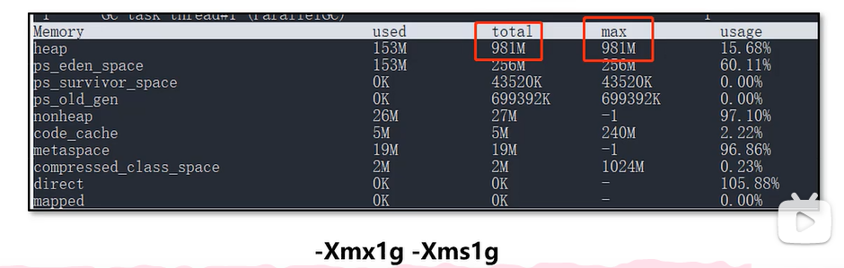

# JVM

------

## JVM基础

### JVM组成

### 字节码文件

### 类的生命周期

------

## 类加载器

### 核心问题

**1、类加载器的作用是什么？**

答：类加载器（ClassLoader）负责在类加载过程中的字节码获取并加载到内存这一部分。通过加载字节码数据放入内存转化成byte[]，接下来调用虚拟机底层方法将byte[]转化成方法区和堆区中的数据。

**2、有几种类加载器？**

1. 启动类加载器（`Bootstrap ClassLoader`）加载核心类 

2. 扩展类加载器（`Extension ClassLoader`）加载扩展类 

3. 应用程序类加载器（`Application ClassLoader`）加载应用`classpath`中的类 

4. 自定义类加载器，重写`findClass`方法。 

JDK9及之后扩展类加载器（`Extension ClassLoader`）变成了平台类加载器（`Platform  ClassLoader`）


**3、类的双亲委派机制是什么？**

答：每个Java实现的类加载器中保存了一个成员变量叫**“父”（Parent）类加载器**。 **自底向上查找是否加载过，再由顶向下进行加载。避免了核心类被应用程序重写并覆盖的问题，提升了安全性**。

1、当一个类加载器去加载某个类的时候，会自底向上查找是否加载过，如果加载过就直接返回，如果一直到最顶层的类加载器都没有加载，再自顶向下进行加载

2、应用程序类加载器的父类是扩展类加载器，扩展类加载器的父类是启动类加载器；

3、双亲委派机制的好处有两点：第一是避免恶意代码替换JDK中的核心类库，比如`java.lang.String`，确保核心类库的安全性和完整性，第二是避免一个类重复地被加载；

**4、这怎么打破类的双亲委派机制？**

1. 重写loadClass方法，不再实现双亲委派机制。 
2. JNDI、JDBC、JCE、JAXB和JBI等框架使用了SPI机制+线程上下文类加载器。 
3. OSGi实现了一整套类加载机制，允许同级类加载器之间互相调用

### 类加载器

**类加载器的作用是什么？**

答：类加载器（ClassLoader）负责在类加载过程中的字节码获取并加载到内存这一部分。通过加载字节码数据放入内存转化成byte[]，接下来调用虚拟机底层方法将byte[]转化成方法区和堆区中的数据。

1、虚拟机底层代码实现的类加载器

- 这里的虚拟机一般指`Hotspot`虚拟机
- **启动类加载器（Bootstrap）**：加载程序运行时的基础类，比如`java.lang.String`

2、Java中提供的默认或者自定义的类加载器

- 继承自抽象类`ClassLoader`
- **扩展类加载器(Extension)**：允许扩展Java中比较常用的类
- **应用程序加载器Application**：加载应用使用的类


### 类的双亲委派机制

由于Java虚拟机中有多个类加载器，双亲委派机制的核心是**解决一个类到底由谁加载的问题**

作用：

- 保证类加载的安全性，避免恶意代码替换JDK中的核心类库，确保核心类库的完整性和安全性
- 避免重复加载

到底类的双亲委派机制是什么？

双亲委派机制指的是：当一个类加载器接收到加载类的任务时，会**自底向上查找是否加载过**该类，**再由顶向下进行加载**


问题：

> 1、重复的类：如果一个类重复出现在三个类加载器的加载位置，应该由谁来加载？

- 启动类加载器加载，根据双亲委派机制，它的优先级是最高的

> 2、String类能覆盖吗？在自己的项目中去创建一个`java.lang.String`类，会被加载吗？

- 不能，会返回启动类加载器加载在`rt.jar`包中的String类

> 3、类加载器的关系？

- 应用程序类加载器的parent父类加载器是扩展类加载器，而扩展类加载器的parent是null，但是在代码逻辑上，扩展类加载器依然会把启动类加载器当成父类加载器处理；

- 启动类加载器是使用C++编写，没有父类加载器

- 可以使用`arthas`来查看类加载器的父子关系


在Java中如何使用代码的方式去主动加载一个类？

1. 使用`Class.forName`方法，使用当前类的类加载器去加载指定的类
2. 获取到类加载器，通过类加载器的`loadClass`方法指定某个类加载器加载

```java
public class Main {
    public static void main(String[] args) throws ClassNotFoundException {
        ClassLoader classLoader = Main.class.getClassLoader();
        System.out.println(classLoader);

        Class<?> stringClass = classLoader.loadClass("java.lang.String");
        System.out.println(stringClass.getClassLoader());
    }
}

// result: 
// sun.misc.Launcher$AppClassLoader@18b4aac2
// null
```

------

### 打破双亲委派机制

三种方式

- 自定义类加载器
  - 自定义类加载器并且重写 `loadClass`方法，就可以将双亲委派机制的代码去除
  - Tomcat通过这种方式实现应用之间类隔离
- 线程上下文类加载器
  - 利用上下文类加载器加载类，比如 `JDBC和JNDI`等
- `Osgi`框架的类加载器
  - 历史上`Osgi`框架实现了一套新的类加载器机制，允许同级之间委托进行类的加载

#### 自定义类加载器

`ClassLoader`的原理，包含了四个核心方法：


```java
// parent等于null说明父类加载器是启动类加载器，直接调用findBootstrapClassOrNull
// 否则调用父类加载器的加载方法
if (parent != null) {
    c = parent.loadClass(name, false);
} else {
    c = findBootstrapClassOrNull(name);
}
// 父类加载器爱莫能助，我来加载！
if (c == null) {
    c = findClass(name);
}
```

问题：

> 1、自定义类加载器父类怎么是`AppClassLoader`呢？


以JDK8为例，ClassLoader类中提供构造方法设置parent的内容:

这个构造方法由另外一个构造方法调用，其中父类加载器由`getSystemClassLoader`方法设置，该方法返回的是`AppClassLoader`

```java
private ClassLoader(Void unused, ClassLoader parent) {
    this.parent = parent;
    if (ParallelLoaders.isRegistered(this.getClass())) {
        parallelLockMap = new ConcurrentHashMap<>();
        package2certs = new ConcurrentHashMap<>();
        assertionLock = new Object();
    } else {
        // no finer-grained lock; lock on the classloader instance
        parallelLockMap = null;
        package2certs = new Hashtable<>();
        assertionLock = this;
    }
}

protected ClassLoader() {
    this(checkCreateClassLoader(), getSystemClassLoader());
}
```

> 2、两个自定义类加载器加载相同限定名的类，不会冲突吗？

- **不会冲突**，在同一个Java虚拟机中，只有**相同类加载器+相同的类限定名**才会被认为是同一个类。

- 在`Arthas`中使用`sc –d 类名`的方式查看具体的情况

------

#### 线程上下文类加载器

`JDBC`案例：

- `JDBC`中使用了`DriverManager`来管理项目中引入的不同数据库的驱动，比如mysql驱动、oracle驱动。
- `DriverManager`类位于`rt.jar`包中，由启动类加载器加载。
- 依赖中的`mysql`驱动对应的类，由应用程序类加载器来加载。
- `DriverManager`属于`rt.jar`是启动类加载器加载的。而用户jar包中的驱动需要由应用类加载器加载，这就违反了双亲委派机制。

解答：

- 启动类加载器加载`DriverManager`。
- 在初始化`DriverManager`时，通过`SPI`机制加载jar包中的`myql`驱动。
- `SPI`中利用了线程上下文类加载器（应用程序类加载器）去加载类并创建对象。
- **这种由启动类加载器加载的类，委派应用程序类加载器去加载类的方式，打破了双亲委派机制。**


> 1、`DriverManager`怎么知道jar包中要加载的驱动在哪儿？

用到了SPI机制：

SPI全称为（Service Provider Interface）,是JDK内置的一种服务提供发现机制

SPI的工作原理

1、在ClassPath路径下META-INF/services文件夹中，以接口的全限定名来命名文件名，对应的文件里面写该接口的实现

2、使用ServiceLoader加载实现类


> 2、SPI中是如何获取应用类加载器的

SPI中使用了线程上下文中保存的类加载器进行类的加载，这个类加载器一般是应用程序类加载器。


> 2、`JDBC`案例真的打破了双亲委派机制吗

`DriverManager`：JDK8中位于rt.jar，由启动类加载器加载

Jar包中的`mysql`驱动： 位于`classpath`，由应用程序类加载器加载

因此**没有打破双亲委派机制**：`JDBC`只是在`DriverManager`加载完之后，通过初始化阶段触发了驱动类的加载，类的加载依然遵循双亲委派机制

**打破双亲委派机制的唯一方法是重写loadClass方法**

#### `OSGi`模块化

历史上，`OSGi`模块化框架。它存在同级之间的类加载器的委托加载。`OSGi`还使用类加载器实现了热部署的 功能。 

**热部署指的是在服务不停止的情况下，动态地更新字节码文件到内存中。**

------

### JDK9之后的类加载器

JDK8及之前的版本中，扩展类加载器和应用程序类加载器的源码位于`rt.jar`包中的`sun.misc.Launcher.java`。


由于`JDK9`引入了module的概念，类加载器在设计上发生了很多变化。

1、**启动类加载器使用Java编写，位于`jdk.internal.loader.ClassLoaders`类中**。

-  Java中的`BootClassLoader`继承自`BuiltinClassLoader`实现从模块中找到要加载的字节码资源文件。 

- 启动类加载器依然无法通过java代码获取到，返回的仍然是null，保持了统一。

2、**扩展类加载器被替换成了平台类加载器（Platform Class Loader）**。

- 平台类加载器遵循模块化方式加载字节码文件，所以继承关系从`URLClassLoader`变成了 `BuiltinClassLoader`，`BuiltinClassLoader`实现了从模块中加载字节码文件。平台类加载器的存在更多的是 为了与老版本的设计方案兼容，自身没有特殊的逻辑。

------

## 运行时数据区

 Java虚拟机在运行Java程序过程中管理的内存区域，称之为**运行时内存区**，其中：

- **线程共享的区域：方法区、堆；**
- **线程不共享的区域：程序计数器，Java虚拟机栈，本地方法栈；**

------

### 核心问题

1、Java的内存分成哪几个部分，详细介绍一下

2、Java内存中哪些部分会内存溢出？

3、JDK7和8在内存结构上的区别是什么？

------

### 程序计数器

程序计数器（Program Counter Register）也叫PC寄存器，每个线程会通过程序计数器记录当前要执行的的字节码指令的地址。

作用

- 程序计数器可以**控制程序指令的进行**，实现分支、跳转、异常等逻辑。

- 在多线程执行情况下，Java虚拟机需要通过程序计数器记录CPU切换前解释执行到那一句指令并继续解释运行。

> 程序计数器在运行中会出现内存溢出吗？

**内存溢出**：指的是程序在使用某一块内存区域时，存放的数据需要占用的内存大小超过了虚拟机能提供的内存上限。

答，不会，因为每个线程**只存储一个固定长度的内存地址**，**程序计数器是不会发生内存溢出的。程序员无需对程序计数器做任何处理**。

------

### Java虚拟机栈

Java虚拟机栈（Java Virtual Machine Stack）采用栈的数据结构来管理方法调用中的基本数据，先进后出（First In Last Out），每一个方法的调用使用**一个栈帧（Stack Frame）**来保存。

Java虚拟机栈随着线程的创建而创建，而回收则会在线程的销毁时进行。由于方法可能会在不同线程中执行，**每个线程都会包含一个自己的虚拟机栈**。

栈帧的组成：

- 局部变量表：在运行过程 中存放所有的局部变量
- 操作数栈：操作数栈是栈帧中虚拟机在执行指令过程中用来存放中间数据的一块区域。
- 帧数据：主要包含动态链接、方法出口、异常表的引用

> 1、局部变量表

- **局部变量表**：在运行过程中存放所有的局部变量；

  - 编译成字节码文件时就可以确定局部变量表的内容。

  - 栈帧中的局部变量表是一个**数组**，数组中每一个位置称之为槽(slot) ，**long和double类型占用两个槽，其他类型占用一个槽**。
  - 局部变量表保存的内容有：**实例方法的this对象，方法的参数，方法体中声明的局部变量**。
    -  **实例方法中的序号为0的位置存放的是this**，指的是当前调用方法的对象，运行时会在内存中存放实例对象的地址。
    - 方法参数也会保存在局部变量表中，其顺序与方法中参数定义的顺序一致。
    - 为了节省空间，**局部变量表中的槽是可以复用的**，一旦某个局部变量不再生效，当前槽就可以再次被使用。

- 操作数栈是栈帧中虚拟机在执行指令过程中用来存放临时数据的一块区域；

- 帧数据主要包含动态链接、方法出口、异常表的引用；

> 2、操作数栈

操作数栈是栈帧中虚拟机在执行指令过程中用来存放中间数据的一块区域。它是一种栈式的数据结构，如果一条指令将一个值压入操作数栈，则后面的指令可以弹出并使用该值。在编译期就可以确定操作数栈的最大深度，从而在执行时正确的分配内存大小。

> 3、**帧数据**

- **动态链接**

  - 当前类的字节码指令引用了其他类的属性或者方法时，需要将符号引用（编号）转换成对应的运行时常量池中的内存地址。

  - 动态链接就保存了编号到运行时常量池的内存地址的映射关系。

- **方法出口**
  - 方法出口指的是方法在正确或者异常结束时，当前栈帧会被弹出，同时程序计数器应该指向上一个栈帧中的下一条指令的地址。所以在当前栈帧中，需要存储此方法出口的地址。

- **异常表**
  - 异常表存放的是代码中异常的处理信息，包含了异常捕获的生效范围以及异常发生后跳转到的字节码指令位置。


> Java虚拟机栈会出现内存溢出吗？

Java虚拟机栈如果栈帧过多，占用内存超过栈内存可以分配的最大大小就会出现内存溢出。 

Java虚拟机栈内存溢出时会出现`StackOverflowError`的错误

如果我们不指定栈的大小，JVM 将创建一个 具有默认大小的栈。大小取决于操作系统和 计算机的体系结构。

要修改Java虚拟机栈的大小，可以使用虚拟机参数 -Xss 。

- 语法：-Xss栈大小

- 单位：字节（默认，必须是 1024 的倍数）、k或者K(KB)、m或者M(MB)、g或者G(GB)，比如-Xss1024K 

注意事项：

- 与-Xss类似，也可以使用 -XX:ThreadStackSize 调整标志来配置堆栈大小。 格式为： -XX:ThreadStackSize=1024

- HotSpot JVM对栈大小的最大值和最小值有要求：Windows（64位）下的JDK8测试最小值为180k，最大值为1024m。
- 局部变量过多、操作数栈深度过大也会影响栈内存的大小。

一般情况下，工作中即便使用了递归进行操作，栈的深度最多也只能到几百,不会出现栈的溢出。所以此参数 可以手动指定为-Xss256k节省内存。

------

### 本地方法栈

Java虚拟机栈存储了Java方法调用时的栈帧，而本地方法栈存储的是native本地方法的栈帧。

 在`Hotspot`虚拟机中，**Java虚拟机栈和本地方法栈实现上使用了同一个栈空间**。本地方法栈会在栈内存上生成一个栈帧，临时保存方法的参数同时方便出现异常时也把本地方法的栈信息打印出来。

------

### 堆

一般Java程序中堆内存是空间最大的一块内存区域。创建出来的对象都存在于堆上。

栈上的局部变量表中，可以存放堆上对象的引用。静态变量也可以存放堆对象的引用，通过静态变量就可以实 现对象在线程之间共享。

> 堆内存会溢出吗？
>
> 堆内存大小是有上限的，当对象一直向堆中放入对象达到上限之后，就会抛出`OutOfMemory` 错误

堆空间有三个需要关注的值，used total max

- used指的是当前已使用的堆内存
- total是java虚拟机已经分配的可用堆内存
- max是java虚拟机可以分配的最大堆内存。

堆内存used total max三个值可以通过dashboard命令看到；

 手动指定刷新频率（不指定默认5秒一次）：dashboard –i 刷新频率(毫秒)

如果不设置任何的虚拟机参数，max默认是系统内存的1/4，total默认是系统内存的1/64。在实际应用中一般都需要设置 total和max的值。

> **堆 – 设置大小**

- 要修改堆的大小，可以使用虚拟机参数 –Xmx（max最大值）和-Xms (初始的total)。
-  语法：**-Xmx值 -Xms值**
- 单位：字节（默认，必须是 1024 的倍数）、k或者K(KB)、m或者M(MB)、g或者G(GB) 
- 限制：**Xmx必须大于 2 MB，Xms必须大于1MB**



Java服务端程序开发时，**建议将-Xmx和-Xms设置为相同的值**，这样在程序启动之后可使用的总内存就是最大内存，而无 需向java虚拟机再次申请，减少了申请并分配内存时间上的开销，同时也不会出现内存过剩之后堆收缩的情况。

------

## 方法区