# JavaSE

## IO流

根据冯.诺依曼结构，计算机结构分为 5 大部分：**运算器、控制器、存储器、输入设备、输出设备**。

从计算机结构的视角来看： **I/O 描述了计算机系统与外部设备之间通信的过程。**

IO流定义：**存储和读取数据的解决方案**

作用：用于读写数据（本地文件和网络）

分类：

- 根据数据流向分类：
  - 输入流（文件->程序）
  - 输出流（程序->文件）
- 根据操作文件类型分类：
  - 字节流：可以操作所有类型的文件
  - 字符流：只能操作纯文本文件

### 体系结构

继承四个超类：`InputStream`、`OutputStream`、`Reader`、`Writer`

#### 1、文件IO流

- `FileIutputStream`：操作本地文件的字节输入流

```java
// 1. 创建字节输入流对象
// 如果文件不存在，就直接报错
FileInputStream inputStream = new FileInputStream(new File("a.txt"));
// 2. 读数据
// 一次都一个字节，读出来的是数据在ASCII上对应的数字
// 读到文件末尾了，read方法返回-1
int read = inputStream.read();
System.out.println(read);
// 3。释放资源
// 注意：每次使用完流之后都要释放资源
inputStream.close();
```

- `FileOutputStream`：操作本地文件的字节输出流


```java
// 1. 创建字节输出流对象
// 注意1：参数是字符串表示的路径或者File对象都是可以的
// 注意2：如果文件不存在会创建一个新的文件，但是要保证父级路径是存在的
// 注意3：如果文件已经存在，则会清空文件
FileOutputStream outputStream = new FileOutputStream("a.txt");
// 2. 写数据
// 注意：write方法的参数是证书，但是实际上写到本地文件中的是证书在ASCII上对应的字符
outputStream.write(97);
// 3。释放资源
// 注意：每次使用完流之后都要释放资源
outputStream.close();
```

- 换行符：windows：`\r\n`，linux：`\n`，mac：`\r`

- 续写：打开续写开关：`FileOutputStream(String name, boolean append)`

#### 2、管道IO流

- `PipedInputStream`（字节输入流）
- `PipedOutputStream`（字节输出流）
- `PipedReader`（字符输入流）
- `PipedWriter`（字符输出流）

#### 3、字节/字符数组

- 字节数组输入流：`ByteArrayInputStream`

- 字节数组输出流：`ByteArrayOutputStream`

- 字符数组输入流：`CharArrayReader`

- 字符数组输出流：`CharArrayWriter`

#### 4、**Buffered 缓冲流**

**字节缓冲流**：IO 操作是很消耗性能的，缓冲流将数据加载至缓冲区，一次性读取/写入多个字节，从而避免频繁的 IO 操作，提高流的传输效率。字节缓冲流这里采用了**装饰器模式**来增强 `InputStream` 和`OutputStream`子类对象的功能。

- `BufferedInputStream`：从源头（通常是文件）读取数据（字节信息）到内存的过程中不会一个字节一个字节的读取，而是会先将读取到的字节存放在缓存区，并从内部缓冲区中单独读取字节。这样大幅减少了 IO 次数，提高了读取效率。

  ```java
  // 新建一个 BufferedInputStream 对象
  BufferedInputStream bufferedInputStream = new BufferedInputStream(new FileInputStream("input.txt"));
  // 读取文件的内容并复制到 String 对象中
  String result = new String(bufferedInputStream.readAllBytes());
  System.out.println(result);
  ```

  字节流和字节缓冲流的性能差别主要体现在我们使用两者的时候都是调用 `write(int b)` 和 `read()` 这两个一次只读取一个字节的方法的时候。由于字节缓冲流内部有缓冲区（字节数组），因此，字节缓冲流会先将读取到的字节存放在缓存区，大幅减少 IO 次数，提高读取效率。

  缓冲区源码：

  ```java
  public class BufferedInputStream extends FilterInputStream {
      // 内部缓冲区数组
      protected volatile byte buf[];
      // 缓冲区的默认大小
      private static int DEFAULT_BUFFER_SIZE = 8192;
      // 使用默认的缓冲区大小
      public BufferedInputStream(InputStream in) {
          this(in, DEFAULT_BUFFER_SIZE);
      }
      // 自定义缓冲区大小
      public BufferedInputStream(InputStream in, int size) {
          super(in);
          if (size <= 0) {
              throw new IllegalArgumentException("Buffer size <= 0");
          }
          buf = new byte[size];
      }
  }
  ```
  
- `BufferedOutputStream`：将数据（字节信息）写入到目的地（通常是文件）的过程中不会一个字节一个字节的写入，而是会先将要写入的字节存放在缓存区，并从内部缓冲区中单独写入字节。这样大幅减少了 IO 次数，提高了读取效率

  ```java
  FileOutputStream fileOutputStream = new FileOutputStream("output.txt");
  BufferedOutputStream bos = new BufferedOutputStream(fileOutputStream)
  ```

**字符缓冲流**

- `BufferedReader`
- `BufferedWriter`

#### 5、**字节转化成字符流**

- `InputStreamReader`：是字节流转换为字符流的桥梁，其子类 `FileReader` 是基于该基础上的封装，可以直接操作字符文件。

  ```java
  // 字节流转换为字符流的桥梁
  public class InputStreamReader extends Reader {
  }
  // 用于读取字符文件
  public class FileReader extends InputStreamReader {
  }
  ```

  `FileReader` 代码示例：

  ```java
  try (FileReader fileReader = new FileReader("input.txt");) {
      int content;
      long skip = fileReader.skip(3);
      System.out.println("The actual number of bytes skipped:" + skip);
      System.out.print("The content read from file:");
      while ((content = fileReader.read()) != -1) {
          System.out.print((char) content);
      }
  } catch (IOException e) {
      e.printStackTrace();
  }
  ```

- `OutputStreamWriter`：是字符流转换为字节流的桥梁，其子类 `FileWriter` 是基于该基础上的封装，可以直接将字符写入到文件。

  ```java
  // 字符流转换为字节流的桥梁
  public class OutputStreamWriter extends Writer {
  }
  // 用于写入字符到文件
  public class FileWriter extends OutputStreamWriter {
  }
  ```

  ```java
  // 字符流转换为字节流的桥梁
  public class OutputStreamWriter extends Writer {
  }
  // 用于写入字符到文件
  public class FileWriter extends OutputStreamWriter {
  }
  ```

  `FileWriter` 代码示例：

  ```java
  try (Writer output = new FileWriter("output.txt")) {
      output.write("你好，我是Guide。");
  } catch (IOException e) {
      e.printStackTrace();
  }
  ```

#### 6、**数据流**

- `DataInputStream：`： 用于读取指定类型数据，不能单独使用，必须结合其它流，比如 `FileInputStream` 

  ```java
  FileInputStream fileInputStream = new FileInputStream("input.txt");
  // 必须将fileInputStream作为构造参数才能使用
  DataInputStream dataInputStream = new DataInputStream(fileInputStream);
  // 可以读取任意具体的类型数据
  dataInputStream.readBoolean();
  dataInputStream.readInt();
  dataInputStream.readUTF();
  ```

- `DataOutputStream`：用于写入指定类型数据，不能单独使用，必须结合其它流，比如 `FileOutputStream` 

  ```java
  // 输出流
  FileOutputStream fileOutputStream = new FileOutputStream("out.txt");
  DataOutputStream dataOutputStream = new DataOutputStream(fileOutputStream);
  // 输出任意数据类型
  dataOutputStream.writeBoolean(true);
  dataOutputStream.writeByte(1);
  ```

#### 7、**打印流**

- `PrintStream`
  - `System.out` 实际是用于获取一个 `PrintStream` 对象，`print`方法实际调用的是 `PrintStream` 对象的 `write` 方法。
  - `PrintStream` 是 `OutputStream` 的子类
- `PrintWriter`
- - `PrintWriter` 是 `Writer` 的子类。

```java
public class PrintStream extends FilterOutputStream
    implements Appendable, Closeable {
}
public class PrintWriter extends Writer {
}
```

#### 8、**对象流**

- `ObjectInputStream`：用于从输入流中读取 Java 对象（反序列化）

```java
ObjectInputStream input = new ObjectInputStream(new FileInputStream("object.data"));
MyClass object = (MyClass) input.readObject();
input.close();
```

- `ObjectOutputStream`：用于将对象写入到输出流(序列化)

```java
ObjectOutputStream output = new ObjectOutputStream(new FileOutputStream("file.txt")
Person person = new Person("Guide哥", "JavaGuide作者");
output.writeObject(person);
```

#### 9、**序列化流**

- `SequenceInputStream`

> **那为什么 I/O 流操作要分为字节流操作和字符流操作呢？**
>
> - 字符流是由 Java 虚拟机将字节转换得到的，这个过程还算是比较耗时。
> - 如果我们不知道编码类型就很容易出现乱码问题。

### 字符集

在计算机中，任意数据都是以二进制的形式组织的

**计算机存储规则**

`ASCII`：一个英文占一个字节

`GB2312字符集`：1980年发布，1981年5月1日实施的简体中文汉字编码国家标准

- 收录7447个图形字符，其中包括6763个简体汉字

`BIG5字符集`：台湾地区繁体中文标准字符集，共收录13053个中文字，1984年实施

`GBK字符集`：2000年3月17日发布，收录21003个汉字

- 包含国际标准`GB13000-1`中的全部中日韩汉字，和`BIG5`字符集的所有汉字
- windows系统默认使用的`GBK`，系统显示`ANSI`
- 英文：一个字节存储，完全兼容ASCII，二进制前面补0
- 汉字：汉字两个字节存储，高位字节二进制一定以1开头，转成十进制之后是一个负数

`Unicode字符集`：国际标准字符集，它将世界各种语言的每个字符定义一个唯一的编码，以满足跨语言、跨平台的文本信息转换

- **UTF-16编码规则**：用2-4个字节保存
- **UTF-32编码规则**：固定使用四个字节保存
- **UTF-8编码规则**：用1-4个字节保存
  - **英文字母：1个字节**，二进制的第一位是0，转成十进制是正数
  - **中文汉字：3个字节**，二进制的第一位是1，第一个字节转成十进制是负数

> 为什么会有乱码？

- 读取数字时未读完整个汉字
- 编码和解码的规则不一致

### IO 设计模式

#### 装饰器（Decorator）模式

**装饰器（Decorator）模式** 可以在不改变原有对象的情况下拓展其功能。

装饰器模式通过组合替代继承来扩展原始类的功能，在一些继承关系比较复杂的场景（IO 这一场景各种类的继承关系就比较复杂）更加实用。

对于字节流来说， `FilterInputStream` （对应输入流）和`FilterOutputStream`（对应输出流）是装饰器模式的核心，分别用于增强 `InputStream` 和`OutputStream`子类对象的功能。

我们常见的`BufferedInputStream`(字节缓冲输入流)、`DataInputStream` 等等都是`FilterInputStream` 的子类，`BufferedOutputStream`（字节缓冲输出流）、`DataOutputStream`等等都是`FilterOutputStream`的子类。

**装饰器类需要跟原始类继承相同的抽象类或者实现相同的接口**。上面介绍到的这些 IO 相关的装饰类和原始类共同的父类是 `InputStream` 和`OutputStream`。

#### 适配器模式

**适配器（Adapter Pattern）模式** 主要用于**接口互不兼容的类的协调工作**，你可以将其联想到我们日常经常使用的电源适配器。

适配器模式中存在被适配的对象或者类称为 **适配者(Adaptee)** ，作用于适配者的对象或者类称为**适配器(Adapter)** 。适配器分为对象适配器和类适配器。**类适配器使用继承关系来实现，对象适配器使用组合关系来实现。**

IO 流中的字符流和字节流的接口不同，它们之间可以协调工作就是基于适配器模式来做的，更准确点来说是对象适配器。通过适配器，我们可以将字节流对象适配成一个字符流对象，这样我们可以直接通过字节流对象来读取或者写入字符数据。

`InputStreamReader` 和 `OutputStreamWriter` 就是两个适配器(Adapter)， 同时，它们两个也是字节流和字符流之间的桥梁。`InputStreamReader` 使用 `StreamDecoder` （流解码器）对字节进行解码，**实现字节流到字符流的转换，** `OutputStreamWriter` 使用`StreamEncoder`（流编码器）对字符进行编码，实现字符流到字节流的转换。

`InputStream` 和 `OutputStream` 的子类是被适配者， `InputStreamReader` 和 `OutputStreamWriter`是适配器。

```java
// InputStreamReader 是适配器，FileInputStream 是被适配的类
InputStreamReader isr = new InputStreamReader(new FileInputStream(fileName), "UTF-8");
// BufferedReader 增强 InputStreamReader 的功能（装饰器模式）
BufferedReader bufferedReader = new BufferedReader(isr);
```

`java.io.InputStreamReader` 部分源码：

```java
public class InputStreamReader extends Reader {
    //用于解码的对象
    private final StreamDecoder sd;
    public InputStreamReader(InputStream in) {
        super(in);
        try {
            // 获取 StreamDecoder 对象
            sd = StreamDecoder.forInputStreamReader(in, this, (String)null);
        } catch (UnsupportedEncodingException e) {
            throw new Error(e);
        }
    }
    // 使用 StreamDecoder 对象做具体的读取工作
    public int read() throws IOException {
        return sd.read();
    }
}
```

`java.io.OutputStreamWriter` 部分源码：

```java
public class OutputStreamWriter extends Writer {
    // 用于编码的对象
    private final StreamEncoder se;
    public OutputStreamWriter(OutputStream out) {
        super(out);
        try {
           // 获取 StreamEncoder 对象
            se = StreamEncoder.forOutputStreamWriter(out, this, (String)null);
        } catch (UnsupportedEncodingException e) {
            throw new Error(e);
        }
    }
    // 使用 StreamEncoder 对象做具体的写入工作
    public void write(int c) throws IOException {
        se.write(c);
    }
}
```

**适配器模式和装饰器模式有什么区别呢？**

**装饰器模式** 更侧重于**动态地增强原始类的功能**，装饰器类需要跟原始类继承相同的抽象类或者实现相同的接口。并且，装饰器模式支持对原始类嵌套使用多个装饰器。

**适配器模式** 更侧重于**让接口不兼容而不能交互的类可以一起工作**，当我们调用适配器对应的方法时，适配器内部会调用适配者类或者和适配类相关的类的方法，这个过程透明的。就比如说 `StreamDecoder` （流解码器）和`StreamEncoder`（流编码器）就是分别基于 `InputStream` 和 `OutputStream` 来获取 `FileChannel`对象并调用对应的 `read` 方法和 `write` 方法进行字节数据的读取和写入。

```java
StreamDecoder(InputStream in, Object lock, CharsetDecoder dec) {
    // 省略大部分代码
    // 根据 InputStream 对象获取 FileChannel 对象
    ch = getChannel((FileInputStream)in);
}
```

适配器和适配者两者不需要继承相同的抽象类或者实现相同的接口。

另外，`FutureTask` 类使用了适配器模式，`Executors` 的内部类 `RunnableAdapter` 实现属于适配器，用于将 `Runnable` 适配成 `Callable`。

`FutureTask`参数包含 `Runnable` 的一个构造方法。

```java
public FutureTask(Runnable runnable, V result) {
    // 调用 Executors 类的 callable 方法
    this.callable = Executors.callable(runnable, result);
    this.state = NEW;
}
```

`Executors`中对应的方法和适配器：

```java
// 实际调用的是 Executors 的内部类 RunnableAdapter 的构造方法
public static <T> Callable<T> callable(Runnable task, T result) {
    if (task == null)
        throw new NullPointerException();
    return new RunnableAdapter<T>(task, result);
}
// 适配器
static final class RunnableAdapter<T> implements Callable<T> {
    final Runnable task;
    final T result;
    RunnableAdapter(Runnable task, T result) {
        this.task = task;
        this.result = result;
    }
    public T call() {
        task.run();
        return result;
    }
}
```

#### 工厂模式

工厂模式用于创建对象，NIO 中大量用到了工厂模式，比如 `Files` 类的 `newInputStream` 方法用于创建 `InputStream` 对象（静态工厂）、 `Paths` 类的 `get` 方法创建 `Path` 对象（静态工厂）、`ZipFileSystem` 类（`sun.nio`包下的类，属于 `java.nio` 相关的一些内部实现）的 `getPath` 的方法创建 `Path` 对象（简单工厂）

```java
InputStream is = Files.newInputStream(Paths.get(generatorLogoPath))
```

#### 观测者模式

NIO 中的文件目录监听服务使用到了观察者模式。

NIO 中的文件目录监听服务基于 `WatchService` 接口和 `Watchable` 接口。`WatchService` 属于观察者，`Watchable` 属于被观察者。

`Watchable` 接口定义了一个用于将对象注册到 `WatchService`（监控服务） 并绑定监听事件的方法 `register` 。

```java
public interface Path
    extends Comparable<Path>, Iterable<Path>, Watchable{
}

public interface Watchable {
    WatchKey register(WatchService watcher,
                      WatchEvent.Kind<?>[] events,
                      WatchEvent.Modifier... modifiers)
        throws IOException;
}
```

`WatchService` 用于监听文件目录的变化，同一个 `WatchService` 对象能够监听多个文件目录。

```java
// 创建 WatchService 对象
WatchService watchService = FileSystems.getDefault().newWatchService();

// 初始化一个被监控文件夹的 Path 类:
Path path = Paths.get("workingDirectory");
// 将这个 path 对象注册到 WatchService（监控服务） 中去
WatchKey watchKey = path.register(
watchService, StandardWatchEventKinds...);
```

`Path` 类 `register` 方法的第二个参数 `events` （需要监听的事件）为可变长参数，也就是说我们可以同时监听多种事件。

```java
WatchKey register(WatchService watcher,
                  WatchEvent.Kind<?>... events)
    throws IOException;
```

常用的监听事件有 3 种：

- `StandardWatchEventKinds.ENTRY_CREATE`：文件创建。
- `StandardWatchEventKinds.ENTRY_DELETE` : 文件删除。
- `StandardWatchEventKinds.ENTRY_MODIFY` : 文件修改。

`register` 方法返回 `WatchKey` 对象，通过`WatchKey` 对象可以获取事件的具体信息比如文件目录下是创建、删除还是修改了文件、创建、删除或者修改的文件的具体名称是什么

```java
WatchKey key;
while ((key = watchService.take()) != null) {
    for (WatchEvent<?> event : key.pollEvents()) {
      // 可以调用 WatchEvent 对象的方法做一些事情比如输出事件的具体上下文信息
    }
    key.reset();
}
```

`WatchService` 内部是通过一个 daemon thread（守护线程）采用定期轮询的方式来检测文件的变化，简化后的源码如下所示。

```java
class PollingWatchService
    extends AbstractWatchService
{
    // 定义一个 daemon thread（守护线程）轮询检测文件变化
    private final ScheduledExecutorService scheduledExecutor;

    PollingWatchService() {
        scheduledExecutor = Executors
            .newSingleThreadScheduledExecutor(new ThreadFactory() {
                 @Override
                 public Thread newThread(Runnable r) {
                     Thread t = new Thread(r);
                     t.setDaemon(true);
                     return t;
                 }});
    }

  void enable(Set<? extends WatchEvent.Kind<?>> events, long period) {
    synchronized (this) {
      // 更新监听事件
      this.events = events;

        // 开启定期轮询
      Runnable thunk = new Runnable() { public void run() { poll(); }};
      this.poller = scheduledExecutor
        .scheduleAtFixedRate(thunk, period, period, TimeUnit.SECONDS);
    }
  }
}
```

### IO 设计模型

**同步和异步**

- 同步：发出一个调用时，在没有得到结果之前，该调用就不返回
- 异步：在调用发出后，被调用者返回结果之后会通知调用者，或通过回调函数处理这个调用

**阻塞和非阻塞**

- 阻塞和非阻塞关注的是**线程的状态**。
- 阻塞调用是指调用结果返回之前，当前线程会被挂起。调用线程只有在得到结果之后才会恢复运行。
- 非阻塞调用指在不能立刻得到结果之前，该调用不会阻塞当前线程。

UNIX 系统下， IO 模型一共有 5 种：**同步阻塞 I/O**、**同步非阻塞 I/O**、**I/O 多路复用**、**信号驱动 I/O** 和**异步 I/O**。

Java中3种常见的IO模型：`BIO（Blocking I/O）、NIO、AIO`

#### BIO(Blocking I/O)

**`BIO` 属于同步阻塞 IO 模型** 。

同步阻塞 IO 模型中，应用程序发起 read 调用后，会一直阻塞，直到内核把数据拷贝到用户空间。


在**客户端连接数量不高**的情况下，是没问题的。但是，当面对十万甚至百万级连接的时候，传统的 BIO 模型是无能为力的。因此，我们需要一种更高效的 I/O 处理模型来应对更高的并发量。

#### NIO(Non-blocking/New I/O)

Java 中的 `NIO` 于 Java 1.4 中引入，对应 `java.nio` 包，提供了 `Channel` , `Selector`，`Buffer` 等抽象。

`NIO` 中的 N 可以理解为 `Non-blocking`，不单纯是 New。它是支持面向缓冲的，基于通道的 I/O 操作方法。 对于高负载、高并发的（网络）应用，应使用 `NIO` 。

Java 中的 `NIO` 可以看作是 **I/O 多路复用模型**。

##### **1、同步非阻塞模型**


同步非阻塞 IO 模型中，应用程序会一直发起 read 调用，等待数据从内核空间拷贝到用户空间的这段时间里，线程依然是阻塞的，直到在内核把数据拷贝到用户空间。

> 相较于BIO的优点：通过**轮询操作**，避免了一直阻塞
>
> 缺点：**应用程序不断进行 I/O 系统调用轮询数据是否已经准备好的过程是十分消耗 CPU 资源的。**

##### **2、I/O多路复用模型**

IO 多路复用模型中，线程首先发起 **select 调用**，询问内核数据是否准备就绪，等内核把数据准备好了，用户线程再发起 read 调用。read 调用的过程（数据从内核空间 -> 用户空间）还是阻塞的。

**IO 多路复用模型，通过减少无效的系统调用，减少了对 CPU 资源的消耗。**

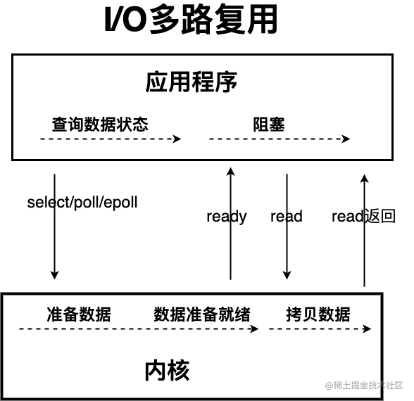

#### AIO(Asynchronous I/O)

`AIO` 也就是 `NIO 2`。Java 7 中引入了 `NIO` 的改进版 `NIO 2`，它是异步 IO 模型。

异步 IO 是基于**事件和回调机制**实现的，也就是应用操作之后会直接返回，不会堵塞在那里，当后台处理完成，操作系统会通知相应的线程进行后续的操作。


------

## 集合

总的区分：

`List`(对付顺序的好帮手): 存储的元素是有序的、可重复的。

`Set`(注重独一无二的性质): 存储的元素不可重复的。

`Queue`(实现排队功能的叫号机): 按特定的排队规则来确定先后顺序，存储的元素是有序的、可重复的。

`Map`(用 key 来搜索的专家): 使用键值对（key-value）存储，key 是无序的、不可重复的，value 是无序的、可重复的，每个键最多映射到一个值


### Collections

#### Set

#### List

#### Queue

### Map

------

## 多线程


------

## 反射

概念：

- 反射赋予了我们**在运行时分析类以及执行类中方法**的能力
- 通过反射获取任意一个类的所有属性和方法，还可以调用这些方法和属性

应用场景

- 动态代理

```java
public class DebugInvocationHandler implements InvocationHandler {
    /**
     * 代理类中的真实对象
     */
    private final Object target;

    public DebugInvocationHandler(Object target) {
        this.target = target;
    }


    public Object invoke(Object proxy, Method method, Object[] args) throws InvocationTargetException, IllegalAccessException {
        System.out.println("before method " + method.getName());
        Object result = method.invoke(target, args);
        System.out.println("after method " + method.getName());
        return result;
    }
}
```

- 注解：

  - @Component 声明一个类为Spring Bean 

  - @Value 读取配置文件中的值

优缺点：

- 优点：可以让咱们的代码更加灵活、为各种框架提供开箱即用的功能提供了便利
- 缺点：增加了安全问题，比如可以无视泛型参数的安全检查（泛型参数的安全检查发生在编译时）

获取Class的四种方式

- 1，知道具体类的情况下：`Class alunbarClass = TargetObject.class;`
- 2，通过 `Class.forName()`传入类的全路径获取：`Class alunbarClass1 = Class.forName("cn.javaguide.TargetObject");`
- 3，通过对象实例获取`instance.getClass()`获取：`TargetObject o = new TargetObject();  Class alunbarClass2 = o.getClass();`
- 4，通过类加载器`xxxClassLoader.loadClass()`传入类路径获取:`ClassLoader.getSystemClassLoader().loadClass("cn.javaguide.TargetObject");`

反射的一些基本操作

1. 创建一个我们要使用反射操作的类 `TargetObject`。

```java
package cn.javaguide;

public class TargetObject {
    private String value;

    public TargetObject() {
        value = "JavaGuide";
    }

    public void publicMethod(String s) {
        System.out.println("I love " + s);
    }

    private void privateMethod() {
        System.out.println("value is " + value);
    }
}
```

2. 使用反射操作这个类的方法以及参数

```java
package cn.javaguide;

import java.lang.reflect.Field;
import java.lang.reflect.InvocationTargetException;
import java.lang.reflect.Method;

public class Main {
    public static void main(String[] args) throws ClassNotFoundException, NoSuchMethodException, IllegalAccessException, InstantiationException, InvocationTargetException, NoSuchFieldException {
        /**
         * 获取 TargetObject 类的 Class 对象并且创建 TargetObject 类实例
         */
        Class<?> targetClass = Class.forName("cn.javaguide.TargetObject");
        TargetObject targetObject = (TargetObject) targetClass.newInstance();
        /**
         * 获取 TargetObject 类中定义的所有方法
         */
        Method[] methods = targetClass.getDeclaredMethods();
        for (Method method : methods) {
            System.out.println(method.getName());
        }

        /**
         * 获取指定方法并调用
         */
        Method publicMethod = targetClass.getDeclaredMethod("publicMethod",
                String.class);

        publicMethod.invoke(targetObject, "JavaGuide");

        /**
         * 获取指定参数并对参数进行修改
         */
        Field field = targetClass.getDeclaredField("value");
        //为了对类中的参数进行修改我们取消安全检查
        field.setAccessible(true);
        field.set(targetObject, "JavaGuide");

        /**
         * 调用 private 方法
         */
        Method privateMethod = targetClass.getDeclaredMethod("privateMethod");
        //为了调用private方法我们取消安全检查
        privateMethod.setAccessible(true);
        privateMethod.invoke(targetObject);
    }
}
```

输出内容

```java
publicMethod
privateMethod
I love JavaGuide
value is JavaGuide
```

------

# JVM

------

## JVM基础

### 初识JVM

JVM 本质上是一个运行在计算机上的程序，他的职责是**运行Java字节码文件**。

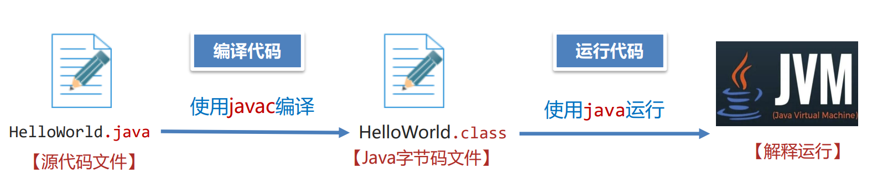

JVM的功能

- **解释和运行**：对字节码文件中的指令， 实时的解释成机器码， 让计算机执行
- **内存管理**：自动为对象、方法等分配内存；自动的垃圾回收机制， 回收不再使用的对象
- **即时编译**（**Just-In-Time 简称JIT**）：对热点代码进行优化， 提升执行效率

常见的JVM

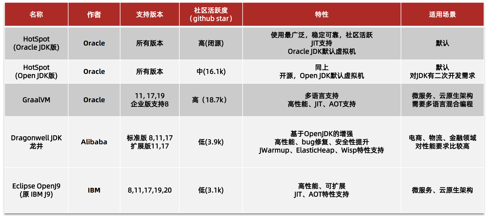

常见的JVM - HotSpot的发展历程

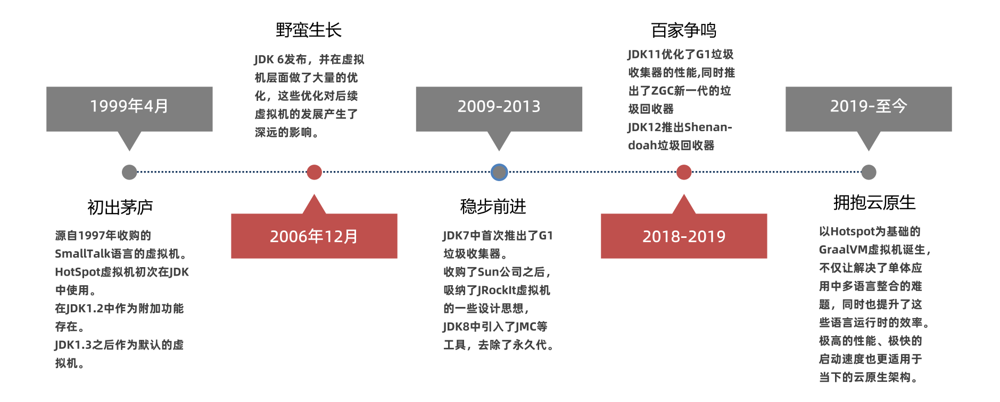

**JVM的组成**

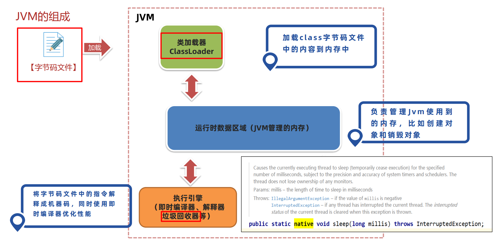

### 字节码文件

**1、以正确的姿势打开文件**

字节码文件中保存了源代码编译之后的内容，以二进制的方式存储，无法直接用记事本打开阅读。 通过NotePad++使用十六进制插件查看class文件：

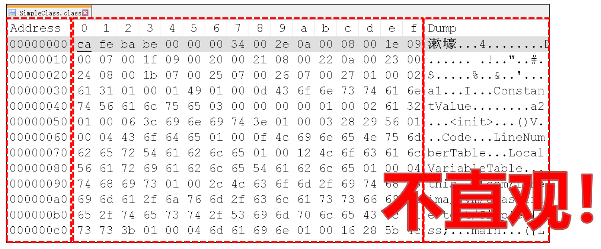

推荐使用 `jclasslib工具`查看字节码文件。

玩转字节码常用工具: 阿里arthas：[简介 | arthas (aliyun.com)](https://arthas.aliyun.com/doc/)

**2、字节码文件的组成**

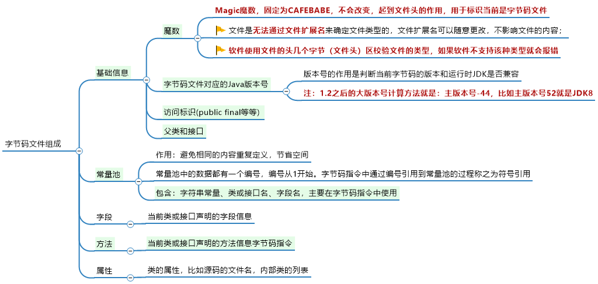

------

### 类的生命周期

定义：类的生命周期描述了一个类加载、使用、卸载的整个过程

应用场景：

- 运行时常量池
- 多态的原理
- 类的加密和解密

类的生命周期全部过程

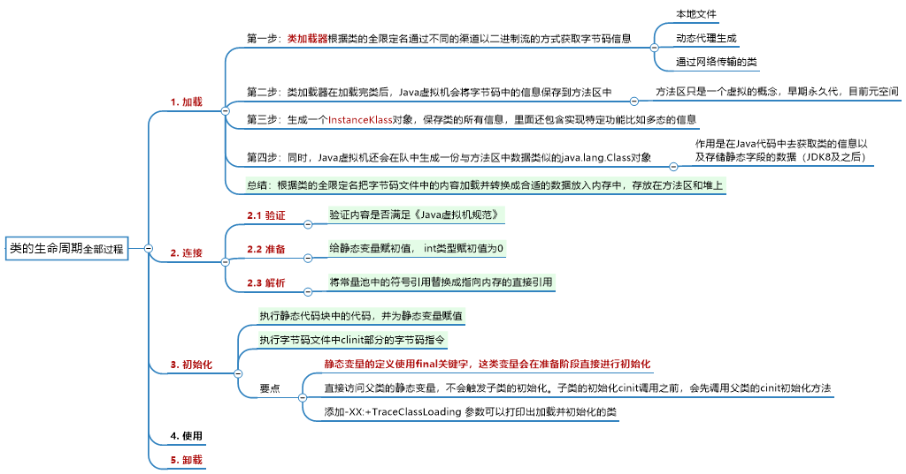

**1、加载阶段**

加载(Loading)阶段第一步是类加载器根据类的全限定名通过不同的渠道以二进制流的方式获取字节码信息。 程序员可以使用Java代码拓展的不同的渠道，类加载器在加载完类之后，Java虚拟机会将字节码中的信息保存到内存的方法区中。同时，Java虚拟机还会在堆中生成一份与方法区中数据类似的java.lang.Class对象。

**2、连接阶段**

连接（Linking）阶段的第一个环节是**验证**，验证的主要目的是检测Java字节码文件是否遵守了《Java虚拟机规 范》中的约束。**这个阶段一般不需要程序员参与**。

主要包含如下四部分，具体详见《Java虚拟机规范》： 

- 1、文件格式验证，比如文件是否以0xCAFEBABE开头，主次版本号是否满足当前Java虚拟机版本要求。
- 2、元信息验证，例如类必须有父类（super不能为空）
- 3、验证程序执行指令的语义，比如方法内的指令执行中跳转到不正确的位置。
- 4、符号引用验证，例如是否访问了其他类中private的方法等

第二个环节是准备。**准备阶段为静态变量（static）分配内存并设置初始值。**而每一种基本数据类型和引用数据类型都有其初始值。

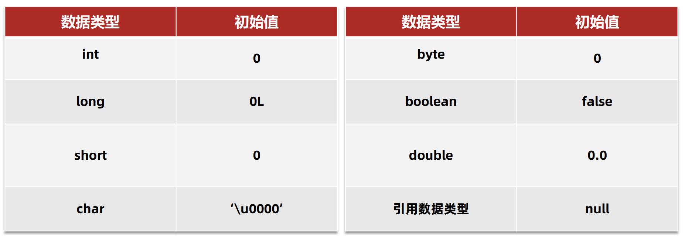

final修饰的基本数据类型的静态变量，准备阶段直接会将代码中的值进行赋值。

第三个环节：**解析阶段**，主要是将常量池中的符号引用替换为直接引用。

- **符号引用就是在字节码文件中使用编号来访问常量池中的内容。**
- **直接引用不在使用编号，而是使用内存中地址进行访问具体的数据。**

**3、初始化阶段**

初始化阶段会执行**静态代码块中的代码**，**并为静态变量赋值**。执行流程与代码流程一致。

初始化阶段会执行**字节码文件中clinit部分的字节码指令**。

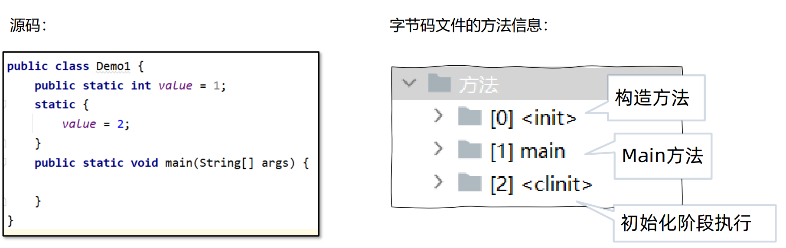

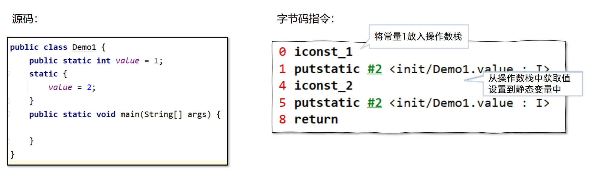

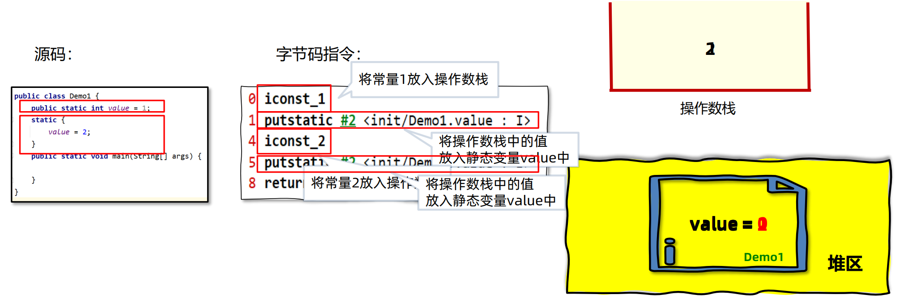

**以下几种方式会导致类的初始化**：添加`-XX:+TraceClassLoading` 参数可以打印出加载并初始化的类

- 1.访问一个类的静态变量或者静态方法，注意变量是final修饰的并且等号右边是常量不会触发初始化。 
- 2.调用Class.forName(String className)。 
- 3.new一个该类的对象时。 
- 4.执行Main方法的当前类。

**clinit指令在特定情况下不会出现**，比如：如下几种情况是不会进行初始化指令执行的。 

- 1.无静态代码块且无静态变量赋值语句。 
- 2.有静态变量的声明，但是没有赋值语句。 
- 3.静态变量的定义使用final关键字，这类变量会在准备阶段直接进行初始化。

> 注意：
>
> **直接访问父类的静态变量，不会触发子类的初始化。**
>
> **子类的初始化clinit调用之前，会先调用父类的clinit初始化方法。**
>
> **数组的创建不会导致数组中元素的类进行初始化。**
>
> **final修饰的变量如果赋值的内容需要执行指令才能得出结果，会执行clinit方法进行初始化**

> 解决大厂经典笔试题

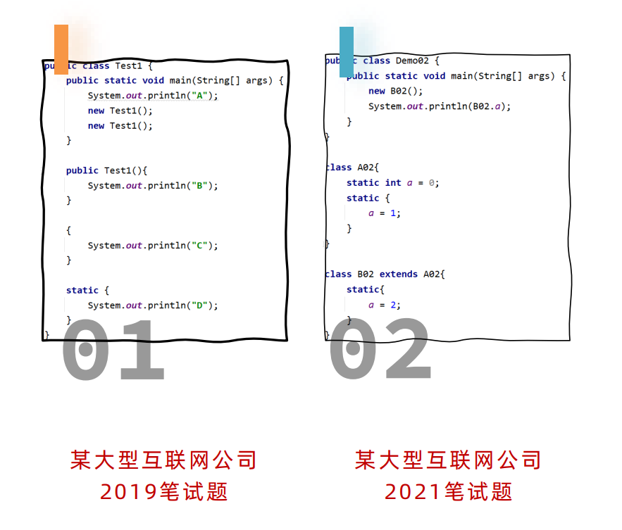


2019执行流程

- 执行main方法先初始化Test1的初始化方法，输出结果DA
- 执行两次Test1的构造方法，输出结果DACBCB

### 总结

几个要点： 

- 1.静态变量的定义使用final关键字，这类变量会在准备阶段直接进行初始化 （除非要执行方法）。 
- 2.直接访问父类的静态变量，不会触发子类的初始化。子类的初始化cinit调用之前， 会先调用父类的cinit初始化方法。

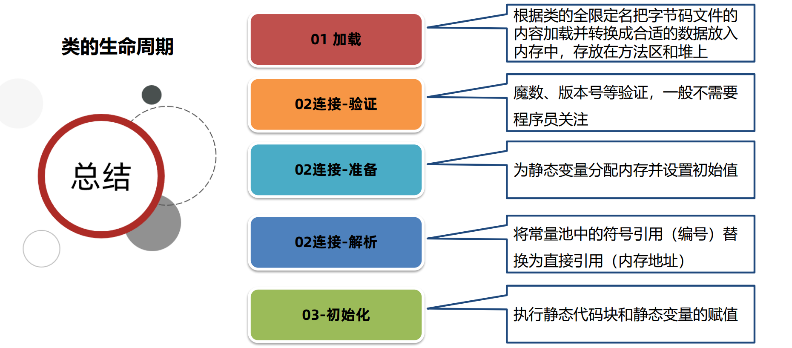

## 类加载器

### 核心问题

**1、类加载器的作用是什么？**

答：类加载器（ClassLoader）负责在类加载过程中的字节码获取并加载到内存这一部分。通过加载字节码数据放入内存转化成byte[]，接下来调用虚拟机底层方法将byte[]转化成方法区和堆区中的数据。

**2、有几种类加载器？**

1. 启动类加载器（`Bootstrap ClassLoader`）加载核心类 

2. 扩展类加载器（`Extension ClassLoader`）加载扩展类 

3. 应用程序类加载器（`Application ClassLoader`）加载应用`classpath`中的类 

4. 自定义类加载器，重写`findClass`方法。 

JDK9及之后扩展类加载器（`Extension ClassLoader`）变成了平台类加载器（`Platform  ClassLoader`）

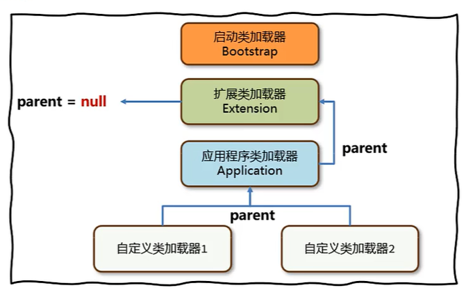

**3、类的双亲委派机制是什么？**

答：每个Java实现的类加载器中保存了一个成员变量叫**“父”（Parent）类加载器**。 **自底向上查找是否加载过，再由顶向下进行加载。避免了核心类被应用程序重写并覆盖的问题，提升了安全性**。

1、当一个类加载器去加载某个类的时候，会自底向上查找是否加载过，如果加载过就直接返回，如果一直到最顶层的类加载器都没有加载，再自顶向下进行加载

2、应用程序类加载器的父类是扩展类加载器，扩展类加载器的父类是启动类加载器；

3、双亲委派机制的好处有两点：第一是避免恶意代码替换JDK中的核心类库，比如`java.lang.String`，确保核心类库的安全性和完整性，第二是避免一个类重复地被加载；

**4、这怎么打破类的双亲委派机制？**

1. 重写loadClass方法，不再实现双亲委派机制。 
2. JNDI、JDBC、JCE、JAXB和JBI等框架使用了SPI机制+线程上下文类加载器。 
3. OSGi实现了一整套类加载机制，允许同级类加载器之间互相调用

### 类加载器

**类加载器的作用是什么？**

答：类加载器（ClassLoader）负责在类加载过程中的字节码获取并加载到内存这一部分。通过加载字节码数据放入内存转化成byte[]，接下来调用虚拟机底层方法将byte[]转化成方法区和堆区中的数据。

1、虚拟机底层代码实现的类加载器

- 这里的虚拟机一般指`Hotspot`虚拟机
- **启动类加载器（Bootstrap）**：加载程序运行时的基础类，比如`java.lang.String`

2、Java中提供的默认或者自定义的类加载器

- 继承自抽象类`ClassLoader`
- **扩展类加载器(Extension)**：允许扩展Java中比较常用的类
- **应用程序加载器Application**：加载应用使用的类

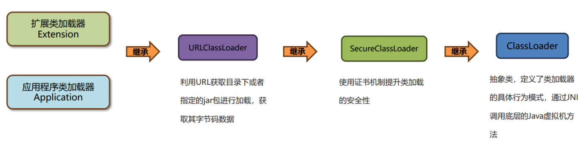

### 类的双亲委派机制

由于Java虚拟机中有多个类加载器，双亲委派机制的核心是**解决一个类到底由谁加载的问题**

作用：

- 保证类加载的安全性，避免恶意代码替换JDK中的核心类库，确保核心类库的完整性和安全性
- 避免重复加载

到底类的双亲委派机制是什么？

双亲委派机制指的是：当一个类加载器接收到加载类的任务时，会**自底向上查找是否加载过**该类，**再由顶向下进行加载**

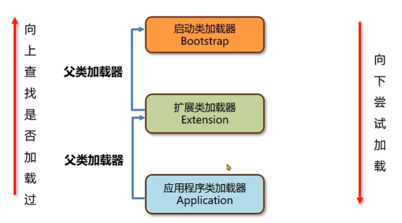

问题：

> 1、重复的类：如果一个类重复出现在三个类加载器的加载位置，应该由谁来加载？

- 启动类加载器加载，根据双亲委派机制，它的优先级是最高的

> 2、String类能覆盖吗？在自己的项目中去创建一个`java.lang.String`类，会被加载吗？

- 不能，会返回启动类加载器加载在`rt.jar`包中的String类

> 3、类加载器的关系？

- 应用程序类加载器的parent父类加载器是扩展类加载器，而扩展类加载器的parent是null，但是在代码逻辑上，扩展类加载器依然会把启动类加载器当成父类加载器处理；

- 启动类加载器是使用C++编写，没有父类加载器

- 可以使用`arthas`来查看类加载器的父子关系

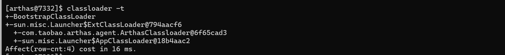

在Java中如何使用代码的方式去主动加载一个类？

1. 使用`Class.forName`方法，使用当前类的类加载器去加载指定的类
2. 获取到类加载器，通过类加载器的`loadClass`方法指定某个类加载器加载

```java
public class Main {
    public static void main(String[] args) throws ClassNotFoundException {
        ClassLoader classLoader = Main.class.getClassLoader();
        System.out.println(classLoader);

        Class<?> stringClass = classLoader.loadClass("java.lang.String");
        System.out.println(stringClass.getClassLoader());
    }
}

// result: 
// sun.misc.Launcher$AppClassLoader@18b4aac2
// null
```

------

### 打破双亲委派机制

三种方式

- 自定义类加载器
  - 自定义类加载器并且重写 `loadClass`方法，就可以将双亲委派机制的代码去除
  - Tomcat通过这种方式实现应用之间类隔离
- 线程上下文类加载器
  - 利用上下文类加载器加载类，比如 `JDBC和JNDI`等
- `Osgi`框架的类加载器
  - 历史上`Osgi`框架实现了一套新的类加载器机制，允许同级之间委托进行类的加载

#### 自定义类加载器

`ClassLoader`的原理，包含了四个核心方法：

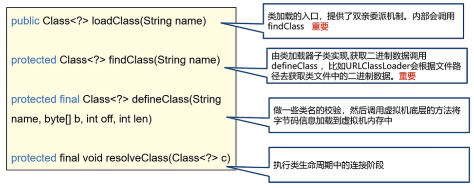

```java
// parent等于null说明父类加载器是启动类加载器，直接调用findBootstrapClassOrNull
// 否则调用父类加载器的加载方法
if (parent != null) {
    c = parent.loadClass(name, false);
} else {
    c = findBootstrapClassOrNull(name);
}
// 父类加载器爱莫能助，我来加载！
if (c == null) {
    c = findClass(name);
}
```

问题：

> 1、自定义类加载器父类怎么是`AppClassLoader`呢？

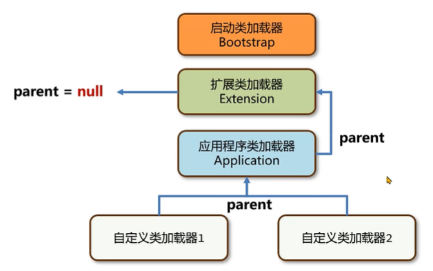

以JDK8为例，ClassLoader类中提供构造方法设置parent的内容:

这个构造方法由另外一个构造方法调用，其中父类加载器由`getSystemClassLoader`方法设置，该方法返回的是`AppClassLoader`

```java
private ClassLoader(Void unused, ClassLoader parent) {
    this.parent = parent;
    if (ParallelLoaders.isRegistered(this.getClass())) {
        parallelLockMap = new ConcurrentHashMap<>();
        package2certs = new ConcurrentHashMap<>();
        assertionLock = new Object();
    } else {
        // no finer-grained lock; lock on the classloader instance
        parallelLockMap = null;
        package2certs = new Hashtable<>();
        assertionLock = this;
    }
}

protected ClassLoader() {
    this(checkCreateClassLoader(), getSystemClassLoader());
}
```

> 2、两个自定义类加载器加载相同限定名的类，不会冲突吗？

- **不会冲突**，在同一个Java虚拟机中，只有**相同类加载器+相同的类限定名**才会被认为是同一个类。

- 在`Arthas`中使用`sc –d 类名`的方式查看具体的情况

------

#### 线程上下文类加载器

`JDBC`案例：

- `JDBC`中使用了`DriverManager`来管理项目中引入的不同数据库的驱动，比如mysql驱动、oracle驱动。
- `DriverManager`类位于`rt.jar`包中，由启动类加载器加载。
- 依赖中的`mysql`驱动对应的类，由应用程序类加载器来加载。
- `DriverManager`属于`rt.jar`是启动类加载器加载的。而用户jar包中的驱动需要由应用类加载器加载，这就违反了双亲委派机制。

解答：

- 启动类加载器加载`DriverManager`。
- 在初始化`DriverManager`时，通过`SPI`机制加载jar包中的`myql`驱动。
- `SPI`中利用了线程上下文类加载器（应用程序类加载器）去加载类并创建对象。
- **这种由启动类加载器加载的类，委派应用程序类加载器去加载类的方式，打破了双亲委派机制。**

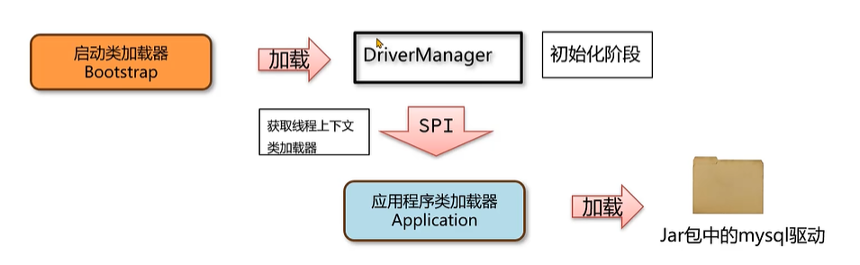

> 1、`DriverManager`怎么知道jar包中要加载的驱动在哪儿？

用到了SPI机制：

SPI全称为（Service Provider Interface）,是JDK内置的一种服务提供发现机制

SPI的工作原理

1、在ClassPath路径下META-INF/services文件夹中，以接口的全限定名来命名文件名，对应的文件里面写该接口的实现

2、使用ServiceLoader加载实现类

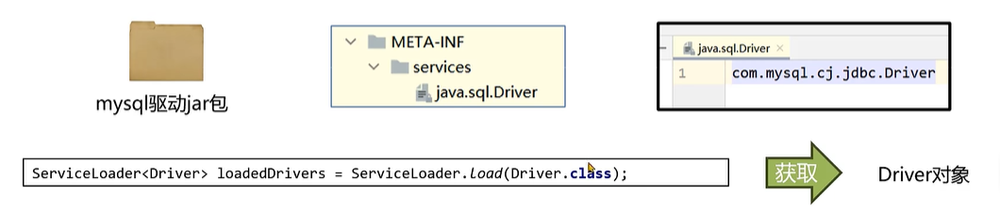

> 2、SPI中是如何获取应用类加载器的

SPI中使用了线程上下文中保存的类加载器进行类的加载，这个类加载器一般是应用程序类加载器。

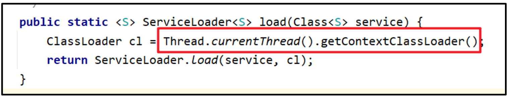

> 2、`JDBC`案例真的打破了双亲委派机制吗

`DriverManager`：JDK8中位于rt.jar，由启动类加载器加载

Jar包中的`mysql`驱动： 位于`classpath`，由应用程序类加载器加载

因此**没有打破双亲委派机制**：`JDBC`只是在`DriverManager`加载完之后，通过初始化阶段触发了驱动类的加载，类的加载依然遵循双亲委派机制

**打破双亲委派机制的唯一方法是重写loadClass方法**

#### `OSGi`模块化

历史上，`OSGi`模块化框架。它存在同级之间的类加载器的委托加载。`OSGi`还使用类加载器实现了热部署的 功能。 

**热部署指的是在服务不停止的情况下，动态地更新字节码文件到内存中。**

------

### JDK9之后的类加载器

JDK8及之前的版本中，扩展类加载器和应用程序类加载器的源码位于`rt.jar`包中的`sun.misc.Launcher.java`。

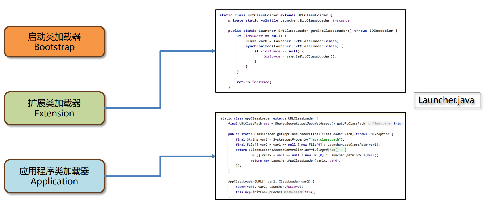

由于`JDK9`引入了module的概念，类加载器在设计上发生了很多变化。

1、**启动类加载器使用Java编写，位于`jdk.internal.loader.ClassLoaders`类中**。

-  Java中的`BootClassLoader`继承自`BuiltinClassLoader`实现从模块中找到要加载的字节码资源文件。 

- 启动类加载器依然无法通过java代码获取到，返回的仍然是null，保持了统一。

2、**扩展类加载器被替换成了平台类加载器（Platform Class Loader）**。

- 平台类加载器遵循模块化方式加载字节码文件，所以继承关系从`URLClassLoader`变成了 `BuiltinClassLoader`，`BuiltinClassLoader`实现了从模块中加载字节码文件。平台类加载器的存在更多的是 为了与老版本的设计方案兼容，自身没有特殊的逻辑。

------

## 运行时数据区

 Java虚拟机在运行Java程序过程中管理的内存区域，称之为**运行时内存区**，其中：

- **线程共享的区域：方法区、堆；**
- **线程不共享的区域：程序计数器，Java虚拟机栈，本地方法栈；**

------

### 核心问题

> 1、Java的内存分成哪几个部分，详细介绍一下

- **程序计数器**：每个线程会通过程序计数器记录当前要执行的字节码指令的地址，程序计数器可以控制程序指令的进行，实现分支、跳转、异常等逻辑；
- **Java虚拟机栈和本地方法栈**：采用栈的数据结构来管理方法调用中的基本数据（局部变量、操作数等），每个方法的调用使用一个栈帧来保存。
- **方法区**：方法区中主要存放的是类的元信息，同时还保存了常量池
- **堆**：堆中存放的是创建出来的对象， 这也是最容易产生内存溢出的位置

> 2、Java内存中哪些部分会内存溢出（OOM，out of Memory）？

程序计数器是唯一不会出现OOM的。Java虚拟机栈和本地方法栈、堆和方法区都会出现OOM

> 3、JDK7和8在内存结构上的区别是什么？

方法区：

- **JDK7及之前的版本**将方法区存放在**堆区域中的永久代空间**

- **JDK8及之后的版本**将方法区存放在**元空间**中，**元空间位于操作系统维护的直接内存中**

字符串常量池

- JDK6及之前的版本将字符串常量池存放在方法区（永久代）中
- JDK7及之后的版本将字符串常量池存放在堆中

------

### 程序计数器

程序计数器（Program Counter Register）也叫PC寄存器，每个线程会通过程序计数器记录当前要执行的的字节码指令的地址。

作用

- 程序计数器可以**控制程序指令的进行**，实现分支、跳转、异常等逻辑。

- 在多线程执行情况下，Java虚拟机需要通过程序计数器记录CPU切换前解释执行到那一句指令并继续解释运行。

> 程序计数器在运行中会出现内存溢出吗？

**内存溢出**：指的是程序在使用某一块内存区域时，存放的数据需要占用的内存大小超过了虚拟机能提供的内存上限。

答，不会，因为每个线程**只存储一个固定长度的内存地址**，**程序计数器是不会发生内存溢出的。程序员无需对程序计数器做任何处理**。

------

### Java虚拟机栈

Java虚拟机栈（Java Virtual Machine Stack）采用栈的数据结构来管理方法调用中的基本数据，先进后出（First In Last Out），每一个方法的调用使用**一个栈帧（Stack Frame）**来保存。

Java虚拟机栈随着线程的创建而创建，而回收则会在线程的销毁时进行。由于方法可能会在不同线程中执行，**每个线程都会包含一个自己的虚拟机栈**。

栈帧的组成：

- 局部变量表：在运行过程 中存放所有的局部变量
- 操作数栈：操作数栈是栈帧中虚拟机在执行指令过程中用来存放中间数据的一块区域。
- 帧数据：主要包含动态链接、方法出口、异常表的引用

> 1、局部变量表

- **局部变量表**：在运行过程中存放所有的局部变量；

  - 编译成字节码文件时就可以确定局部变量表的内容。

  - 栈帧中的局部变量表是一个**数组**，数组中每一个位置称之为槽(slot) ，**long和double类型占用两个槽，其他类型占用一个槽**。
  - 局部变量表保存的内容有：**实例方法的this对象，方法的参数，方法体中声明的局部变量**。
    -  **实例方法中的序号为0的位置存放的是this**，指的是当前调用方法的对象，运行时会在内存中存放实例对象的地址。
    - 方法参数也会保存在局部变量表中，其顺序与方法中参数定义的顺序一致。
    - 为了节省空间，**局部变量表中的槽是可以复用的**，一旦某个局部变量不再生效，当前槽就可以再次被使用。

- 操作数栈是栈帧中虚拟机在执行指令过程中用来存放临时数据的一块区域；

- 帧数据主要包含动态链接、方法出口、异常表的引用；

> 2、操作数栈

操作数栈是栈帧中虚拟机在执行指令过程中用来存放中间数据的一块区域。它是一种栈式的数据结构，如果一条指令将一个值压入操作数栈，则后面的指令可以弹出并使用该值。在编译期就可以确定操作数栈的最大深度，从而在执行时正确的分配内存大小。

> 3、**帧数据**

- **动态链接**

  - 当前类的字节码指令引用了其他类的属性或者方法时，需要将符号引用（编号）转换成对应的运行时常量池中的内存地址。

  - 动态链接就保存了编号到运行时常量池的内存地址的映射关系。

- **方法出口**
  - 方法出口指的是方法在正确或者异常结束时，当前栈帧会被弹出，同时程序计数器应该指向上一个栈帧中的下一条指令的地址。所以在当前栈帧中，需要存储此方法出口的地址。

- **异常表**
  - 异常表存放的是代码中异常的处理信息，包含了异常捕获的生效范围以及异常发生后跳转到的字节码指令位置。

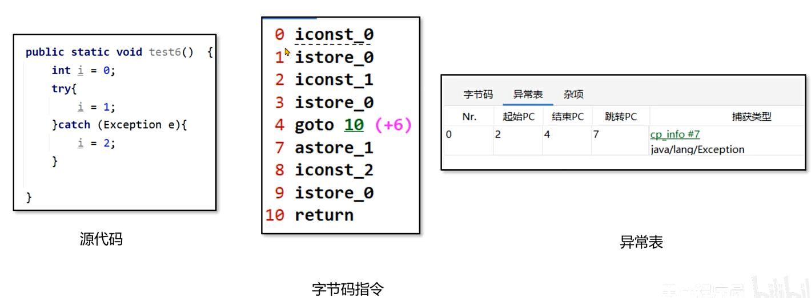

> Java虚拟机栈会出现内存溢出吗？

Java虚拟机栈如果栈帧过多，占用内存超过栈内存可以分配的最大大小就会出现内存溢出。 

Java虚拟机栈内存溢出时会出现`StackOverflowError`的错误

如果我们不指定栈的大小，JVM 将创建一个 具有默认大小的栈。大小取决于操作系统和 计算机的体系结构。

要修改Java虚拟机栈的大小，可以使用虚拟机参数 -Xss 。

- 语法：-Xss栈大小

- 单位：字节（默认，必须是 1024 的倍数）、k或者K(KB)、m或者M(MB)、g或者G(GB)，比如-Xss1024K 

注意事项：

- 与-Xss类似，也可以使用 -XX:ThreadStackSize 调整标志来配置堆栈大小。 格式为： -XX:ThreadStackSize=1024

- HotSpot JVM对栈大小的最大值和最小值有要求：Windows（64位）下的JDK8测试最小值为180k，最大值为1024m。
- 局部变量过多、操作数栈深度过大也会影响栈内存的大小。

一般情况下，工作中即便使用了递归进行操作，栈的深度最多也只能到几百,不会出现栈的溢出。所以此参数 可以手动指定为-Xss256k节省内存。

------

### 本地方法栈

Java虚拟机栈存储了Java方法调用时的栈帧，而本地方法栈存储的是native本地方法的栈帧。

 在`Hotspot`虚拟机中，**Java虚拟机栈和本地方法栈实现上使用了同一个栈空间**。本地方法栈会在栈内存上生成一个栈帧，临时保存方法的参数同时方便出现异常时也把本地方法的栈信息打印出来。

------

### 堆

一般Java程序中堆内存是空间最大的一块内存区域。创建出来的对象都存在于堆上。

栈上的局部变量表中，可以存放堆上对象的引用。静态变量也可以存放堆对象的引用，通过静态变量就可以实现对象在线程之间共享。

> 堆内存会溢出吗？
>
> 堆内存大小是有上限的，当对象一直向堆中放入对象达到上限之后，就会抛出`OutOfMemory` 错误

堆空间有三个需要关注的值，used total max

- used指的是当前已使用的堆内存
- total是java虚拟机已经分配的可用堆内存
- max是java虚拟机可以分配的最大堆内存。

堆内存used total max三个值可以通过dashboard命令看到；

手动指定刷新频率（不指定默认5秒一次）：dashboard –i 刷新频率(毫秒)

如果不设置任何的虚拟机参数，max默认是系统内存的1/4，total默认是系统内存的1/64。在实际应用中一般都需要设置 total和max的值。

> **堆 – 设置大小**

- 要修改堆的大小，可以使用虚拟机参数 –Xmx（max最大值）和-Xms (初始的total)。
-  语法：**-Xmx值 -Xms值**
- 单位：字节（默认，必须是 1024 的倍数）、k或者K(KB)、m或者M(MB)、g或者G(GB) 
- 限制：**Xmx必须大于 2 MB，Xms必须大于1MB**

> 问题：为什么arthas中显示的heap堆大小与设置的值不一样呢？

arthas中的heap堆内存使用了JMX技术中内存获取方式，这种方式与垃圾回收器有关，计算的是**可以分配对象的内存**，而不是整个内存

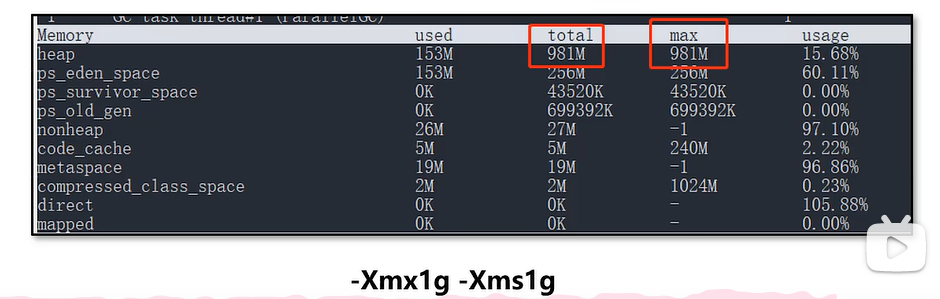

Java服务端程序开发时，**建议将-Xmx和-Xms设置为相同的值**，这样在程序启动之后可使用的总内存就是最大内存，而无 需向java虚拟机再次申请，减少了申请并分配内存时间上的开销，同时也不会出现内存过剩之后堆收缩的情况。

------

### 方法区

方法区是存放基础信息的位置，**线程共享**，主要包含三部分内容：

- **类的元信息**：保存了所有类的基本信息
  - 一般称之为InstanceKlass对象，包含类的基本信息，常量池、字段、方法（存放引用）和虚方法表（实现多态的基础）。
  - 在类的加载阶段完成。
- **运行时常量池**：保存了字节码文件中的常量池内容
  - 字节码文件中通过编号查表的方式找到常量，这种常量池称为**静态常量池**。
  - 当常量池加载到内存中之后，可以通过内存地址快速的定位到常量池中的内容，这种常量池称为**运行时常量池**。
- **字符串常量池**：保存了字符串常量 

1、Hotspot方法区设计：

- **JDK7及之前的版本**将方法区存放在**堆区域中的永久代空间**，堆的大小由虚拟机参数`-XX:MaxPermSize=值`来控制。
- **JDK8及之后的版本**将方法区存放在**元空间**中，**元空间位于操作系统维护的直接内存中**，默认情况下只要不超过操作系统承受的上限，可以一直分配。可以使用`-XX:MaxMetaspaceSize=值`将元空间最大大小进行限制。

2、arthas中查看方法区

- 使用`memory`打印出内存情况，JDK7及之前的版本查看`ps_perm_gen`属性
- JDK8及之后的版本查看`metaspace`属性。

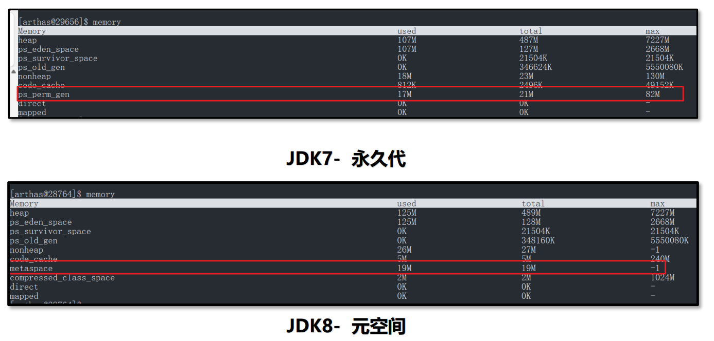

3、字符串常量池的变更

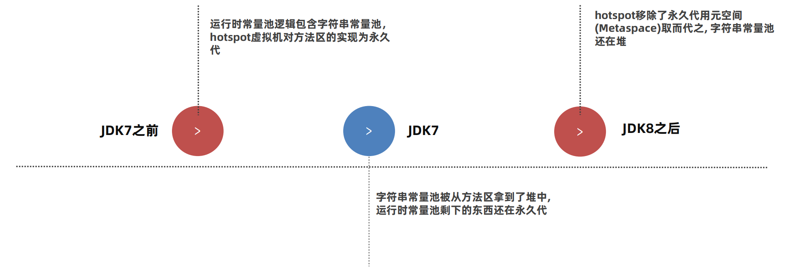

> 练习1：

通过字节码指令分析如下代码的运行结果？

```java
public static void main(String[] args) {
    String a = "1";
    String b = "2";
    String c = "12";
    String d = a + b;
    System.out.println(c == d);   // false
}
```

其字节码指令：

- 从常量池中获取字符串1的地址放入操作数栈，然后将操作数栈中的值放入局部变量表，重复三次，局部变量表中分别存储“1”，“2”，“12”
- 两个变量的相加调用了StringBuilder对象，在堆中生成了一个新的值，使用append方法实现字符串相加，并将其放入局部变量表中
- 因为c和d所指向的内容不一样，故输出为false;

```java
 0 ldc #2 <1>
 2 astore_1
 3 ldc #3 <2>
 5 astore_2
 6 ldc #4 <12>
 8 astore_3
 9 new #5 <java/lang/StringBuilder>
12 dup
13 invokespecial #6 <java/lang/StringBuilder.<init> : ()V>
16 aload_1
17 invokevirtual #7 <java/lang/StringBuilder.append : (Ljava/lang/String;)Ljava/lang/StringBuilder;>
20 aload_2
21 invokevirtual #7 <java/lang/StringBuilder.append : (Ljava/lang/String;)Ljava/lang/StringBuilder;>
24 invokevirtual #8 <java/lang/StringBuilder.toString : ()Ljava/lang/String;>
27 astore 4
29 getstatic #9 <java/lang/System.out : Ljava/io/PrintStream;>
32 aload_3
33 aload 4
35 if_acmpne 42 (+7)
38 iconst_1
39 goto 43 (+4)
42 iconst_0
43 invokevirtual #10 <java/io/PrintStream.println : (Z)V>
46 return
```

> 练习2：

通过字节码指令分析如下代码的运行结果？

```java
public static void main(String[] args) {
    String a = "1";
    String b = "2";
    String c = "12";
    String d = "1" + "2";
    System.out.println(c == d);  // true
}
```

其字节码指令：

- 从常量池中获取字符串1的地址放入操作数栈，然后将操作数栈中的值放入局部变量表，重复三次，局部变量表中分别存储“1”，“2”，“12”
- 两个常量相加，编译阶段直接连接；

```java
 0 ldc #2 <1>
 2 astore_1
 3 ldc #3 <2>
 5 astore_2
 6 ldc #4 <12>
 8 astore_3
 9 ldc #4 <12>
11 astore 4
13 getstatic #5 <java/lang/System.out : Ljava/io/PrintStream;>
16 aload_3
17 aload 4
19 if_acmpne 26 (+7)
22 iconst_1
23 goto 27 (+4)
26 iconst_0
27 invokevirtual #6 <java/io/PrintStream.println : (Z)V>
30 return
```

> 神奇的intern

- JDK6版本中intern () 方法会把第一次遇到的字符串实例复制到永久代的字符串常量池中，返回 的也是永久代里面这个字符串实例的引用。JVM启动时就会把java加入到常量池中。
- JDK7及之后版本中**由于字符串常量池在堆上**，所以intern () 方法会把第一次遇到的字符串的**引用**放入字符串常量池。

>  静态变量的存储

- JDK6及之前的版本中，静态变量是存放在方法区中的，也就是永久代。
- JDK7及之后的版本中，静态变量是存放在**堆中的Class对象**中，脱离了永久代。

------

### 直接内存

直接内存（Direct Memory）并不在《Java虚拟机规范》中存在，所以并不属于Java运行时的内存区域。

在 JDK 1.4 中引入了 NIO 机制，使用了直接内存，主要为了解决以下两个问题:

1、Java堆中的对象如果不再使用要回收，回收时会影响对象的创建和使用。 

2、IO操作比如读文件，需要先把文件读入直接内存（缓冲区）再把数据复制到Java堆中。 现在直接放入直接内存即可，同时Java堆上维护直接内存的引用，减少了数据复制的开销。写文件也是类似的思路。

直接内存

- 要创建直接内存上的数据，可以使用`ByteBuffer`。

- 语法： `ByteBuffer directBuffer = ByteBuffer.allocateDirect(size);`

- 注意事项： arthas的memory命令可以查看直接内存大小，属性名direct。

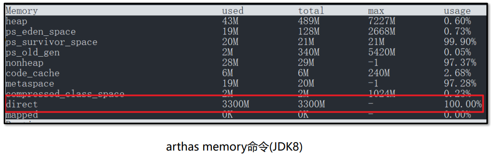

- 如果需要手动调整直接内存的大小，可以使用`-XX:MaxDirectMemorySize=大小` 

  - 单位k或K表示千字节，m或M表示兆字节，g或G表示千兆字节。默认不设置该参数情况下，JVM 自动选择最大分配的大小。

  - 以下示例以不同的单位说明如何将直接内存大小设置为 `1024 KB`：
    - `-XX:MaxDirectMemorySize=1m`
    - `-XX:MaxDirectMemorySize=1024k`
    - `-XX:MaxDirectMemorySize=1048576`

------

## 自动垃圾回收

**C/C++的内存管理**

- 在C/C++这类没有自动垃圾回收机制的语言中，一个对象如果不再使用，需要手动释放，否则就会出现**内存泄漏**。我们称这种释放对象的过程为垃圾回收，而需要程序员编写代码进行回收的方式为**手动回收**。
- **内存泄漏**指的是不再使用的对象在系统中未被回收，内存泄漏的积累可能会导致**内存溢出**。

**Java的内存管理**

- 执行引擎的一部分

- Java中为了简化对象的释放，引入了**自动的垃圾回收（Garbage Collection简称GC）机制**。通过垃圾回收器来对不再使用的对象完成自动的回收，垃圾回收器主要负责对**堆**上的内存进行回收。其他很多现代语言比如C#、Python、Go都拥有自己的垃圾回收器。

**垃圾回收的对比**

- 自动垃圾回收：自动根据对象是否使用由虚拟机来回收对象
  - 优点：降低程序员实现难度、降低对象回收bug的可能性
  - 缺点：程序员无法控制内存回收的及时性

- 手动垃圾回收：由程序员编程实现对象的删除
  - 优点：回收及时性高，由程序员把控回收的时机
  - 缺点：编写不当容易出现悬空指针、重复释放、内存泄漏等问题

**应用场景**

- 解决系统僵死的问题：大厂的系统出现的许多系统僵死问题 都与频繁的垃圾回收有关

- 性能优化：对垃圾回收器进行合理的设置可以有 效地提升程序的执行性能

- 高频面试题：常见的垃圾回收器、常见的垃圾回收算法、四种引用、项目中用了哪一种垃圾回收器

> 线程不共享的部分，都是**伴随着线程的创建而创建，线程的销毁而销毁**。而方法的栈帧在执行完方法之后就会自动弹出栈并释放掉对应的内存。

------

### 方法区的回收

方法区中能回收的内容主要就是不再使用的类。 

判定一个类可以被卸载。需要同时满足下面三个条件： 

1、**此类所有实例对象都已经被回收，在堆中不存在任何该类的实例对象以及子类对象。** 

2、**加载该类的类加载器已经被回收**。 

3、**该类对应的 java.lang.Class 对象没有在任何地方被引用**

方法区的回收 – 手动触发回收

如果需要手动触发垃圾回收，可以调用System.gc()方法。

- 语法： `System.gc()` 
- 注意事项： 调用System.gc()方法并不一定会立即回收垃圾，仅仅是向Java虚拟机发送一个垃圾回收的请求，具体是否需要执行垃圾回收Java虚拟机会自行判断。

------

### 堆的回收

> 如何判断堆上的对象可以回收？

Java中的对象是否能被回收，是根据对象是否被引用来决定的。如果对象被引用了，说明该对象还在使用，不允许被回收。只有无法通过引用获取到对象时，该对象才能被回收。

------

#### 引用计数法和可达性分析法

**引用计数法**

- 引用计数法会为每个对象维护一个引用计数器，当对象被引用时加1，取消引用时减1。
- 优点是实现简单，C++中的智能指针就采用了引用计数法
- 缺点主要有两点：
  - 1.每次引用和取消引用都需要维护计数器，对系统性能会有一定的影响
  - 2.存在循环引用问题，所谓循环引用就是当A引用B，B同时引用A时会出现对象无法回收的问题。
- 如果想要查看垃圾回收的信息，可以使用-verbose:gc参数。
  - 语法： -verbose:gc

**可达性分析算法**

Java使用的是**可达性分析算法**来判断对象是否可以被回收。

可达性分析将对象分为两类：**垃圾回收的根对象（GC  Root）和普通对象**，对象与对象之间存在引用关系。

可达性分析算法指的是如果从某个到GC Root对象是可达的，对象就不可被回收。

- GC Root对象常规情况下是不会被回收的

> 哪些对象被称之为GC Root对象呢？ 

- **线程Thread对象**，引用线程栈帧中的方法参数、局部变量等。

- **系统类加载器加载的java.lang.Class对象**，引用类中的静态变量。

- **监视器对象**，用来保存同步锁synchronized关键字持有的对象。 

- **本地方法调用时使用的全局对象**

------

#### 五种对象引用

可达性算法中描述的对象引用，一般指的是强引用，即是GCRoot对象对普通对象有引用关系，只要这层关系存在， 普通对象就不会被回收。除了强引用之外，Java中还设计了几种其他引用方式：

- 软引用
- 弱引用
- 虚引用
- 终结器引用

1、软引用

- 软引用相对于强引用是一种比较弱的引用关系，如果一个对象只有软引用关联到它，当程序内存不足时，就会将软引用中的数据进行回收。
- 软引用的执行过程如下： 
  - 1.将对象使用软引用包装起来，`new SoftReference<对象类型>(对象)`。 
  - 2.内存不足时，虚拟机尝试进行垃圾回收。 
  - 3.如果垃圾回收仍不能解决内存不足的问题，回收软引用中的对象。 
  - 4.如果依然内存不足，抛出OutOfMemory异常。

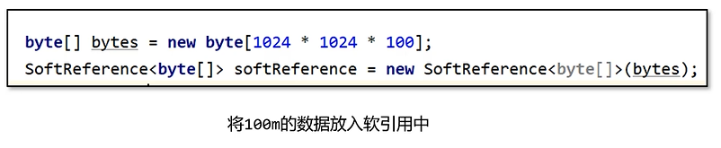

2、弱引用

弱引用的整体机制和软引用基本一致，区别在于弱引用包含的对象在垃圾回收时，**不管内存够不够都会直接被回收**。

在JDK 1.2版之后提供了WeakReference类来实现弱引用，弱引用主要在`ThreadLocal`中使用。

弱引用对象本身也可以使用引用队列进行回收。

```java
byte[] bytes = new byte[1024 * 1024 * 100];
WeakReference<byte[]> weakReference = new WeakReference<byte[]>(bytes);
bytes = null;
System.out.println(weakReference.get());

System.gc();

System.out.println(weakReference.get());

// 输出
// [B@5cad8086
// null3、虚引用
```

3、虚引用和终结器引用

- **这两种引用在常规开发中是不会使用的**。

- 虚引用也叫幽灵引用/幻影引用，不能通过虚引用对象获取到包含的对象。虚引用唯一的用途是当对象被垃圾回 收器回收时可以接收到对应的通知。Java中使用`PhantomReference`实现了虚引用，直接内存中为了及时知道 直接内存对象不再使用，从而回收内存，使用了虚引用来实现。
- 终结器引用指的是在对象需要被回收时，终结器引用会关联对象并放置在Finalizer类中的引用队列中，在稍后 由一条由`FinalizerThread`线程从队列中获取对象，然后执行对象的finalize方法，在对象第二次被回收时，该对象才真正的被回收。在这个过程中可以在finalize方法中再将自身对象使用强引用关联上，但是不建议这样做

------

#### 垃圾回收算法

核心思想：Java是如何实现垃圾回收的呢？简单来说，垃圾回收要做的有两件事： 

1、找到内存中存活的对象

2、释放不再存活对象的内存，使得程序能再次利用这部分空间

四种垃圾回收算法

- 标记-清除算法
- 复制算法

- 标记-整理算法

- 分代GC

> 垃圾回收算法的评价标准

Java垃圾回收过程会通过单独的GC线程来完成，但是不管使用哪一种GC算法，都会有部分阶段需要停止所有的用户线程。这个过程被称之为Stop The World简称STW，如果STW时间过长则会影响用户的使用。所以判断GC算法是否优秀，可以从三个方面来考虑：

**1、吞吐量**

- 吞吐量指的是 CPU 用于执行用户代码的时间与 CPU 总执行时间的比值，即**`吞吐量 = 执行用户代码时间 /（执行用户代码时间 + GC时间）`**。吞吐量数值越高，垃圾回收的效率就越高。

**2、最大暂停时间**

- 最大暂停时间指的是所有在垃圾回收过程中的STW时间最大值。
- 比如如下的图中，黄色部分的STW就是最大暂停时间，显而易见上面的图比下面的图拥有更少的最大暂停时间。最大暂停时间越短，用户使用系统时受到的影响就越短。

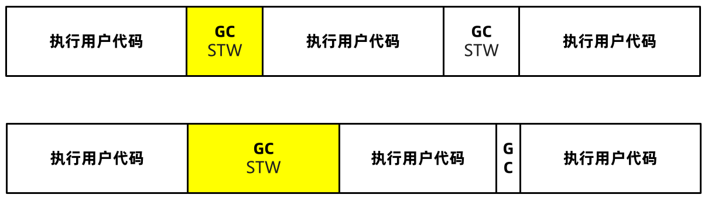

**3、堆使用效率**

- 不同垃圾回收算法，对堆内存的使用方式是不同的。比如标记清除算法，可以使用完整的堆内存。而复制算法会将堆内存一分为二，每次只能使用一半内存。从堆使用效率上来说，标记清除算法要优于复制算法。

上述三种评价标准：**堆使用效率、吞吐量，以及最大暂停时间不可兼得**。 一般来说，堆内存越大，最大暂停时间就越长。想要减少最大暂停时间，就会降低吞吐量。不同的垃圾回收算法，适用于不同的场景。

> **标记-清除算法**

标记清除算法的核心思想分为两个阶段： 

- 1、标记阶段，将所有存活的对象进行标记。Java中使用**可达性分析算法**，从GC Root开始通过引用链遍历出所有存活对象。

- 2、清除阶段，从内存中删除没有被标记也就是非存活对象。

优点：实现简单，只需要在第一阶段给每个对象维护标志位，第二阶段删除对象即可。

缺点：

- **碎片化问题**：由于内存是连续的，所以在对象被删除之后，内存中会出现很多细小的可用内存单元。如果我们需要的是一个比较大的空间，很有可能这些内存单元的大小过小无法进行分配。
- **分配速度慢**。由于内存碎片的存在，需要维护一个空闲链表，极有可能发生每次需要遍历到链表的最后才能获得合适的内存空间。

> **复制算法**

核心思想：

- 1、准备两块空间From空间和To空间，每次在对象分配阶段，只能使用其中一块空间（From空间）

- 2、在垃圾回收GC阶段，将From中存活对象复制到To空间。

- 3、将两块空间的From和To名字互换。

优点：

- 吞吐量高：复制算法只需要遍历一次存活对象 复制到To空间即可，比标记-整理 算法少了一次遍历的过程，因而性 能较好，但是不如标记-清除算法， 因为标记清除算法不需要进行对象的移动

- **不会发生碎片化**：复制算法在复制之后就会将对象按顺序放入To空间中，所以对象以外的区域都是可用空间，不存在碎片化内存空间。

缺点：内存使用效率低，每次只能让一半的内存空间来为创建对象使用

> **标记-整理算法**

标记整理算法也叫标记压缩算法，是对标记清理算法中容易产生内存碎片问题的一种解决方案。 

核心思想分为两个阶段：

1. 标记阶段，将所有存活的对象进行标记。Java中使用可达性分析算法，从GC Root开始通过引用链遍历出所有存活对象。
2. 整理阶段，将存活对象移动到堆的一端。清理掉存活对象的内存空间。

优点

- 内存使用效率高：整个堆内存都可以使用，不会像复制算法只能使用半个堆内存
- **不会发生碎片化**：在整理阶段可以将对象往内存的一侧进行移动，剩下的空间都是可以分配对象的有效空间

缺点

- 整理阶段的效率不高：整理算法有很多种，比如Lisp2整 理算法需要对整个堆中的对象搜索3 次，整体性能不佳。可以通过TwoFinger、表格算法、ImmixGC等高效的整理算法优化此阶段的性能

> **分代GC**

现代优秀的垃圾回收算法，会将上述描述的垃圾回收算法组合进行使用，其中应用最广的就是**分代垃圾回收算法(Generational GC)**。
分代垃圾回收将整个内存区域划分为年轻代和老年代：

- 年轻代：用于存放存活时间比较短的对象
- 老年代：用于存放存活时间比较长的对象

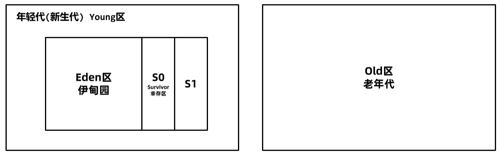

**arthas查看分代之后的内存情况** 

- 在JDK8中，添加`-XX:+UseSerialGC`参数使用分代回收的垃圾回收器，运行程序。

- 在arthas中使用`memory`命令查看内存，显示出三个区域的内存情况。

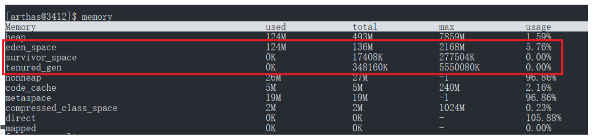

**调整内存区域的大小**

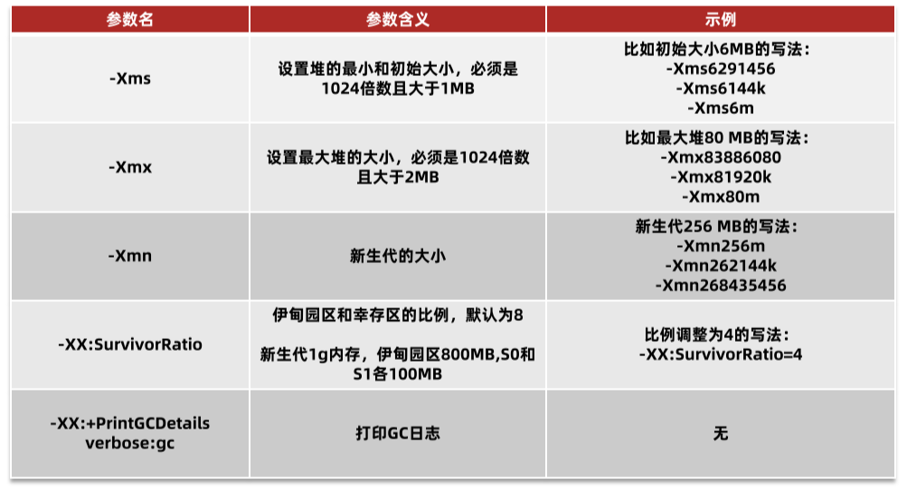

分代垃圾回收算法执行流程

- 1、分代回收时，创建出来的对象，首先会被放入`Eden`伊甸园区。 
- 2、随着对象在Eden区越来越多，如果Eden区满，新创建的对象已经无法放入，就会触发年轻代的GC，称为 `Minor GC或者Young GC`。Minor GC会把需要eden中和From需要回收的对象回收，把没有回收的对象放入To区。 

- 3、接下来，S0会变成To区，S1变成From区。当eden区满时再往里放入对象，依然会发生Minor GC。 此时会回收eden区和S1(from)中的对象，并把eden和from区中剩余的对象放入S0。注意：每次Minor GC中都会为对象记录他的年龄，初始值为0，每次GC完加1。
- 4、如果Minor GC后对象的年龄达到阈值（最大15，默认值和垃圾回收器有关），对象就会被晋升至老年代。
- 5、当老年代中空间不足，无法放入新的对象时，先尝试minor gc如果还是不足，就会触发`Full GC`，`Full GC`会对整个堆进行垃圾回收。 如果Full GC依然无法回收掉老年代的对象，那么当对象继续放入老年代时，就会抛出`Out Of Memory`异常。

#### 垃圾回收器

> 为什么分代GC算法要把堆分成年轻代和老年代？

系统中的大部分对象，都是创建出来之后很快就不再使用可以被回收，比如用户获取订单数据，订单数据返回给用户之后就可以释放了。

老年代中会存放长期存活的对象，比如Spring的大部分bean对象，在程序启动之后就不会被回收了。

在虚拟机的默认设置中，新生代大小要远小于老年代的大小。

分代GC算法将堆分成年轻代和老年代主要原因有：

- 1、可以通过调整年轻代和老年代的比例来适应不同类型的应用程序，提高内存的利用率和性能。 
- 2、新生代和老年代使用不同的垃圾回收算法，新生代一般选择复制算法，老年代可以选择标记-清除和标记-整理 算法，由程序员来选择灵活度较高。 
- 3、分代的设计中允许只回收新生代（minor gc），如果能满足对象分配的要求就不需要对整个堆进行回收(full gc),STW时间就会减少。

**垃圾回收器的组合关系**

垃圾回收器是垃圾回收算法的具体实现。 由于垃圾回收器分为年轻代和老年代，**除了G1之外其他垃圾回收器必须成对组合进行使用**。

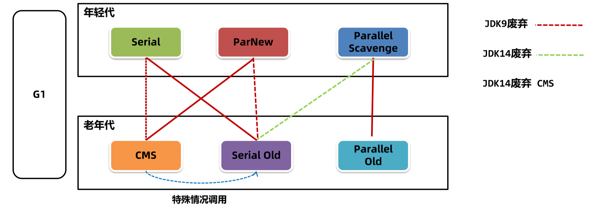

**1、Serial和SerialOld组合关系**

|          | **年轻代-Serial垃圾回收器**                                  | 老年代-SerialOld垃圾回收器                                   |
| -------- | ------------------------------------------------------------ | ------------------------------------------------------------ |
| 介绍     | Serial是一种**单线程串行**回收年轻代的垃圾回收器             | SerialOld是Serial垃圾回收器的老年代版 本，采用**单线程串行**回收 <br/>**-XX:+UseSerialGC 新生代、老年代都使用串行回收器**。 |
| 回收年代 | 年轻代                                                       | 老年代                                                       |
| 回收算法 | 复制算法                                                     | 标记-整理算法                                                |
| 优点     | 单CPU处理器下吞吐量非常出色                                  | 单CPU处理器下吞吐量非常出色                                  |
| 缺点     | 多CPU下吞吐量不如其他垃圾回收器，堆如果偏大会让用户线程处于长期的等待 | 多CPU下吞吐量不如其他垃圾回收器，堆如果偏大会让用户线程处于长期的等待 |
| 适用场景 | Java编写的客户端程序或者硬件配置有限的场景                   | 与Seriel垃圾回收器搭配使用或者在CMS特殊情况下适用            |

**2、ParNew和CMS组合关系**

|          | **年轻代-ParNew垃圾回收器**                                  | 老年代- CMS(Concurrent Mark Sweep)垃圾回收器                 |
| -------- | ------------------------------------------------------------ | ------------------------------------------------------------ |
| 介绍     | ParNew垃圾回收器本质上是对Serial在多 CPU下的优化，使用**多线程**进行垃圾回收 `-XX:+UseParNewGC` 新生代使用ParNew<br/>回收器， 老年代使用串行回收器 | CMS垃圾回收器关注的是**系统的暂停时间**， 允许用户线程和垃圾回收线程在某些步骤中<br/>同时执行，减少了用户线程的等待时间。<br/>参数：`XX:+UseConcMarkSweepGC` |
| 回收年代 | 年轻代                                                       | 老年代                                                       |
| 回收算法 | **复制算法**                                                 | **标记-清除算法**                                            |
| 优点     | 多CPU处理器下停顿时间较短                                    | 系统由于垃圾回收出现的停 顿时间较短，用户体验好              |
| 缺点     | 吞吐量和停顿时间不如G1， 所以在JDK9之后不建议使用            | 内存碎片问题；退化问题；浮动垃圾问题                         |
| 适用场景 | JDK8及之前的版本中，与CMS 老年代垃圾回收器搭配使用           | 大型的互联网系统中用户请求数 据量大、频率高的场景，比如订单接口、商品接口等 |

CMS执行步骤： 

- 1.初始标记，用极短的时间标记出GC Roots能直接关联到的对象。 

- 2.并发标记, 标记所有的对象，用户线程不需要暂停。

- 3.重新标记，由于并发标记阶段有些对象会发生了变化，存在错标、漏标等情况，需要重新标记。

- 4.并发清理，清理死亡的对象，用户线程不需要暂停。

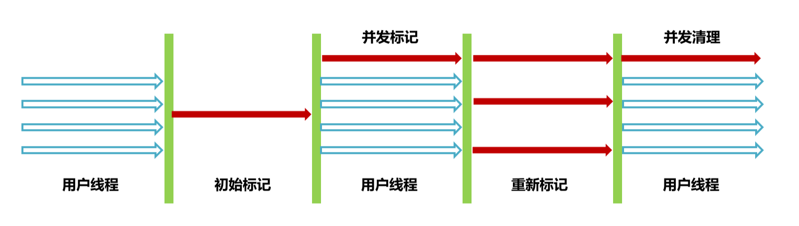

CMS 缺点

- CMS使用了标记-清除算法，在垃圾收集结束之后会出现大量的内存碎片，CMS会在Full GC时进行碎片的整理。 这样会导致用户线程暂停，可以使用`-XX:CMSFullGCsBeforeCompaction=N 参数（默认0）`调整N次Full GC之 后再整理。 
- 无法处理在并发清理过程中产生的“浮动垃圾”，不能做到完全的垃圾回收。
- 如果老年代内存不足无法分配对象，CMS就会退化成Serial Old单线程回收老年代。

**3、Parallel Scavenge和Parallel Old组合关系**

|          | 年轻代-Parallel Scavenge垃圾回收器                           | 老年代-Parallel Old垃圾回收器                                |
| -------- | ------------------------------------------------------------ | ------------------------------------------------------------ |
| 介绍     | Parallel Scavenge是**JDK8默认的年轻代垃圾回收器**， 多线程并行回收，关注的是系统的吞吐量。具备**自动调整堆内存大小**的特点。 | Parallel Old是为Parallel Scavenge收集器 设计的老年代版本，利用多线程并发收集。<br />参数： `-XX:+UseParallelGC 或 -XX:+UseParallelOldGC`可以使用`Parallel Scavenge + Parallel Old`这种组合 |
| 回收年代 | 年轻代                                                       | 老年代                                                       |
| 回收算法 | **复制算法**                                                 | **标记-整理算法**                                            |
| 优点     | 吞吐量高，而且手动可控。 为了提高吞吐量，虚拟机会动态调整堆的参数 | 并发收集，在多核CPU下 效率较高                               |
| 缺点     | 不能保证单次的停顿时间                                       | 暂停时间会比较长                                             |
| 适用场景 | 后台任务，不需要与用户交互，并 且容易产生大量的对象，比如：大数据的处理，大文件导出 | 与Parallel Scavenge配套使用                                  |

Parallel Scavenge垃圾回收器

- Parallel Scavenge允许手动设置最大暂停时间和吞 吐量。

- Oracle官方建议在使用这个组合时，不要设置堆内存 的最大值，垃圾回收器会根据最大暂停时间和吞吐量自动调整内存大小。

最大暂停时间：`-XX:MaxGCPauseMillis=n` 设置每次垃圾回收时的最大停顿毫秒数

吞吐量：`-XX:GCTimeRatio=n` 设置吞吐量为n（用户线程执行时间 = n/n + 1）

自动调整内存大小：`-XX:+UseAdaptiveSizePolicy`设置可以让垃圾回收器根据吞吐量和最大停顿的毫秒数自动调整内存大小

**4、G1垃圾回收器**

**JDK9之后默认的垃圾回收器是G1（Garbage First）垃圾回收器。** 

- Parallel Scavenge关注吞吐量，允许用户设置最大暂停时间 ，但是会减少年轻代可用空间的大小。 CMS关注暂停时间，但是吞吐量方面会下降。 

- 而G1设计目标就是将上述两种垃圾回收器的优点融合： 
  - 1.支持巨大的堆空间回收，并有较高的吞吐量。 
  - 2.支持多CPU并行垃圾回收。 3.允许用户设置最大暂停时间。

- JDK9之后强烈建议使用G1垃圾回收器。

**G1垃圾回收器 – 内存结构**

G1出现之前的垃圾回收器，内存结构一般是连续的，如下图：

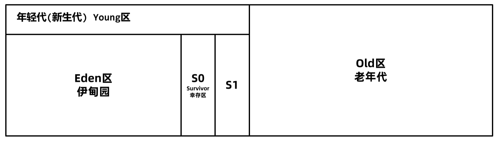

G1的整个堆会被划分成多个大小相等的区域，称之为`区Region`，区域不要求是连续的。分为Eden、Survivor、 Old区。Region的大小通过`堆空间大小/2048`计算得到，也可以通过参数`-XX:G1HeapRegionSize=32m`指定(其中32m指定region大小为32M)，Region size必须是2的指数幂，取值范围从1M到32M。

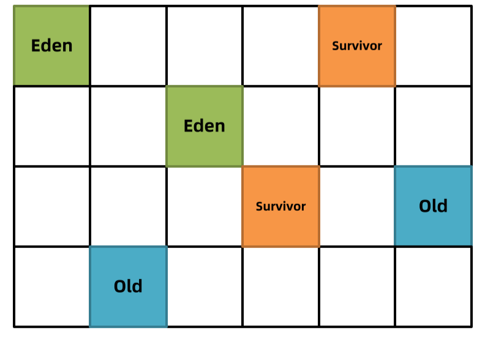

G1垃圾回收有两种方式：

1、年轻代回收（Young GC）

- 年轻代回收（Young GC），回收Eden区和Survivor区中不用的对象。会导致STW，G1中可以通过参数 `-XX:MaxGCPauseMillis=n`（默认200） 设置每次垃圾回收时的最大暂停时间毫秒数，G1垃圾回收器会尽可能地保证暂停时间。
- 执行流程
  - 1、新创建的对象会存放在Eden区。当G1判断年轻代区不足（max默认60%），无法分配对象时需要回收时会执行 Young GC。
  - 2、标记出Eden和Survivor区域中的存活对象。
  - 3、根据配置的最大暂停时间选择某些区域将存活对象复制到一个新的Survivor区中（年龄+1），清空这些区域。
    - G1在进行Young GC的过程中会去记录每次垃圾回收时每个Eden区和Survivor区的平均耗时，以作为下次回收时的 参考依据。这样就可以根据配置的最大暂停时间计算出本次回收时最多能回收多少个Region区域了。比如 `-XX:MaxGCPauseMillis=n`（默认200），每个Region回收耗时40ms，那么这次回收最多只能回收4个Region。
  - 4、后续Young GC时与之前相同，只不过Survivor区中存活对象会被搬运到另一个Survivor区。 
  - 5、当某个存活对象的年龄到达阈值（默认15），将被放入老年代。
  - 6、部分对象如果大小超过Region的一半，会直接放入老年代，这类老年代被称为`Humongous区`。比如堆内存是 4G，每个Region是2M，只要一个大对象超过了1M就被放入Humongous区，如果对象过大会横跨多个Region。
  - 7、多次回收之后，会出现很多Old老年代区，此时总堆占有率达到阈值时 （`-XX:InitiatingHeapOccupancyPercent默认45%`）会触发混合回收MixedGC。回收所有年轻代和部分老年代的对象以及大对象区。采用复制算法来完成。

2、混合回收（Mixed GC）

混合回收分为：

- 初始标记（initial mark）
- 并发标记（concurrent mark）
- 最终标记（remark或者Finalize Marking）
- 并发清理（cleanup）

G1对老年代的清理会选择存活度最低的区域来进行回收，这样可以保证回收效率最高，这也是G1（Garbage first）名称的由来。

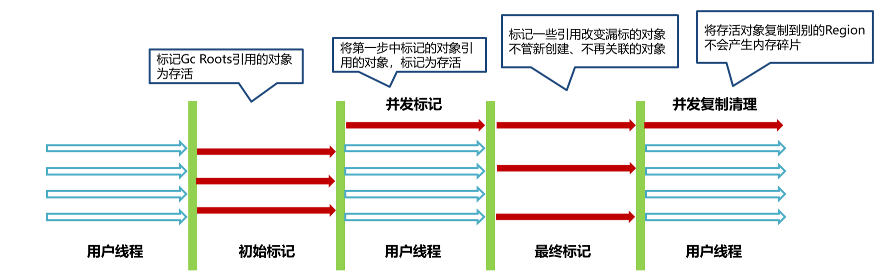

最后清理阶段使用复制算法，不会产生内存碎片。

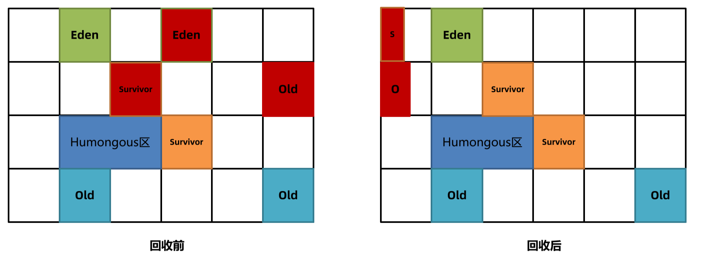

**FULL GC**：注意：如果清理过程中发现没有足够的空Region存放转移的对象，会出现Full GC。单线程执行标记-整理算法， 此时会导致用户线程的暂停。所以尽量保证应该用的堆内存有一定多余的空间。

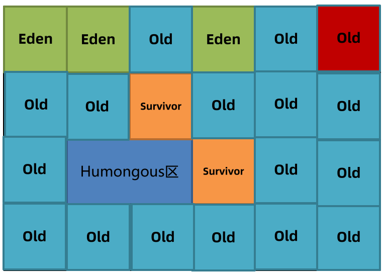

|          | G1 – Garbage First 垃圾回收器                                |
| -------- | ------------------------------------------------------------ |
| 介绍     | 参数1： `-XX:+UseG1GC` 打开G1的开关， JDK9之后默认不需要打开 <br />参数2：`-XX:MaxGCPauseMillis=毫秒值`  最大暂停的时间 |
| 回收年代 | 年轻代+老年代                                                |
| 回收算法 | **复制算法**                                                 |
| 优点     | 对比较大的堆如超过6G的堆回收时，延迟可控 不会产生内存碎片，并发标记的SATB算法效率高 |
| 缺点     | JDK8之前还不够成熟                                           |
| 适用场景 | JDK8最新版本、JDK9之后建 议默认使用                          |

#### 总结

> Java中有哪几块内存需要进行垃圾回收？

线程不共享的区域：Java虚拟机栈和本地方法栈会随着线程的生命周期随着线程回收而回收

线程共享的区域：

- 方法区：一般不需要回收，JSP等技术会通过回收类加载器去回收方法区中的类

- 堆：由垃圾回收器负责进行回收

> 有哪几种常见的引用类型？

强引用，最常见的引用方式，由可达性分析算法来判断

软引用，对象在没有强引用情况下，内存不足时会回收

弱引用，对象在没有强引用情况下，会直接回收

虚引用，通过虚引用知道对象被回收了

终结器引用，对象回收时可以自救，不建议使用

> 有哪几种常见的垃圾回收算法？

| 垃圾回收算法  | 定义                                                         |
| ------------- | ------------------------------------------------------------ |
| 标记-清除算法 | 标记之后再清除，容易产生内存 碎片                            |
| 复制算法      | 从一块区域复制到另一块区域，容易造成只能使用一部分内存；     |
| 标记-整理算法 | 标记之后将存活的对象推到一边 对象会移动，效率不高            |
| 分代GC        | 将内存区域划分成年轻代、幸存者区、老年代进行回收，可以使用多种回收算法 |

> 常见的垃圾回收器有哪些？

| 垃圾回收器                                  | 应用                                                 |
| ------------------------------------------- | ---------------------------------------------------- |
| `Serial`和`SerialOld`组合关系               | 单线程，主要适用于单核CPU场景                        |
| `parNew`和`CMS`组合关系                     | 暂停时间较短，适用于大型互联网应用中与用户交互的部分 |
| `Parallel Scavenge`和`Parallel Old`组合关系 | 吞吐量高，适用于后台进行大量数据操作                 |
| `G1`                                        | 暂停时间较短，适用于大型互联网应用中与用户交互的部分 |

------

## 内存调优

**内存泄漏（memory leak）**：在Java中如果不再使用一个对象，但是该对象依然在GC ROOT的引用链上， 这个对象就不会被垃圾回收器回收，这种情况就称之为内存泄漏。

- 内存泄漏绝大多数情况都是由**堆内存**泄漏引起的，所以后续没有特别说明则讨论的都是堆内存泄漏。

- 少量的内存泄漏可以容忍，但是如果发生持续的内存泄漏，就像滚雪球雪球越滚越大，不管有多大的内存迟早会被消耗完，最终导致的结果就是**内存溢出**。**但是产生内存溢出并不是只有内存泄漏这一种原因**。

内存泄漏的常见场景

- 大型Java后端应用中在处理用户的请求之后，没有及时将用户的数据删除。随着用户请求数量越来越多，内存泄漏的对象占满了堆内存最终导致内存溢出。
- 分布式任务调度系统，如Elastic-job、Quartz等进行任务调度时，被调度的Java应用在 调度任务结束中出现了内存泄漏，最终导致多次调度之后内存溢出。

**解决内存溢出的方法**

- 1、发现问题：通过监控工具尽可能早地发 现内存慢慢变大的现象
- 2、诊断原因：通过分析工具，诊断问题的产生原因，定位到出现问题的源代码
- 3、修复问题：修复源代码中的问题
- 4、测试验证：在测试化境验证问题解决，最后发布上线

发现问题：**Top命令**

- top命令是linux下用来查看系统信息的一个命令，它提供给我们去实时地 去查看系统的资源，比如执行时的进程、线程和系统参数等信息。
- 进程使用的内存为RES（常驻内存）- SHR（共享内存）

- 优点：操作简单，无需额外的软件安装
- 缺点：只能查看最基础的进程信息，无 法查看到每个部分的内存占用 （堆、方法区、堆外）

发现问题：**Visual VM**

- VisualVM是多功能合一的Java故障排除工具并且他是一款可视化工具，整合了 命令行 JDK 工具和轻量级分析功能，功能非常强大。 
- 这款软件在Oracle JDK 6~8 中发布，但是在 Oracle JDK 9 之后不在 JDK安装目录下需要单独下载。下载地址：https://visualvm.github.io/
- 优点：功能丰富，实时监控CPU、 内存、线程等详细信息；支持Idea插件，开发过程中也可以使用
- 缺点：对大量集群化部署的Java进程需要手动进行管理

发现问题：**Arthas**

- Arthas 是一款线上监控诊断产品，通过全局视角实时查看应用 load、内存、 gc、线程的状态信息，并能在不修改应用代码的情况下，对业务问题进行诊断， 包括查看方法调用的出入参、异常，监测方法执行耗时，类加载信息等，大大提升 线上问题排查效率。
- 优点：功能强大，不止于监控基 础的信息，还能监控单个 方法的执行耗时等细节内容；支持应用的集群管理；
- 缺点：部分高级功能使用门槛较高

------

# 设计模式

------

## 装饰器模式

**装饰器（Decorator）模式** 可以在不改变原有对象的情况下拓展其功能。

装饰器模式通过组合替代继承来扩展原始类的功能，在一些继承关系比较复杂的场景（IO 这一场景各种类的继承关系就比较复杂）更加实用。

------

## 代理模式

定义：为其他对象提供一种代理以控制对这个对象的访问

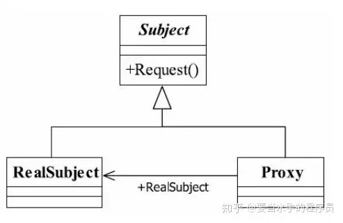

代理模式的通用类图。上图中，Subject是一个抽象类或者接口，`RealSubject`是实现方法类，具体的业务执行，`Proxy`则是`RealSubject`的代理，直接和client接触的。代理模式可以在不修改被代理对象的基础上，通过扩展代理类，进行一些功能的附加与增强。值得注意的是，代理类和被代理类应该共同实现一个接口，或者是共同继承某个类。

代理模式优点

- 职责清晰
- 高扩展，只要实现了接口，都可以用代理。
- 智能化，动态代理。

### 1、静态代理

以租房为例，我们一般用租房软件、找中介或者找房东。这里的中介就是代理者。

首先定义一个提供了租房方法的接口。

```java
public interface IRentHouse {
    void rentHouse();
}
```

定义租房的实现类

```java
public class RentHouse implements IRentHouse {
    @Override
    public void rentHouse() {
        System.out.println("租了一间房子。。。");
    }
}
```

我要租房，房源都在中介手中，所以找中介

```java
public class IntermediaryProxy implements IRentHouse {

    private IRentHouse rentHouse;

    public IntermediaryProxy(IRentHouse irentHouse){
        rentHouse = irentHouse;
    }

    @Override
    public void rentHouse() {
        System.out.println("交中介费");
        rentHouse.rentHouse();
        System.out.println("中介负责维修管理");
    }
}
```

这里中介也实现了租房的接口。

再main方法中测试

```java
public class Main {

    public static void main(String[] args){
        //定义租房
        IRentHouse rentHouse = new RentHouse();
        //定义中介
        IRentHouse intermediary = new IntermediaryProxy(rentHouse);
        //中介租房
        intermediary.rentHouse();
    }
}
```

返回信息

```
交中介费
租了一间房子。。。
中介负责维修管理
```

这就是静态代理，因为中介这个代理类已经事先写好了，只负责代理租房业务

### 2、强制代理

如果我们直接找房东要租房，房东会说我把房子委托给中介了，你找中介去租吧。这样我们就又要交一部分中介费了，真坑。

来看代码如何实现，定义一个租房接口，增加一个方法。

```java
public interface IRentHouse {
    void rentHouse();
    IRentHouse getProxy();
}
```

这时中介的方法也稍微做一下修改

```java
public class IntermediaryProxy implements IRentHouse {

    private IRentHouse rentHouse;

    public IntermediaryProxy(IRentHouse irentHouse){
        rentHouse = irentHouse;
    }

    @Override
    public void rentHouse() {
        rentHouse.rentHouse();
    }

    @Override
    public IRentHouse getProxy() {
        return this;
    }
}
```

其中的`getProxy()`方法返回中介的代理类对象

我们再来看房东是如何实现租房：

```java
public class LandLord implements IRentHouse {

    private IRentHouse iRentHouse = null;

    @Override
    public void rentHouse() {
        if (isProxy()){
            System.out.println("租了一间房子。。。");
        }else {
            System.out.println("请找中介");
        }
    }

    @Override
    public IRentHouse getProxy() {
        iRentHouse = new IntermediaryProxy(this);
        return iRentHouse;
    }

    /**
     * 校验是否是代理访问
     * @return
     */
    private boolean isProxy(){
        if(this.iRentHouse == null){
            return false;
        }else{
            return true;
        }
    }
}
```

房东的`getProxy`方法返回的是代理类，然后判断租房方法的调用者是否是中介，不是中介就不租房。

main方法测试：

```java
public static void main(String[] args){
        IRentHouse iRentHosue = new LandLord();
        //租客找房东租房
        iRentHouse.rentHouse();
        //找中介租房
        IRentHouse rentHouse = iRentHouse.getProxy();
        rentHouse.rentHouse();
    }
}
```

```
请找中介
租了一间房子。。
```

看，这样就是强制你使用代理，如果不是代理就没法访问。

### 3、动态代理

我们知道现在的中介不仅仅是有租房业务，同时还有卖房、家政、维修等得业务，只是我们就不能对每一个业务都增加一个代理，就要提供通用的代理方法，这就要通过动态代理来实现了。

中介的代理方法做了一下修改

```java
public class IntermediaryProxy implements InvocationHandler {


    private Object obj;

    public IntermediaryProxy(Object object){
        obj = object;
    }

    /**
     * 调用被代理的方法
     * @param proxy
     * @param method
     * @param args
     * @return
     * @throws Throwable
     */
    @Override
    public Object invoke(Object proxy, Method method, Object[] args) throws Throwable {
        Object result = method.invoke(this.obj, args);
        return result;
    }

}
```

在这里实现`InvocationHandler`接口，此接口是 `JDK` 提供的动态代理接口，对被代理的方法提供代理。其中`invoke`方法是接口`InvocationHandler`定义必须实现的， 它完成对真实方法的调用。动态代理是根据被代理的接口生成所有的方法，也就是说给定一个接口，动态代理就会实现接口下所有的方法。通过 `InvocationHandler`接口， 所有方法都由该`Handler`来进行处理， 即所有被代理的方法都由 `InvocationHandler`接管实际的处理任务。

这里增加一个卖房的业务，代码和租房代码类似。

main方法测试：

```java
public static void main(String[] args){

    IRentHouse rentHouse = new RentHouse();
    //定义一个handler
    InvocationHandler handler = new IntermediaryProxy(rentHouse);
    //获得类的class loader
    ClassLoader cl = rentHouse.getClass().getClassLoader();
    //动态产生一个代理者
    IRentHouse proxy = (IRentHouse) Proxy.newProxyInstance(cl, new Class[]{IRentHouse.class}, handler);
    proxy.rentHouse();

    ISellHouse sellHouse = new SellHouse();
    InvocationHandler handler1 = new IntermediaryProxy(sellHouse);
    ClassLoader classLoader = sellHouse.getClass().getClassLoader();
    ISellHouse proxy1 = (ISellHouse) Proxy.newProxyInstance(classLoader, new Class[]{ISellHouse.class}, handler1);
    proxy1.sellHouse();

}
```

```
租了一间房子。。。
买了一间房子。。。
```

在main方法中我们用到了Proxy这个类的方法，

```java
public static Object newProxyInstance(ClassLoader loader,
                                          Class<?>[] interfaces,
                                          InvocationHandler h)
```

`loader`：类加载器，interfaces：代码要用来代理的接口， h：一个 `InvocationHandler` 对象 。

`InvocationHandler` 是一个接口，每个代理的实例都有一个与之关联的 `InvocationHandler` 实现类，如果代理的方法被调用，那么代理便会通知和转发给内部的 `InvocationHandler` 实现类，由它决定处理。

```java
public interface InvocationHandler {

    public Object invoke(Object proxy, Method method, Object[] args)
        throws Throwable;
}
```

`InvocationHandler` 内部只是一个 invoke() 方法，正是这个方法决定了怎么样处理代理传递过来的方法调用。

因为，Proxy 动态产生的代理会调用 `InvocationHandler` 实现类，所以 `InvocationHandler` 是实际执行者。

### 总结

1. 静态代理，代理类需要自己编写代码写成。
2. 动态代理，代理类通过 `Proxy.newInstance()` 方法生成。
3. `JDK`实现的代理中不管是静态代理还是动态代理，代理与被代理者都要实现两样接口，它们的实质是面向接口编程。`CGLib`可以不需要接口。
4. 动态代理通过 Proxy 动态生成 proxy class，但是它也指定了一个 `InvocationHandler` 的实现类。

