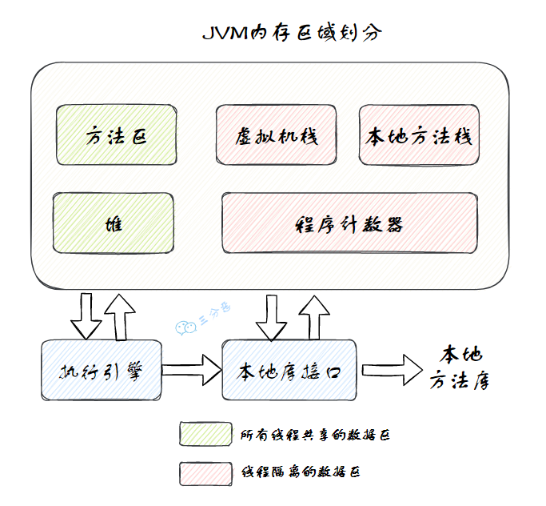

# MySQL

## MySQL的索引

> **一、`MySQL`索引原理**
>
> `MySQL`索引采用了`B+树`的数据结构，能够大大提高查询效率。它类似于书籍的目录，通过索引，数据库系统可以迅速定位到表中的特定数据，无需扫描整个表。
>
> **二、`MySQL`索引的优点**
>
> 1. **提高查询速度**：通过索引，数据库可以迅速找到所需数据，避免了全表扫描的耗时操作。
> 2. **保证数据的唯一性**：通过唯一索引，可以确保数据库表中每一行数据的某列或多列组合是唯一的。
> 3. **加速表与表之间的连接**：在执行连接操作时，如果连接的字段已经被索引，那么连接的速度会更快。
>
> **三、`MySQL`索引的缺点**
>
> 1. **占用磁盘空间**：索引本身需要占用一定的磁盘空间。
> 2. **降低写操作的性能**：每次对表中的数据进行增、删、改操作时，索引也需要进行相应的调整，这可能会降低写操作的性能。
>
> **四、`MySQL`索引的使用场景**
>
> 1. **经常需要搜索的列**：对于经常出现在WHERE子句中的列，应该考虑建立索引。
> 2. **作为连接键的列**：如果某列经常出现在连接（JOIN）操作中，也应该考虑建立索引。
> 3. **经常需要排序的列**：如果某列经常需要按照其值进行排序，也可以考虑建立索引。
>
> **五、注意事项**
>
> 1. **避免过度索引**：不是每个列都需要建立索引，过多的索引会占用更多的磁盘空间，并可能降低写操作的性能。因此，需要根据实际情况进行选择。
> 2. **定期维护索引**：随着时间的推移，数据库中的数据会发生变化，索引的性能也可能会受到影响。因此，需要定期检查和优化索引。
>
> 总的来说，`MySQL`索引是提高数据库查询性能的重要工具，但也需要根据实际情况进行合理使用和维护。

## MySQL索引为什么不用红黑树，AVL树，为什么要用B+树？

> `MySQL`索引选择使用B+树而不是红黑树或`AVL`树，主要是基于B+树在数据库环境中的特定优势和特性。
>
> 1. **多路搜索特性**：B+树是一个多路平衡搜索树，这意味着每个节点可以有多于两个的子节点。这种特性使得B+树相对于二叉树（如红黑树和`AVL`树）在树的高度上具有优势。在数据库中，树的高度直接关系到查询性能，因为每次查询都需要从根节点遍历到叶子节点。多路搜索特性有助于降低树的高度，从而减少I/O操作和查询时间。
> 2. **范围查询和排序性能**：B+树特别适用于范围查询和排序操作。由于其叶子节点之间通过指针相连，可以很方便地遍历叶子节点以获取范围内的数据。相比之下，红黑树和AVL树在进行范围查询时可能需要中序遍历，效率较低。此外，B+树在叶子节点中存储了所有的数据，使得排序操作更加高效。
> 3. **磁盘I/O优化**：在数据库中，数据通常存储在磁盘上，而磁盘I/O操作是数据库性能的关键瓶颈之一。B+树的非叶子节点只存储键值信息，而实际的数据存储在叶子节点中。这种设计使得非叶子节点可以容纳更多的键值信息，从而减少了树的高度和磁盘I/O次数。此外，由于B+树的叶子节点之间通过指针相连，数据库系统可以更加高效地读取和缓存数据。
> 4. **平衡性**：B+树在插入和删除节点时能够保持较好的平衡性，避免了树的高度过度增长。这种平衡性保证了查询性能的稳定性，不会因为数据的插入和删除操作而产生显著的波动。
>
> 红黑树和`AVL`树虽然也是平衡二叉树，但在数据库环境中可能并不适用。它们的树高度相对较高，导致查询性能下降；同时，它们在处理范围查询和排序操作时效率较低。此外，红黑树在插入和删除节点时需要调整树的结构以保持平衡，这也会增加额外的开销。

## MySQL语句的执行过程？

> `MySQL`语句的执行过程涉及多个关键阶段，以下是其大致的执行流程：
>
> 1. **客户端发送`SQL`语句**： 当用户在客户端（如`MySQL`命令行工具、图形化界面工具等）输入`SQL`语句并执行时，这条语句首先被发送到`MySQL`服务器。
> 2. **词法解析和语法解析**： `MySQL`服务器接收到`SQL`语句后，首先会进行词法解析，将`SQL`语句拆分成一个个的词汇单元（如关键字、表名、列名等）。接着进行语法解析，根据`MySQL`的语法规则判断这条`SQL`语句是否合法，并生成一个“解析树”。
> 3. **预处理**： 在语法解析之后，`MySQL`会进行预处理阶段。这个阶段会检查`SQL`语句中涉及的表、列等是否存在，并解析权限。如果涉及存储过程、函数或触发器，也会在这一阶段进行预处理。
> 4. **优化器优化**： `MySQL`查询优化器会对解析树进行优化，选择最高效的执行计划。它会考虑多种因素，如表的大小、索引、统计信息等，以决定如何最快地获取查询结果。
> 5. **生成执行计划**： 优化器根据优化结果生成一个详细的执行计划，这个计划描述了如何获取数据、如何连接表、如何排序等。
> 6. **执行引擎执行**： 执行引擎按照执行计划开始执行。它可能会与存储引擎交互，从磁盘上读取数据、写入数据或更新数据。如果涉及多个表，执行引擎还会负责表的连接操作。
> 7. **返回结果**： 执行引擎将查询结果返回给客户端。这个结果可能是查询到的数据行，也可能是受影响的行数（如INSERT、UPDATE、DELETE操作）。
> 8. **清理**： 查询执行完毕后，`MySQL`会进行清理工作，如释放内存、关闭临时表等。
>
> 在整个过程中，`MySQL`还会涉及一些日志的写入，如二进制日志（用于复制和恢复操作）、慢查询日志（记录执行时间较长的查询）等。此外，如果开启了事务，还会涉及事务的管理和锁定机制。

## MySQL有缓存吗？

> **`MySQL`有缓存机制**。`MySQL`数据库会缓存已经执行过的`SQL`语句和语句执行结果。如果下次提交同一个`SQL`语句，`MySQL`就会直接从缓存中读取执行结果，而不是重新分析、执行`SQL`，这样可以减少`SQL`语句的执行时间，提高查询效率。
>
> 但是，如果表中的数据发生变化，所有与之相关的缓存都会被释放刷新，以避免出现**数据脏读**问题。此外，`MySQL`也提供了手动选择是否使用缓存查询的功能，可以在`SQL`查询语句的字段前增加`SQL_NO_CACHE`或`SQL_CACHE`关键字来控制是否使用缓存。
>
> 总的来说，`MySQL`的缓存机制是其性能优化的一部分，有助于提高查询速度和效率。然而，需要注意的是，缓存并不总是有利的，特别是在数据频繁变化的情况下，因此需要根据实际情况合理使用和管理缓存。

## MySQL事务

> `MySQL`的事务（Transaction）是数据库管理系统执行过程中的一个**逻辑单位**，它由一个或多个`SQL`语句组成，这些语句要么全部执行，要么全部不执行。事务的主要目的是确保数据的完整性和一致性，在并发操作中保持数据的正确状态。
>
> 事务具有以下四个关键特性，通常被称为`ACID特性`：
>
> 1. **原子性（Atomicity）**：事务被视为一个不可分割的工作单位，事务中包括的诸操作要么都做，要么都不做。
> 2. **一致性（Consistency）**：事务必须使数据库从一个一致性状态变换到另一个一致性状态。这意味着一个事务在执行前后，数据库都必须处于一致性状态。
> 3. **隔离性（Isolation）**：在事务执行过程中，其他事务不能访问该事务的数据，直到该事务完成。这确保了并发执行的事务不会相互干扰。数据库系统通过**事务隔离级别**（如读未提交、读已提交、可重复读、串行化）来实现事务的隔离性。
> 4. **持久性（Durability）**：一旦事务提交，则其结果就是永久性的，即使系统崩溃也不会丢失。
>
> 在`MySQL`中，特别是`InnoDB`存储引擎，事务得到了全面的支持。当你在`InnoDB`中执行一个事务时，可以包含多个`SQL`语句，这些语句要么全部成功，要么在发生错误时全部回滚（撤销）。这通过维护一个**撤销日志**（`undo log`）来实现，当事务需要回滚时，可以利用这个日志将数据恢复到事务开始之前的状态。
>
> 此外，`MySQL`还提供了事务控制语句，如`COMMIT`和`ROLLBACK`，来显式地提交或回滚事务。`COMMIT`用于提交事务，即将事务中的修改永久保存到数据库中；而`ROLLBACK`则用于撤销事务中的修改，将数据库恢复到事务开始之前的状态。

> SQL 标准定义了四个隔离级别：
>
> - **READ-UNCOMMITTED(读取未提交)** ：最低的隔离级别，允许读取尚未提交的数据变更，可能会导致脏读、幻读或不可重复读。
> - **READ-COMMITTED(读取已提交)** ：允许读取并发事务已经提交的数据，可以阻止脏读，但是幻读或不可重复读仍有可能发生。
> - **REPEATABLE-READ(可重复读)** ：对同一字段的多次读取结果都是一致的，除非数据是被本身事务自己所修改，可以阻止脏读和不可重复读，但幻读仍有可能发生。
> - **SERIALIZABLE(可串行化)** ：最高的隔离级别，完全服从 ACID 的隔离级别。所有的事务依次逐个执行，这样事务之间就完全不可能产生干扰，也就是说，该级别可以防止脏读、不可重复读以及幻读。
>
> | 隔离级别                 | Lost Updates | Dirty Reads | Non-repeating Reads | Phantom Reads |
> | ------------------------ | ------------ | ----------- | ------------------- | ------------- |
> | READ-UNCOMMITTED（最低） |              |             |                     |               |
> | READ-COMMITTED           |              | √           |                     |               |
> | REPEATABLE-READ（默认）  | √            | √           | √                   |               |
> | SERIALIZABLE（最高）     | √            | √           | √                   | √             |
>

## 非聚簇索引的回表机制？

> 非聚簇索引的回表机制是数据库查询中的一个重要概念，尤其在`MySQL`的`InnoDB`存储引擎中。以下是对非聚簇索引回表机制的详细解释：
>
> 首先，我们需要理解聚簇索引和非聚簇索引的基本区别。
>
> - **聚簇索引**的叶子节点存储的是**行记录**，也就是说，数据与索引是存储在一起的。
> - **非聚簇索引**的叶子节点存储的则是**主键值**，也就是说，数据和索引是分开的。
>
> 当我们使用非聚簇索引进行查询时，查询过程大致如下：
>
> 1. 数据库首先在非聚簇索引中找到满足查询条件的数据行的主键值。
> 2. 然后，根据这些主键值，数据库需要再次回到聚簇索引（通常是主键索引）中查找相应的数据行。这个过程就像是根据一个地址（主键值）去找到实际的房屋（数据行）。
>
> 这个**从非聚簇索引回到聚簇索引查找数据行的过程，就是所谓的“回表”**。回表操作会增加额外的IO操作和时间开销，因为需要再次访问数据表。在大量数据或者频繁进行回表查询的场景下，这会对查询性能产生显著影响。
>
> 为了避免频繁的回表查询，一种优化策略是**使用覆盖索引**。覆盖索引是指查询只需要通过索引就可以返回所需要的数据，而无需回表去访问实际的数据行。这可以显著提高查询效率。

## 哪些情况下索引会失效？

> 索引失效是指在某些情况下，数据库查询无法有效利用索引来加速查询过程，从而导致查询性能下降。以下是一些常见的导致索引失效的情况：
>
> 1. **联合索引列顺序不正确**：联合索引的列顺序对查询效率有重要影响。如果查询条件中经常使用的列没有放在联合索引的前面，那么索引可能无法被充分利用。
> 2. **索引列上使用了函数或表达式**：当在索引列上应用函数或表达式时，数据库通常无法直接利用索引进行查询，从而导致索引失效。
> 3. **数据库表设计不合理**：表设计的不合理，如包含大量不必要的字段或冗余数据，或字段类型选择不当，都可能影响索引的有效性。
> 4. **列类型不匹配**：当查询条件中的数据类型与索引列的数据类型不匹配时，索引可能无法被使用，从而导致索引失效。
> 5. **使用了IS NULL或IS NOT NULL**：如果索引列中包含NULL值，并且在查询条件中使用了IS NULL或IS NOT NULL，那么索引可能无法被有效利用。
> 6. **隐式类型转换**：当查询条件中涉及到隐式类型转换时，如将字符串类型与数值类型进行比较，索引可能会失效。
>
> 为了避免索引失效，需要合理设计数据库表结构、选择适当的索引类型、定期更新数据库统计信息，并在编写查询语句时注意避免上述可能导致索引失效的操作。同时，定期监控和分析查询性能，根据需要进行索引优化和调整，也是保持索引有效性的重要措施。

## 分库分表

## mysql联合索引失效？

## **联合索引 abc，a=1,c=1/b=1,c=1/a=1,c=1,b=1走不走索引**

> 示例 1`（a=1,c=1）`：
>
> ```sql
> EXPLAIN SELECT * FROM tbn WHERE A=1 AND C=1
> ```
>
> 
>
> key 是 `idx_abc`，表明 `a=1,c=1` 会使用联合索引。但因为缺少了 B 字段的条件，所以 `MySQL` 可能无法利用索引来直接定位到精确的行，而是使用索引来缩小搜索范围。
>
> 最终，`MySQL` 需要检查更多的行（rows: 3）来找到满足所有条件的结果集，但总体来说，使用索引明显比全表扫描要高效得多。
>
> 示例 2`（b=1,c=1）`：
>
> ```sql
> EXPLAIN SELECT * FROM tbn WHERE B=1 AND C=1
> ```
>
> 
>
> key 是 NULL，表明 b=1,c=1 不会使用联合索引。这是因为查询条件中涉及的字段 B 和 C 没有遵循之前定义的联合索引 `idx_abc`（A、B、C 顺序）的最左前缀原则。
>
> 在 `idx_abc` 索引中，A 是最左边的列，但是查询没有包含 A，因此 `MySQL` 无法利用这个索引。
>
> 示例 3`（a=1,c=1,b=1）`：
>
> ```sql
> EXPLAIN SELECT * FROM tbn WHERE A=1 AND C=1 AND B=1
> ```
>
> 
>
> key 是 `idx_abc`，表明 `a=1,c=1,b=1` 会使用联合索引。
>
> 并且 rows=1，因为查询条件包含了联合索引 `idx_abc` 中所有列的等值条件，并且条件的顺序与索引列的顺序相匹配，使得查询能够准确、快速地定位到目标数据。

# Java SE

## `ArrayList` 和 `LinkedList` 的时间复杂度

> **①查询**
>
> 基于索引
>
> -  `ArrayList` 是基于数组实现的，所以 `get(int index)` 可以直接通过数组下标获取，时间复杂度是 O(1)；
> - `LinkedList` 是基于链表实现的，`get(int index)` 需要遍历链表，时间复杂度是 O(n)。
>
> 基于元素：`get(E element)` 这种查找，两种集合都需要遍历通过 equals 比较获取元素，所以时间复杂度都是 O(n)。
>
> **②增删（头尾、中间）**
>
> `ArrayList`
>
> - 尾部：`ArrayList` 如果增删的是数组的尾部，直接插入或者删除就可以了，时间复杂度是 O(1)；如果 add 的时候涉及到扩容，时间复杂度会提升到 O(n)。
>
> - 中间：如果插入的是中间的位置，就需要把插入位置后的元素向前或者向后移动，甚至还有可能触发扩容，效率就会低很多，O(n)。
>
> `LinkedList`
>
> - `LinkedList` 因为是链表结构，插入和删除只需要改变前置节点、后置节点和插入节点的引用就行了，不需要移动元素。
>
> - 如果是在链表的头部插入或者删除，时间复杂度是 O(1)；如果是在链表的中间插入或者删除，时间复杂度是 O(n)，因为需要遍历链表找到插入位置；如果是在链表的尾部插入或者删除，时间复杂度是 O(1)。
>
> 
>
> 
>
> 注意，这里有个陷阱，`LinkedList` 更利于增删不是体现在时间复杂度上，因为二者增删的时间复杂度都是 O(n)，都需要遍历列表；而是体现在增删的效率上，因为 `LinkedList` 的增删只需要改变引用，而 `ArrayList` 的增删可能需要移动元素。

## `HashSet` 和 `ArrayList` 的区别

> - `ArrayList` 是基于动态数组实现的，`HashSet` 是基于 `HashMap` 实现的。
> - `ArrayList` 允许重复元素和 null 值，可以有多个相同的元素；`HashSet` 保证每个元素唯一，不允许重复元素，基于元素的 `hashCode` 和 `equals` 方法来确定元素的唯一性。
> - `ArrayList` 保持元素的插入顺序，可以通过索引访问元素；`HashSet` 不保证元素的顺序，元素的存储顺序依赖于哈希算法，并且可能随着元素的添加或删除而改变。

## `HashSet` 怎么判断元素重复，重复了是否 put

> `HashSet` 的 add 方法是通过调用 `HashMap` 的 put 方法实现的：
>
> ```java
> public boolean add(E e) {
>        return map.put(e, PRESENT)==null;
> }
> ```
>
> 所以 `HashSet` 判断元素重复的逻辑底层依然是 `HashMap` 的底层逻辑：
>
> `HashMap`插入数据流程图：
>
> 
>
> `HashMap` 在插入元素时，通常需要三步：
>
> 第一步，通过 hash 方法计算 key 的哈希值。
>
> ```java
> static final int hash(Object key) {
>        int h;
>        return (key == null) ? 0 : (h = key.hashCode()) ^ (h >>> 16);
> }
> ```
>
> 第二步，数组进行第一次扩容。
>
> ```java
> if ((tab = table) == null || (n = tab.length) == 0)
>     n = (tab = resize()).length;
> ```
>
> 第三步，根据哈希值计算 key 在数组中的下标，如果对应下标正好没有存放数据，则直接插入。
>
> ```java
> if ((p = tab[i = (n - 1) & hash]) == null)
>     tab[i] = newNode(hash, key, value, null);
> ```
>
> 如果对应下标已经有数据了，就需要判断是否为相同的 key，是则覆盖 value，否则需要判断是否为树节点，是则向树中插入节点，否则向链表中插入数据。
>
> ```java
> else {
>     Node<K,V> e; K k;
>     if (p.hash == hash &&
>         ((k = p.key) == key || (key != null && key.equals(k))))
>         e = p;
>     else if (p instanceof TreeNode)
>         e = ((TreeNode<K,V>)p).putTreeVal(this, tab, hash, key, value);
>     else {
>         for (int binCount = 0; ; ++binCount) {
>             if ((e = p.next) == null) {
>                 p.next = newNode(hash, key, value, null);
>                 if (binCount >= TREEIFY_THRESHOLD - 1) // -1 for 1st
>                     treeifyBin(tab, hash);
>                 break;
>             }
>             if (e.hash == hash &&
>                 ((k = e.key) == key || (key != null && key.equals(k))))
>                 break;
>             p = e;
>         }
>     }
> }
> ```
>
> 也就是说，`HashSet` 通过元素的哈希值来判断元素是否重复，如果重复了，会覆盖原来的值。
>
> ```java
> if (e != null) { // existing mapping for key
>     V oldValue = e.value;
>     if (!onlyIfAbsent || oldValue == null)
>         e.value = value;
>     afterNodeAccess(e);
>     return oldValue;
> }   
> ```

## hashcode 和 equals 方法只重写一个行不行，只重写 equals 没重写 hashcode，map put 的时候会发生什么

> #### 什么是 `hashCode` 方法？
>
> `hashCode()` 方法的作⽤是获取哈希码，它会返回⼀个 int 整数，定义在 Object 类中， 是一个本地⽅法。
>
> ```java
> public native int hashCode();
> ```
>
> #### 为什么要有 `hashCode` 方法？
>
> `hashCode` 方法主要用来获取对象的哈希码，哈希码是由对象的内存地址或者对象的属性计算出来的，它是⼀个 int 类型的整数，通常是不会重复的，因此可以用来作为键值对的建，以提高查询效率。
>
> 例如 `HashMap` 中的 key 就是通过 `hashCode` 来实现的，通过调用 `hashCode` 方法获取键的哈希码，并将其与右移 16 位的哈希码进行异或运算。
>
> ```java
> static final int hash(Object key) {
>     int h;
>     return (key == null) ? 0 : (h = key.hashCode()) ^ (h >>> 16);
> }
> ```
>
> #### 为什么重写 `quals` 时必须重写 `hashCode` ⽅法？
>
> 维护 `equals()`和 `hashCode()`之间的一致性是至关重要的，因为基于哈希的集合类（如 `HashSet`、`HashMap`、`Hashtable` 等）依赖于这一点来正确存储和检索对象。
>
> 具体地说，这些集合通过对象的哈希码将其存储在不同的“桶”中（底层数据结构是数组，哈希码用来确定下标），当查找对象时，它们使用哈希码确定在哪个桶中搜索，然后通过 `equals()`方法在桶中找到正确的对象。
>
> 如果重写了 `equals()`方法而没有重写 `hashCode()`方法，那么被认为相等的对象可能会有不同的哈希码，从而导致无法在集合中正确处理这些对象。
>
> #### 为什么两个对象有相同的 `hashcode` 值，它们也不⼀定相等？
>
> 这主要是由于哈希码（`hashCode`）的本质和目的所决定的。
>
> 哈希码是通过哈希函数将对象中映射成一个整数值，其主要目的是在哈希表中快速定位对象的存储位置。
>
> 由于哈希函数将**一个较大的输入域映射到一个较小的输出域**，不同的输入值（即不同的对象）可能会产生相同的输出值（即相同的哈希码）。
>
> 这种情况被称为哈希冲突。当两个不相等的对象发生哈希冲突时，它们会有相同的 `hashCode`。
>
> 为了解决哈希冲突的问题，哈希表在处理键时，不仅会比较键对象的哈希码，还会使用 equals 方法来检查键对象是否真正相等。如果两个对象的哈希码相同，但通过 equals 方法比较结果为 false，那么这两个对象就不被视为相等。
>
> ```java
> if (p.hash == hash &&
>     ((k = p.key) == key || (key != null && key.equals(k))))
>     e = p;
> ```
>
> #### 只重写 equals 没重写 hashcode，map put 的时候会发生什么?
>
> 如果只重写 `equals` 方法，没有重写 `hashcode` 方法，那么会导致 equals 相等的两个对象，`hashcode` 不相等，这样的话，这两个对象会被放到不同的桶中，这样就会导致 get 的时候，找不到对应的值。

## **Java 编译时异常和运行时异常的区别**

> Java异常体系
>
> 
>
> `Throwable` 是 Java 语言中所有错误和异常的基类。它有两个主要的子类：`Error 和 Exception`，这两个类分别代表了 Java 异常处理体系中的两个分支。
>
> - `Error` 类代表那些严重的错误，这类错误通常是程序无法处理的。比如，`OutOfMemoryError` 表示内存不足，`StackOverflowError` 表示栈溢出。这些错误通常与 `JVM` 的运行状态有关，一旦发生，应用程序通常无法恢复。
>
> - `Exception` 类代表程序可以处理的异常。它分为两大类：编译时异常（`Checked Exception`）和运行时异常（`Runtime Exception`）。
>
> ①、编译时异常（`Checked Exception`）：这类异常在编译时必须被显式处理（捕获或声明抛出）。
>
> 如果方法可能抛出某种编译时异常，但没有捕获它（try-catch）或没有在方法声明中用 throws 子句声明它，那么编译将不会通过。例如：`IOException`、`SQLException` 等。
>
> ②、运行时异常（Runtime Exception）：这类异常在运行时抛出，它们都是 `RuntimeException` 的子类。对于运行时异常，Java 编译器不要求必须处理它们（即不需要捕获也不需要声明抛出）。
>
> 运行时异常通常是由程序逻辑错误导致的，如 `NullPointerException`、`IndexOutOfBoundsException` 等。

## **return 先执行还是 finally 先执行**

> 这道题通常会和实际的代码结合起来看：
>
> ```java
> public class TryDemo {
>     public static void main(String[] args) {
>         System.out.println(test());
>     }
>     public static int test() {
>         try {
>             return 1;
>         } catch (Exception e) {
>             return 2;
>         } finally {
>             System.out.print("3");
>         }
>     }
> }
> ```
>
> 在`test()`方法中，首先有一个`try`块，接着是一个`catch`块（用于捕获异常），最后是一个`finally`块（无论是否捕获到异常，`finally`块总会执行）。
>
> ①、`try`块中包含一条`return 1;`语句。正常情况下，如果`try`块中的代码能够顺利执行，那么方法将返回数字`1`。在这个例子中，`try`块中没有任何可能抛出异常的操作，因此它会正常执行完毕，并准备返回`1`。
>
> ②、由于`try`块中没有异常发生，所以`catch`块中的代码不会执行。
>
> ③、无论前面的代码是否发生异常，`finally`块总是会执行。在这个例子中，`finally`块包含一条`System.out.print("3");`语句，意味着在方法结束前，会在控制台打印出`3`。
>
> 当执行`main`方法时，控制台的输出将会是：
>
> ```java
> 31
> ```
>
> 这是因为`finally`块确保了它包含的`System.out.print("3");`会执行并打印`3`，随后`test()`方法返回`try`块中的值`1`，最终结果就是`31`。

## **事务的四个特性，怎么理解事务一致性**

> #### 原子性：
>
> 原子性子性意味着事务中的所有操作要么全部完成，要么全部不完成，它是不可分割的单位。如果事务中的任何一个操作失败了，整个事务都会回滚到事务开始之前的状态，如同这些操作从未被执行过一样。
>
> #### 一致性：
>
> 一致性确保事务从一个一致的状态转换到另一个一致的状态。
>
> 比如在银行转账事务中，无论发生什么，转账前后两个账户的总金额应保持不变。假如 A 账户（100 块）给 B 账户（10 块）转了 10 块钱，不管成功与否，A 和 B 的总金额都是 110 块。
>
> #### 隔离性：
>
> 隔离性意味着并发执行的事务是彼此隔离的，一个事务的执行不会被其他事务干扰。就是事务之间是井水不犯河水的。
>
> 隔离性主要是为了解决事务并发执行时可能出现的问题，如脏读、不可重复读、幻读等。
>
> 数据库系统通过事务隔离级别（如**读未提交、读已提交、可重复读、串行化**）来实现事务的隔离性。
>
> #### 持久性：
>
> 持久性确保事务一旦提交，它对数据库所做的更改就是永久性的，即使发生系统崩溃，数据库也能恢复到最近一次提交的状态。通常，持久性是通过数据库的恢复和日志机制来实现的，确保提交的事务更改不会丢失。

## **`JDBC` 的执行步骤**

> Java 数据库连接（`JDBC`）是一个用于执行 `SQL` 语句的 `Java API`，它为多种关系数据库提供了统一访问的机制。使用 `JDBC` 操作数据库通常涉及以下步骤：
>
> #### 1. 加载数据库驱动
>
> 在与数据库建立连接之前，首先需要通过`Class.forName()`方法加载对应的数据库驱动。这一步确保 `JDBC` 驱动注册到了`DriverManager`类中。
>
> ```java
> Class.forName("com.mysql.cj.jdbc.Driver");
> ```
>
> #### 2. 建立数据库连接
>
> 使用`DriverManager.getConnection()`方法建立到数据库的连接。这一步需要提供数据库 URL、用户名和密码作为参数。
>
> ```java
> Connection conn = DriverManager.getConnection(
>     "jdbc:mysql://localhost:3306/databaseName", "username", "password");
> ```
>
> #### 3. 创建`Statement`对象
>
> 通过建立的数据库连接对象`Connection`创建`Statement`、`PreparedStatement`或`CallableStatement`对象，用于执行 SQL 语句。
>
> ```java
> Statement stmt = conn.createStatement();
> ```
>
> 或者创建`PreparedStatement`对象（预编译 SQL 语句，适用于带参数的 SQL）：
>
> ```java
> PreparedStatement pstmt = conn.prepareStatement("SELECT * FROM tableName WHERE column = ?");
> pstmt.setString(1, "value");
> ```
>
> #### 4. 执行 SQL 语句
>
> 使用`Statement`或`PreparedStatement`对象执行 `SQL` 语句。
>
> 执行查询（SELECT）语句时，使用`executeQuery()`方法，它返回`ResultSet`对象；
>
> 执行更新（INSERT、UPDATE、DELETE）语句时，使用`executeUpdate()`方法，它返回一个整数表示受影响的行数。
>
> ```java
> ResultSet rs = stmt.executeQuery("SELECT * FROM tableName");
> ```
>
> 或
>
> ```java
> int affectedRows = stmt.executeUpdate("UPDATE tableName SET column = 'value' WHERE condition");
> ```
>
> #### 5. 处理结果集
>
> 如果执行的是查询操作，需要处理`ResultSet`对象来获取数据。
>
> ```java
> while (rs.next()) {
>     String data = rs.getString("columnName");
>     // 处理每一行数据
> }
> ```
>
> #### 6. 关闭资源
>
> 最后，需要依次关闭`ResultSet`、`Statement`和`Connection`等资源，释放数据库连接等资源。
>
> ```java
> if (rs != null) rs.close();
> if (stmt != null) stmt.close();
> if (conn != null) conn.close();
> ```
>
> #### 总结
>
> 使用 `JDBC` 操作数据库的过程包括加载驱动、建立连接、创建执行语句、执行 SQL 语句、处理结果集和关闭资源。
>
> 在 Java 开发中，通常会使用 `JDBC` 模板库（如 Spring 的 `JdbcTemplate`）或 `ORM` 框架（如 `Hibernate`、`MyBatis`、`MyBatis-Plus`）来简化数据库操作和资源管理。

## **创建连接拿到的是什么对象**

> 在 `JDBC` 的执行步骤中，创建连接后拿到的对象是`java.sql.Connection`对象。这个对象是 `JDBC API` 中用于表示数据库连接的接口，它提供了执行 `SQL` 语句、管理事务等一系列操作的方法。
>
> `Connection`对象代表了应用程序和数据库的一个连接会话。
>
> 通过调用`DriverManager.getConnection()`方法并传入数据库的 URL、用户名和密码等信息来获得这个对象。
>
> 一旦获得`Connection`对象，就可以使用它来创建执行 `SQL` 语句的`Statement`、`PreparedStatement`和`CallableStatement`对象，以及管理事务等。

## **statement 和 preparedstatement 的区别**

> `Statement`和`PreparedStatement`都是用于执行 SQL 语句的接口，但它们之间存在几个关键的区别：
>
> #### 1. 预编译
>
> ①**`Statement`**：每次执行`Statement`对象的`executeQuery`或`executeUpdate`方法时，`SQL` 语句在数据库端都需要重新编译和执行。这适用于一次性执行的 `SQL` 语句。
>
> ②**`PreparedStatement`**：代表预编译的 `SQL` 语句的对象。这意味着 `SQL` 语句在`PreparedStatement`对象创建时就被发送到数据库进行预编译。之后，可以通过设置参数值来多次高效地执行这个 `SQL` 语句。这不仅减少了数据库编译 `SQL` 语句的开销，也提高了性能，尤其是对于重复执行的 `SQL` 操作。
>
> #### 2. 参数化查询
>
> - **`Statement`**：不支持参数化查询。如果需要在 `SQL` 语句中插入变量，通常需要通过字符串拼接的方式来实现，这会增加 `SQL` 注入攻击的风险。
>- **`PreparedStatement`**：支持参数化查询，即可以在 `SQL` 语句中使用问号（?）作为参数占位符。通过`setXxx`方法（如`setString`、`setInt`）设置参数，可以有效防止 `SQL` 注入。
> 
> 总的来说，`PreparedStatement`相比`Statement`有着更好的性能和更高的安全性，是执行 SQL 语句的首选方式，尤其是在处理含有用户输入的动态查询时。

## HashMap是如何进行扩容的

> `JDK1.7`
>
> - 先生成长度是老数组2倍的新数组
> - 遍历老数组中桶中的每个元素
> - 根据key计算新数组的索引下标
> - 按照索引将元素添加到新数组中去；
> - 所有元素转移完之后，将新数组赋值给`Hashmap`对象的table属性
>
> 注意：`JDK1.7`多线程环境下扩容会产生**链表成环**问题，引发严重的性能问题，`JDK1.8`中采用尾插法&链表重新链接解决了此问题
>
> `JDK1.8`
>
> - 先生成长度是老数组2倍的新数组
> - 遍历老数组中桶中的每个元素
> - 如果桶节点没有形成链表，计算出新数组的索引位置，直接转移到新数组
> - 如果桶节点已经形成链表
>   - 将链表重新链接，按照低位区和高位区重新分配到新数组；
> - 如果桶节点已经形成红黑树
>   - 调用split方法将红黑树重新切分低位区和高位区2个链表
>   - 判断低位区和高位区链表的长度，链表长度小于6，则会进行取消树化的处理，否则会将新生成的链表重新树化；
> - 所有元素转移完之后，将新数组赋值给`Hashmap`对象的table属性

## 什么是Java中的SPI机制

> SPI 即 Service Provider Interface ，字面意思就是：“**服务提供者的接口**”，我的理解是：专门提供给服务提供者或者扩展框架功能的开发者去使用的一个接口。
>
> SPI 将服务接口和具体的服务实现分离开来，将服务调用方和服务实现者解耦，能够提升程序的扩展性、可维护性。修改或者替换服务实现并不需要修改调用方。
>
> 很多框架都使用了 Java 的 SPI 机制，比如：Spring 框架、数据库加载驱动、日志接口、以及 Dubbo 的扩展实现等等。
>
> 具体实现
>
> 1、定义接口
>
> ```java
> public interface SayService {
>  void say();
> }
> ```
>
> 2、定义实现类
>
> ```java
> public class SayChinese implements SayService{
>  @Override
>  public void say() {
>      System.out.println("你好");
>  }
> }
> 
> public class SayEnglish implements SayService{
>  @Override
>  public void say() {
>      System.out.println("hello");
>  }
> }
> ```
>
> 3、配置：在resources的`META-INF.services`目录下根据接口的**全限定名**创建文件，添加实现类的全限定名。
>
> ```
> org.example.spi.SayChinese
> org.example.spi.SayEnglish
> ```
>
> 4、使用`ServiceLoader`加载
>
> ```java
> public static void main(String[] args) {
>  ServiceLoader<SayService> load = ServiceLoader.load(SayService.class);
> 
>  for(SayService sayService: load){
>      sayService.say();
>  }
> 
>  Iterator<SayService> iterator = load.iterator();
>  while (iterator.hasNext()){
>      SayService sayService = (SayService) iterator.next();
>      sayService.say();
>  }
> }
> 
> 你好
> hello
> 你好
> hello
> ```
>
> `ServiceLoader`详解
>
> `ServiceLoader` 是 JDK 提供的一个工具类， 位于`package java.util;`包下。
>
> ```java
> public final class ServiceLoader<S> implements Iterable<S>{ xxx...}
> 
> public static <S> ServiceLoader<S> load(Class<S> service) {
>     ClassLoader cl = Thread.currentThread().getContextClassLoader();
>     return ServiceLoader.load(service, cl);
> }
> 
> public static <S> ServiceLoader<S> load(Class<S> service,
>                                         ClassLoader loader) {
>     return new ServiceLoader<>(service, loader);
> }
> 
> private ServiceLoader(Class<S> svc, ClassLoader cl) {
>     service = Objects.requireNonNull(svc, "Service interface cannot be null");
>     loader = (cl == null) ? ClassLoader.getSystemClassLoader() : cl;
>     acc = (System.getSecurityManager() != null) ? AccessController.getContext() : null;
>     reload();
> }
> 
> public void reload() {
>     providers.clear();
>     lookupIterator = new LazyIterator(service, loader);
> }
> ```
>
> 根据代码的调用顺序，在 `reload()` 方法中是通过一个内部类 `LazyIterator` 实现的。先继续往下面看。
>
> `ServiceLoader` 实现了 `Iterable` 接口的方法后，具有了迭代的能力，在这个 `iterator` 方法被调用时，首先会在 `ServiceLoader` 的 `Provider` 缓存中进行查找，如果缓存中没有命中那么则在 `LazyIterator` 中进行查找。
>
> ```java
> 
> public Iterator<S> iterator() {
>  return new Iterator<S>() {
> 
>      Iterator<Map.Entry<String, S>> knownProviders
>              = providers.entrySet().iterator();
> 
>      public boolean hasNext() {
>          if (knownProviders.hasNext())
>              return true;
>          return lookupIterator.hasNext(); // 调用 LazyIterator
>      }
> 
>      public S next() {
>          if (knownProviders.hasNext())
>              return knownProviders.next().getValue();
>          return lookupIterator.next(); // 调用 LazyIterator
>      }
> 
>      public void remove() {
>          throw new UnsupportedOperationException();
>      }
> 
>  };
> }
> ```
>
> **SPI和API的区别是什么？**
>
> - SPI - “接口”位于“调用方”所在的“包”中
>
> - API - “接口”位于“实现方”所在的“包”中
>
> ### SPI机制的缺陷
>
> 通过上面的解析，可以发现，我们使用`SPI`机制的缺陷：
>
> - 不能按需加载，需要遍历所有的实现，并实例化，然后在循环中才能找到我们需要的实现。如果不想用某些实现类，或者某些类实例化很耗时，它也被载入并实例化了，这就造成了浪费。
> - 获取某个实现类的方式不够灵活，只能通过 Iterator 形式获取，不能根据某个参数来获取对应的实现类。
> - 多个并发多线程使用 ServiceLoader 类的实例是不安全的。
>
> ------
>
> 著作权归@pdai所有 原文链接：https://pdai.tech/md/java/advanced/java-advanced-spi.html

# JAVA并发编程

## 同步和异步，阻塞和非阻塞，并发和并行

同步和异步

- 同步：发出一个调用时，在没有得到结果之前，该调用就不返回
- 异步：在调用发出后，被调用者返回结果之后会通知调用者，或通过回调函数处理这个调用

阻塞和非阻塞

- 阻塞和非阻塞关注的是**线程的状态**。
- 阻塞调用是指调用结果返回之前，当前线程会被挂起。调用线程只有在得到结果之后才会恢复运行。
- 非阻塞调用指在不能立刻得到结果之前，该调用不会阻塞当前线程。

并发和并行

- **并发**：两个及两个以上的作业在同一 **时间段** 内执行。
- **并行**：两个及两个以上的作业在同一 **时刻** 执行。

## 谈谈你对AQS的理解

## lock和sysnchronized区别

## 线程池如何知道一个线程的任务已经执行完成

## 什么叫阻塞队列的有界和无界

> **阻塞队列**：阻塞队列是一种特殊类型的队列，当队列为空时，从队列中获取元素的操作会被阻塞，或者当队列已满时，向队列中添加元素的操作会被阻塞，直到队列不为空或不为满时操作才能继续进行。阻塞队列常常用于生产者和消费者模型中，实现线程间的[安全](https://cloud.baidu.com/solution/security/soc.html)通信。Java中的`java.util.concurrent.BlockingQueue`接口就是阻塞队列的一个实现。
>
> **有界队列**：是一种特殊类型的队列，其容量是有限的。当队列已满时，新的元素无法再加入队列，此时会抛出异常或返回特定值。有界队列常用于限制队列的大小，防止内存溢出。Java中的`java.util.ArrayDeque`和`java.util.LinkedList`类都支持设置最大容量。
>
> **无界队列**：无界队列是一种特殊类型的队列，其容量是无限的，可以容纳任意数量的元素。无界队列常用于需要大量[存储](https://cloud.baidu.com/product/bos.html)数据的场景，如日志记录、大数据处理等。需要注意的是，由于无界队列的容量是无限的，因此可能会导致内存占用过高，甚至引发`OutOfMemoryError`错误。
>
> 具体需求和场景：
>
> - 阻塞队列适用于需要在线程间安全通信的场景，如生产者和消费者模型；
> - 有界队列适用于需要限制队列大小的场景，如缓存系统；
> - 无界队列适用于需要大量存储数据的场景，如日志记录和大数据处理。

## ConcurrentHashMap底层具体实现知道吗？实现原理是什么？

## 能谈一下CAS机制吗？

## 死锁发生原因和怎么避免？

> 线程死锁：多个线程同时被阻塞，它们中的一个或者全部都在等待某个资源被释放。由于线程被无限期地阻塞，因此程序不可能正常终止。
>
> 产生死锁的四个必要条件：
>
> 1. **互斥条件**：该资源任意一个时刻只由一个线程占用。
> 2. **请求与保持条件**：一个线程因请求资源而阻塞时，对已获得的资源保持不放。
> 3. **不剥夺条件**：线程已获得的资源在未使用完之前不能被其他线程强行剥夺，只有自己使用完毕后才释放资源。
> 4. **循环等待条件**：若干线程之间形成一种头尾相接的循环等待资源关系。
>
> ------
>
> **如何预防死锁？** 破坏死锁的产生的必要条件即可：
>
> 1. **破坏请求与保持条件**：一次性申请所有的资源。
> 2. **破坏不剥夺条件**：占用部分资源的线程进一步申请其他资源时，如果申请不到，可以主动释放它占有的资源。
> 3. **破坏循环等待条件**：靠按序申请资源来预防。按某一顺序申请资源，释放资源则反序释放。破坏循环等待条件。
>
> **如何避免死锁？**
>
> 避免死锁就是在资源分配时，借助于算法（比如银行家算法）对资源分配进行计算评估，使其进入**安全状态**。
>
> - **安全状态** 指的是系统能够按照某种线程推进顺序（`P1、P2、P3……Pn`）来为每个线程分配所需资源，直到满足每个线程对资源的最大需求，使每个线程都可顺利完成。称 `<P1、P2、P3.....Pn>` 序列为安全序列。
>
> 

## sleep()和wait()方法对比

> **共同点**：两者都可以暂停线程的执行。
>
> **区别**：
>
> - **`sleep()` 方法没有释放锁，而 `wait()` 方法释放了锁** 。
> - `wait()` 通常被用于线程间交互/通信，`sleep()`通常被用于暂停执行。
> - `wait()` 方法被调用后，线程不会自动苏醒，需要别的线程调用同一个对象上的 `notify()`或者 `notifyAll()` 方法。`sleep()`方法执行完成后，线程会自动苏醒，或者也可以使用 `wait(long timeout)` 超时后线程会自动苏醒。
> - `sleep()` 是 `Thread` 类的静态本地方法，`wait()` 则是 `Object` 类的本地方法。为什么这样设计呢？`wait()` 是让获得对象锁的线程实现等待，会自动释放当前线程占有的对象锁。每个对象（`Object`）都拥有对象锁，既然要释放当前线程占有的对象锁并让其进入 WAITING 状态，自然是要操作对应的对象（`Object`）而非当前的线程（`Thread`）。

## 可以直接调用 Thread 类的 run 方法吗？

> new 一个 `Thread`，线程进入了新建状态。调用 `start()`方法，会启动一个线程并使线程进入了就绪状态，当分配到时间片后就可以开始运行了。 `start()` 会执行线程的相应准备工作，然后自动执行 `run()` 方法的内容，这是真正的多线程工作。 但是，直接执行 `run()` 方法，会把 `run()` 方法当成一个 main 线程下的普通方法去执行，并不会在某个线程中执行它，所以这并不是多线程工作。
>
> **总结：调用 `start()` 方法方可启动线程并使线程进入就绪状态，直接执行 `run()` 方法的话不会以多线程的方式执行。**

## 讲一下wait和notify为什么要在synchronized代码块中

## 怎么理解线程安全性问题

# JVM

> JVM，也就是 Java 虚拟机，它是 Java 实现跨平台的基石。
>
> Java 程序运行的时候，编译器会将  Java 源代码（.java）编译成平台无关的 Java 字节码文件（.class），接下来对应平台的 JVM 会对字节码文件进行解释，翻译成对应平台的机器指令并运行。
>
> Java语言编译运行
>
> 
>
> 同时，任何可以通过 Java 编译的语言，比如说 Groovy、Kotlin、Scala 等，都可以在 JVM 上运行。
>
> 

## **堆和栈的区别是什么**

> `JVM` 的内存区域可以粗暴地划分为`堆`和`栈`，当然了，按照 Java 的虚拟机规范，可以再细分为`程序计数器`、`虚拟机栈`、`本地方法栈`、`堆`、`方法区`等。
>
> **Java虚拟机运行时数据区**
>
> 
>
> 其中`方法区`和`堆`是线程共享区，`虚拟机栈`、`本地方法栈`和`程序计数器`是线程私有的。
>
> #### Java 虚拟机栈
>
> Java 虚拟机栈（`Java Virtual Machine Stack`），通常指的就是“栈”，它的生命周期与线程相同。
>
> Java 虚拟机栈（`JVM` 栈）中是一个个栈帧，每个栈帧对应一个被调用的方法。当线程执行一个方法时，会创建一个对应的栈帧，并将栈帧压入栈中。当方法执行完毕后，将栈帧从栈中移除。
>
> 
>
> #### 本地方法栈
>
> 本地方法栈（Native Method Stacks）与虚拟机栈相似，区别在于虚拟机栈是为虚拟机执行 Java 方法服务的，而本地方法栈是为虚拟机使用到的本地（Native）方法服务的。
>
> #### Java 堆
>
> Java 堆（Java Heap）是虚拟机所管理的内存中最大的一块，被所有线程共享，在虚拟机启动时创建。
>
> 
>
> 以前，Java 中“几乎”所有的对象都会在堆中分配，但随着 `JIT` 编译器的发展和逃逸技术的逐渐成熟，所有的对象都分配到堆上渐渐变得不那么“绝对”了。
>
> 从 `JDK 7` 开始，Java 虚拟机已经默认开启逃逸分析了，意味着如果某些方法中的对象引用没有被返回或者未被外面使用（也就是未逃逸出去），那么对象可以直接在栈上分配内存。
>
> Java 堆是垃圾收集器管理的内存区域，因此一些资料中它也被称作“`GC` 堆”（Garbage Collected Heap）。
>
> 从回收内存的角度来看，由于垃圾收集器大部分都是基于分代收集理论设计的，所以 Java 堆中经常会出现`新生代`、`老年代`、`Eden空间`、`From Survivor空间`、`To Survivor空间`等名词。
>
> **Java 堆内存结构**
>
> 
>
> 总结来说：堆属于线程共享的内存区域，几乎所有的对象都在对上分配，生命周期不由单个方法调用所决定，可以在方法调用结束后继续存在，直到不在被任何变量引用，然后被垃圾收集器回收。
>
> 栈就是前面提到的 `JVM` 栈（主要存储局部变量、方法参数、对象引用等），属于线程私有，通常随着方法调用的结束而消失，也就无需进行垃圾收集。

## **垃圾回收器的作用是什么**

> 垃圾回收器的核心作用是**自动管理Java应用程序的运行时内存**。它负责识别哪些内存是不再被应用程序使用的（即“垃圾”），并释放这些内存以便重新使用。
>
> 这一过程减少了程序员手动管理内存的负担，降低了内存泄漏和溢出错误的风险。

## **什么是内存泄露**

> 在 Java 中，和内存相关的问题主要有两种，内存溢出和内存泄漏。
>
> - **内存溢出**（Out Of Memory）：就是申请内存时，`JVM` 没有足够的内存空间。通俗说法就是去蹲坑发现坑位满了。
> - **内存泄露**（Memory Leak）：就是申请了内存，但是没有释放，导致内存空间浪费。通俗说法就是有人占着茅坑不拉屎。
>
> 内存泄漏是内在病源，外在病症表现可能有：
>
> - CPU 使用率飙升，甚至到 100%
> - 应用程序抛出 `OutOfMemoryError` 错误

## 什么时候触发`Young GC`

>  当Eden区满了的时候，会触发`Young GC`

## 什么情况下进行`Full GC`

> 1. 在发生`Young GC`的时候，虚拟机会检测之前每次晋升到老年代的平均大小是否大于年老代的剩余空间，如果大于，则直接进行Full GC；如果小于，但设置了`Handle PromotionFailure`，那么也会执行`Full GC`。
> 2. 永久代空间不足，会触发`Full GC`
> 3. `System.gc()`也会触发`Full GC`
> 4. 堆中分配很大的对象

# `MQ`

## `MQ`幂等性

## `MQ`如何保证消息一定被消费

> `MQ`（消息队列）是一种用于在分布式系统中进行异步通信的机制。为了保证消息一定被消费，`MQ` 通常会采用一系列机制和技术。以下是一些常见的方法：
>
> 1. **确认机制**：当消息被发送到`MQ`后，`MQ`会等待消费者的确认。消费者处理完消息后，会向`MQ`发送一个确认消息，表示该消息已经被成功消费。如果`MQ`在一定时间内没有收到确认消息，它会认为该消息没有被成功消费，然后会重新发送消息给消费者。这种机制确保了消息至少被消费一次。
> 2. **持久化存储**：`MQ` 通常会将消息持久化存储到磁盘或数据库中，以防止消息丢失。即使`MQ`服务器宕机或重启，也能从持久化存储中恢复消息，确保消息不会被遗漏。
> 3. **重试机制**：如果消费者在处理消息时失败，`MQ`会尝试重新发送消息给消费者。重试的次数和间隔可以根据需要进行配置。通过重试机制，可以确保在消费者暂时不可用或处理失败的情况下，消息仍然能够被成功消费。
> 4. **死信队列**：对于多次尝试消费都失败的消息，`MQ` 可以将其发送到死信队列中。这样可以避免消息一直阻塞在正常队列中，同时也为开发者提供了处理这些消息的机会。开发者可以定期检查死信队列，对其中的消息进行特殊处理。
> 5. **消息幂等性**：对于某些业务场景，要求即使重复消费相同的消息也不会产生副作用。这时，需要保证消息的幂等性。在消费者处理消息时，可以通过一些技术手段（如唯一ID、分布式锁等）来确保消息只被处理一次。
> 6. **监控和告警**：`MQ` 通常提供监控和告警功能，可以实时监控消息的消费情况。当消息消费出现异常时，`MQ`会及时发出告警通知，以便开发者能够及时处理问题。

## MQ如何保证消息消费的顺序性

> 使用单个消费者：让单个消费者处理队列中的所有消息，这样可以确保消息按照它们进入队列的顺序被处理。但是，这种方法在处理大量消息时可能会成为性能瓶颈。
>
> 使用锁机制：使用锁机制可以防止多个消费者同时访问同一消息。例如，使用数据库锁或分布式锁来确保在任何时候只有一个消费者可以处理特定消息。然而，这种方法可能会增加系统的复杂性和开销。
>
> 使用事务：将消息处理与事务结合使用可以确保消息的一致性和顺序性。在事务期间，消费者会锁定消息，进行一些处理，然后提交事务。如果事务失败，消息将被回滚到队列中，以便其他消费者可以重新处理。
>
> 使用消息序列号：为每条消息分配一个唯一的序列号，消费者根据这个序列号来处理消息。当消费者处理完一条消息后，它可以将该序列号提交到下一个待处理的消息。这种方法可以避免消息丢失和重复处理的问题。
>
> 使用可靠的消息队列：选择一个可靠的消息队列系统，如RabbitMQ或Apache Kafka，这些系统提供了消息持久化和确认机制，以确保消息不会丢失或被重复处理。
>
> 限制并发处理：通过限制消费者的并发级别，可以控制同时处理多少消息。这样可以避免因同时处理大量消息而导致的问题，如死锁和竞态条件。
>
> 考虑使用单向消息传递：采用单向消息传递模型，其中消息只能从生产者流向消费者，而不能返回生产者。这样可以减少因消息返回而引起的复杂性和性能问题。

## 什么原因会导致MQ消息挤压？

> MQ消息积压是指生产者发送的消息在Broker端大量堆积，无法被消费者及时消费，导致业务功能无法正常使用。以下是一些导致MQ消息积压的常见原因：
>
> 1. **流量变大而服务器配置偏低**：当消息的产生速度大于消费速度时，如果RabbitMQ服务器配置较低，就可能导致消息积压。
> 2. **消费者故障**：如果消费者出现宕机或网络问题，导致无法及时消费消息，消息会持续堆积。
> 3. **程序逻辑设计问题**：如果生产者持续生产消息，但消费者由于某种原因（如处理逻辑耗时过长）消费能力不足，也会造成消息积压。
> 4. **新上线的消费者功能存在BUG**：新上线的消费者功能如果有缺陷，可能导致消息无法被正常消费，从而引发消息堆积。
> 5. **配置不合理**：消息队列的容量设置过小或消费者的线程数设置过少，都可能导致消息积压。
> 6. **生产者推送大量消息**：在特定场景下，如大促活动，生产者可能短时间内推送大量消息至Broker，如果消费者的消费能力不足以应对这种突发流量，也会导致消息堆积。
>
> 为了解决MQ消息积压问题，可以采取以下策略：
>
> 1. **扩容**：纵向扩容，增加服务器资源，如内存和CPU；横向扩容，将单机改为集群模式，增加集群节点，并增加消费者数量。
> 2. **优化程序逻辑**：确保生产者和消费者的逻辑设计合理，避免生产者过快生产消息或消费者处理消息过慢。
> 3. **监控和报警**：建立有效的监控和报警机制，及时发现并解决消息积压问题。

## MQ的死信队列了解吗，有没有在项目中用过

> MQ的死信队列（Dead-Letter-Exchange，简称DLX）是一个在RabbitMQ中用于处理无法被正常消费的消息的机制。当消息在队列中因为某些原因（如被拒绝、过期或队列达到最大长度）而无法被消费时，它们会被发送到死信交换机，进而路由到死信队列中等待进一步处理。
>
> 以下是关于RabbitMQ死信队列的一些关键点：
>
> 1. **消息被拒绝并设置requeue为false**：当消费者使用basic.reject或basic.nack方法拒绝消息，并且设置requeue参数为false时，消息不会重新入队，而是会被发送到死信交换机。
> 2. **消息过期**：可以为队列或消息设置TTL（Time-To-Live）值，当消息在队列中的存活时间超过这个值时，消息会变为死信。
> 3. **队列达到最大长度**：当队列中的消息数量达到最大限制，并且无法再接受新消息时，如果队列的设置是丢弃最旧的消息或者将消息转为死信，那么被丢弃或转为死信的消息会发送到死信交换机。
> 4. **配置死信交换机和路由**：为了确保死信能够被正确处理，需要为每个业务队列配置一个死信交换机，并为死信交换机配置一个或多个路由键和队列。这样，当消息变为死信时，它们会根据配置的路由键被路由到相应的死信队列。
> 5. **死信队列的处理**：死信队列中的消息需要被特别关注和处理，因为它们代表了系统中存在的问题或异常情况。开发者可以编写特定的消费者来监听死信队列，以便及时发现并解决这些问题。
>
> 通过合理配置和使用死信队列，可以帮助我们更好地管理和监控MQ中的消息，确保消息能够被正确处理，避免消息丢失或积压，提高系统的稳定性和可靠性。

# ES

## ES的深度分页怎么解决？

> ES（Elasticsearch）的深度分页问题通常是由于查询大量数据时，性能会受到影响。
>
> 1. **设置max_result_window参数**：这是分页返回的最大数据量的设置。虽然这可以暂时解决问题，但随着数据量的增大，OOM（内存溢出）问题可能会更加严重。
> 2. **设置数据限制**：参考一些大型互联网公司（如淘宝、百度、谷歌等）的做法，对于越往后的数据，其对用户的影响通常越小，因此可以限制返回的数据量。
> 3. **滚动查询（Scroll Search）**：滚动查询通过保存快照，并在查询时通过快照获取数据。然而，这种查询方式对Client端并不友好，因为数据的更新、删除和新增都不会影响快照。
> 4. **search_after方式**：这种方式是根据上一页的最后一条数据来确定下一页的位置。由于这种特殊的查询方式不支持跳页查询，只能依赖上一页的数据。

## ES的写入性能调优了解吗？

> **批量写入**：使用批量写入API可以显著提高写入性能。将多个文档一次性提交到ES，而不是逐个提交，可以减少网络开销和请求处理时间。
>
> **刷新间隔**：ES默认每秒自动刷新一次索引，可以通过增加刷新间隔来提高写入性能。刷新间隔越长，写入性能越高，但是数据的可见性会有所延迟。
>
> **副本数**：副本是ES中用于提高数据冗余和可用性的机制。增加副本数可以提高读取性能，但会降低写入性能。可以根据需求权衡副本数和写入性能。
>
> **索引分片**：ES将索引分成多个分片，每个分片可以独立地进行读写操作。增加分片数可以提高写入性能，但也会增加集群的负载和资源消耗。需要根据集群规模和硬件配置来确定合适的分片数。
>
> **硬件优化**：使用高性能的硬件可以提升ES的写入性能。例如，使用SSD硬盘可以加快磁盘写入速度，增加内存可以提高缓存效果。
>
> **禁用不必要的功能**：ES提供了许多功能和插件，但并不是所有功能都对写入性能有利。禁用不必要的功能和插件可以减少系统开销，提高写入性能。
>
> **异步写入**：使用异步写入机制可以将写入操作放入后台线程进行处理，提高写入性能。但需要注意异步写入可能会导致数据丢失的风险，需要根据业务需求进行权衡。

# Spring

## Spring的优点

> 通过**控制反转和依赖注入**实现松耦合。 
>
> 支持**面向切面**的编程，并且把应用业务逻辑和系统服务分开。
>
> 通过切面和模板减少样板式代码。
>
> **声明式事务**的支持。可以从单调繁冗的事务管理代码中解脱出来，通过声明式方式灵活地进行事务 的管理，提高开发效率和质量。
>
> 方便集成各种优秀框架。内部提供了对各种优秀框架的直接支持（如：Hessian、Quartz、 `MyBatis`等）。
>
> 方便程序的测试。Spring支持`Junit4`，添加注解便可以测试Spring程序。

## Spring 用到了哪些设计模式？

> 简单工厂模式：`BeanFactory`就是简单工厂模式的体现，根据传入一个唯一标识来获得 Bean 对 象。
>
> 工厂方法模式：
>
> 单例模式：
>
> 适配器模式
>
> 代理模式
>
> 观察者模式：spring 中 observer 模式常用的地方是 listener 的实现，如`ApplicationListener`
>
> 模板模：Spring 中 `jdbcTemplate`、`hibernateTemplate` 等，就使用到了模板模式。

## 什么是AOP

> **面向切面编程**，作为面向对象的一种补充，将公共逻辑（事务管理、日志、缓存等）封装成切面，跟业 务代码进行分离，可以减少系统的重复代码和降低模块之间的耦合度。切面就是那些与业务无关，但所
> 有业务模块都会调用的公共逻辑。

## **Spring 事务怎么实现的**

> 在 Spring 中，事务管理可以分为两大类：声明式事务管理和编程式事务管理。
>
> Spring事务分类
>
> 
>
> #### 编程式事务管理
>
> 编程式事务可以使用 `TransactionTemplate` 和 `PlatformTransactionManager` 来实现，需要显式执行事务。允许我们在代码中直接控制事务的边界，通过编程方式明确指定事务的开始、提交和回滚。
>
> ```java
> public class AccountService {
>        private TransactionTemplate transactionTemplate;
> 
>        public void setTransactionTemplate(TransactionTemplate transactionTemplate) {
>            this.transactionTemplate = transactionTemplate;
>        }
> 
>        public void transfer(final String out, final String in, final Double money) {
>            transactionTemplate.execute(new TransactionCallbackWithoutResult() {
>                @Override
>                protected void doInTransactionWithoutResult(TransactionStatus status) {
>                    // 转出
>                    accountDao.outMoney(out, money);
>                    // 转入
>                    accountDao.inMoney(in, money);
>                }
>            });
>        }
> }
> ```
>
> 在上面的代码中，我们使用了 `TransactionTemplate` 来实现编程式事务，通过 `execute` 方法来执行事务，这样就可以在方法内部实现事务的控制。
>
> #### 声明式事务管理
>
> 声明式事务是建立在 `AOP` 之上的。其本质是通过 `AOP` 功能，对方法前后进行拦截，将事务处理的功能编织到拦截的方法中，也就是在目标方法开始之前启动一个事务，在目标方法执行完之后根据执行情况提交或者回滚事务。
>
> 相比较编程式事务，优点是不需要在业务逻辑代码中掺杂事务管理的代码， Spring 推荐通过 `@Transactional` 注解的方式来实现声明式事务管理，也是日常开发中最常用的。
>
> 不足的地方是，**声明式事务管理最细粒度只能作用到方法级别**，无法像编程式事务那样可以作用到代码块级别。
>
> ```java
> @Service
> public class AccountService {
>     @Autowired
>     private AccountDao accountDao;
> 
>     @Transactional
>     public void transfer(String out, String in, Double money) {
>         // 转出
>         accountDao.outMoney(out, money);
>         // 转入
>         accountDao.inMoney(in, money);
>     }
> }
> ```
>
> Spring 的声明式事务管理是通过 `AOP`（面向切面编程）和代理机制实现的。
>
> 第一步，**在 Bean 初始化阶段创建代理对象**：
>
> Spring 容器在初始化单例 Bean 的时候，会遍历所有 `BeanPostProcessor` 实现类，并执行其 `postProcessAfterInitialization` 方法。
>
> 在执行 `postProcessAfterInitialization` 方法时会遍历容器中所有的切面，查找与当前 Bean 匹配的切面，这里会获取事务的属性切面，也就是 `@Transactional` 注解及其属性值。
>
> 然后根据得到的切面创建一个代理对象，默认使用 `JDK` 动态代理创建代理，如果目标类是接口，则使用 `JDK` 动态代理，否则使用 `Cglib`。
>
> 第二步，**在执行目标方法时进行事务增强操作**：
>
> 当通过代理对象调用 Bean 方法的时候，会触发对应的 AOP 增强拦截器，声明式事务是一种环绕增强，对应接口为`MethodInterceptor`，事务增强对该接口的实现为`TransactionInterceptor`，类图如下：
>
> 
>
> 事务拦截器`TransactionInterceptor`在`invoke`方法中，通过调用父类`TransactionAspectSupport`的`invokeWithinTransaction`方法进行事务处理，包括开启事务、事务提交、异常回滚等。

## Spring的事务？Spring事务什么时候下会失效？

> Spring 的声明式事务和数据库的事务并不是一回事，尽管它们在某些方面存在关联。
>
> 声明式事务是 Spring 框架提供的一种机制，用于在应用程序中管理事务的执行。它允许你通过配置方式定义事务的行为，而无需显式编写事务管理代码。声明式事务可以应用于多个业务方法，而不仅仅是数据库操作。
>
> 数据库的事务是数据库引擎提供的一种机制，用于确保数据库操作的原子性、一致性、隔离性和持久性（ACID 特性）。数据库事务通常用于在数据库操作期间维护数据的完整性和一致性。它可以包含多个数据库操作，并且在事务执行期间，这些操作要么全部提交成功，要么全部回滚到事务开始前的状态。
>
> 在 Spring 中，声明式事务可以应用于包含数据库操作的方法，以确保这些操作在事务的上下文中执行，并根据需要进行提交或回滚。
>
> 声明式事务通过将事务管理逻辑与业务逻辑分离，提供了更高层次的抽象和灵活性。它可以用于管理其他类型的事务，如消息队列、远程服务调用等。
>
> 总结来说，声明式事务是 Spring 框架提供的一种事务管理机制，可以应用于多种业务操作，包括数据库操作。而数据库的事务是数据库引擎提供的一种机制，用于确保数据库操作的一致性和完整性。Spring 的声明式事务可以管理数据库事务，但它不仅限于数据库操作。

## Spring的事务什么时候会失效

> Spring的事务在多种情况下可能会失效，以下是一些常见的原因：
>
> 1. **自调用**：当类中的方法调用本类中的另一个方法时，如果调用是通过this进行的（通常省略），那么此时this并不是代理对象，而是实际的类实例。因此，事务不会生效。解决这个问题的方法是，从Spring的IoC容器中获取该类的代理对象，并通过代理对象来调用方法。
> 2. **方法访问权限问题**：Spring要求被代理的方法必须是public的。如果方法不是public的，事务将不会生效。此外，如果方法被final修饰，Spring的动态代理无法代理final方法，因此事务也会失效。
> 3. **数据库不支持事务**：某些数据库引擎（如MySQL的MyISAM引擎）不支持事务，因此即使Spring配置了事务，这些操作也不会在事务中执行。
> 4. **方法没有被Spring管理**：如果类没有被Spring管理（即没有添加@Controller、@Service、@Repository等注解），那么它的方法不会被Spring的事务管理器控制，因此事务不会生效。
> 5. **异常处理不当**：如果在事务方法中发生异常，并且该异常没有被Spring的事务管理器捕获，那么事务不会回滚。此外，对于非RuntimeException（即checked异常），Spring默认不会回滚事务，除非在@Transactional注解中明确指定了rollbackFor属性。
> 6. **多线程调用**：由于Spring的事务管理是基于ThreadLocal的，不同线程间的事务是隔离的。因此，如果在一个线程中开启事务，然后在另一个线程中执行数据库操作，那么这些操作不会参与之前线程的事务。
> 7. **错误的传播属性**：@Transactional注解有一个propagation属性，用于指定事务的传播行为。如果使用了错误的传播属性，可能导致事务的行为不符合预期。
> 8. **自定义了回滚异常与事务回滚异常不一致**：如果在@Transactional注解中自定义了回滚的异常类型，但实际抛出的异常与该类型不匹配，那么事务不会回滚。

## **事务的传播机制**

> 事务的传播机制定义了在方法被另一个事务方法调用时，这个方法的事务行为应该如何。
>
> Spring 提供了一系列事务传播行为，这些传播行为定义了事务的边界和事务上下文如何在方法调用链中传播。
>
> 三分恶面渣逆袭：6种事务传播机制
>
> - REQUIRED：如果当前存在事务，则加入该事务；如果当前没有事务，则创建一个新的事务。Spring 的默认传播行为。
> - SUPPORTS：如果当前存在事务，则加入该事务；如果当前没有事务，则以非事务方式执行。
> - MANDATORY：如果当前存在事务，则加入该事务；如果当前没有事务，则抛出异常。
> - REQUIRES_NEW：总是启动一个新的事务，如果当前存在事务，则将当前事务挂起。
> - NOT_SUPPORTED：总是以非事务方式执行，如果当前存在事务，则将当前事务挂起。
> - NESTED：如果当前存在事务，则在嵌套事务内执行。如果当前事务不存在，则行为与 REQUIRED 一样。嵌套事务是一个子事务，它依赖于父事务。父事务失败时，会回滚子事务所做的所有操作。但子事务异常不一定会导致父事务的回滚。
>
> 事务传播机制是使用 ThreadLocal 实现的，所以，如果调用的方法是在新线程中的，事务传播会失效。
>
> Spring 默认的事务传播行为是 PROPAFATION_REQUIRED，即如果多个 `ServiceX#methodX()` 都工作在事务环境下，且程序中存在调用链 `Service1#method1()->Service2#method2()->Service3#method3()`，那么这 3 个服务类的 3 个方法都通过 Spring 的事务传播机制工作在同一个事务中。

# Redis

## 我们的 Redis 缓存怎么保证和数据库中数据的一致性?

> **先更新数据库，再更新缓存**：
>
> - 当需要更新数据时，首先更新数据库。
> - 然后，删除或更新对应的`Redis`缓存项。
> - 这种方法的优点在于操作直观且简单。然而，如果第二步更新缓存失败，可能会导致数据不一致。
>
> **先删除缓存，再更新数据库**：
>
> - 当需要更新数据时，首先删除`Redis`缓存中的对应项。
> - 然后，更新数据库。
> - 这种方法的缺点是，在删除缓存和更新数据库之间，如果有其他线程读取数据，可能会读取到旧的、已经从缓存中删除的数据，从而导致短暂的数据不一致。
>
> **延时双删策略**：
>
> - 在更新数据库之前，先删除Redis缓存。
> - 更新数据库后，等待一段时间（这个时间通常是读操作可能的最长耗时，包括Redis主从同步、网络耗时等），然后再次删除Redis缓存。
> - 这种方法可以有效解决在更新过程中其他线程读取旧数据的问题。
>
> **设置缓存过期时间**：
>
> - 为Redis缓存项设置一个合理的过期时间。这样，即使出现不一致的情况，缓存中的数据也会在一段时间后自动失效，从而确保最终一致性。
>
> **使用消息队列保证顺序**：
>
> - 将数据库更新和缓存更新的操作放入消息队列中，确保它们按照正确的顺序执行。
> - 这种方法可以确保操作的原子性，但可能会增加系统的复杂性和延迟。
>
> **分布式锁**：
>
> - 在更新数据库和缓存的过程中，使用分布式锁来确保操作的原子性。
> - 但需要注意的是，过度使用分布式锁可能会导致性能问题。
>
> **读写分离**：
>
> - 在某些场景中，可以将读操作和写操作分离到不同的服务或数据库中。例如，写操作更新主数据库，而读操作从Redis缓存或只读副本数据库中获取数据。
>
> **应用层补偿**：
>
> - 在应用层实现补偿机制，例如监听数据库的更新事件，并在必要时主动更新或删除Redis缓存。

## Redis 什么情况会导致读写性能突然变慢?

> Redis的读写性能突然变慢可能由多种因素导致。以下是一些常见的原因：
>
> 1. **内存不足**：当Redis使用的内存达到其上限时，操作系统可能会开始使用交换分区（swap），这会导致Redis的读写操作变慢。此外，如果Redis实例运行的机器内存不足，也可能导致性能下降。
> 2. **网络延迟**：网络问题，如网络IO压力大或客户端使用短连接与Redis相连，都可能导致读写性能下降。短连接需要频繁地建立和关闭连接，增加了额外的开销。
> 3. **复杂命令或查询**：使用复杂度高的命令或一次性查询全量数据会增加Redis的处理时间，导致性能下降。
> 4. **大键（bigkey）操作**：操作包含大量元素或占用大量内存空间的键（bigkey）会导致性能问题。例如，删除、修改或查询bigkey时，Redis需要消耗更多的CPU和内存资源。
> 5. **大量键集中过期**：当大量键在相近的时间点集中过期时，Redis需要处理大量的过期事件，这可能导致性能突然下降。
> 6. **数据持久化**：当Redis数据量较大时，无论是生成RDB快照还是进行AOF重写，都会导致fork耗时严重，从而影响读写性能。此外，如果AOF的写回策略设置为always，那么每个操作都需要同步刷回磁盘，这也会增加写操作的延迟。
> 7. **CPU绑定不合理**：如果Redis实例的进程绑定到不合适的CPU核上，可能会导致性能下降。同样，如果Redis实例运行机器上开启了透明内存大页机制，也可能影响性能。
> 8. **硬件问题**：硬件故障或性能瓶颈，如磁盘I/O速度较慢、CPU性能不足等，也可能导致Redis读写性能变慢。

## 单个 Redis 中有热 Key，压力特别大，怎么解决?

> **分离热 Key**：
>
> - 将热 Key 分离出来，存储在一个独立的 Redis 实例或集群中，以减轻主 Redis 实例的负载。
> - 可以使用 Redis 的哈希标签（hash tag）功能，确保与热 Key 相关的数据也存储在同一实例或分片上，以保持数据一致性。
>
> **使用更高效的数据结构**：
>
> - 如果热 Key 对应的是复杂的数据结构（如哈希表、列表等），考虑是否可以使用更高效的数据结构或编码方式。
> - 例如，对于频繁更新的列表，可以考虑使用 Redis 的有序集合（sorted set）或跳表（skip list）数据结构。
>
> **缓存热点数据**：
>
> - 在应用层引入缓存机制，将热 Key 的数据缓存到本地缓存（如 Memcached）中，减少对 Redis 的访问。
> - 当本地缓存中的数据过期或不存在时，再从 Redis 中获取数据。
>
> **分布式缓存**：
>
> - 如果热 Key 的数据量大到单个 Redis 实例无法承载，可以考虑使用分布式缓存方案。
> - 将热 Key 的数据分散到多个 Redis 实例或分片中，通过分片键（sharding key）进行路由，实现负载均衡。
>
> **使用读写分离**：
>
> - 对于读操作特别频繁的热 Key，可以考虑使用读写分离架构，将读请求和写请求分散到不同的 Redis 实例上。
> - 写请求仍然发送到主 Redis 实例，而读请求可以发送到从 Redis 实例或从 Redis 集群中的多个节点。
>
> **使用 Redis 集群**：
>
> - 如果单个 Redis 实例已经无法满足需求，可以考虑使用 Redis 集群进行水平扩展。
> - Redis 集群可以自动将数据分散到多个节点上，实现负载均衡和高可用性。

## Redis 主节点宕机后，怎么恢复数据，怎么产生新的主?

> 在Redis主从架构中，当主节点宕机后，可以通过一系列机制来恢复数据并产生新的主节点，以保证数据的可用性和一致性。具体过程如下：
>
> 1. **故障检测**：从节点会定期向主节点发送心跳检测包（通常是PING命令），以确认主节点的状态。如果在设定的时间内没有收到主节点的响应（PONG回复），从节点会认为主节点已经宕机。
> 2. **选举新的主节点**：在从节点中，会按照优先级、复制偏移量等因素选举出一个新的主节点。优先级高的节点更容易被选为新的主节点，如果优先级相同，则比较复制偏移量，偏移量大的节点（即数据更完整的节点）更有可能成为新的主节点。
> 3. **数据同步**：新的主节点一旦选举出来，其他的从节点会开始向新的主节点发送SYNC或PSYNC命令，进行数据的同步。如果是第一次同步，会使用SYNC命令进行全量同步；如果是后续同步，由于已经部分同步过数据，会使用PSYNC命令进行增量同步，只同步缺失的部分数据。
> 4. **客户端重定向**：在故障转移过程中，客户端可能会收到一些错误响应，因为原来的主节点已经不可用。此时，客户端需要重新连接到新的主节点，或者通过代理层（如Redis Sentinel）来自动处理这种重定向。
>
> 在Redis Sentinel模式下，这一过程是自动的。Sentinel会监控主从节点的状态，当检测到主节点故障时，会自动执行故障转移，选举新的主节点，并通知客户端更新连接信息。

## Redis 的内存淘汰策略了解吗?

> **noeviction**：这是默认的淘汰策略。当 Redis 内存使用达到上限时，它不会淘汰任何数据，而是直接拒绝新的写请求（除了 DEL 和一些特定的命令）。读请求仍然会正常处理。
>
> **volatile-ttl**：这个策略会优先淘汰那些设置了过期时间且剩余存活时间（TTL）较短的键。
>
> **volatile-random**：这个策略会随机淘汰那些设置了过期时间的键。
>
> **volatile-lru**：这个策略会淘汰那些设置了过期时间且最久未使用的键（使用 LRU 算法，即最近最少使用）。
>
> **volatile-lfu**：这个策略会淘汰那些设置了过期时间且最少使用的键（使用 LFU 算法，即最近最不常用）。
>
> **allkeys-lru**：这个策略会淘汰整个数据集中最久未使用的键（使用 LRU 算法）。
>
> **allkeys-random**：这个策略会随机淘汰数据集中的任意键。
>
> **allkeys-lfu**：这个策略会淘汰整个数据集中最少使用的键（使用 LFU 算法）。

# MyBatisPlus

## MyBatisPlus遇到慢SQL怎么排查？

> 确认是否是慢SQL：首先，确认是否真的是SQL语句导致了性能问题。可以通过日志或者性能监控工具来查看具体的SQL执行时间和性能指标。
>
> 分析SQL语句：仔细分析慢SQL语句，检查是否存在不必要的查询、多表关联、大数据量操作等问题。可以使用数据库的查询分析工具（如EXPLAIN）来查看SQL的执行计划，判断是否存在索引缺失、全表扫描等性能问题。
>
> 检查索引：确保数据库表中的相关字段都有适当的索引。索引可以加快查询速度，减少数据库的IO操作。可以通过数据库的索引优化工具或者命令来检查索引的使用情况。
>
> 优化SQL语句：根据分析结果，对慢SQL进行优化。可以考虑使用合适的索引、优化查询条件、减少不必要的字段查询等方式来提高SQL的执行效率。
>
> 使用缓存：如果某些查询结果是经常被使用的，可以考虑使用缓存来提高查询性能。MyBatis Plus提供了缓存的支持，可以配置二级缓存或者使用其他缓存框架（如Redis）来缓存查询结果。
>
> 调整数据库连接池：检查数据库连接池的配置参数，确保连接池大小、最大连接数等参数设置合理。过小的连接池可能导致连接等待，从而影响SQL的执行性能。
>
> 监控和日志：使用监控工具和日志记录来跟踪SQL的执行情况和性能指标。可以使用数据库的性能监控工具、MyBatis Plus的日志配置等方式来获取更详细的信息。

# TomCat

## TomCat 服务器 CPU 负载特别高，但是内存不高可能是什么问题导致的?

> 当Tomcat服务器的CPU负载特别高，但内存占用并不高时，可能是以下几个问题导致的：
>
> 1. 高并发请求：如果Tomcat服务器面临大量的并发请求，CPU负载会增加。即使内存占用不高，但CPU需要处理大量的请求和线程调度，导致负载升高。
> 2. 长时间运行的线程：如果Tomcat中存在长时间运行的线程，例如长时间的数据库查询或者耗时的业务逻辑处理，这些线程会占用CPU资源，导致CPU负载升高。
> 3. 错误的配置：Tomcat的配置参数可能不合理，导致CPU负载升高。例如，线程池配置过小，无法处理大量的并发请求，导致CPU负载升高。
> 4. 死循环或者无限循环：代码中存在死循环或者无限循环的情况，导致CPU一直在执行循环，造成CPU负载升高。
> 5. 第三方库或应用的问题：某些第三方库或应用可能存在性能问题，导致CPU负载升高。可以检查是否有更新版本的库或应用可用，或者尝试禁用某些库或应用来排除问题。
>
> 针对以上问题，可以采取以下措施进行排查和解决：
>
> - 检查Tomcat的访问日志和线程堆栈，查看是否有异常请求或者长时间运行的线程。
> - 检查Tomcat的配置参数，确保线程池、连接池等参数设置合理。
> - 检查应用代码，查找是否存在死循环或者无限循环的情况。
> - 使用性能监控工具，分析CPU占用高的线程和方法，定位性能瓶颈。
> - 更新或替换可能存在性能问题的第三方库或应用。

# 分布式

## 了解分布式吗

