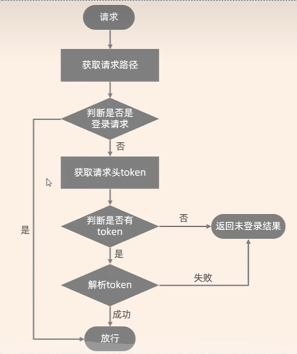
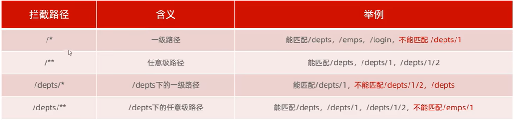
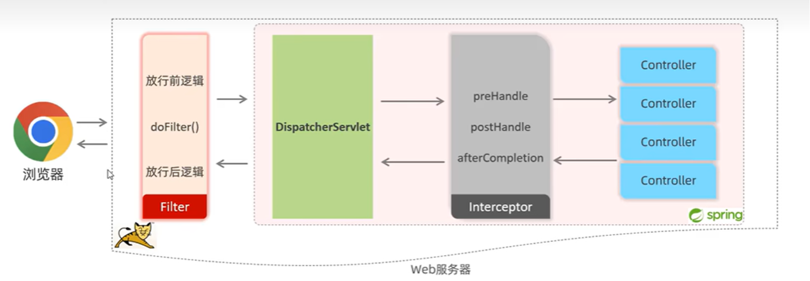
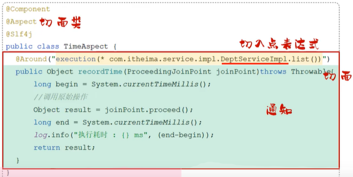
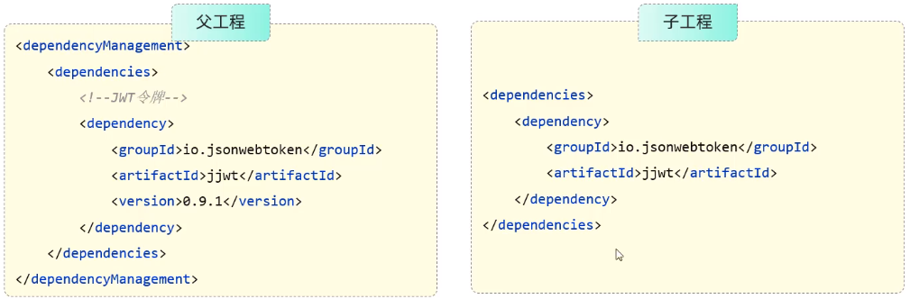

# Spring模块


# 过滤器和拦截器

## 过滤器Filter

概述：

- 概念：Filter过滤器，是JavaWeb三大组件（Servlet、Filter、Listener）之一
- 过滤器可以把对资源的请求拦截下来，从而实现一些特殊的功能
- 过滤器一般完成一些通用的操作，比如登录校验、统一编码处理、敏感字符处理等

快速入门

- 定义Filter：定义一个类，实现Filter接口，并重写其中所有方法
- 配置Filter：Filter类上加`@WebFilter(urlPatterns="/*")`注解，配置拦截的资源。引导类上加`@ServiceComponentScan`开启Servlet组件支持

执行流程

- 请求->放行前逻辑->放行->资源->放行后逻辑
- 放行后访问对应资源，资源访问完成后，还会回到Filter中吗？会
- 如果回到Filter中，是重新执行还是执行放行后的逻辑呢？执行放行后的逻辑

拦截路径

- ```java
  @WebFilter(urlPatterns="/*")
  public class DemoFilter implements Filter{}
  ```

- Filter可以根据需求，配置不同的拦截资源路径

- 拦截具体路径：`urlPatterns = "/login"`, 只有访问login路径时，才会被拦截

- 目录拦截：`urlPatterns = '/emps/*'`，访问/emps下的所有资源，都会被拦截

- 拦截所有：`urlPatterns = '/*'`，访问所有资源，都会被拦截

过滤器链

- 介绍：在一个web应用中，可以配置多个过滤器，这样多个过滤波器就形成了一个过滤器链
- 顺序：注解配置的Filter，优先级是按照**过滤器类名（字符串）的自然排序**

应用：登录校验Filter

- 所有的请求，拦截到了之后，都需要校验令牌吗？**有一个例外，登录请求**
- 拦截到请求后，什么情况下放行，执行业务操作？**有令牌，且令牌校验通过（合法）；否则都返回未登录错误结果**

- 

## 拦截器Interceptor

概述

- 概念：是一种动态拦截方法调用的机制，类似于过滤器。spring框架中提供的，用来动态拦截控制器方法的执行

- 作用：拦截请求，在指定的方法调用前后，根据业务需要执行预先设定的代码

快速入门

- 定义拦截器，实现`HandlerInterceptor`接口，并重写其所有方法
- 注册拦截器：

```java
public class LoginInterceptor implements HandlerInterceptor {

    @Override
    public boolean preHandle(HttpServletRequest request, HttpServletResponse response, Object handler) {
        // 1.判断是否需要拦截（ThreadLocal中是否有用户）
        if (UserHolder.getUser() == null) {
            // 没有，需要拦截，设置状态码
            response.setStatus(401);
            // 拦截
            return false;
        }
        // 有用户，则放行
        return true;
    }
}


public class RefreshTokenInterceptor implements HandlerInterceptor {

    private final StringRedisTemplate stringRedisTemplate;

    public RefreshTokenInterceptor(StringRedisTemplate stringRedisTemplate) {
        this.stringRedisTemplate = stringRedisTemplate;
    }

    @Override
    public boolean preHandle(HttpServletRequest request, HttpServletResponse response, Object handler) {
        // 1.获取请求头中的token
        String token = request.getHeader("LOGIN_USER_KEY");
        if (StrUtil.isBlank(token)) {
            return true;
        }
        // 2.基于TOKEN获取redis中的用户
        String key = LOGIN_USER_KEY + token;
        Map<Object, Object> userMap = stringRedisTemplate.opsForHash().entries(key);
        // 3.判断用户是否存在
        if (userMap.isEmpty()) {
            return true;
        }
        // 5.将查询到的hash数据转为UserDTO
        UserDTO userDTO = BeanUtil.fillBeanWithMap(userMap, new UserDTO(), false);
        // 6.存在，保存用户信息到 ThreadLocal
        UserHolder.saveUser(userDTO);
        // 7.刷新token有效期
        stringRedisTemplate.expire(key, LOGIN_USER_TTL, TimeUnit.MINUTES);
        // 8.放行
        return true;
    }

    @Override
    public void afterCompletion(HttpServletRequest request, HttpServletResponse response, Object handler, Exception ex) throws Exception {
        // 移除用户
        UserHolder.removeUser();
    }
}
```

```java
/**
 * 注册拦截器
 */
@Configuration
public class MvcConfig implements WebMvcConfigurer {
    @Autowired
    private StringRedisTemplate stringRedisTemplate;

    @Override
    public void addInterceptors(InterceptorRegistry registry) {
        // 拦截所有请求
        registry.addInterceptor(new RefreshTokenInterceptor(stringRedisTemplate)).order(0);
        // 拦截部分请求
        registry.addInterceptor(new LoginInterceptor())
                .excludePathPatterns(
                        "/user/code",
                        "/user/login",
                        "/blog/hot",
                        "/shop/**",
                        "/shop-type/**",
                        "/voucher/**"
                ).order(1);
    }
}
```

拦截路径

- 拦截器可以根据需求，配置不同的拦截路径
- 

- 执行流程
- 

## 二者差别

**实现原理不同**

- 过滤器基于函数回调的，一般自定义过滤器都会有一个doFilter()方法，这个方法有一个FilterClain参数，它是一个回调接口;
- 拦截器是基于Java的反射机制（动态代理）实现的

**使用范围不同**

- 过滤器需要实现`javax.serlvet.Filter`接口(`Serlvet`规范中定义的)，也就是说Filter的使用依赖于`Tomcat`容器，导致它只能再web程序中使用
- 拦截器是一个Spring组件，并由Spring容器管理，并不依赖于Tomcat等容器，可以单独使用，需要实现`HandlerInterceptor`接口

**使用场景不同**

- 拦截器主要用来实现项目中的业务判断，比如日志记录，权限判断等业务
- 过滤器通常是用来实现通用功能过滤，比如敏感词过滤、响应数据压缩等功能

**触发时机不同**

- 过滤器Filter是在请求进入容器后，但在进入servlet之前进行预处理，请求结束是在servlet处理完以后
- 拦截器 Interceptor 是在请求进入servlet后，在进入Controller之前进行预处理的，Controller 中渲染了 对应的视图之后请求结束

**拦截范围不同**

- 请求的执行顺序是：**请求进入容器 -> 进入过滤器 -> 进入 Servlet -> 进入拦截器 -> 执行控制器**。
- 过滤器`Filter`会拦截所有的资源，而`Interceptor`只会拦截`Spring`环境中的资源

------

# 异常处理

全局异常处理器

- 在类上添加注解：`@RestControllerAdvice = @ControllerAdvice + @ResponseBody` 

- 在方法上添加注解：`@ExceptionHandler`

```java
@Slf4j
@RestControllerAdvice
public class WebExceptionAdvice {

    @ExceptionHandler(RuntimeException.class)
    public Result handleRuntimeException(RuntimeException e) {
        log.error(e.toString(), e);
        return Result.fail("服务器异常");
    }
}
```

------

# 事务管理

概念：事务是一组操作的集合，它是一个不可分割的工作单位，这些操作要么同时成功，要么同时失败

操作：

- 开启事务（一组操作开始前，开启事务）：start transaction / begin
- 提交事务(这组操作全部成功后，提交事务)：commit
- 回滚事务(中间任何一个操作出现失误，回滚事务）：rollback

## Spring事务管理

注解

- 注解：`@transactional`
- 位置：业务service层的方法上，类上，接口上
- 作用：将当前方法交给spring进行事务管理，方法执行前，开启事务；成功执行完毕，提交事务；出现异常，回滚事务

事务属性

- 1、回滚`rollbackFor`

  - 默认情况下，只有出现`RuntimeException`才回滚异常。rollbackFor属性用于控制出现何种异常类型，回滚事务
  - `@Transactional(rollbackFor = Exception.class)`

- 2、传播行为`propagation`

  - 事务传播行为：指的是当一个事务方法被另一个事务方法调用时，这个事务方法应该如何进行事务控制
  - `REQUIRED`：大部分情况下都是用该传播行为即可
  - `REQUIRES_NEW`：当我们不希望事务之间相互影响时，可以使用该传播行为。比如：下订单前需要记录日志，不论订单保存成功与否，都需要日志记录能够记录成功

  | 属性值        | 含义                                                         |
  | ------------- | ------------------------------------------------------------ |
  | **REQUIRED**  | 【默认值】需要事务，有则加入，无则创建新事务                 |
  | REQUIRES_NEW  | 需要新事务，无论有无，总是创建新事务                         |
  | SUPPORTS      | 支持事务，有则加入，无则在无事务状态中运行                   |
  | NOT_SUPPORTED | 不支持事务，在无事务状态下运行，如果当前存在已有事务，则挂起当前事务 |
  | MANDATORY     | 必须有事务，否则抛异常                                       |
  | NEVER         | 必须没事务，否则抛异常                                       |
  | ...           |                                                              |

------

# 控制反转IoC

[IOC源码](https://javadoop.com/post/spring-ioc)

含义：**IoC（Inversion of Control:控制反转）** 是一种**设计思想**，而不是一个具体的技术实现。IoC 的思想就是将原本在程序中手动创建对象的控制权，交由 Spring 框架来管理。不过， IoC 并非 Spring 特有，在其他语言中也有应用。

- **控制**：指的是对象创建（实例化、管理）的权力
- **反转**：控制权交给外部环境（Spring 框架、IoC 容器）

解决问题：

- 对象之间的耦合度或者说依赖程度降低；
- 资源变的容易管理；比如你用 Spring 容器提供的话很容易就可以实现一个单例。

**依赖注入DI：是IoC 最常见以及最合理的实现方式**

> spring-context 会自动将 spring-core、spring-beans、spring-aop、spring-expression 这几个基础 jar 包带进来。

# 面向切面编程AOP

## **概述**

- AOP：Aspect Oriented Programming(面向切面编程，面向方法编程)，其实就是**面向特定方法编程**
- 场景：统计每一个业务方法的执行耗时
- 实现：动态代理，SpringAOP是Spring框架的高级技术，只在管理bean对象的过程中，主要通过**底层的动态代理机制**，对特定的方法进行编程

## **核心概念**

- 连接点：JoinPoint,可以被AOP控制的方法（暗含方法执行时的相关信息）
- 通知：Advice，指哪些重复的逻辑，也就是共性功能（最终体现为一个方法）
- 切入点：PointCut，匹配连接点的条件，通知仅会在切入点方法执行时被调用
- 切面：Aspect，描述通知与切入点的对应关系（通知+切入点）
- 目标对象：Target，通知所应用的对象
- 

**执行流程**：运行的不再是原始对象，而是基于目标对象所生成的代理对象

## 通知类型及顺序

通知类型

- `@Around`：环绕通知，此注解标注的通知方法在目标方法前、后都被执行
- `@Before`：前置通知，此注解标注的通知方法在目标方法前都被执行
- `@After`：后置通知，此注解标注的通知方法在目标方法后都被执行
- `@AfterReturning`：返回后通知，，此注解标注的通知方法在目标方法后被执行，有异常不会执行
- `@AfterThrowing`：异常后通知，，此注解标注的通知方法发生异常后执行

通知顺序：

- 当有多个切面的切入点都匹配到了目标方法，目标方法运行时，多个通知方法都会被执行
- 执行顺序
  - 不同切面类中，默认按照**切面类的类名字母**排序
    - 目标方法前的通知方法：字母排序靠前的先执行
    - 目标方法后的通知方法：字母排名靠前的后执行
  - 用`@Order(数字)`加在切面类上来控制顺序
    - 目标方法前的通知方法：数字小的先执行
    - 目标方法后的通知方法：数字小的后执行

## **切入点表达式**

- 概念：描述切入点方法一种表达式

- 作用：主要用来决定项目中的哪些方法需要加入通知

- 常见形式

  - `execution(...)`：根据方法的签名来匹配

    - ```java
      @Around("execution(* com.cug.service.impl.*.*(..))")
      public Object recordTime(ProceedingJoinPoint joinPoint) throws Throwable {}
      ```

    - `execution(访问修饰符？返回值 包名.类名.?方法名(方法参数) throws 异常？)`

    - 其中带？的表示可以省略的部分

      - 访问修饰符：可省略
      - 包名.类名：可省略
      - throws 异常：可省略

    - 可以使用通配符描述切入点

      - `*`：单个独立的任意符号，可以通配任意返回值、包名、类名、方法名、任意类型的一个参数，也可以通配包、类、方法名的一部分
      - `..` ：多个连续的任意符号，可以统配任意层级的包，或任意类型、任意个数的参数

    - 注意事项：根据业务需要，可以使用`且（&&）、或（||）、非（！）`来组合比较复杂的切入点表达式

    - 书写建议

      - 所有**业务方法名在命名时尽量规范**，方便切入点表达式快速匹配。如：查询类方法都是find开头，更新类方法都是update开头
      - 描述切入点方法通常基于**接口描述**，而不是直接描述实现类，增强拓展性
      - 在满足业务需要的前提下，**尽量缩小切入点的匹配范围**。如报名匹配尽量不使用.. ，使用*匹配单个包

  - `@annotation(...)`：根据注解匹配

    - ```java
      @Retention(RetentionPolicy.RUNTIME)
      @Target(ElementType.METHOD)
      public @interface Log {
      }
      ```

    - ```java
      @Around("@annotation(com.cug.anno.Log)")
      public Object recordLog(ProceedingJoinPoint joinPoint) throws Throwable {}
      ```

    - @annotation切入点表达式，用于匹配标识有特定注解的方法

    - 使用步骤：定义一个注解，将该注解放到对应的方法上

**快速入门**

- AOP:记录每个方法的耗时

  - 导入依赖：`spring-boot-starter-aop`

  - ```java
    @Slf4j
    @Component
    // @Aspect // AOP类
    public class TimeAspect {
    
        @Pointcut("execution(* com.cug.service.impl.*.*(..))")
        private void pt() {
        }
    
        @Around("pt()")
        public Object recordTime(ProceedingJoinPoint joinPoint) throws Throwable {
            // 1.记录开始时间
            long begin = System.currentTimeMillis();
            // 2.运行原始方法
            Object result = joinPoint.proceed();
            // 3.获取方法运行结束时间，计算执行耗时
            long end = System.currentTimeMillis();
            log.info(joinPoint.getSignature() + "方法执行耗时：{}ms", end - begin);
            return result;
        }
    }
    ```

- 事务管理
- 权限控制
- 记录操作日志

## 连接点

在Spring中用`JoinPoint`抽象了连接点，用它可以获得方法执行时的相关信息，如目标类名，方法名，方法参数等

对于@Around 通知，获取连接点信息只能使用ProceedingJoinPoint

对于其它四种通知，获取连接点信息只能使用JoinPoint，它是ProceedingJoinPoint的父类型

------

# Maven

## 分模块设计与开发

- 将项目按照功能分为若干个子模块，方便项目的管理维护、扩展，也方便模块间的相互调用，资源共享
- 注意事项：分模块设计需要先针对模块功能进行设计，在进行编码。不会湘江工程开发完毕，然后在进行拆分

## 继承和聚合

**继承**

- 继承描述的是两个工程间的关系，与java中的继承相似，子工程可以继承父工程中的配置信息，常见于依赖关系的继承
- 作用：简化依赖配置、统一管理依赖
- 实现：`<parent>...</parent>`
- 版本锁定
  - 
  - 在maven中，可以在父工程中的pom文件中通过`<dependencyManagement>`来统一管理依赖版本
  - 注意事项：子工程引入依赖时，无需指定`<version>`版本号，父工程统一管理。变更依赖本本，只需在父工程中统一变更
- `<dependencyManagement>`和`<dependencies>`的区别是什么?
  - <dependencies>是直接依赖，在父工程配置了依赖，子工程会直接继承下来
  - <dependencyManagement>是统一管理依赖版本，不会直接依赖，还需要在子工程中引入所需依赖（无需指定版本）

**聚合**

- 将多个模块组织成一个整体，同时进行项目的构建

- 聚合工程：一个不具有业务功能的”空“，有且只有一个pom文件

**二者关系**

- 作用
  - 聚合用于快速构建项目
  - 继承用于简化依赖配置，统一管理依赖
- 相同点
  - 聚合和继承的pom.xml文件打包方式均为pom，可以将两种关系只做到同一个pom文件中
  - 聚合与继承均属于设计型模块，并无实际的模块内容
- 不同点
  - 聚合实在聚合工程中配置关系，聚合可以感知到参与聚合的模块有哪些
  - 继承是在子模块中配置关系，父模块无法感知哪些子模块继承了自己

## 私服

- 私服是一种特殊的远程仓库，它是架设在局域网内的仓库服务，用来代理位于外部的中央仓库，用于解决团队内部的资源共享与资源同步问题
- 私服在企业项目开发中，一个项目/公司，只需要一台即可（无需我们自己搭建，会使用即可）
- 依赖查找顺序：本地仓库->私服->中央仓库

Spring打包方式

- jar：普通模块打包，springboot项目基本都是jar包（内嵌tomcat运行）
- war：普通web程序打包，需要部署在外部的tomcat服务器中运行
- pom：父工程或聚合工程，该模块不写代码，仅进行依赖管理