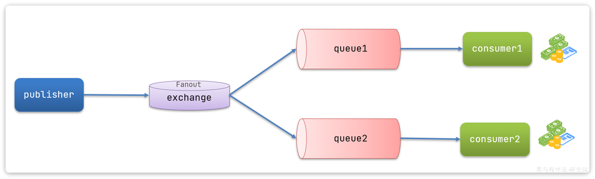

# 服务注册和发现Nacos

微服务的远程调用

- 实现方式之一：通过http请求实现远程查询和增删改等操作
- Spring给我们提供了一个`RestTemplate`的API，可以方便的实现Http请求的发送。

```java
/*
* 注册为Bean
*/
@Configuration
public class RemoteCallConfig {

    @Bean
    public RestTemplate restTemplate() {
        return new RestTemplate();
    }
}


// 2.查询商品
// List<ItemDTO> items = itemService.queryItemByIds(itemIds);
// 2.1.利用RestTemplate发起http请求，得到http的响应
ResponseEntity<List<ItemDTO>> response = restTemplate.exchange(
    "http://localhost:8081/items?ids={ids}",
    HttpMethod.GET,
    null,
    new ParameterizedTypeReference<List<ItemDTO>>() {
    },
    Map.of("ids", CollUtil.join(itemIds, ","))
);
```


# 消息队列MQ

`MQ`（Message Queue）：实现多个服务间异步通讯的方式

- 同步通讯：就如同打视频电话，双方的交互都是实时的。因此同一时刻你只能跟一个人打视频电话。
- 异步通讯：就如同发微信聊天，双方的交互不是实时的，你不需要立刻给对方回应。因此你可以多线操作，同时跟多人聊天。

**同步通信**：

- 优点：即时响应
  - 实现方式：基于`OpenFeign`调用，
- 缺点：
  - 拓展性差：业务丰富的的同时，要不断更改源代码
  - 性能下降：同步调用的方式
  - 级联失败：基于`OpenFeign`调用交易服务、通知服务。当交易服务、通知服务出现故障时，整个事务都会回滚，交易失败。

**异步通信**

- 异步调用方式其实就是基于消息通知的方式，一般包含三个角色：

  - 消息发送者：投递消息的人，就是原来的调用方
  - 消息Broker：管理、暂存、转发消息，你可以把它理解成微信服务器
  - 消息接收者：接收和处理消息的人，就是原来的服务提供方

- 异步调用的优势包括：

  - 耦合度更低

  - 性能更好

  - 业务拓展性强

  - 故障隔离，避免级联失败

- 异步通信的缺点：

  - 完全依赖于Broker的可靠性、安全性和性能
  - 架构复杂，后期维护和调试麻烦

- 技术选型

- |            | RabbitMQ                | ActiveMQ                       | RocketMQ   | Kafka      |
  | ---------- | ----------------------- | ------------------------------ | ---------- | ---------- |
  | 公司/社区  | Rabbit                  | Apache                         | 阿里       | Apache     |
  | 开发语言   | Erlang                  | Java                           | Java       | Scala&Java |
  | 协议支持   | AMQP，XMPP，SMTP，STOMP | OpenWire,STOMP，REST,XMPP,AMQP | 自定义协议 | 自定义协议 |
  | 可用性     | 高                      | 一般                           | 高         | 高         |
  | 单机吞吐量 | 一般                    | 差                             | 高         | 非常高     |
  | 消息延迟   | 微秒级                  | 毫秒级                         | 毫秒级     | 毫秒以内   |
  | 消息可靠性 | 高                      | 一般                           | 高         | 一般       |

  追求可用性：Kafka、 RocketMQ 、`RabbitMQ`

  追求可靠性：`RabbitMQ`、RocketMQ

  追求吞吐能力：RocketMQ、Kafka

  追求消息低延迟：`RabbitMQ`、Kafka

### RabbitMQ

`RabbitMQ`是基于Erlang语言开发的开源消息通信中间件，[`RabbitMQ`官网地址](https://www.rabbitmq.com/)

1、`docker`部署

```c
docker run \
 -e RABBITMQ_DEFAULT_USER=rabbitmq \
 -e RABBITMQ_DEFAULT_PASS=123456 \
 -v mq-plugins:/plugins \
 --name mq \
 --hostname mq \
 -p 15672:15672 \
 -p 5672:5672 \
 --network hm-net\
 -d \
 rabbitmq:3.8-management
```

可以看到在安装命令中有两个映射的端口：

- `15672`：`RabbitMQ`提供的管理控制台的端口
- `5672`： `RabbitMQ`的消息发送处理接口

部署完成后，访问地址为`http://{本地虚拟机ip地址}:15672`


其中包含几个概念：

- **`publisher`**：生产者，也就是发送消息的一方
- **`consumer`**：消费者，也就是消费消息的一方
- **`queue`**：队列，存储消息。生产者投递的消息会暂存在消息队列中，等待消费者处理
- **`exchange`**：交换机，负责消息路由。生产者发送的消息由交换机决定投递到哪个队列。
- **`virtual host`**：虚拟主机，起到数据隔离的作用。每个虚拟主机相互独立，有各自的exchange、queue

### SpringAMQP

将来我们开发业务功能的时候，肯定不会在控制台收发消息，而是应该基于编程的方式。由于`RabbitMQ`采用了`AMQP`协议，因此它具备跨语言的特性。任何语言只要遵循`AMQP`协议收发消息，都可以与`RabbitMQ`交互。并且`RabbitMQ`官方也提供了各种不同语言的客户端。

但是，`RabbitMQ`官方提供的Java客户端编码相对复杂，一般生产环境下我们更多会结合Spring来使用。而Spring的官方刚好基于`RabbitMQ`提供了这样一套消息收发的模板工具：`SpringAMQP`。并且还基于`SpringBoot`对其实现了自动装配，使用起来非常方便。

#### 简单案例

服务配置，在publisher和consumer中的application.yml中进行配置

```yml
spring:
  rabbitmq:
    host: 192.168.48.128 # 你的虚拟机IP
    port: 5672 # 端口
    virtual-host: /hmall # 虚拟主机
    username: hmall # 用户名
    password: 123 # 密码
```

**消息发送**

```java
@SpringBootTest
public class SpringAmqpTest {

    @Autowired
    private RabbitTemplate rabbitTemplate;

    @Test
    public void testSimpleQueue() {
        // 队列名称
        String queueName = "simple.queue";
        // 消息
        String message = "hello, spring amqp!";
        // 发送消息
        rabbitTemplate.convertAndSend(queueName, message);
    }
}
```

**消息接收**

```java
@Component
public class SpringRabbitListener {
    // 利用RabbitListener来声明要监听的队列信息
    // 将来一旦监听的队列中有了消息，就会推送给当前服务，调用当前方法，处理消息。
    // 可以看到方法体中接收的就是消息体的内容
    @RabbitListener(queues = "simple.queue")
    public void listenSimpleQueueMessage(String msg) throws InterruptedException {
        System.out.println("spring 消费者接收到消息：【" + msg + "】");
    }
}
```

#### WorkQueues模型

Work queues，任务模型。简单来说就是**让多个消费者绑定到一个队列，共同消费队列中的消息**。


当消息处理比较耗时的时候，可能生产消息的速度会远远大于消息的消费速度。长此以往，消息就会堆积越来越多，无法及时处理。

此时就可以使用work 模型，**多个消费者共同处理消息处理，消息处理的速度就能大大提高**了。

**消息发送**

```java
/**
     * workQueue
     * 向队列中不停发送消息，模拟消息堆积。
     */
@Test
public void testWorkQueue() throws InterruptedException {
    // 队列名称
    String queueName = "simple.queue";
    // 消息
    String message = "hello, message_";
    for (int i = 0; i < 50; i++) {
        // 发送消息，每20毫秒发送一次，相当于每秒发送50条消息
        rabbitTemplate.convertAndSend(queueName, message + i);
        Thread.sleep(20);
    }
}
```

**消息接收**

```java
@RabbitListener(queues = "work.queue")
public void listenWorkQueue1(String msg) throws InterruptedException {
    System.out.println("消费者1接收到消息：【" + msg + "】" + LocalTime.now());
    Thread.sleep(20);
}

@RabbitListener(queues = "work.queue")
public void listenWorkQueue2(String msg) throws InterruptedException {
    System.err.println("消费者2........接收到消息：【" + msg + "】" + LocalTime.now());
    Thread.sleep(200);
}
```

能者多劳：

```yml
spring:
  rabbitmq:
    listener:
      simple:
        prefetch: 1 # 每次只能获取一条消息，处理完成才能获取下一个消息
```

总结：

Work模型的使用：

- 多个消费者绑定到一个队列，同一条消息只会被一个消费者处理
- 通过设置prefetch来控制消费者预取的消息数量

#### 交换机类型


可以看到，在订阅模型中，多了一个exchange角色，而且过程略有变化：

- **Publisher**：生产者，不再发送消息到队列中，而是发给交换机
- **Exchange**：交换机，一方面，接收生产者发送的消息。另一方面，知道如何处理消息，例如递交给某个特别队列、递交给所有队列、或是将消息丢弃。到底如何操作，取决于Exchange的类型。
- **Queue**：消息队列也与以前一样，接收消息、缓存消息。不过队列一定要与交换机绑定。
- **Consumer**：消费者，与以前一样，订阅队列，没有变化

**Exchange（交换机）只负责转发消息，不具备存储消息的能力**，因此如果没有任何队列与Exchange绑定，或者没有符合路由规则的队列，那么消息会丢失！ 

交换机的类型有四种：

- **Fanout**：广播，将消息交给所有绑定到交换机的队列。我们最早在控制台使用的正是Fanout交换机
- **Direct**：订阅，基于RoutingKey（路由key）发送给订阅了消息的队列
- **Topic**：通配符订阅，与Direct类似，只不过RoutingKey可以使用通配符
- **Headers**：头匹配，基于MQ的消息头匹配，用的较少。

交换机的作用是什么？

- 接收publisher发送的消息
- 将消息按照规则路由到与之绑定的队列
- 不能缓存消息，路由失败，消息丢失
- `FanoutExchange`的会将消息路由到每个绑定的队列

#### Fanout交换机



- 1）  可以有多个队列
- 2）  每个队列都要绑定到Exchange（交换机）
- 3）  生产者发送的消息，只能发送到交换机
- 4）  交换机把消息发送给绑定过的所有队列
- 5）  订阅队列的消费者**都能拿到消息**

**消息发送**

```java
@Test
public void testFanoutExchange() {
    // 交换机名称
    String exchangeName = "hmall.fanout";
    // 消息
    String message = "hello, everyone!";
    rabbitTemplate.convertAndSend(exchangeName, "", message);
}
```

**消息接收**

- 绑定队列到交换机

```java
@RabbitListener(queues = "fanout.queue1")
public void listenFanoutQueue1(String msg) {
    System.out.println("消费者1接收到Fanout消息：【" + msg + "】");
}

@RabbitListener(queues = "fanout.queue2")
public void listenFanoutQueue2(String msg) {
    System.out.println("消费者2接收到Fanout消息：【" + msg + "】");
}
```

#### Direct交换机

在Fanout模式中，一条消息，会被所有订阅的队列都消费。但是，在某些场景下，我们**希望不同的消息被不同的队列消费**。这时就要用到Direct类型的Exchange。


在Direct模型下：

- 队列与交换机的绑定，不能是任意绑定了，而是要指定一个`RoutingKey`**（路由key）**
- 消息的发送方在向 Exchange发送消息时，也必须指定消息的 `RoutingKey`。
- Exchange不再把消息交给每一个绑定的队列，而是根据消息的`Routing Key`进行判断，只有队列的`Routingkey`与消息的 `Routing key`完全一致，才会接收到消息

**案例需求如图**：


1.  声明一个名为`hmall.direct`的交换机
2.  声明队列`direct.queue1`，绑定`hmall.direct`，`bindingKey`为`blud`和`red`
3.  声明队列`direct.queue2`，绑定`hmall.direct`，`bindingKey`为`yellow`和`red`
4.  在`consumer`服务中，编写两个消费者方法，分别监听direct.queue1和direct.queue2 
5.  在publisher中编写测试方法，向`hmall.direct`发送消息 

**消息发送**

```java
@Test
public void testSendDirectExchange() {
    // 交换机名称
    String exchangeName = "itcast.direct";
    // 消息
    String message = "hello, blue!";
    // 发送消息
    rabbitTemplate.convertAndSend(exchangeName, "blue", message);
}
```

**消息接收**

```java
@RabbitListener(bindings = @QueueBinding(
    value = @Queue(name = "direct.queue1"),
    exchange = @Exchange(name = "itcast.direct", type = ExchangeTypes.DIRECT),
    key = {"red", "blue"}
))
public void listenDirectQueue1(String msg){
    System.out.println("消费者接收到direct.queue1的消息：【" + msg + "】");
}

@RabbitListener(bindings = @QueueBinding(
    value = @Queue(name = "direct.queue2"),
    exchange = @Exchange(name = "itcast.direct", type = ExchangeTypes.DIRECT),
    key = {"red", "yellow"}
))
public void listenDirectQueue2(String msg){
    System.out.println("消费者接收到direct.queue2的消息：【" + msg + "】");
}
```

#### Topic交换机

`Topic`类型的`Exchange`与`Direct`相比，都是可以根据`RoutingKey`把消息路由到不同的队列。

只不过`Topic`类型`Exchange`可以让队列在绑定`BindingKey` 的时候使用**通配符！**

`BindingKey`一般都是有一个或多个单词组成，多个单词之间以`.`分割，例如： `item.insert`

通配符规则：

- `#`：匹配一个或多个词
- `*`：匹配不多不少恰好1个词


假如此时publisher发送的消息使用的`RoutingKey`共有四种：

- `china.news `代表有中国的新闻消息；
- `china.weather` 代表中国的天气消息；
- `japan.news` 则代表日本新闻
- `japan.weather` 代表日本的天气消息；

解释：

- `topic.queue1`：绑定的是`china.#` ，凡是以 `china.`开头的`routing key` 都会被匹配到，包括：
  - `china.news`
  - `china.weather`
- `topic.queue2`：绑定的是`#.news` ，凡是以 `.news`结尾的 `routing key` 都会被匹配。包括:
  - `china.news`
  - `japan.news`

**消息发送**

```java
@Test
public void testSendTopicExchange() {
    // 交换机名称
    String exchangeName = "itcast.topic";
    // 消息
    String message = "今天天气不错，我的心情好极了!";
    // 发送消息
    rabbitTemplate.convertAndSend(exchangeName, "china.weather", message);
}
```

**消息接收**

```java
@RabbitListener(bindings = @QueueBinding(
    value = @Queue(name = "topic.queue1"),
    exchange = @Exchange(name = "itcast.topic", type = ExchangeTypes.TOPIC),
    key = "china.#"
))
public void listenTopicQueue1(String msg){
    System.out.println("消费者接收到topic.queue1的消息：【" + msg + "】");
}

@RabbitListener(bindings = @QueueBinding(
    value = @Queue(name = "topic.queue2"),
    exchange = @Exchange(name = "itcast.topic", type = ExchangeTypes.TOPIC),
    key = "#.news"
))
public void listenTopicQueue2(String msg){
    System.out.println("消费者接收到topic.queue2的消息：【" + msg + "】");
}
```

#### 消息转接器

我们在publisher模块的SpringAmqpTest中新增一个消息发送的代码，发送一个Map对象：

```Java
@Test
public void testSendMap() throws InterruptedException {
    // 准备消息
    Map<String,Object> msg = new HashMap<>();
    msg.put("name", "柳岩");
    msg.put("age", 21);
    // 发送消息
    rabbitTemplate.convertAndSend("object.queue", msg);
}
```

发送消息后查看控制台：


可以看到消息格式非常不友好。

JDK序列化方式并不合适。我们希望消息体的体积更小、可读性更高，因此可以使用JSON方式来做序列化和反序列化。

在`publisher`和`consumer`两个服务中都引入依赖：

```XML
<dependency>
    <groupId>com.fasterxml.jackson.dataformat</groupId>
    <artifactId>jackson-dataformat-xml</artifactId>
    <version>2.9.10</version>
</dependency>
```

注意，如果项目中引入了`spring-boot-starter-web`依赖，则无需再次引入`Jackson`依赖。

配置消息转换器，在`publisher`和`consumer`两个服务的启动类中添加一个Bean即可：

```Java
@Bean
public MessageConverter messageConverter(){
    // 1.定义消息转换器
    Jackson2JsonMessageConverter jackson2JsonMessageConverter = new Jackson2JsonMessageConverter();
    // 2.配置自动创建消息id，用于识别不同消息，也可以在业务中基于ID判断是否是重复消息
    jackson2JsonMessageConverter.setCreateMessageIds(true);
    return jackson2JsonMessageConverter;
}
```

消息转换器中添加的messageId可以便于我们将来做幂等性判断。

------

# Elasticsearch

数据库的模糊搜索功能单一，匹配条件非常苛刻，必须恰好包含用户搜索的关键字。而在搜索引擎中，用户输入出现个别错字，或者用拼音搜索、同义词搜索都能正确匹配到数据。

综上，在面临海量数据的搜索，或者有一些复杂搜索需求的时候，推荐使用专门的搜索引擎来实现搜索功能。

目前全球的搜索引擎技术排名如下：


# 初识elasticsearch

[飞书-黑马微服务框架-elasticsearch](https://b11et3un53m.feishu.cn/wiki/LDLew5xnDiDv7Qk2uPwcoeNpngf)

Elasticsearch是一个基于Apache Lucene库实现的，Restful风格的，分布式搜索和数据分析引擎。基于**倒排索引**技术，实现了高性能的全文检索和数据分析功能。官方网站如下：[elasticsearch](https://www.elastic.co/cn/elasticsearch)

## 倒排索引

elasticsearch之所以有如此高性能的搜索表现，正是得益于底层的倒排索引技术。那么什么是倒排索引呢？

**倒排**索引的概念是基于MySQL这样的**正向**索引而言的。

### 正向索引

我们先来回顾一下正向索引。

例如有一张名为`tb_goods`的表：

| **id** | **title**      | **price** |
| :----- | :------------- | :-------- |
| 1      | 小米手机       | 3499      |
| 2      | 华为手机       | 4999      |
| 3      | 华为小米充电器 | 49        |
| 4      | 小米手环       | 49        |
| ...    | ...            | ...       |

其中的`id`字段已经创建了索引，由于索引底层采用了B+树结构，因此我们根据id搜索的速度会非常快。但是其他字段例如`title`，只在叶子节点上存在。

因此要根据`title`搜索的时候只能遍历树中的每一个叶子节点，判断title数据是否符合要求。

比如用户的SQL语句为：

```SQL
select * from tb_goods where title like '%手机%';
```

那搜索的大概流程如图：


说明：

- 1）检查到搜索条件为`like '%手机%'`，需要找到`title`中包含`手机`的数据
- 2）逐条遍历每行数据（每个叶子节点），比如第1次拿到`id`为1的数据
- 3）判断数据中的`title`字段值是否符合条件
- 4）如果符合则放入结果集，不符合则丢弃
- 5）回到步骤1

综上，根据id精确匹配时，可以走索引，查询效率较高。而当搜索条件为模糊匹配时，由于索引无法生效，导致从索引查询退化为全表扫描，效率很差。

因此，正向索引适合于根据索引字段的精确搜索，不适合基于部分词条的模糊匹配。

而倒排索引恰好解决的就是根据部分词条模糊匹配的问题。

### 倒排索引

倒排索引中有两个非常重要的概念：

- 文档（`Document`）：用来搜索的数据，其中的每一条数据就是一个文档。例如一个网页、一个商品信息
- 词条（`Term`）：对文档数据或用户搜索数据，利用某种算法分词，得到的具备含义的词语就是词条。例如：我是中国人，就可以分为：我、是、中国人、中国、国人这样的几个词条

**创建倒排索引**是对正向索引的一种特殊处理和应用，流程如下：

- 将每一个文档的数据利用**分词算法**根据语义拆分，得到一个个词条
- 创建表，每行数据包括词条、词条所在文档id、位置等信息
- 因为词条唯一性，可以给词条创建**正向**索引

此时形成的这张以词条为索引的表，就是倒排索引表，两者对比如下：

**正向索引**

| **id（索引）** | **title**      | **price** |
| :------------- | :------------- | :-------- |
| 1              | 小米手机       | 3499      |
| 2              | 华为手机       | 4999      |
| 3              | 华为小米充电器 | 49        |
| 4              | 小米手环       | 49        |
| ...            | ...            | ...       |

**倒排索引**

| **词条（索引）** | **文档id** |
| :--------------- | :--------- |
| 小米             | 1，3，4    |
| 手机             | 1，2       |
| 华为             | 2，3       |
| 充电器           | 3          |
| 手环             | 4          |

倒排索引的**搜索流程**如下（以搜索"华为手机"为例），如图：


流程描述：

1）用户输入条件`"华为手机"`进行搜索。

2）对用户输入条件**分词**，得到词条：`华为`、`手机`。

3）拿着词条在倒排索引中查找（**由于词条有索引，查询效率很高**），即可得到包含词条的文档id：`1、2、3`。

4）拿着文档`id`到正向索引中查找具体文档即可（由于`id`也有索引，查询效率也很高）。

虽然要先查询倒排索引，再查询倒排索引，但是无论是词条、还是文档id都建立了索引，查询速度非常快！无需全表扫描。

### 正向和倒排

那么为什么一个叫做正向索引，一个叫做倒排索引呢？

-  **正向索引**是最传统的，根据id索引的方式。但根据词条查询时，必须先逐条获取每个文档，然后判断文档中是否包含所需要的词条，是**根据文档找词条的过程**。 
-  而**倒排索引**则相反，是先找到用户要搜索的词条，根据词条得到保护词条的文档的id，然后根据id获取文档。是**根据词条找文档的过程**。 

是不是恰好反过来了？

那么两者方式的优缺点是什么呢？

**正向索引**：

- 优点： 
  - 可以给多个字段创建索引
  - 根据索引字段搜索、排序速度非常快
- 缺点： 
  - 根据非索引字段，或者索引字段中的部分词条查找时，只能全表扫描。

**倒排索引**：

- 优点： 
  - 根据词条搜索、模糊搜索时，速度非常快
- 缺点： 
  - 只能给词条创建索引，而不是字段
  - 无法根据字段做排序

## 基础概念

elasticsearch中有很多独有的概念，与mysql中略有差别，但也有相似之处。

### 文档和字段

elasticsearch是面向**文档（Document）**存储的，可以是数据库中的一条商品数据，一个订单信息。文档数据会被序列化为`json`格式后存储在`elasticsearch`中：


```JSON
{
    "id": 1,
    "title": "小米手机",
    "price": 3499
}
{
    "id": 2,
    "title": "华为手机",
    "price": 4999
}
{
    "id": 3,
    "title": "华为小米充电器",
    "price": 49
}
{
    "id": 4,
    "title": "小米手环",
    "price": 299
}
```

因此，原本数据库中的一行数据就是ES中的一个JSON文档；而数据库中每行数据都包含很多列，这些列就转换为JSON文档中的**字段（Field）**。

### 索引和映射

随着业务发展，需要在es中存储的文档也会越来越多，比如有商品的文档、用户的文档、订单文档等等：


所有文档都散乱存放显然非常混乱，也不方便管理。

因此，我们要将类型相同的文档集中在一起管理，称为**索引（Index）**。例如：

**商品索引**

```JSON
{
    "id": 1,
    "title": "小米手机",
    "price": 3499
}

{
    "id": 2,
    "title": "华为手机",
    "price": 4999
}

{
    "id": 3,
    "title": "三星手机",
    "price": 3999
}
```

**用户索引**

```JSON
{
    "id": 101,
    "name": "张三",
    "age": 21
}

{
    "id": 102,
    "name": "李四",
    "age": 24
}

{
    "id": 103,
    "name": "麻子",
    "age": 18
}
```

**订单索引**

```JSON
{
    "id": 10,
    "userId": 101,
    "goodsId": 1,
    "totalFee": 294
}

{
    "id": 11,
    "userId": 102,
    "goodsId": 2,
    "totalFee": 328
}
```

- 所有用户文档，就可以组织在一起，称为用户的索引；
- 所有商品的文档，可以组织在一起，称为商品的索引；
- 所有订单的文档，可以组织在一起，称为订单的索引；

因此，我们可以把索引当做是数据库中的表。

数据库的表会有约束信息，用来定义表的结构、字段的名称、类型等信息。因此，索引库中就有**映射（mapping）**，是索引中文档的字段约束信息，类似表的结构约束。

### mysql与elasticsearch

我们统一的把mysql与elasticsearch的概念做一下对比：

| **MySQL** | **Elasticsearch** | **说明**                                                     |
| :-------- | :---------------- | :----------------------------------------------------------- |
| Table     | Index             | 索引(index)，就是文档的集合，类似数据库的表(table)           |
| Row       | Document          | 文档（Document），就是一条条的数据，类似数据库中的行（Row），文档都是JSON格式 |
| Column    | Field             | 字段（Field），就是JSON文档中的字段，类似数据库中的列（Column） |
| Schema    | Mapping           | Mapping（映射）是索引中文档的约束，例如字段类型约束。类似数据库的表结构（Schema） |
| SQL       | DSL               | DSL是elasticsearch提供的JSON风格的请求语句，用来操作elasticsearch，实现CRUD |

如图：


那是不是说，我们学习了elasticsearch就不再需要mysql了呢？

并不是如此，两者各自有自己的擅长之处：

-  Mysql：擅长事务类型操作，可以确保数据的安全和一致性 
-  Elasticsearch：擅长海量数据的搜索、分析、计算 

因此在企业中，往往是两者结合使用：

- 对安全性要求较高的写操作，使用mysql实现
- 对查询性能要求较高的搜索需求，使用elasticsearch实现
- 两者再基于某种方式，实现数据的同步，保证一致性


## 安装

我们要安装的内容包含3部分：

- elasticsearch
- kibana

首先Elasticsearch不用多说，是提供核心的数据存储、搜索、分析功能的。

然后是Kibana，Elasticsearch对外提供的是Restful风格的API，任何操作都可以通过发送http请求来完成。不过http请求的方式、路径、还有请求参数的格式都有严格的规范。这些规范我们肯定记不住，因此我们要借助于Kibana这个服务。

Kibana是elastic公司提供的用于操作Elasticsearch的可视化控制台。它的功能非常强大，包括：

- 对Elasticsearch数据的搜索、展示
- 对Elasticsearch数据的统计、聚合，并形成图形化报表、图形
- 对Elasticsearch的集群状态监控
- 它还提供了一个开发控制台（DevTools），在其中对Elasticsearch的Restful的API接口提供了**语法提示**

通过下面的Docker命令即可安装单机版本的elasticsearch：

```Bash
docker run -d \
  --name es \
  -e "ES_JAVA_OPTS=-Xms512m -Xmx512m" \
  -e "discovery.type=single-node" \
  -v es-data:/usr/share/elasticsearch/data \
  -v es-plugins:/usr/share/elasticsearch/plugins \
  --privileged \
  --network hmall \
  -p 9200:9200 \
  -p 9300:9300 \
  elasticsearch:7.12.1
```