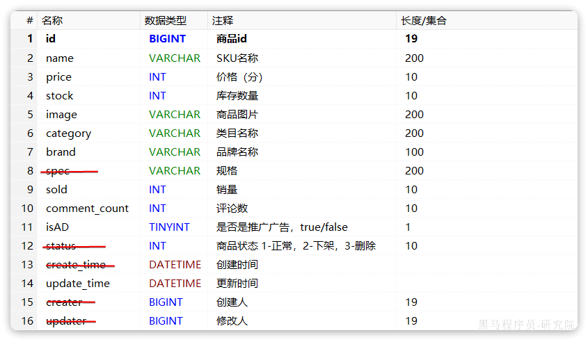
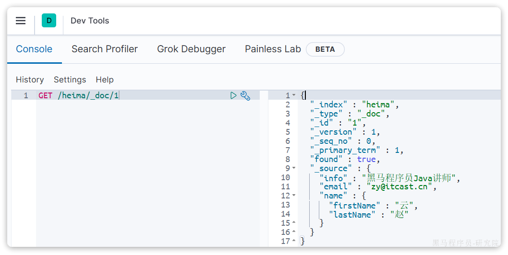

# 服务注册和发现Nacos

微服务的远程调用

- 实现方式之一：通过http请求实现远程查询和增删改等操作
- Spring给我们提供了一个`RestTemplate`的API，可以方便的实现Http请求的发送。

```java
/*
* 注册为Bean
*/
@Configuration
public class RemoteCallConfig {

    @Bean
    public RestTemplate restTemplate() {
        return new RestTemplate();
    }
}


// 2.查询商品
// List<ItemDTO> items = itemService.queryItemByIds(itemIds);
// 2.1.利用RestTemplate发起http请求，得到http的响应
ResponseEntity<List<ItemDTO>> response = restTemplate.exchange(
    "http://localhost:8081/items?ids={ids}",
    HttpMethod.GET,
    null,
    new ParameterizedTypeReference<List<ItemDTO>>() {
    },
    Map.of("ids", CollUtil.join(itemIds, ","))
);
```


# 消息队列MQ

`MQ`（Message Queue）：实现多个服务间异步通讯的方式

- 同步通讯：就如同打视频电话，双方的交互都是实时的。因此同一时刻你只能跟一个人打视频电话。
- 异步通讯：就如同发微信聊天，双方的交互不是实时的，你不需要立刻给对方回应。因此你可以多线操作，同时跟多人聊天。

**同步通信**：

- 优点：即时响应
  - 实现方式：基于`OpenFeign`调用，
- 缺点：
  - 拓展性差：业务丰富的的同时，要不断更改源代码
  - 性能下降：同步调用的方式
  - 级联失败：基于`OpenFeign`调用交易服务、通知服务。当交易服务、通知服务出现故障时，整个事务都会回滚，交易失败。

**异步通信**

- 异步调用方式其实就是基于消息通知的方式，一般包含三个角色：

  - 消息发送者：投递消息的人，就是原来的调用方
  - 消息Broker：管理、暂存、转发消息，你可以把它理解成微信服务器
  - 消息接收者：接收和处理消息的人，就是原来的服务提供方

- 异步调用的优势包括：

  - 耦合度更低

  - 性能更好

  - 业务拓展性强

  - 故障隔离，避免级联失败

- 异步通信的缺点：

  - 完全依赖于Broker的可靠性、安全性和性能
  - 架构复杂，后期维护和调试麻烦

- 技术选型

- |            | RabbitMQ                | ActiveMQ                       | RocketMQ   | Kafka      |
  | ---------- | ----------------------- | ------------------------------ | ---------- | ---------- |
  | 公司/社区  | Rabbit                  | Apache                         | 阿里       | Apache     |
  | 开发语言   | Erlang                  | Java                           | Java       | Scala&Java |
  | 协议支持   | AMQP，XMPP，SMTP，STOMP | OpenWire,STOMP，REST,XMPP,AMQP | 自定义协议 | 自定义协议 |
  | 可用性     | 高                      | 一般                           | 高         | 高         |
  | 单机吞吐量 | 一般                    | 差                             | 高         | 非常高     |
  | 消息延迟   | 微秒级                  | 毫秒级                         | 毫秒级     | 毫秒以内   |
  | 消息可靠性 | 高                      | 一般                           | 高         | 一般       |

  追求可用性：Kafka、 RocketMQ 、`RabbitMQ`

  追求可靠性：`RabbitMQ`、RocketMQ

  追求吞吐能力：RocketMQ、Kafka

  追求消息低延迟：`RabbitMQ`、Kafka

### RabbitMQ

`RabbitMQ`是基于Erlang语言开发的开源消息通信中间件，[`RabbitMQ`官网地址](https://www.rabbitmq.com/)

1、`docker`部署

```c
docker run \
 -e RABBITMQ_DEFAULT_USER=rabbitmq \
 -e RABBITMQ_DEFAULT_PASS=123456 \
 -v mq-plugins:/plugins \
 --name mq \
 --hostname mq \
 -p 15672:15672 \
 -p 5672:5672 \
 --network hm-net\
 -d \
 rabbitmq:3.8-management
```

可以看到在安装命令中有两个映射的端口：

- `15672`：`RabbitMQ`提供的管理控制台的端口
- `5672`： `RabbitMQ`的消息发送处理接口

部署完成后，访问地址为`http://{本地虚拟机ip地址}:15672`


其中包含几个概念：

- **`publisher`**：生产者，也就是发送消息的一方
- **`consumer`**：消费者，也就是消费消息的一方
- **`queue`**：队列，存储消息。生产者投递的消息会暂存在消息队列中，等待消费者处理
- **`exchange`**：交换机，负责消息路由。生产者发送的消息由交换机决定投递到哪个队列。
- **`virtual host`**：虚拟主机，起到数据隔离的作用。每个虚拟主机相互独立，有各自的exchange、queue

### SpringAMQP

将来我们开发业务功能的时候，肯定不会在控制台收发消息，而是应该基于编程的方式。由于`RabbitMQ`采用了`AMQP`协议，因此它具备跨语言的特性。任何语言只要遵循`AMQP`协议收发消息，都可以与`RabbitMQ`交互。并且`RabbitMQ`官方也提供了各种不同语言的客户端。

但是，`RabbitMQ`官方提供的Java客户端编码相对复杂，一般生产环境下我们更多会结合Spring来使用。而Spring的官方刚好基于`RabbitMQ`提供了这样一套消息收发的模板工具：`SpringAMQP`。并且还基于`SpringBoot`对其实现了自动装配，使用起来非常方便。

#### 简单案例

服务配置，在publisher和consumer中的application.yml中进行配置

```yml
spring:
  rabbitmq:
    host: 192.168.48.128 # 你的虚拟机IP
    port: 5672 # 端口
    virtual-host: /hmall # 虚拟主机
    username: hmall # 用户名
    password: 123 # 密码
```

**消息发送**

```java
@SpringBootTest
public class SpringAmqpTest {

    @Autowired
    private RabbitTemplate rabbitTemplate;

    @Test
    public void testSimpleQueue() {
        // 队列名称
        String queueName = "simple.queue";
        // 消息
        String message = "hello, spring amqp!";
        // 发送消息
        rabbitTemplate.convertAndSend(queueName, message);
    }
}
```

**消息接收**

```java
@Component
public class SpringRabbitListener {
    // 利用RabbitListener来声明要监听的队列信息
    // 将来一旦监听的队列中有了消息，就会推送给当前服务，调用当前方法，处理消息。
    // 可以看到方法体中接收的就是消息体的内容
    @RabbitListener(queues = "simple.queue")
    public void listenSimpleQueueMessage(String msg) throws InterruptedException {
        System.out.println("spring 消费者接收到消息：【" + msg + "】");
    }
}
```

#### WorkQueues模型

Work queues，任务模型。简单来说就是**让多个消费者绑定到一个队列，共同消费队列中的消息**。


当消息处理比较耗时的时候，可能生产消息的速度会远远大于消息的消费速度。长此以往，消息就会堆积越来越多，无法及时处理。

此时就可以使用work 模型，**多个消费者共同处理消息处理，消息处理的速度就能大大提高**了。

**消息发送**

```java
/**
     * workQueue
     * 向队列中不停发送消息，模拟消息堆积。
     */
@Test
public void testWorkQueue() throws InterruptedException {
    // 队列名称
    String queueName = "simple.queue";
    // 消息
    String message = "hello, message_";
    for (int i = 0; i < 50; i++) {
        // 发送消息，每20毫秒发送一次，相当于每秒发送50条消息
        rabbitTemplate.convertAndSend(queueName, message + i);
        Thread.sleep(20);
    }
}
```

**消息接收**

```java
@RabbitListener(queues = "work.queue")
public void listenWorkQueue1(String msg) throws InterruptedException {
    System.out.println("消费者1接收到消息：【" + msg + "】" + LocalTime.now());
    Thread.sleep(20);
}

@RabbitListener(queues = "work.queue")
public void listenWorkQueue2(String msg) throws InterruptedException {
    System.err.println("消费者2........接收到消息：【" + msg + "】" + LocalTime.now());
    Thread.sleep(200);
}
```

能者多劳：

```yml
spring:
  rabbitmq:
    listener:
      simple:
        prefetch: 1 # 每次只能获取一条消息，处理完成才能获取下一个消息
```

总结：

Work模型的使用：

- 多个消费者绑定到一个队列，同一条消息只会被一个消费者处理
- 通过设置prefetch来控制消费者预取的消息数量

#### 交换机类型


可以看到，在订阅模型中，多了一个exchange角色，而且过程略有变化：

- **Publisher**：生产者，不再发送消息到队列中，而是发给交换机
- **Exchange**：交换机，一方面，接收生产者发送的消息。另一方面，知道如何处理消息，例如递交给某个特别队列、递交给所有队列、或是将消息丢弃。到底如何操作，取决于Exchange的类型。
- **Queue**：消息队列也与以前一样，接收消息、缓存消息。不过队列一定要与交换机绑定。
- **Consumer**：消费者，与以前一样，订阅队列，没有变化

**Exchange（交换机）只负责转发消息，不具备存储消息的能力**，因此如果没有任何队列与Exchange绑定，或者没有符合路由规则的队列，那么消息会丢失！ 

交换机的类型有四种：

- **Fanout**：广播，将消息交给所有绑定到交换机的队列。我们最早在控制台使用的正是Fanout交换机
- **Direct**：订阅，基于RoutingKey（路由key）发送给订阅了消息的队列
- **Topic**：通配符订阅，与Direct类似，只不过RoutingKey可以使用通配符
- **Headers**：头匹配，基于MQ的消息头匹配，用的较少。

交换机的作用是什么？

- 接收publisher发送的消息
- 将消息按照规则路由到与之绑定的队列
- 不能缓存消息，路由失败，消息丢失
- `FanoutExchange`的会将消息路由到每个绑定的队列

#### Fanout交换机


- 1）  可以有多个队列
- 2）  每个队列都要绑定到Exchange（交换机）
- 3）  生产者发送的消息，只能发送到交换机
- 4）  交换机把消息发送给绑定过的所有队列
- 5）  订阅队列的消费者**都能拿到消息**

**消息发送**

```java
@Test
public void testFanoutExchange() {
    // 交换机名称
    String exchangeName = "hmall.fanout";
    // 消息
    String message = "hello, everyone!";
    rabbitTemplate.convertAndSend(exchangeName, "", message);
}
```

**消息接收**

- 绑定队列到交换机

```java
@RabbitListener(queues = "fanout.queue1")
public void listenFanoutQueue1(String msg) {
    System.out.println("消费者1接收到Fanout消息：【" + msg + "】");
}

@RabbitListener(queues = "fanout.queue2")
public void listenFanoutQueue2(String msg) {
    System.out.println("消费者2接收到Fanout消息：【" + msg + "】");
}
```

#### Direct交换机

在Fanout模式中，一条消息，会被所有订阅的队列都消费。但是，在某些场景下，我们**希望不同的消息被不同的队列消费**。这时就要用到Direct类型的Exchange。


在Direct模型下：

- 队列与交换机的绑定，不能是任意绑定了，而是要指定一个`RoutingKey`**（路由key）**
- 消息的发送方在向 Exchange发送消息时，也必须指定消息的 `RoutingKey`。
- Exchange不再把消息交给每一个绑定的队列，而是根据消息的`Routing Key`进行判断，只有队列的`Routingkey`与消息的 `Routing key`完全一致，才会接收到消息

**案例需求如图**：


1.  声明一个名为`hmall.direct`的交换机
2.  声明队列`direct.queue1`，绑定`hmall.direct`，`bindingKey`为`blud`和`red`
3.  声明队列`direct.queue2`，绑定`hmall.direct`，`bindingKey`为`yellow`和`red`
4.  在`consumer`服务中，编写两个消费者方法，分别监听direct.queue1和direct.queue2 
5.  在publisher中编写测试方法，向`hmall.direct`发送消息 

**消息发送**

```java
@Test
public void testSendDirectExchange() {
    // 交换机名称
    String exchangeName = "itcast.direct";
    // 消息
    String message = "hello, blue!";
    // 发送消息
    rabbitTemplate.convertAndSend(exchangeName, "blue", message);
}
```

**消息接收**

```java
@RabbitListener(bindings = @QueueBinding(
    value = @Queue(name = "direct.queue1"),
    exchange = @Exchange(name = "itcast.direct", type = ExchangeTypes.DIRECT),
    key = {"red", "blue"}
))
public void listenDirectQueue1(String msg){
    System.out.println("消费者接收到direct.queue1的消息：【" + msg + "】");
}

@RabbitListener(bindings = @QueueBinding(
    value = @Queue(name = "direct.queue2"),
    exchange = @Exchange(name = "itcast.direct", type = ExchangeTypes.DIRECT),
    key = {"red", "yellow"}
))
public void listenDirectQueue2(String msg){
    System.out.println("消费者接收到direct.queue2的消息：【" + msg + "】");
}
```

#### Topic交换机

`Topic`类型的`Exchange`与`Direct`相比，都是可以根据`RoutingKey`把消息路由到不同的队列。

只不过`Topic`类型`Exchange`可以让队列在绑定`BindingKey` 的时候使用**通配符！**

`BindingKey`一般都是有一个或多个单词组成，多个单词之间以`.`分割，例如： `item.insert`

通配符规则：

- `#`：匹配一个或多个词
- `*`：匹配不多不少恰好1个词


假如此时publisher发送的消息使用的`RoutingKey`共有四种：

- `china.news `代表有中国的新闻消息；
- `china.weather` 代表中国的天气消息；
- `japan.news` 则代表日本新闻
- `japan.weather` 代表日本的天气消息；

解释：

- `topic.queue1`：绑定的是`china.#` ，凡是以 `china.`开头的`routing key` 都会被匹配到，包括：
  - `china.news`
  - `china.weather`
- `topic.queue2`：绑定的是`#.news` ，凡是以 `.news`结尾的 `routing key` 都会被匹配。包括:
  - `china.news`
  - `japan.news`

**消息发送**

```java
@Test
public void testSendTopicExchange() {
    // 交换机名称
    String exchangeName = "itcast.topic";
    // 消息
    String message = "今天天气不错，我的心情好极了!";
    // 发送消息
    rabbitTemplate.convertAndSend(exchangeName, "china.weather", message);
}
```

**消息接收**

```java
@RabbitListener(bindings = @QueueBinding(
    value = @Queue(name = "topic.queue1"),
    exchange = @Exchange(name = "itcast.topic", type = ExchangeTypes.TOPIC),
    key = "china.#"
))
public void listenTopicQueue1(String msg){
    System.out.println("消费者接收到topic.queue1的消息：【" + msg + "】");
}

@RabbitListener(bindings = @QueueBinding(
    value = @Queue(name = "topic.queue2"),
    exchange = @Exchange(name = "itcast.topic", type = ExchangeTypes.TOPIC),
    key = "#.news"
))
public void listenTopicQueue2(String msg){
    System.out.println("消费者接收到topic.queue2的消息：【" + msg + "】");
}
```

#### 消息转接器

我们在publisher模块的SpringAmqpTest中新增一个消息发送的代码，发送一个Map对象：

```Java
@Test
public void testSendMap() throws InterruptedException {
    // 准备消息
    Map<String,Object> msg = new HashMap<>();
    msg.put("name", "柳岩");
    msg.put("age", 21);
    // 发送消息
    rabbitTemplate.convertAndSend("object.queue", msg);
}
```

发送消息后查看控制台：


可以看到消息格式非常不友好。

JDK序列化方式并不合适。我们希望消息体的体积更小、可读性更高，因此可以使用JSON方式来做序列化和反序列化。

在`publisher`和`consumer`两个服务中都引入依赖：

```XML
<dependency>
    <groupId>com.fasterxml.jackson.dataformat</groupId>
    <artifactId>jackson-dataformat-xml</artifactId>
    <version>2.9.10</version>
</dependency>
```

注意，如果项目中引入了`spring-boot-starter-web`依赖，则无需再次引入`Jackson`依赖。

配置消息转换器，在`publisher`和`consumer`两个服务的启动类中添加一个Bean即可：

```Java
@Bean
public MessageConverter messageConverter(){
    // 1.定义消息转换器
    Jackson2JsonMessageConverter jackson2JsonMessageConverter = new Jackson2JsonMessageConverter();
    // 2.配置自动创建消息id，用于识别不同消息，也可以在业务中基于ID判断是否是重复消息
    jackson2JsonMessageConverter.setCreateMessageIds(true);
    return jackson2JsonMessageConverter;
}
```

消息转换器中添加的messageId可以便于我们将来做幂等性判断。

------

# Elasticsearch

参考：[飞书-黑马微服务框架-elasticsearch](https://b11et3un53m.feishu.cn/wiki/LDLew5xnDiDv7Qk2uPwcoeNpngf)

数据库的模糊搜索功能单一，匹配条件非常苛刻，必须恰好包含用户搜索的关键字。而在搜索引擎中，用户输入出现个别错字，或者用拼音搜索、同义词搜索都能正确匹配到数据。综上，在面临海量数据的搜索，或者有一些复杂搜索需求的时候，推荐使用专门的搜索引擎来实现搜索功能。

目前全球的搜索引擎技术排名如下：


Elasticsearch是一个基于Apache Lucene库实现的，Restful风格的，分布式搜索和数据分析引擎。基于**倒排索引**技术，实现了高性能的全文检索和数据分析功能。官方网站如下：[elasticsearch](https://www.elastic.co/cn/elasticsearch)

## 基本概念

elasticsearch之所以有如此高性能的搜索表现，正是得益于底层的倒排索引技术。那么什么是倒排索引呢？

**倒排**索引的概念是基于MySQL这样的**正向**索引而言的。

### 正向索引和倒排索引

正向索引：最传统的，根据id索引的方式；根据词条查询时，必须先逐条获取每个文档，然后判断文档中是否包含所需要的词条，是**根据文档找词条的过程**。 

倒排索引：先找到用户要搜索的词条，根据词条得到保护词条的文档的id，然后根据id获取文档。是**根据词条找文档的过程**。 

倒排索引中有两个非常重要的概念：

- 文档（`Document`）：用来搜索的数据，其中的每一条数据就是一个文档。例如一个网页、一个商品信息
- 词条（`Term`）：对文档数据或用户搜索数据，利用某种算法分词，得到的具备含义的词语就是词条。例如：我是中国人，就可以分为：我、是、中国人、中国、国人这样的几个词条

**创建倒排索引**是对正向索引的一种特殊处理和应用，流程如下：

- 将每一个文档的数据利用**分词算法**根据语义拆分，得到一个个词条
- 创建表，每行数据包括词条、词条所在文档id、位置等信息
- 因为词条唯一性，可以给词条创建**正向**索引

二者优缺点：

- **正向索引**：

  - 优点： 可以给多个字段创建索引；根据索引字段搜索、排序速度非常快

  - 缺点： 根据非索引字段，或者索引字段中的部分词条查找时，只能全表扫描。


- **倒排索引**：

  - 优点： 根据词条搜索、模糊搜索时，速度非常快；

  - 缺点： 只能给词条创建索引，而不是字段；无法根据字段做排序；


### 概念差异

elasticsearch中有很多独有的概念，与mysql中略有差别，但也有相似之处。

**文档(Document)->数据库中的行**，文档数据会被序列化为`json`格式后存储在`elasticsearch`中：

**字段(Field)->数据库中的列**

**索引(index)->数据库**

**映射(mapping)->数据表**

| **MySQL** | **Elasticsearch** | **说明**                                                     |
| :-------- | :---------------- | :----------------------------------------------------------- |
| Table     | Index             | 索引(index)，就是文档的集合，类似数据库的表(table)           |
| Row       | Document          | 文档（Document），就是一条条的数据，类似数据库中的行（Row），文档都是JSON格式 |
| Column    | Field             | 字段（Field），就是JSON文档中的字段，类似数据库中的列（Column） |
| Schema    | Mapping           | Mapping（映射）是索引中文档的约束，例如字段类型约束。类似数据库的表结构（Schema） |
| SQL       | DSL               | DSL是elasticsearch提供的JSON风格的请求语句，用来操作elasticsearch，实现CRUD |

> 那是不是说，我们学习了elasticsearch就不再需要mysql了呢？
>

并不是如此，两者各自有自己的擅长之处：

-  Mysql：擅长事务类型操作，可以确保数据的安全和一致性 
-  Elasticsearch：擅长海量数据的搜索、分析、计算 

因此在企业中，往往是两者结合使用：

- 对安全性要求较高的写操作，使用mysql实现
- 对查询性能要求较高的搜索需求，使用elasticsearch实现
- 两者再基于某种方式，实现**数据的同步，保证一致性**


## 安装部署

我们要安装的内容包含3部分：

- `elasticsearch`：提供核心的数据存储、搜索、分析功能，对外提供的是Restful风格的API，任何操作都可以通过发送http请求来完成。
- `kibana`：elastic公司提供的用于操作Elasticsearch的可视化控制台。它的功能非常强大，包括：

  - 对Elasticsearch数据的搜索、展示

  - 对Elasticsearch数据的统计、聚合，并形成图形化报表、图形

  - 对Elasticsearch的集群状态监控

  - 它还提供了一个开发控制台（DevTools），在其中对`Elasticsearch`的`Restful`的API接口提供了**语法提示**


通过下面的Docker命令即可安装单机版本的`elasticsearch`：

```Bash
docker run -d \
  --name es \
  -e "ES_JAVA_OPTS=-Xms512m -Xmx512m" \
  -e "discovery.type=single-node" \
  -v es-data:/usr/share/elasticsearch/data \
  -v es-plugins:/usr/share/elasticsearch/plugins \
  --privileged \
  --network hmall \
  -p 9200:9200 \
  -p 9300:9300 \
  elasticsearch:7.12.1
```

## 索引库操作及RestClient建立映射

Index就类似数据库表，Mapping映射就类似表的结构。我们要向es中存储数据，必须**先创建Index和Mapping**

### Mapping映射属性

Mapping是对索引库中文档的约束，常见的Mapping属性包括：

- `type`：字段数据类型，常见的简单类型有： 
  - 字符串：`text`（可分词的文本）、`keyword`（精确值，例如：品牌、国家、ip地址）
  - 数值：`long`、`integer`、`short`、`byte`、`double`、`float`、
  - 布尔：`boolean`
  - 日期：`date`
  - 对象：`object`
- `index`：是否创建索引，默认为`true`
- `analyzer`：使用哪种分词器
- `properties`：该字段的子字段

例如下面的json文档：

```JSON
{
    "age": 21,
    "weight": 52.1,
    "isMarried": false,
    "info": "黑马程序员Java讲师",
    "email": "zy@itcast.cn",
    "score": [99.1, 99.5, 98.9],
    "name": {
        "firstName": "云",
        "lastName": "赵"
    }
}
```

对应的每个字段映射（Mapping）：

| **字段名** | **字段类型** | **类型说明**       | **是否****参与搜索** | **是否****参与分词** | **分词器** |      |
| :--------- | :----------- | :----------------- | :------------------- | :------------------- | :--------- | ---- |
| age        | `integer`    | 整数               |                      |                      | ——         |      |
| weight     | `float`      | 浮点数             |                      |                      | ——         |      |
| isMarried  | `boolean`    | 布尔               |                      |                      | ——         |      |
| info       | `text`       | 字符串，但需要分词 |                      |                      | IK         |      |
| email      | `keyword`    | 字符串，但是不分词 |                      |                      | ——         |      |
| score      | `float`      | 只看数组中元素类型 |                      |                      | ——         |      |
| name       | firstName    | `keyword`          | 字符串，但是不分词   |                      |            | ——   |
| lastName   | `keyword`    | 字符串，但是不分词 |                      |                      | ——         |      |

### 索引库的CRUD

由于Elasticsearch采用的是Restful风格的API，因此其请求方式和路径相对都比较规范，而且请求参数也都采用JSON风格。

我们直接**基于Kibana的DevTools**来编写请求做测试，由于有语法提示，会非常方便。

#### 创建索引库和映射

**基本语法**：

- 请求方式：`PUT`
- 请求路径：`/索引库名`，可以自定义
- 请求参数：`mapping`映射

**格式**：

```JSON
PUT /索引库名称
{
  "mappings": {
    "properties": {
      "字段名":{
        "type": "text",
        "analyzer": "ik_smart"
      },
      "字段名2":{
        "type": "keyword",
        "index": "false"
      },
      "字段名3":{
        "properties": {
          "子字段": {
            "type": "keyword"
          }
        }
      },
      // ...略
    }
  }
}
```

**示例**：

```JSON
PUT /heima
{
  "mappings": {
    "properties": {
      "info":{
        "type": "text",
        "analyzer": "ik_smart"
      },
      "email":{
        "type": "keyword",
        "index": "false"
      },
      "name":{
        "properties": {
          "firstName": {
            "type": "keyword"
          }
        }
      }
    }
  }
}
```

#### 查询索引库

**基本语法**：

-  请求方式：GET 
-  请求路径：/索引库名 
-  请求参数：无 

**格式**：

```JSON
GET /索引库名
```

**示例**：

```JSON
GET /heima
```

#### 修改索引库

倒排索引结构虽然不复杂，但是一旦数据结构改变（比如改变了分词器），就需要重新创建倒排索引，这简直是灾难。因此索引库**一旦创建，无法修改mapping**。

虽然无法修改mapping中已有的字段，但是**却允许添加新的字段到mapping中**，因为不会对倒排索引产生影响。因此修改索引库能做的就是向索引库中添加新字段，或者更新索引库的基础属性。

**语法说明**：

```JSON
PUT /索引库名/_mapping
{
  "properties": {
    "新字段名":{
      "type": "integer"
    }
  }
}
```

**示例**：

```JSON
PUT /heima/_mapping
{
  "properties": {
    "age":{
      "type": "integer"
    }
  }
}
```

#### 删除索引库

**语法：**

-  请求方式：`DELETE` 
-  请求路径：/索引库名 
-  请求参数：无 

**格式：**

```json
DELETE /索引库名
```

示例：

```json
DELETE /heima
```

#### 总结

索引库操作有哪些？

- 创建索引库：PUT /索引库名
- 查询索引库：GET /索引库名
- 删除索引库：DELETE /索引库名
- 修改索引库，添加字段：PUT /索引库名/_mapping

可以看到，对索引库的操作基本遵循的Restful的风格，因此API接口非常统一，方便记忆。

### RestClient建立索引

在elasticsearch提供的API中，与elasticsearch一切交互都封装在一个名为`RestHighLevelClient`的类中，必须先完成这个对象的初始化，建立与elasticsearch的连接。

分为三步：

1）在`item-service`模块中引入`es`的`RestHighLevelClient`依赖：

```XML
<dependency>
    <groupId>org.elasticsearch.client</groupId>
    <artifactId>elasticsearch-rest-high-level-client</artifactId>
</dependency>
```

2）因为SpringBoot默认的ES版本是`7.17.10`，所以我们需要覆盖默认的ES版本：

```XML
  <properties>
      <maven.compiler.source>11</maven.compiler.source>
      <maven.compiler.target>11</maven.compiler.target>
      <elasticsearch.version>7.12.1</elasticsearch.version>
  </properties>
```

3）初始化RestHighLevelClient：

初始化的代码如下：

```Java
RestHighLevelClient client = new RestHighLevelClient(RestClient.builder(
        HttpHost.create("http://192.168.150.101:9200")
));
```

这里为了单元测试方便，我们创建一个测试类`IndexTest`，然后将初始化的代码编写在`@BeforeEach`方法中：

```Java
package com.hmall.item.es;

import org.apache.http.HttpHost;
import org.elasticsearch.client.RestClient;
import org.elasticsearch.client.RestHighLevelClient;
import org.junit.jupiter.api.AfterEach;
import org.junit.jupiter.api.BeforeEach;
import org.junit.jupiter.api.Test;

import java.io.IOException;

public class IndexTest {

    private RestHighLevelClient client;

    @BeforeEach
    void setUp() {
        this.client = new RestHighLevelClient(RestClient.builder(
                HttpHost.create("http://192.168.150.101:9200")
        ));
    }

    @Test
    void testConnect() {
        System.out.println(client);
    }

    @AfterEach
    void tearDown() throws IOException {
        this.client.close();
    }
}
```

#### 创建索引库

由于要实现对商品搜索，所以我们需要将商品添加到Elasticsearch中，不过需要根据搜索业务的需求来设定索引库结构，而不是一股脑的把MySQL数据写入Elasticsearch.

**Mapping映射**

搜索页面的效果如图所示：


实现搜索功能需要的字段包括三大部分：

- 搜索过滤字段
  - 分类
  - 品牌
  - 价格
- 排序字段
  - 默认：按照更新时间降序排序
  - 销量
  - 价格
- 展示字段
  - 商品id：用于点击后跳转
  - 图片地址
  - 是否是广告推广商品
  - 名称
  - 价格
  - 评价数量
  - 销量

对应的商品表结构如下，索引库无关字段已经划掉：



结合数据库表结构，以上字段对应的mapping映射属性如下：

| **字段名**   | **字段类型** | **类型说明**           | **是否****参与搜索** | **是否****参与分词** | **分词器** |
| ------------ | ------------ | ---------------------- | -------------------- | -------------------- | ---------- |
| id           | `long`       | 长整数                 |                      |                      | ——         |
| name         | `text`       | 字符串，参与分词搜索   |                      |                      | IK         |
| price        | `integer`    | 以分为单位，所以是整数 |                      |                      | ——         |
| stock        | `integer`    | 字符串，但需要分词     |                      |                      | ——         |
| image        | `keyword`    | 字符串，但是不分词     |                      |                      | ——         |
| category     | `keyword`    | 字符串，但是不分词     |                      |                      | ——         |
| brand        | `keyword`    | 字符串，但是不分词     |                      |                      | ——         |
| sold         | `integer`    | 销量，整数             |                      |                      | ——         |
| commentCount | `integer`    | 销量，整数             |                      |                      | ——         |
| isAD         | `boolean`    | 布尔类型               |                      |                      | ——         |
| updateTime   | `Date`       | 更新时间               |                      |                      | ——         |

因此，最终我们的索引库文档结构应该是这样：

```JSON
PUT /items
{
  "mappings": {
    "properties": {
      "id": {
        "type": "keyword"
      },
      "name":{
        "type": "text",
        "analyzer": "ik_max_word"
      },
      "price":{
        "type": "integer"
      },
      "stock":{
        "type": "integer"
      },
      "image":{
        "type": "keyword",
        "index": false
      },
      "category":{
        "type": "keyword"
      },
      "brand":{
        "type": "keyword"
      },
      "sold":{
        "type": "integer"
      },
      "commentCount":{
        "type": "integer"
      },
      "isAD":{
        "type": "boolean"
      },
      "updateTime":{
        "type": "date"
      }
    }
  }
}
```

#### 创建索引

创建索引库的API如下：


代码分为三步：

- 1）创建Request对象。
  - 因为是创建索引库的操作，因此Request是`CreateIndexRequest`。
- 2）添加请求参数
  - 其实就是Json格式的Mapping映射参数。因为json字符串很长，这里是定义了静态字符串常量`MAPPING_TEMPLATE`，让代码看起来更加优雅。
- 3）发送请求
  - `client.indices()`方法的返回值是`IndicesClient`类型，封装了所有与索引库操作有关的方法。例如创建索引、删除索引、判断索引是否存在等

在`item-service`中的`IndexTest`测试类中，具体代码如下：

```Java
@Test
void testCreateIndex() throws IOException {
    // 1.创建Request对象
    CreateIndexRequest request = new CreateIndexRequest("items");
    // 2.准备请求参数
    request.source(MAPPING_TEMPLATE, XContentType.JSON);
    // 3.发送请求
    client.indices().create(request, RequestOptions.DEFAULT);
}

static final String MAPPING_TEMPLATE = "{\n" +
            "  \"mappings\": {\n" +
            "    \"properties\": {\n" +
            "      \"id\": {\n" +
            "        \"type\": \"keyword\"\n" +
            "      },\n" +
            "      \"name\":{\n" +
            "        \"type\": \"text\",\n" +
            "        \"analyzer\": \"ik_max_word\"\n" +
            "      },\n" +
            "      \"price\":{\n" +
            "        \"type\": \"integer\"\n" +
            "      },\n" +
            "      \"stock\":{\n" +
            "        \"type\": \"integer\"\n" +
            "      },\n" +
            "      \"image\":{\n" +
            "        \"type\": \"keyword\",\n" +
            "        \"index\": false\n" +
            "      },\n" +
            "      \"category\":{\n" +
            "        \"type\": \"keyword\"\n" +
            "      },\n" +
            "      \"brand\":{\n" +
            "        \"type\": \"keyword\"\n" +
            "      },\n" +
            "      \"sold\":{\n" +
            "        \"type\": \"integer\"\n" +
            "      },\n" +
            "      \"commentCount\":{\n" +
            "        \"type\": \"integer\"\n" +
            "      },\n" +
            "      \"isAD\":{\n" +
            "        \"type\": \"boolean\"\n" +
            "      },\n" +
            "      \"updateTime\":{\n" +
            "        \"type\": \"date\"\n" +
            "      }\n" +
            "    }\n" +
            "  }\n" +
            "}";
```

#### 删除索引库

删除索引库的请求非常简单：

```JSON
DELETE /hotel
```

与创建索引库相比：

- 请求方式从PUT变为DELTE
- 请求路径不变
- 无请求参数

所以代码的差异，注意体现在Request对象上。流程如下：

- 1）创建Request对象。这次是DeleteIndexRequest对象
- 2）准备参数。这里是无参，因此省略
- 3）发送请求。改用delete方法

在`item-service`中的`IndexTest`测试类中，编写单元测试，实现删除索引：

```Java
@Test
void testDeleteIndex() throws IOException {
    // 1.创建Request对象
    DeleteIndexRequest request = new DeleteIndexRequest("items");
    // 2.发送请求
    client.indices().delete(request, RequestOptions.DEFAULT);
}
```

#### 判断索引库是否存在

判断索引库是否存在，本质就是查询，对应的请求语句是：

```JSON
GET /hotel
```

因此与删除的Java代码流程是类似的，流程如下：

- 1）创建Request对象。这次是GetIndexRequest对象
- 2）准备参数。这里是无参，直接省略
- 3）发送请求。改用exists方法

```Java
@Test
void testExistsIndex() throws IOException {
    // 1.创建Request对象
    GetIndexRequest request = new GetIndexRequest("items");
    // 2.发送请求
    boolean exists = client.indices().exists(request, RequestOptions.DEFAULT);
    // 3.输出
    System.err.println(exists ? "索引库已经存在！" : "索引库不存在！");
}
```

#### 总结

JavaRestClient操作elasticsearch的流程基本类似。核心是`client.indices()`方法来获取索引库的操作对象。

索引库操作的基本步骤：

- 初始化`RestHighLevelClient`
- 创建XxxIndexRequest。XXX是`Create`、`Get`、`Delete`
- 准备请求参数（ `Create`时需要，其它是无参，可以省略）
- 发送请求。调用`RestHighLevelClient#indices().xxx()`方法，xxx是`create`、`exists`、`delete`

## 文档库操作及RestClient操作文档

### 文档操作

有了索引库，接下来就可以向索引库中添加数据了。

Elasticsearch中的数据其实就是JSON风格的文档。操作文档自然保护`增`、`删`、`改`、`查`等几种常见操作。

#### 新增文档

**语法：**

```JSON
POST /索引库名/_doc/文档id
{
    "字段1": "值1",
    "字段2": "值2",
    "字段3": {
        "子属性1": "值3",
        "子属性2": "值4"
    },
}
```

**示例：**

```JSON
POST /heima/_doc/1
{
    "info": "黑马程序员Java讲师",
    "email": "zy@itcast.cn",
    "name": {
        "firstName": "云",
        "lastName": "赵"
    }
}
```

**响应：**


#### 查询文档

根据rest风格，新增是post，查询应该是get，不过查询一般都需要条件，这里我们把文档id带上。

**语法：**

```JSON
GET /{索引库名称}/_doc/{id}
```

**示例：**

```JavaScript
GET /heima/_doc/1
```

**查看结果：**



#### 删除文档

删除使用DELETE请求，同样，需要根据id进行删除：

**语法：**

```JavaScript
DELETE /{索引库名}/_doc/id值
```

**示例：**

```JSON
DELETE /heima/_doc/1
```

**结果：**


#### 修改文档

修改有两种方式：

- 全量修改：直接覆盖原来的文档
- 局部修改：修改文档中的部分字段

**全量修改**

全量修改是覆盖原来的文档，其本质是两步操作：

- 根据指定的id删除文档
- 新增一个相同id的文档

**注意**：如果根据id删除时，id不存在，第二步的新增也会执行，也就从修改变成了新增操作了。

**语法：**

```JSON
PUT /{索引库名}/_doc/文档id
{
    "字段1": "值1",
    "字段2": "值2",
    // ... 略
}
```

**示例：**

```JSON
PUT /heima/_doc/1
{
    "info": "黑马程序员高级Java讲师",
    "email": "zy@itcast.cn",
    "name": {
        "firstName": "云",
        "lastName": "赵"
    }
}
```

由于`id`为`1`的文档已经被删除，所以第一次执行时，得到的反馈是`created`：


所以如果执行第2次时，得到的反馈则是`updated`：


**局部修改**

局部修改是只修改指定id匹配的文档中的部分字段。

**语法：**

```JSON
POST /{索引库名}/_update/文档id
{
    "doc": {
         "字段名": "新的值",
    }
}
```

**示例：**

```JSON
POST /heima/_update/1
{
  "doc": {
    "email": "ZhaoYun@itcast.cn"
  }
}
```

**执行结果**：


#### 批处理

批处理采用POST请求，基本语法如下：

```Java
POST _bulk
{ "index" : { "_index" : "test", "_id" : "1" } }
{ "field1" : "value1" }
{ "delete" : { "_index" : "test", "_id" : "2" } }
{ "create" : { "_index" : "test", "_id" : "3" } }
{ "field1" : "value3" }
{ "update" : {"_id" : "1", "_index" : "test"} }
{ "doc" : {"field2" : "value2"} }
```

其中：

- `index`代表新增操作
  - `_index`：指定索引库名
  - `_id`指定要操作的文档id
  - `{ "field1" : "value1" }`：则是要新增的文档内容
- `delete`代表删除操作
  - `_index`：指定索引库名
  - `_id`指定要操作的文档id
- `update`代表更新操作
  - `_index`：指定索引库名
  - `_id`指定要操作的文档id
  - `{ "doc" : {"field2" : "value2"} }`：要更新的文档字段

示例，批量新增：

```Java
POST /_bulk
{"index": {"_index":"hmall", "_id": "3"}}
{"info": "黑马程序员C++讲师", "email": "ww@itcast.cn", "name":{"firstName": "五", "lastName":"赵"}}
{"index": {"_index":"hmall", "_id": "4"}}
{"info": "黑马程序员前端讲师", "email": "zhangsan@itcast.cn", "name":{"firstName": "三", "lastName":"张"}}
```

批量删除：

```Java
POST /_bulk
{"delete":{"_index":"hmall", "_id": "3"}}
{"delete":{"_index":"hmall", "_id": "4"}}
```

#### 总结

文档操作有哪些？

- 创建文档：`POST /{索引库名}/_doc/文档id   { json文档 }`
- 查询文档：`GET /{索引库名}/_doc/文档id`
- 删除文档：`DELETE /{索引库名}/_doc/文档id`
- 修改文档： 
  - 全量修改：`PUT /{索引库名}/_doc/文档id { json文档 }`
  - 局部修改：`POST /{索引库名}/_update/文档id { "doc": {字段}}`

### RestClient操作文档

#### 实体类

索引库结构与数据库结构还存在一些差异，因此我们要定义一个索引库结构对应的实体。

在`hm-service`模块的`com.hmall.item.domain.dto`包中定义一个新的DTO：

```Java
package com.hmall.item.domain.dto;

import io.swagger.annotations.ApiModel;
import io.swagger.annotations.ApiModelProperty;
import lombok.Data;

import java.time.LocalDateTime;

@Data
@ApiModel(description = "索引库实体")
public class ItemDTO{

    @ApiModelProperty("商品id")
    private String id;

    @ApiModelProperty("商品名称")
    private String name;

    @ApiModelProperty("价格（分）")
    private Integer price;

    @ApiModelProperty("库存数量")
    private Integer stock;

    @ApiModelProperty("商品图片")
    private String image;

    @ApiModelProperty("类目名称")
    private String category;

    @ApiModelProperty("品牌名称")
    private String brand;

    @ApiModelProperty("销量")
    private Integer sold;

    @ApiModelProperty("评论数")
    private Integer commentCount;

    @ApiModelProperty("是否是推广广告，true/false")
    private Boolean isAD;

    @ApiModelProperty("更新时间")
    private LocalDateTime updateTime;
}
```

#### API语法

新增文档的请求语法如下：

```JSON
POST /{索引库名}/_doc/1
{
    "name": "Jack",
    "age": 21
}
```

对应的JavaAPI如下：


可以看到与索引库操作的API非常类似，同样是三步走：

- 1）创建Request对象，这里是`IndexRequest`，因为添加文档就是创建倒排索引的过程
- 2）准备请求参数，本例中就是Json文档
- 3）发送请求

变化的地方在于，这里直接使用`client.xxx()`的API，不再需要`client.indices()`了。

**完整代码**

我们导入商品数据，除了参考API模板“三步走”以外，还需要做几点准备工作：

- 商品数据来自于数据库，我们需要先查询出来，得到`Item`对象
- `Item`对象需要转为`ItemDTO`对象
- `ItemDTO`需要序列化为`json`格式

因此，代码整体步骤如下：

- 1）根据id查询商品数据`Item`
- 2）将`Item`封装为`ItemDTO`
- 3）将`ItemDTO`序列化为JSON
- 4）创建IndexRequest，指定索引库名和id
- 5）准备请求参数，也就是JSON文档
- 6）发送请求

在`item-service`的`DocumentTest`测试类中，编写单元测试：

```Java
@Test
void testAddDocument() throws IOException {
    // 1.根据id查询商品数据
    Item item = itemService.getById(100002644680L);
    // 2.转换为文档类型
    ItemDTO itemDTO = BeanUtil.copyProperties(item, ItemDTO.class);
    // 3.将ItemDTO转json
    String doc = JSONUtil.toJsonStr(itemDTO);

    // 1.准备Request对象
    IndexRequest request = new IndexRequest("items").id(itemDTO.getId());
    // 2.准备Json文档
    request.source(doc, XContentType.JSON);
    // 3.发送请求
    client.index(request, RequestOptions.DEFAULT);
}
```

#### 查询文档

我们以根据id查询文档为例

**语法说明**

查询的请求语句如下：

```JSON
GET /{索引库名}/_doc/{id}
```

与之前的流程类似，代码大概分2步：

- 创建Request对象
- 准备请求参数，这里是无参，直接省略
- 发送请求

不过查询的目的是得到结果，解析为ItemDTO，还要再加一步对结果的解析。示例代码如下：


可以看到，响应结果是一个JSON，其中文档放在一个`_source`属性中，因此解析就是拿到`_source`，反序列化为Java对象即可。

其它代码与之前类似，流程如下：

- 1）准备Request对象。这次是查询，所以是`GetRequest`
- 2）发送请求，得到结果。因为是查询，这里调用`client.get()`方法
- 3）解析结果，就是对JSON做反序列化

**完整代码**

在`item-service`的`DocumentTest`测试类中，编写单元测试：

```Java
@Test
void testGetDocumentById() throws IOException {
    // 1.准备Request对象
    GetRequest request = new GetRequest("items").id("100002644680");
    // 2.发送请求
    GetResponse response = client.get(request, RequestOptions.DEFAULT);
    // 3.获取响应结果中的source
    String json = response.getSourceAsString();
    
    ItemDTO itemDTO = JSONUtil.toBean(json, ItemDTO.class);
    System.out.println("itemDTO = " + itemDTO);
}
```

#### 删除文档

删除的请求语句如下：

```JSON
DELETE /hotel/_doc/{id}
```

与查询相比，仅仅是请求方式从`DELETE`变成`GET`，可以想象Java代码应该依然是2步走：

- 1）准备Request对象，因为是删除，这次是`DeleteRequest`对象。要指定索引库名和id
- 2）准备参数，无参，直接省略
- 3）发送请求。因为是删除，所以是`client.delete()`方法

在`item-service`的`DocumentTest`测试类中，编写单元测试：

```Java
@Test
void testDeleteDocument() throws IOException {
    // 1.准备Request，两个参数，第一个是索引库名，第二个是文档id
    DeleteRequest request = new DeleteRequest("item", "100002644680");
    // 2.发送请求
    client.delete(request, RequestOptions.DEFAULT);
}
```

#### 修改文档

修改我们讲过两种方式：

- 全量修改：本质是先根据id删除，再新增
- 局部修改：修改文档中的指定字段值

在RestClient的API中，全量修改与新增的API完全一致，判断依据是ID：

- 如果新增时，ID已经存在，则修改
- 如果新增时，ID不存在，则新增

这里不再赘述，我们主要关注局部修改的API即可。

**语法说明**

局部修改的请求语法如下：

```JSON
POST /{索引库名}/_update/{id}
{
  "doc": {
    "字段名": "字段值",
    "字段名": "字段值"
  }
}
```

代码示例如图：


与之前类似，也是三步走：

- 1）准备`Request`对象。这次是修改，所以是`UpdateRequest`
- 2）准备参数。也就是JSON文档，里面包含要修改的字段
- 3）更新文档。这里调用`client.update()`方法

**完整代码**

在`item-service`的`DocumentTest`测试类中，编写单元测试：

```Java
@Test
void testUpdateDocument() throws IOException {
    // 1.准备Request
    UpdateRequest request = new UpdateRequest("items", "100002644680");
    // 2.准备请求参数
    request.doc(
            "price", 58800,
            "commentCount", 1
    );
    // 3.发送请求
    client.update(request, RequestOptions.DEFAULT);
}
```

#### 批量导入文档

在之前的案例中，我们都是操作单个文档。而数据库中的商品数据实际会达到数十万条，某些项目中可能达到数百万条。

我们如果要将这些数据导入索引库，肯定不能逐条导入，而是采用批处理方案。常见的方案有：

- 利用Logstash批量导入
  - 需要安装Logstash
  - 对数据的再加工能力较弱
  - 无需编码，但要学习编写Logstash导入配置
- 利用JavaAPI批量导入
  - 需要编码，但基于JavaAPI，学习成本低
  - 更加灵活，可以任意对数据做再加工处理后写入索引库

接下来，我们就学习下如何利用JavaAPI实现批量文档导入。

**语法说明**

批处理与前面讲的文档的CRUD步骤基本一致：

- 创建Request，但这次用的是`BulkRequest`
- 准备请求参数
- 发送请求，这次要用到`client.bulk()`方法

`BulkRequest`本身其实并没有请求参数，其本质就是将多个普通的CRUD请求组合在一起发送。例如：

- 批量新增文档，就是给每个文档创建一个`IndexRequest`请求，然后封装到`BulkRequest`中，一起发出。
- 批量删除，就是创建N个`DeleteRequest`请求，然后封装到`BulkRequest`，一起发出

因此`BulkRequest`中提供了`add`方法，用以添加其它CRUD的请求：


可以看到，能添加的请求有：

- `IndexRequest`，也就是新增
- `UpdateRequest`，也就是修改
- `DeleteRequest`，也就是删除

因此Bulk中添加了多个`IndexRequest`，就是批量新增功能了。示例：

```Java
@Test
void testBulk() throws IOException {
    // 1.创建Request
    BulkRequest request = new BulkRequest();
    // 2.准备请求参数
    request.add(new IndexRequest("items").id("1").source("json doc1", XContentType.JSON));
    request.add(new IndexRequest("items").id("2").source("json doc2", XContentType.JSON));
    // 3.发送请求
    client.bulk(request, RequestOptions.DEFAULT);
}
```

**完整代码**

当我们要导入商品数据时，由于商品数量达到数十万，因此不可能一次性全部导入。建议采用循环遍历方式，每次导入1000条左右的数据。

`item-service`的`DocumentTest`测试类中，编写单元测试：

```Java
@Test
void testLoadItemDocs() throws IOException {
    // 分页查询商品数据
    int pageNo = 1;
    int size = 1000;
    while (true) {
        Page<Item> page = itemService.lambdaQuery().eq(Item::getStatus, 1).page(new Page<Item>(pageNo, size));
        // 非空校验
        List<Item> items = page.getRecords();
        if (CollUtils.isEmpty(items)) {
            return;
        }
        log.info("加载第{}页数据，共{}条", pageNo, items.size());
        // 1.创建Request
        BulkRequest request = new BulkRequest("items");
        // 2.准备参数，添加多个新增的Request
        for (Item item : items) {
            // 2.1.转换为文档类型ItemDTO
            ItemDTO itemDTO = BeanUtil.copyProperties(item, ItemDTO.class);
            // 2.2.创建新增文档的Request对象
            request.add(new IndexRequest()
                            .id(itemDTO.getId())
                            .source(JSONUtil.toJsonStr(itemDTO), XContentType.JSON));
        }
        // 3.发送请求
        client.bulk(request, RequestOptions.DEFAULT);

        // 翻页
        pageNo++;
    }
}
```

#### 小结

文档操作的基本步骤：

- 初始化`RestHighLevelClient`
- 创建XxxRequest。
  - XXX是`Index`、`Get`、`Update`、`Delete`、`Bulk`
- 准备参数（`Index`、`Update`、`Bulk`时需要）
- 发送请求。
  - 调用`RestHighLevelClient#.xxx()`方法，xxx是`index`、`get`、`update`、`delete`、`bulk`
- 解析结果（`Get`时需要）

## DSL查询及RestClient查询

Elasticsearch的查询可以分为两大类：

- **叶子查询（Leaf** **query** **clauses）**：一般是在特定的字段里查询特定值，属于简单查询，很少单独使用。
- **复合查询（Compound** **query** **clauses）**：以逻辑方式组合多个叶子查询或者更改叶子查询的行为方式。

### 叶子查询


#### 全文检索查询

以全文检索中的`match`为例，语法如下：

```JSON
GET /{索引库名}/_search
{
  "query": {
    "match": {
      "字段名": "搜索条件"
    }
  }
}

GET /hotel/_search
{
  "query":{
    "match": {
      "all": "外滩如家"
    }
  }
}
```

示例：


与`match`类似的还有`multi_match`，区别在于可以同时对多个字段搜索，而且多个字段都要满足，语法示例：

```JSON
GET /{索引库名}/_search
{
  "query": {
    "multi_match": {
      "query": "搜索条件",
      "fields": ["字段1", "字段2"]
    }
  }
}

# 全文检索查询
GET /hotel/_search
{
  "query":{
    "multi_match": {
      "query": "外滩如家",
      "fields": ["brand", "name","business"]
    }
  }
}
```

示例：


#### 精确查询

精确查询，英文是`Term-level query`，顾名思义，词条级别的查询。也就是说不会对用户输入的搜索条件再分词，而是作为一个词条，与搜索的字段内容精确值匹配。因此推荐查找`keyword`、数值、日期、`boolean`类型的字段。例如：

- id
- price
- 城市
- 地名
- 人名

等等，作为一个整体才有含义的字段。

```json
GET /{索引库名}/_search
{
  "query": {
    "term": {
      "字段名": {
        "value": "搜索条件"
      }
    }
  }
}

# 精确查询
GET /hotel/_search
{
  "query":{
    "term": {
      "city": {
        "value": "上海"
      }
    }
  }
}
```

示例：


当你输入的搜索条件不是词条，而是短语时，由于不做分词，你反而搜索不到：


再来看下`range`查询，语法如下：

```JSON
GET /{索引库名}/_search
{
  "query": {
    "range": {
      "字段名": {
        "gte": {最小值},
        "lte": {最大值}
      }
    }
  }
}

# 范围查询
GET /hotel/_search
{
  "query":{
    "range": {
      "price": {
        "gte": 100,
        "lte": 300
      }
    }
  }
}
```

`range`是范围查询，对于范围筛选的关键字有：

- `gte`：大于等于
- `gt`：大于
- `lte`：小于等于
- `lt`：小于

示例：


#### 地理查询

Elasticsearch 支持两种类型的地理数据： [`geo_point`](https://www.elastic.co/guide/en/elasticsearch/reference/7.12/geo-point.html)支持纬度/经度对的字段，以及 [`geo_shape`](https://www.elastic.co/guide/en/elasticsearch/reference/7.12/geo-shape.html)支持点、线、圆、多边形、多多边形等的字段[官方文档](https://www.elastic.co/guide/en/elasticsearch/reference/7.12/geo-queries.html)

`geo_bounding_box`：查找具有落入指定矩形内的地理点的文档。

`geo_distance`：查找地理点在中心点指定距离内的文档。

`geo_polygon`：查找具有指定多边形内地理点的文档。

`geo_shape`：查找包含以下内容的文档：

- `geo-shapes`与指定的地理形状相交、包含或不相交
- `geo-points`与指定的地理形状相交

```json
# 地理坐标查询
GET /hotel/_search
{
  "query": {
    "bool": {
      "must": {
        "match_all": {}
      },
      "filter": {
        "geo_distance": {
          "distance": "10km",
          "location": {
            "lat": 31.282444,
            "lon": 121.479385
          }
        }
      }
    }
  }
}
```

### 复合查询

复合查询大致可以分为两类：

- 第一类：基于逻辑运算组合叶子查询，实现组合条件，例如
  - bool
- 第二类：基于某种算法修改查询时的文档相关性算分，从而改变文档排名。例如：
  - function_score
  - dis_max

其它复合查询及相关语法可以参考官方文档：[复合查询](https://www.elastic.co/guide/en/elasticsearch/reference/7.12/compound-queries.html)

#### 算分函数查询（选讲）

当我们利用match查询时，文档结果会根据与搜索词条的**关联度打分**（**_score**），返回结果时按照分值降序排列。

例如，我们搜索 "手机"，结果如下：


从elasticsearch5.1开始，采用的相关性打分算法是BM25算法，公式如下：


要想认为控制相关性算分，就需要利用elasticsearch中的function score 查询了。

**基本语法**：

function score 查询中包含四部分内容：

- **原始查询**条件：query部分，基于这个条件搜索文档，并且基于BM25算法给文档打分，**原始算分**（query score)
- **过滤条件**：filter部分，符合该条件的文档才会重新算分
- **算分函数**：符合filter条件的文档要根据这个函数做运算，得到的**函数算分**（function score），有四种函数 
  - weight：函数结果是常量
  - field_value_factor：以文档中的某个字段值作为函数结果
  - random_score：以随机数作为函数结果
  - script_score：自定义算分函数算法
- **运算模式**：算分函数的结果、原始查询的相关性算分，两者之间的运算方式，包括： 
  - multiply：相乘
  - replace：用function score替换query score
  - 其它，例如：sum、avg、max、min

function score的运行流程如下：

- 1）根据**原始条件**查询搜索文档，并且计算相关性算分，称为**原始算分**（query score）
- 2）根据**过滤条件**，过滤文档
- 3）符合**过滤条件**的文档，基于**算分函数**运算，得到**函数算分**（function score）
- 4）将**原始算分**（query score）和**函数算分**（function score）基于**运算模式**做运算，得到最终结果，作为相关性算分。

因此，其中的关键点是：

- 过滤条件：决定哪些文档的算分被修改
- 算分函数：决定函数算分的算法
- 运算模式：决定最终算分结果

示例：给IPhone这个品牌的手机算分提高十倍，分析如下：

- 过滤条件：品牌必须为IPhone
- 算分函数：常量weight，值为10
- 算分模式：相乘multiply

对应代码如下：

```JSON
GET /hotel/_search
{
  "query": {
    "function_score": {
      "query": {
        "match": {
          "all": "外滩"
        }
      },
      "functions": [
        {
          "filter": {
            "term": {
              "brand": "如家"
            }
          },
          "weight": 10  // 权重
        }
      ],
      "boost_mode": "sum"   // 计算方式：相乘或相加
    }
  }
}
```

#### bool查询

bool查询，即布尔查询。就是利用逻辑运算来组合一个或多个查询子句的组合。bool查询支持的逻辑运算有：

- must：必须匹配每个子查询，类似“与”
- should：选择性匹配子查询，类似“或”
- must_not：必须不匹配，**不参与算分**，类似“非”
- filter：必须匹配，**不参与算分**

bool查询的语法如下：

```JSON
GET /items/_search
{
  "query": {
    "bool": {
      "must": [
        {"match": {"name": "手机"}}
      ],
      "should": [
        {"term": {"brand": { "value": "vivo" }}},
        {"term": {"brand": { "value": "小米" }}}
      ],
      "must_not": [
        {"range": {"price": {"gte": 2500}}}
      ],
      "filter": [
        {"range": {"price": {"lte": 1000}}}
      ]
    }
  }
}
```

出于性能考虑，与搜索关键字无关的查询尽量采用must_not或filter逻辑运算，避免参与相关性算分。

例如黑马商城的搜索页面：


其中输入框的搜索条件肯定要参与相关性算分，可以采用match。但是价格范围过滤、品牌过滤、分类过滤等尽量采用filter，不要参与相关性算分。

比如，我们要搜索`手机`，但品牌必须是`华为`，价格必须是`900~1599`，那么可以这样写：

```JSON
GET /items/_search
{
  "query": {
    "bool": {
      "must": [
        {"match": {"name": "手机"}}
      ],
      "filter": [
        {"term": {"brand": { "value": "华为" }}},
        {"range": {"price": {"gte": 90000, "lt": 159900}}}
      ]
    }
  }
}
```

> 需求：搜索名字包含”如家“，价格不高于400，在坐标31.21，121.5周围10km范围内的酒店

```json
GET /hotel/_search
{
  "query": {
    "bool": {
      "must": [
        {
          "match": {
            "brand": "如家"
          }
        }
      ],
      "must_not": [
        {
          "range": {
            "price": {
              "gt": 400
            }
          }
        }
      ],
      "filter": [
        {
          "geo_distance": {
            "distance": "10km",
            "location": {
              "lat": 31.21,
              "lon": 121.5
            }
          }
        }
      ]
    }
  }
}

```

### 排序

elasticsearch默认是根据相关度算分（`_score`）来排序，但是也支持自定义方式对搜索结果排序。不过分词字段无法排序，能参与排序字段类型有：`keyword`类型、数值类型、地理坐标类型、日期类型等。

```json
# 语法说明：
GET /indexName/_search
{
  "query": {
    "match_all": {}
  },
  "sort": [
    {
      "排序字段": {
        "FIFED": "排序方式asc和desc"
      }
    }
  ]
}
```

> 案例：对酒店数据按照用户评价降序排序，评价相同的按照价格升序排序

```json
# 排序
GET /hotel/_search
{
  "query": {
    "match_all": {}
  }, 
  "sort": [
    {
      "score": {
        "order": "desc"
      }
    },
    {
      "price": {
        "order": "asc"
      }
    }
  ]
}
```

> 实现对酒店数据按照你的位置坐标的距离升序排序

```java
GET /hotel/_search
{
  "query": {
    "match_all": {}
  }, 
  "sort": [
    {
      "_geo_distance": {
        "location": {
          "lat": 31.26546,
          "lon": 121
        },
        "order": "asc",
        "unit": "km"
      }
    }
  ]
}
```

### 分页

elasticsearch 默认情况下只返回top10的数据。而如果要查询更多数据就需要修改分页参数了。

**基础分页**

elasticsearch中通过修改`from`、`size`参数来控制要返回的分页结果：

- `from`：从第几个文档开始
- `size`：总共查询几个文档

类似于mysql中的`limit ?, ?`

```json
GET /items/_search
{
  "query": {
    "match_all": {}
  },
  "from": 0, // 分页开始的位置，默认为0
  "size": 10,  // 每页文档数量，默认10
  "sort": [
    {
      "price": {
        "order": "desc"
      }
    }
  ]
}
```

**深度分页[官方网站](https://www.elastic.co/guide/en/elasticsearch/reference/7.12/paginate-search-results.html)**

elasticsearch的数据一般会采用分片存储，也就是把一个索引中的数据分成N份，存储到不同节点上。这种存储方式比较有利于数据扩展，但给分页带来了一些麻烦。

比如一个索引库中有100000条数据，分别存储到4个分片，每个分片25000条数据。现在每页查询10条，查询第99页。那么分页查询的条件如下：

从语句来分析，要查询第990~1000名的数据。

从实现思路来分析，肯定是将所有数据排序，**找出前1000名，截取其中的990~1000的部分**。但问题来了，我们如何才能找到所有数据中的前1000名呢？

要知道每一片的数据都不一样，第1片上的第900到1000，在另1个节点上并不一定依然是900到1000名。所以我们只能在每一个分片上都找出排名前1000的数据，然后汇总到一起，重新排序，才能找出整个索引库中真正的前1000名，此时截取990~1000的数据即可。

如图：


试想一下，假如我们现在要查询的是第999页数据呢，是不是要找第9990~10000的数据，那岂不是需要把每个分片中的前10000名数据都查询出来，汇总在一起，在内存中排序？如果查询的分页深度更深呢，需要一次检索的数据岂不是更多？

由此可知，当查询分页深度较大时，汇总数据过多，对内存和CPU会产生非常大的压力。

因此elasticsearch会禁止`from + size `超过`10000`的请求。

针对深度分页，elasticsearch提供了两种解决方案：

- `search after`：分页时需要排序，原理是从上一次的排序值开始，查询下一页数据。官方推荐使用的方式。
- `scroll`：原理将排序后的文档id形成快照，保存下来，基于快照做分页。官方已经不推荐使用。

分页总结

1. from+size
   - 优点：支持随即翻页
   - 缺点：深度分页问题，默认查询上限为10000
   - 场景：baidu、京东、谷歌这样的随机翻页搜索
2. after search
   - 优点：没有查询上限
   - 缺点：只能向后逐页查询，不支持随机翻页
   - 场景：没有随即翻页需求的搜索，例如手机向下滚动翻页
3. scroll
   - 优点：没有查询上限(单次查询的size不超过10000)
   - 缺点：hu偶有额外的内存消耗，并且搜索结果是非实时的
   - 场景：海量数据的获取和迁移，不推荐使用

### 高亮

观察页面源码，你会发现两件事情：

- 高亮词条都被加了`<em>`标签
- `<em>`标签都添加了红色样式

css样式肯定是前端实现页面的时候写好的，但是前端编写页面的时候是不知道页面要展示什么数据的，不可能给数据加标签。而服务端实现搜索功能，要是有`elasticsearch`做分词搜索，是知道哪些词条需要高亮的。

因此词条的**高亮标签肯定是由服务端提供数据的时候已经加上的**。

因此实现高亮的思路就是：

- 用户输入搜索关键字搜索数据
- 服务端根据搜索关键字到elasticsearch搜索，并给搜索结果中的关键字词条添加`html`标签
- 前端提前给约定好的`html`标签添加`CSS`样式

**实现高亮**

事实上elasticsearch已经提供了给搜索关键字加标签的语法，无需我们自己编码。

基本语法如下：

```JSON
GET /{索引库名}/_search
{
  "query": {
    "match": {
      "搜索字段": "搜索关键字"
    }
  },
  "highlight": {
    "fields": {
      "高亮字段名称": {
        "pre_tags": "<em>",
        "post_tags": "</em>"
      }
    }
  }
}
```

```json
# 高亮查询，默认情况下，ES搜索字段必须与高亮字段一致
GET /hotel/_search
{
  "query": {
    "match": {
      "all": "如家"
    }
  },
  "highlight": {
    "fields": {
      "name": {
        "pre_tags": "<em>",
        "post_tags": "</em>",
        "require_field_match": "true"
      }
    }
  }
}
```

### RestClient

**代码解读**：

elasticsearch返回的结果是一个JSON字符串，结构包含：

- `hits`：命中的结果 
  - `total`：总条数，其中的value是具体的总条数值
  - `max_score`：所有结果中得分最高的文档的相关性算分
  - `hits`：搜索结果的文档数组，其中的每个文档都是一个json对象 
    - `_source`：文档中的原始数据，也是json对象

因此，我们解析响应结果，就是逐层解析JSON字符串，流程如下：

- `SearchHits`：通过`response.getHits()`获取，就是JSON中的最外层的`hits`，代表命中的结果 
  - `SearchHits#getTotalHits().value`：获取总条数信息
  - `SearchHits#getHits()`：获取`SearchHit`数组，也就是文档数组 
    - `SearchHit#getSourceAsString()`：获取文档结果中的`_source`，也就是原始的`json`文档数据

```java
@SpringBootTest
public class HotelSearchDoc {
    private RestHighLevelClient client;

    @Test
    void testMatchAll() throws IOException {
        // 准备Request
        SearchRequest searchRequest = new SearchRequest("hotel");
        // 准备DSL
        searchRequest.source().query(QueryBuilders.matchAllQuery()).sort("score", SortOrder.ASC);
        // 发送请求
        SearchResponse response = client.search(searchRequest, RequestOptions.DEFAULT);

        // 解析结果
        SearchHits searchHits = response.getHits();
        // 查询的总条数
        long total = searchHits.getTotalHits().value;
        // 查询的结果数组
        SearchHit[] hits = searchHits.getHits();

        ArrayList<HotelDoc> hotelDocs = new ArrayList<>((int) total);

        for (SearchHit hit : hits) {
            String source = hit.getSourceAsString();
            HotelDoc hotelDoc = JSON.parseObject(source, HotelDoc.class);
            System.out.println(source);
            hotelDocs.add(hotelDoc);
        }
        System.out.println(hotelDocs.size());
    }

    @BeforeEach
    void setUp() {
        client = new RestHighLevelClient(RestClient.builder(
                HttpHost.create("http://192.168.48.130:9200")
        ));
    }

    @AfterEach
    void tearDown() throws IOException {
        client.close();
    }
}
```

```java
@Test
void testBool() throws IOException {
    // 准备Request
    SearchRequest searchRequest = new SearchRequest("hotel");
    // 准备DSL
    BoolQueryBuilder boolQuery = QueryBuilders.boolQuery();
    boolQuery.must(QueryBuilders.termQuery("city","上海"));
    boolQuery.mustNot(QueryBuilders.rangeQuery("score").lt(45));
    boolQuery.filter(QueryBuilders.matchQuery("all", "如家"));

    searchRequest.source().query(boolQuery);

    searchRequest.source().from(0).size(5);
    // 发送请求
    SearchResponse response = client.search(searchRequest, RequestOptions.DEFAULT);

    handleResponse(response);
}
```

**高亮**

高亮查询与前面的查询有两点不同：

- 条件同样是在`request.source()`中指定，只不过高亮条件要基于`HighlightBuilder`来构造
- 高亮响应结果与搜索的文档结果不在一起，需要单独解析

首先来看高亮条件构造，其DSL和JavaAPI的对比如图：


示例代码如下：

```Java
@Test
void testHighlight() throws IOException {
    // 1.创建Request
    SearchRequest request = new SearchRequest("items");
    // 2.组织请求参数
    // 2.1.query条件
    request.source().query(QueryBuilders.matchQuery("name", "脱脂牛奶"));
    // 2.2.高亮条件
    request.source().highlighter(
            SearchSourceBuilder.highlight()
                    .field("name")
                    .preTags("<em>")
                    .postTags("</em>")
    );
    // 3.发送请求
    SearchResponse response = client.search(request, RequestOptions.DEFAULT);
    // 4.解析响应
    handleResponse(response);
}
```

再来看结果解析，文档解析的部分不变，主要是高亮内容需要单独解析出来，其DSL和JavaAPI的对比如图：


代码解读：

- 第`3、4`步：从结果中获取`_source`。`hit.getSourceAsString()`，这部分是非高亮结果，json字符串。还需要反序列为`ItemDTO`对象
- 第`5`步：获取高亮结果。`hit.getHighlightFields()`，返回值是一个`Map`，key是高亮字段名称，值是`HighlightField`对象，代表高亮值
- 第`5.1`步：从`Map`中根据高亮字段名称，获取高亮字段值对象`HighlightField`
- 第`5.2`步：从`HighlightField`中获取`Fragments`，并且转为字符串。这部分就是真正的高亮字符串了
- 最后：用高亮的结果替换`ItemDTO`中的非高亮结果

完整代码如下：

```Java
private void handleResponse(SearchResponse response) {
    SearchHits searchHits = response.getHits();
    // 1.获取总条数
    long total = searchHits.getTotalHits().value;
    System.out.println("共搜索到" + total + "条数据");
    // 2.遍历结果数组
    SearchHit[] hits = searchHits.getHits();
    for (SearchHit hit : hits) {
        // 3.得到_source，也就是原始json文档
        String source = hit.getSourceAsString();
        // 4.反序列化
        ItemDTO item = JSONUtil.toBean(source, ItemDTO.class);
        // 5.获取高亮结果
        Map<String, HighlightField> hfs = hit.getHighlightFields();
        if (CollUtils.isNotEmpty(hfs)) {
            // 5.1.有高亮结果，获取name的高亮结果
            HighlightField hf = hfs.get("name");
            if (hf != null) {
                // 5.2.获取第一个高亮结果片段，就是商品名称的高亮值
                String hfName = hf.getFragments()[0].string();
                item.setName(hfName);
            }
        }
        System.out.println(item);
    }
}
```