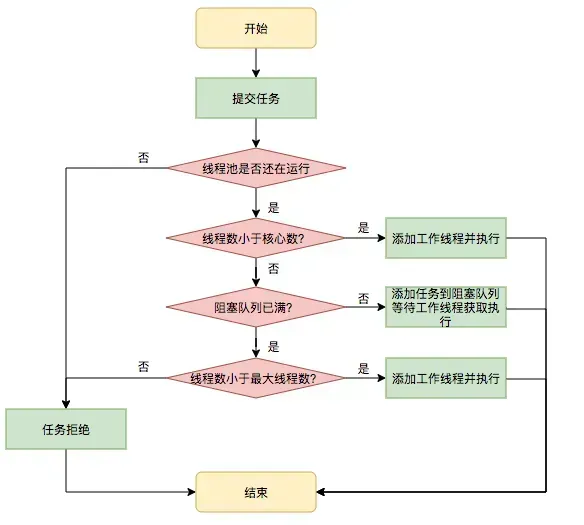

## String

------

**String、StringBuilder、StringBuffer的区别，为什么这样设计**

`String`、`StringBuilder`和`StringBuffer`在 Java 中都是用于处理字符串的，它们之间的区别是，String 是不可变的，平常开发用得最多，当遇到大量字符串连接时，就用 StringBuilder，它不会生成很多新的对象，StringBuffer 和 StringBuilder 类似，但每个方法上都加了 synchronized 关键字，所以是线程安全的。

为什么这么设计？

- **String**：适用于字符串内容不会改变的场景，比如说作为 HashMap 的 key。
- **StringBuilder**：适用于单线程环境下需要频繁修改字符串内容的场景，比如在循环中拼接或修改字符串，是 String 的完美替代品。
- **StringBuffer**：现在已经不怎么用了，因为一般不会在多线程场景下去频繁的修改字符串内容。

------

**String不可变吗？为什么不可变？有什么好处？怎么保证不可变。**

String 是不可变的，这意味着一旦一个 String 对象被创建，其存储的文本内容就不能被改变。这是因为：

1、**不可变性使得 String 对象在使用中更加安全**。因为字符串经常用作参数传递给其他 Java 方法，例如网络连接、打开文件等。

如果 String 是可变的，这些方法调用的参数值就可能在不知不觉中被改变，从而导致网络连接被篡改、文件被莫名其妙地修改等问题。

2、不可变的对象因为状态不会改变，所以更容易进行**缓存和重用**。字符串常量池的出现正是基于这个原因。

当代码中出现相同的字符串字面量时，JVM 会确保所有的引用都指向常量池中的同一个对象，从而节约内存。

3、因为 String 的内容不会改变，所以它的**哈希值也就固定不变**。这使得 String 对象特别适合作为 HashMap 或 HashSet 等集合的键，因为计算哈希值只需要进行一次，提高了哈希表操作的效率。

------

**如何保证 String 不可变？**

第一，String 类内部使用一个私有的字符数组来存储字符串数据。这个字符数组在创建字符串时被初始化，之后不允许被改变。

```java
private final char value[];
```

第二，String 类没有提供任何可以修改其内容的公共方法，像 concat 这些看似修改字符串的操作，实际上都是返回一个新创建的字符串对象，而原始字符串对象保持不变。

```java
public String concat(String str) {
    if (str.isEmpty()) {
        return this;
    }
    int len = value.length;
    int otherLen = str.length();
    char buf[] = Arrays.copyOf(value, len + otherLen);
    str.getChars(buf, len);
    return new String(buf, true);
}
```

第三，String 类本身被声明为 final，这意味着它不能被继承。这防止了子类可能通过添加修改方法来改变字符串内容的可能性。

```java
public final class String
```

------

## 抽象类和接口

**抽象类**

- 定义：在Java中被abstract关键字修饰的类称为抽象类，被abstract关键字修饰的方法称为抽象方法，**抽象方法只有方法的声明，没有方法体**。
- 抽象类的特点
  - 抽象类**不能被实例化只能被继承**；
  - 包含抽象方法的一定是抽象类，但是抽象类不一定含有抽象方法；
  - 抽象类中的抽象方法的修饰符只能为public或者protected，默认为public；
  - 一个子类继承一个抽象类，则子类必须实现父类抽象方法，否则子类也必须定义为抽象类；
  - 抽象类可以包含属性、方法、构造方法，但是**构造方法不能用于实例化**，主要用途是被子类调用。

**接口**

- 定义：Java中接口使用interface关键字修饰
- 接口的特点：
  - 接口可以包含**变量、方法**；变量被隐式地指定为public static final，方法被隐式地指定为public abstract（JDK1.8之前）；
  - 接口支持多继承，即一个接口可以extends多个接口，间接的解决了Java中类的单继承问题；
  - 一个类可以实现多个接口；
  - JDK1.8中对接口增加了新的特性：
    - （1）默认方法（default method）：JDK 1.8允许给接口添加非抽象的方法实现，但必须使用default关键字修饰；定义了default的方法可以不被实现子类所实现，但只能被实现子类的对象调用；如果子类实现了多个接口，并且这些接口包含一样的默认方法，则子类必须重写默认方法；
    - （2）静态方法（static method）：JDK 1.8中允许使用static关键字修饰一个方法，并提供实现，称为接口静态方法。接口静态方法只能通过接口调用（接口名.静态方法名）。

```java
public interface Person{
    public static final int a=10;
    
    //JDK1.8
    default void sayHello(){
        System.out.println("Hello World");
    }
    public void say();
}

public abstract class Person{
    public abstract void say();
    public void eat(){};
}
```

**二者相同点**

- 都不能被实例化
- 接口的实现类或抽象类的子类都只有实现了接口或抽象类中的方法后才能实例化。

**二者不同点**

- 接口只有定义，不能有方法的实现，java 1.8中可以定义default方法体，而抽象类可以有定义与实现，方法可在抽象类中实现。
- 实现接口的关键字为implements，继承抽象类的关键字为extends。一个类可以实现多个接口，但一个类只能继承一个抽象类。所以，使用接口可以间接地实现多重继承。
- 接口强调特定功能的实现，而抽象类强调所属关系。
- 接口成员变量默认为public static final，必须赋初值，不能被修改；其所有的成员方法都是public、abstract的。抽象类中成员变量默认default，可在子类中被重新定义，也可被重新赋值；抽象方法被abstract修饰，不能被private、static、synchronized和native等修饰，必须以分号结尾，不带花括号。

------

## 线程池

### 为什么要用线程池

------

线程池是为了减少频繁的创建线程和销毁线程带来的性能损耗。

### 线程池的工作策略？

------

线程池分为核心线程池，线程池的最大容量，还有等待任务的队列，提交一个任务，如果核心线程没有满，就创建一个线程，如果满了，就是会加入等待队列，如果等待队列满了，就会增加线程，如果达到最大线程数量，如果都达到最大线程数量，就会按照一些丢弃的策略进行处理。



### 线程池参数？

------

```java
public ThreadPoolExecutor(int corePoolSize,
                          int maximumPoolSize,
                          long keepAliveTime,
                          TimeUnit unit,
                          BlockingQueue<Runnable> workQueue,
                          ThreadFactory threadFactory,
                          RejectedExecutionHandler handler) {}
```

1. **corePoolSize**：线程池核心线程数量。默认情况下，线程池中线程的数量如果 <= corePoolSize，那么即使这些线程处于空闲状态，那也不会被销毁。
2. **maximumPoolSize**：线程池中最多可容纳的线程数量。当一个新任务交给线程池，如果此时线程池中有空闲的线程，就会直接执行，如果没有空闲的线程且当前线程池的线程数量小于corePoolSize，就会创建新的线程来执行任务，否则就会将该任务加入到阻塞队列中，如果阻塞队列满了，就会创建一个新线程，从阻塞队列头部取出一个任务来执行，并将新任务加入到阻塞队列末尾。如果当前线程池中线程的数量等于maximumPoolSize，就不会创建新线程，就会去执行拒绝策略。
3. **keepAliveTime**：当线程池中线程的数量大于corePoolSize，并且某个线程的空闲时间超过了keepAliveTime，那么这个线程就会被销毁。
4. **unit**：就是keepAliveTime时间的单位。
5. **workQueue**：工作队列。当没有空闲的线程执行新任务时，该任务就会被放入工作队列中，等待执行。
6. **threadFactory**：线程工厂。可以用来给线程取名字等等
7. **handler**：拒绝策略。当一个新任务交给线程池，如果此时线程池中有空闲的线程，就会直接执行，如果没有空闲的线程，就会将该任务加入到阻塞队列中，如果阻塞队列满了，就会创建一个新线程，从阻塞队列头部取出一个任务来执行，并将新任务加入到阻塞队列末尾。如果当前线程池中线程的数量等于maximumPoolSize，就不会创建新线程，就会去执行拒绝策略。

### 有哪些线程池？

------

1. **ScheduledThreadPool**：可以设置定期的执行任务，它支持定时或周期性执行任务，比如每隔 10 秒钟执行一次任务，我通过这个实现类设置定期执行任务的策略。
2. **FixedThreadPool**：它的核心线程数和最大线程数是一样的，所以可以把它看作是**固定线程数的线程池**，它的特点是线程池中的线程数除了初始阶段需要从 0 开始增加外，之后的线程数量就是固定的，就算任务数超过线程数，线程池也不会再创建更多的线程来处理任务，而是会把超出线程处理能力的任务放到任务队列中进行等待。而且就算任务队列满了，到了本该继续增加线程数的时候，由于它的最大线程数和核心线程数是一样的，所以也无法再增加新的线程了。
3. **CachedThreadPool**：可以称作可**缓存线程池**，它的特点在于线程数是几乎可以无限增加的（实际最大可以达到 Integer.MAX_VALUE，为 2^31-1，这个数非常大，所以基本不可能达到），而当线程闲置时还可以对线程进行回收。也就是说该线程池的线程数量不是固定不变的，当然它也有一个用于存储提交任务的队列，但这个队列是 SynchronousQueue，队列的容量为0，实际不存储任何任务，它只负责对任务进行中转和传递，所以效率比较高。
4. **SingleThreadExecutor**：它会使用**唯一的线程去执行任务**，原理和 FixedThreadPool 是一样的，只不过这里线程只有一个，如果线程在执行任务的过程中发生异常，线程池也会重新创建一个线程来执行后续的任务。这种线程池由于只有一个线程，所以非常适合用于所有任务都需要按被提交的顺序依次执行的场景，而前几种线程池不一定能够保障任务的执行顺序等于被提交的顺序，因为它们是多线程并行执行的。
5. **SingleThreadScheduledExecutor**：它实际和 ScheduledThreadPool 线程池非常相似，它只是 ScheduledThreadPool 的一个特例，内部只有一个线程。
