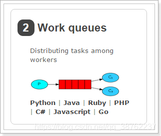

# Spring面试八股文

## 注解

------

**@Autowired和@Resource**

介绍：@Resource和@Autowired都是**做bean的注入时使用**，其实@Resource并不是Spring的注解，它的包是javax.annotation.Resource，需要导入，但是Spring支持该注解的注入。

相同点

- 两者**都可以写在字段和setter方法上**。两者如果都写在字段上，那么就不需要再写setter方法。

不同点

- **@Autowired**

  - @Autowired为Spring提供的注解，需要导入包`org.springframework.beans.factory.annotation.Autowired`;只按照byType注入。

  - @Autowired注解是按照**类型（byType）装配依赖对象**，默认情况下它要求依赖对象必须存在，如果允许null值，可以设置它的required属性为false。

  - ```java
    public class TestServiceImpl {
        // 下面两种@Autowired只要使用一种即可
        @Autowired
        private UserDao userDao; // 用于字段上
        
        @Autowired
        public void setUserDao(UserDao userDao) { // 用于属性的方法上
            this.userDao = userDao;
        }
    }
    ```

  - 如果我们想使用按照名称（byName）来装配，可以结合**@Qualifier注解**一起使用。(通过类型匹配找到多个candidate,在没有@Qualifier、@Primary注解的情况下，会使用对象名作为最后的fallback匹配)如下：

  - ```java
        @Autowired
        @Qualifier("userDao")
        private UserDao userDao; 
    ```

- @Resource

  - @Resource默认按照ByName自动注入，由J2EE提供，需要导入包`javax.annotation.Resource`。

  - @Resource有两个重要的属性：**name和type**，而Spring将@Resource注解的name属性解析为bean的名字，而type属性则解析为bean的类型。所以，如果使用name属性，则使用byName的自动注入策略，而使用type属性时则使用byType自动注入策略。如果既不制定name也不制定type属性，这时将通过反射机制使用byName自动注入策略。

  - ```java
    public class TestServiceImpl {
        // 下面两种@Resource只要使用一种即可
        @Resource(name="userDao")
        private UserDao userDao; // 用于字段上
        
        @Resource(name="userDao")
        public void setUserDao(UserDao userDao) { // 用于属性的setter方法上
            this.userDao = userDao;
        }
    }
    ```

  - 注：最好是将@Resource放在setter方法上，因为这样更符合面向对象的思想，通过set、get去操作属性，而不是直接去操作属性。

  - @Resource装配顺序：

  - ①、如果同时指定了name和type，则从Spring上下文中找到唯一匹配的bean进行装配，找不到则抛出异常。

  - ②、如果指定了name，则从上下文中查找名称（id）匹配的bean进行装配，找不到则抛出异常。

  - ③、如果指定了type，则从上下文中找到类似匹配的唯一bean进行装配，找不到或是找到多个，都会抛出异常。

  - ④、如果既没有指定name，又没有指定type，则自动按照byName方式进行装配；如果没有匹配，则回退为一个原始类型进行匹配，如果匹配则自动装配。

  - @Resource的作用相当于@Autowired，只不过@Autowired按照byType自动注入。

------

# 微服务面试八股文

------

## RabbitMQ消息队列

消息队列的作用：解耦、异步、削峰

### 基本概念

------

**Message**：由消息头和消息体组成。消息体是不透明的，而消息头则由一系列的可选属性组成，这些属性包括routing-key、priority、delivery-mode（是否持久性存储）等。

**Publisher**：消息的生产者。 

**Exchange**：接收消息并将消息路由到一个或多个Queue。default exchange 是默认的直连交换机，名字为空字符串，每个新建队列都会自动绑定到默认交换机上，绑定的路由键名称与队列名称相同。 

**Binding**：通过Binding将Exchange和Queue关联，这样Exchange就知道将消息路由到哪个Queue中。 

**Queue**：存储消息，队列的特性是先进先出。一个消息可分发到一个或多个队列。

**Virtual host**：每个 vhost 本质上就是一个 mini 版的 RabbitMQ 服务器，拥有自己的队列、交换器、绑 定和权限机制。vhost 是 AMQP 概念的基础，必须在连接时指定，RabbitMQ 默认的 vhost 是 / 。当多 个不同的用户使用同一个RabbitMQ server提供的服务时，可以划分出多个vhost，每个用户在自己的 vhost创建exchange和queue。

**Broker**：消息队列服务器实体。

### 为什么要使用消息队列

------

主要三点原因：**解耦、异步、削峰**。
1、解耦。比如，用户下单后，订单系统需要通知库存系统，假如库存系统无法访问，则订单减库存将失败，从而导致订单操作失败。订单系统与库存系统耦合，这个时候如果使用消息队列，可以返回给用户成功，先把消息持久化，等库存系统恢复后，就可以正常消费减去库存了。

2、异步。将消息写入消息队列，非必要的业务逻辑以异步的方式运行，不影响主流程业务。 

3、削峰。消费端慢慢的按照数据库能处理的并发量，从消息队列中慢慢拉取消息。在生产中，这个短暂的高峰期积压是允许的。比如秒杀活动，一般会因为流量过大，从而导致流量暴增，应用挂掉。这个时候加上消息队列，服务器接收到用户的请求后，首先写入消息队列，如果消息队列长度超过最大数量， 则直接抛弃用户请求或跳转到错误页面。

### 使用了消息队列会有什么缺点

------

**系统可用性降低**。引入消息队列之后，如果消息队列挂了，可能会影响到业务系统的可用性。 

**系统复杂性增加**。加入了消息队列，要多考虑很多方面的问题，比如：一致性问题、如何保证消息 不被重复消费、如何保证消息可靠性传输等。

### Exchange类型

------

Exchange分发消息时根据类型的不同分发策略不同，目前共四种类型：**direct、fanout、topic、 headers** 。headers 模式根据消息的headers进行路由，此外 headers 交换器和 direct 交换器完全一致，但性能差很多。

Exchange规则。

| 类型名称 | 类型描述                                                     |
| -------- | ------------------------------------------------------------ |
| fanout   | 把所有发送到该Exchange的消息路由到所有与它绑定的Queue中      |
| direct   | Routing Key==Binding Key                                     |
| topic    | 模糊匹配                                                     |
| headers  | Exchange不依赖于routing key与binding key的匹配规则来路由消息，而是根据发送<br/>的消息内容中的header属性进行匹配。 |

### RabbitMQ的消息模型

------

RabbitMQ的消息确认机制：当消费者获取消息后，会向RabbitMQ发送**回执ACK**，告知消息已经被接收。不过这种回执ACK分两种情况：

- 自动ACK：消息一旦被接收，消费者自动发送ACK；
- 手动ACK：消息接收后，不会发送ACK，需要手动调用

RabbitMQ的几个概念：

- **`publisher`**：生产者，也就是发送消息的一方
- **`consumer`**：消费者，也就是消费消息的一方
- **`queue`**：队列，存储消息。生产者投递的消息会暂存在消息队列中，等待消费者处理
- **`exchange`**：交换机，负责消息路由。生产者发送的消息由交换机决定投递到哪个队列。
- **`virtual host`**：虚拟主机，起到数据隔离的作用。每个虚拟主机相互独立，有各自的exchange、queue

**1、基本消息模型**


- P：生产者，也就是要发送消息的程序
- C：消费者：消息的接受者，会一直等待消息到来。
- queue：消息队列，图中红色部分。类似一个邮箱，可以缓存消息；生产者向其中投递消息，消费者从其中取出消息。

**2、work消息模型**

当消息处理比较耗时的时候，可能生产消息的速度会远远大于消息的消费速度。长此以往，消息就会堆积越来越多，无法及时处理。

此时就可以使用work 模型：让多个消费者绑定到一个队列，共同消费队列中的消息。队列中的消息一旦消费，就会消失，因此任务是不会被重复执行的。



角色：

- P：生产者：任务的发布者
- C1：消费者，领取任务并且完成任务，假设完成速度较慢
- C2：消费者2：领取任务并完成任务，假设完成速度快

能者多劳

- 消费者1比消费者2的效率要低，一次任务的耗时较长
- 然而两人最终消费的消息数量是一样的；消费者2大量时间处于空闲状态，消费者1一直忙碌

**3、订阅模型-Fanout**


1） 可以有多个消费者

2） 每个消费者有自己的queue（队列）

3） 每个队列都要绑定到Exchange（交换机）

4） 生产者发送的消息，只能发送到交换机，交换机来决定要发给哪个队列，生产者无法决定。

5） 交换机把消息发送给绑定过的所有队列

6） 队列的消费者都能拿到消息。**实现一条消息被多个消费者消费**

要注意代码中：**队列需要和交换机绑定**

**4、订阅模型-Direct**

在Fanout模式中，一条消息，会被所有订阅的队列都消费。但是，在某些场景下，我们希望**不同的消息被不同的队列消费**。这时就要用到Direct类型的Exchange。

在Direct模型下：

- 队列与交换机的绑定，不能是任意绑定了，而是要指定一个RoutingKey（路由key）
- 消息的发送方在 向 Exchange发送消息时，也必须指定消息的 RoutingKey。
- Exchange不再把消息交给每一个绑定的队列，而是根据消息的Routing Key进行判断，只有队列的Routingkey与消息的 Routing key完全一致，才会接收到消息


图解：

- P：生产者，向Exchange发送消息，发送消息时，会指定一个routing key。
- X：Exchange（交换机），接收生产者的消息，然后把消息递交给 与routing key完全匹配的队列
- C1：消费者，其所在队列指定了需要routing key 为 error 的消息
- C2：消费者，其所在队列指定了需要routing key 为 info、error、warning 的消息

**5、订阅模型-Topic**

Topic类型的Exchange与Direct相比，都是可以根据RoutingKey把消息路由到不同的队列。只不过Topic类型Exchange可以让队列在绑定Routing key 的时候使用通配符！

Routingkey 一般都是有一个或多个单词组成，多个单词之间以”.”分割，例如： item.insert

通配符规则：

- ：匹配一个或多个词

- *：匹配不多不少恰好1个词

举例： + audit.#：能够匹配audit.irs.corporate 或者 audit.irs + audit.*：只能匹配audit.irs


解释：

- 红色Queue：绑定的是usa.# ，因此凡是以 usa.开头的routing key 都会被匹配到
- 黄色Queue：绑定的是#.news ，因此凡是以 .news结尾的 routing key 都会被匹配

### 消息丢失

------

消息丢失场景：

- 生产者生产消息到RabbitMQ Server消息丢失
- RabbitMQ Server存储的消息丢失
- RabbitMQ Server到消费者消息丢失。

消息丢失从三个方面来解决：

- 生产者确认机制
- 消费者手动确认消息
- 持久化。

1 **生产者确认机制**

生产者发送消息到队列，无法确保发送的消息成功的到达server。 解决方法：
1. 事务机制。在一条消息发送之后会使发送端阻塞，等待RabbitMQ的回应，之后才能继续发送下一条消息。性能差。
2. 开启生产者确认机制，只要消息成功发送到交换机之后，RabbitMQ就会发送一个ack给生产者（即 使消息没有Queue接收，也会发送ack）。如果消息没有成功发送到交换机，就会发送一条nack消 息，提示发送失败。

在 Springboot 是通过 `publisher-confirms` 参数来设置 confirm 模式：

```yml
spring:
	rabbitmq:
		#开启 confirm 确认机制 
		publisher-confirms: true
```

在生产端提供一个回调方法，当服务端确认了一条或者多条消息后，生产者会回调这个方法，根据具体的结果对消息进行后续处理，比如重新发送、记录日志等。

```java
// 消息是否成功发送到Exchange 
final RabbitTemplate.ConfirmCallback confirmCallback = (
    CorrelationData correlationData, boolean ack, String cause
) -> {
    log.info("correlationData: " + correlationData); log.info("ack: " + ack);
    if(!ack) {
        log.info("异常处理....");
        rabbitTemplate.setConfirmCallback(confirmCallback);
    }
}
rabbitTemplate.setConfirmCallback(confirmCallback);
```

**2 路由不可达消息**

生产者确认机制只确保消息正确到达交换机，对于从交换机路由到Queue失败的消息，会被丢弃掉，导 致消息丢失。对于不可路由的消息，有两种处理方式：**Return消息机制和备份交换机**。

**2.1 Return消息机制**

Return消息机制提供了回调函数 `ReturnCallback`，当消息从交换机路由到Queue失败才会回调这个方法。需要将 mandatory 设置为 true ，才能监听到路由不可达的消息。

```yml
spring:
	rabbitmq:
		#触发ReturnCallback必须设置mandatory=true, 否则Exchange没有找到Queue就会丢弃掉消息, 而不会触发ReturnCallback
		template.mandatory: true
```

通过 ReturnCallback 监听路由不可达消息。

```java
final RabbitTemplate.ReturnCallback returnCallback = (Message message, int replyCode, String replyText, String exchange, String routingKey) ->
    log.info("return exchange: " + exchange + ", routingKey: "
             + routingKey + ", replyCode: " + replyCode + ", replyText: "
             + replyText); 
rabbitTemplate.setReturnCallback(returnCallback);
```

当消息从交换机路由到Queue失败时，会返回 return exchange: , routingKey: MAIL, replyCode: 312, replyText: NO_ROUTE 。

**2.2 备份交换机**

备份交换机`alternate-exchange` 是一个普通的exchange，当你发送消息到对应的exchange时，没有匹 配到queue，就会自动转移到备份交换机对应的queue，这样消息就不会丢失。

**3 消费者手动消息确认**

有可能消费者收到消息还没来得及处理MQ服务就宕机了，导致消息丢失。因为消息者默认采用自动 ack，一旦消费者收到消息后会通知MQ Server这条消息已经处理好了，MQ 就会移除这条消息。 

解决方法：消费者设置为手动确认消息。消费者处理完逻辑之后再给broker回复ack，表示消息已经成功消费，可以从broker中删除。当消息者消费失败的时候，给broker回复nack，根据配置决定重新入队还是从broker移除，或者进入死信队列。只要没收到消费者的 acknowledgment，broker 就会一直保存着这条消息，但不会 requeue，也不会分配给其他消费者。

消费者设置手动ack：

```yml
#设置消费端手动 ack 
spring.rabbitmq.listener.simple.acknowledge-mode=manual
```

消息处理完，手动确认：

```java
@RabbitListener(queues = RabbitMqConfig.MAIL_QUEUE) 
public void onMessage(Message message, Channel channel) throws IOException {
    try{ 
        Thread.sleep(5000);
    } catch (InterruptedException e) {
        e.printStackTrace();
    }
    long deliveryTag = message.getMessageProperties().getDeliveryTag(); 
    //手工ack；第二个参数是multiple，设置为true，表示deliveryTag序列号之前（包括自身） 的消息都已经收到，设为false则表示收到一条消息
    channel.basicAck(deliveryTag, true); 
    System.out.println("mail listener receive: " + new String(message.getBody()));
}
```

当消息消费失败时，消费端给broker回复nack，如果consumer设置了requeue为false，则nack后 broker会删除消息或者进入死信队列，否则消息会重新入队。

**4 持久化**

如果RabbitMQ服务异常导致重启，将会导致消息丢失。RabbitMQ提供了持久化的机制，将内存中的消息持久化到硬盘上，即使重启RabbitMQ，消息也不会丢失。

消息持久化需要满足以下条件： 

1. 消息设置持久化。发布消息前，设置投递模式`delivery mode`为2，表示消息需要持久化。 
2. Queue设置持久化。

3. 交换机设置持久化。

当发布一条消息到交换机上时，Rabbit会先把消息写入持久化日志，然后才向生产者发送响应。一旦从队列中消费了一条消息的话并且做了确认，RabbitMQ会在持久化日志中移除这条消息。在消费消息前，如果RabbitMQ重启的话，服务器会自动重建交换机和队列，加载持久化日志中的消息到相应的队列或者交换机上，保证消息不会丢失。

**5 镜像队列**

当MQ发生故障时，会导致服务不可用。引入RabbitMQ的镜像队列机制，将queue镜像到集群中其他的节点之上。如果集群中的一个节点失效了，能自动地切换到镜像中的另一个节点以保证服务的可用性。 

通常每一个镜像队列都包含一个master和多个slave，分别对应于不同的节点。发送到镜像队列的所有消息总是被直接发送到master和所有的slave之上。除了publish外所有动作都只会向master发送，然后 由master将命令执行的结果广播给slave，从镜像队列中的消费操作实际上是在master上执行的。

### 重复消费

------

消息重复的原因有两个：**1.生产时消息重复，2.消费时消息重复**。 

生产者发送消息给MQ，在MQ确认的时候出现了网络波动，生产者没有收到确认，这时候生产者就会重新发送这条消息，导致MQ会接收到重复消息。

消费者消费成功后，给MQ确认的时候出现了网络波动，MQ没有接收到确认，为了保证消息不丢失， MQ就会继续给消费者投递之前的消息。这时候消费者就接收到了两条一样的消息。由于重复消息是由 于网络原因造成的，无法避免。

解决方法：发送消息时**让每个消息携带一个全局的唯一ID**，在消费消息时先判断消息是否已经被消费过，保证消息消费逻辑的幂等性。具体消费过程为：

1. 消费者获取到消息后先根据id去查询redis/db是否存在该消息 
2. 如果不存在，则正常消费，消费完毕后写入redis/db
3. 如果存在，则证明消息被消费过，直接丢弃

### RabbitMQ如何保证消息的顺序性？

------

单线程消费保证消息的顺序性；

对消息进行编号，消费者根据编号处理消息。

### 消费端限流

------

当 RabbitMQ 服务器积压大量消息时，队列里的消息会大量涌入消费端，可能导致消费端服务器奔溃。 这种情况下需要对消费端限流。

Spring RabbitMQ 提供参数 `prefetch` 可以设置单个请求处理的消息个数。如果消费者同时处理的消息 到达最大值的时候，则该消费者会阻塞，不会消费新的消息，直到有消息 ack 才会消费新的消息。

开启消费端限流：

```yml
#在单个请求中处理的消息个数，unack的最大数量 
spring.rabbitmq.listener.simple.prefetch=2
```

原生 RabbitMQ 还提供 prefetchSize 和 global 两个参数。Spring RabbitMQ没有这两个参数。

```java
//单条消息大小限制，0代表不限制 
//global：限制限流功能是channel级别的还是consumer级别。当设置为false，consumer级别，限流功能生效，设置为true没有了限流功能，因为channel级别尚未实现。
void basicQos(int prefetchSize, int prefetchCount, boolean global) throws IOException;
```

### 死信队列

------

消费失败的消息存放的队列。 

消息消费失败的原因：

- 消息被拒绝并且消息没有重新入队（requeue=false） 
- 消息超时未消费
- 达到最大队列长度

设置死信队列的 exchange 和 queue，然后进行绑定：

```java
	@Bean
	public DirectExchange dlxExchange() {
    	return new DirectExchange(RabbitMqConfig.DLX_EXCHANGE);
    }
    @Bean 
	public Queue dlxQueue() {
        return new Queue(RabbitMqConfig.DLX_QUEUE, true);
    }
    @Bean 
	public Binding bindingDeadExchange(Queue dlxQueue, DirectExchange deadExchange) {
        return BindingBuilder.bind(dlxQueue).to(deadExchange).with(RabbitMqConfig.DLX_QUEUE);
    }
```

在普通队列加上两个参数，绑定普通队列到死信队列。当消息消费失败时，消息会被路由到死信队列。

```java
@Bean 
public Queue sendSmsQueue() {
    Map<String,Object> arguments = new HashMap<>(2); // 绑定该队列到私信交换机
    arguments.put("x-dead-letter-exchange", RabbitMqConfig.DLX_EXCHANGE); 
	arguments.put("x-dead-letter-routing-key", RabbitMqConfig.DLX_QUEUE); 
    return new Queue(RabbitMqConfig.MAIL_QUEUE, true, false, false,arguments);
}
```

