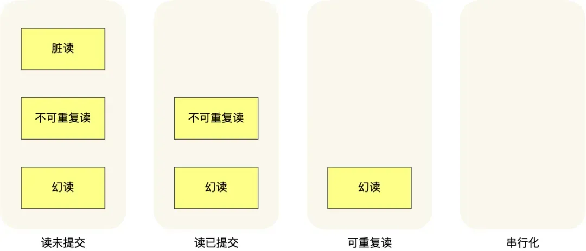

# MySQL

### MySQL 事务

------

`MySQL`的事务（Transaction）是数据库管理系统执行过程中的一个**逻辑单位**，它由一个或多个`SQL`语句组成，这些语句要么全部执行，要么全部不执行。事务的主要目的是确保数据的完整性和一致性，在并发操作中保持数据的正确状态。

事务具有以下四个关键特性，通常被称为`ACID特性`：

1. **原子性（Atomicity）**：事务被视为一个不可分割的工作单位，事务中包括的诸操作要么都做，要么都不做。
2. **一致性（Consistency）**：事务必须使数据库从一个一致性状态变换到另一个一致性状态。这意味着一个事务在执行前后，数据库都必须处于一致性状态。
3. **隔离性（Isolation）**：在事务执行过程中，其他事务不能访问该事务的数据，直到该事务完成。这确保了并发执行的事务不会相互干扰。数据库系统通过**事务隔离级别**（如读未提交、读已提交、可重复读、串行化）来实现事务的隔离性。
4. **持久性（Durability）**：一旦事务提交，则其结果就是永久性的，即使系统崩溃也不会丢失。

在`MySQL`中，特别是`InnoDB`存储引擎，事务得到了全面的支持。当你在`InnoDB`中执行一个事务时，可以包含多个`SQL`语句，这些语句要么全部成功，要么在发生错误时全部回滚（撤销）。这通过维护一个**撤销日志**（`undo log`）来实现，当事务需要回滚时，可以利用这个日志将数据恢复到事务开始之前的状态。

此外，`MySQL`还提供了事务控制语句，如`COMMIT`和`ROLLBACK`，来显式地提交或回滚事务。`COMMIT`用于提交事务，即将事务中的修改永久保存到数据库中；而`ROLLBACK`则用于撤销事务中的修改，将数据库恢复到事务开始之前的状态。

### MySQL数据隔离级别

------

1. **读未提交**，指一个事务还没提交时，它做的变更就能被其他事务看到；可能会导致脏读、幻读或不可重复读。
2. **读提交**，指一个事务提交之后，它做的变更才能被其他事务看到；可以阻止脏读，但是幻读或不可重复读仍有可能发生。
3. **可重复读**，指一个事务执行过程中看到的数据，一直跟这个事务启动时看到的数据是一致的，**MySQL InnoDB 引擎的默认隔离级别**；可以阻止脏读和不可重复读，但幻读仍有可能发生。
4. **串行化**；会对记录加上读写锁，在多个事务对这条记录进行读写操作时，如果发生了读写冲突的时候，后访问的事务必须等前一个事务执行完成，才能继续执行；该级别可以防止脏读、不可重复读以及幻读。

针对不同的隔离级别，并发事务时可能发生的现象也会不同。

### MySQL索引结构

------

**一、`MySQL`索引原理**

`MySQL`索引采用了`B+树`的数据结构，能够大大提高查询效率。它类似于书籍的目录，通过索引，数据库系统可以迅速定位到表中的特定数据，无需扫描整个表。

**二、`MySQL`索引的优点**

1. **提高查询速度**：通过索引，数据库可以迅速找到所需数据，避免了全表扫描的耗时操作。
2. **保证数据的唯一性**：通过唯一索引，可以确保数据库表中每一行数据的某列或多列组合是唯一的。
3. **加速表与表之间的连接**：在执行连接操作时，如果连接的字段已经被索引，那么连接的速度会更快。

**三、`MySQL`索引的缺点**

1. **占用磁盘空间**：索引本身需要占用一定的磁盘空间。
2. **降低写操作的性能**：每次对表中的数据进行增、删、改操作时，索引也需要进行相应的调整，这可能会降低写操作的性能。

**四、`MySQL`索引的使用场景**

1. **经常需要搜索的列**：对于经常出现在WHERE子句中的列，应该考虑建立索引。
2. **作为连接键的列**：如果某列经常出现在连接（JOIN）操作中，也应该考虑建立索引。
3. **经常需要排序的列**：如果某列经常需要按照其值进行排序，也可以考虑建立索引。

**五、注意事项**

1. **避免过度索引**：不是每个列都需要建立索引，过多的索引会占用更多的磁盘空间，并可能降低写操作的性能。因此，需要根据实际情况进行选择。
2. **定期维护索引**：随着时间的推移，数据库中的数据会发生变化，索引的性能也可能会受到影响。因此，需要定期检查和优化索引。

总的来说，`MySQL`索引是提高数据库查询性能的重要工具，但也需要根据实际情况进行合理使用和维护。

### 为什么索引用B+树？

------

`MySQL`索引选择使用B+树而不是红黑树或`AVL`树，主要是基于B+树在数据库环境中的特定优势和特性。

1. **多路搜索特性**：B+树是一个多路平衡搜索树，这意味着每个节点可以有多于两个的子节点。这种特性使得B+树相对于二叉树（如红黑树和`AVL`树）在树的高度上具有优势。在数据库中，树的高度直接关系到查询性能，因为每次查询都需要从根节点遍历到叶子节点。多路搜索特性有助于降低树的高度，从而减少I/O操作和查询时间。
2. **范围查询和排序性能**：B+树特别适用于范围查询和排序操作。由于其叶子节点之间通过指针相连，可以很方便地遍历叶子节点以获取范围内的数据。相比之下，红黑树和AVL树在进行范围查询时可能需要中序遍历，效率较低。此外，B+树在叶子节点中存储了所有的数据，使得排序操作更加高效。
3. **磁盘I/O优化**：在数据库中，数据通常存储在磁盘上，而磁盘I/O操作是数据库性能的关键瓶颈之一。B+树的非叶子节点只存储键值信息，而实际的数据存储在叶子节点中。这种设计使得非叶子节点可以容纳更多的键值信息，从而减少了树的高度和磁盘I/O次数。此外，由于B+树的叶子节点之间通过指针相连，数据库系统可以更加高效地读取和缓存数据。
4. **平衡性**：B+树在插入和删除节点时能够保持较好的平衡性，避免了树的高度过度增长。这种平衡性保证了查询性能的稳定性，不会因为数据的插入和删除操作而产生显著的波动。

红黑树和`AVL`树虽然也是平衡二叉树，但在数据库环境中可能并不适用。它们的树高度相对较高，导致查询性能下降；同时，它们在处理范围查询和排序操作时效率较低。此外，红黑树在插入和删除节点时需要调整树的结构以保持平衡，这也会增加额外的开销。

### 慢查询如何解决

------

1. 通过 **explain** 执行结果，查看 sql 是否走索引，如果不走索引，考虑增加索引。
2. 可以通过建立联合索引，实现覆盖索引优化，减少回表，使用联合索引符合最左匹配原则，不然会索引失效
3. 避免索引失效，比如不要用左模糊匹配、函数计算、表达式计算等等。
4. 联表查询最好要以小表驱动大表，并且被驱动表的字段要有索引，当然最好通过冗余字段的设计，避免联表查询。
5. 针对 limit n,y 深分页的查询优化，可以把Limit查询转换成某个位置的查询：select * from tb_sku where id>20000 limit 10，该方案适用于主键自增的表，
6. 将字段多的表分解成多个表，有些字段使用频率高，有些低，数据量大时，会由于使用频率低的存在而变慢，可以考虑分开

### 索引什么情况会生效？

------

- 区分度比较低的字段，建立了索引，可能不一定会用到索引。

- 当我们使用**左或者左右模糊匹配**的时候，也就是 like %xx 或者 like %xx% 这两种方式都会造成索引失效；
- 当我们在查询条件中对索引列使用函数，就会导致索引失效。
- 当我们在查询条件中对索引列进行表达式计算，也是无法走索引的。
- MySQL 在遇到字符串和数字比较的时候，会自动把字符串转为数字，然后再进行比较。如果字符串是索引列，而条件语句中的输入参数是数字的话，那么索引列会发生**隐式类型转换**，由于隐式类型转换是通过 CAST 函数实现的，等同于对索引列使用了函数，所以就会导致索引失效。
- 联合索引要能正确使用需要遵循**最左匹配原则**，也就是按照最左优先的方式进行索引的匹配，否则就会导致索引失效。

### MySQL语句的执行过程

------

`MySQL`语句的执行过程涉及多个关键阶段，以下是其大致的执行流程：

1. **客户端发送`SQL`语句**： 当用户在客户端（如`MySQL`命令行工具、图形化界面工具等）输入`SQL`语句并执行时，这条语句首先被发送到`MySQL`服务器。
2. **词法解析和语法解析**： `MySQL`服务器接收到`SQL`语句后，首先会进行词法解析，将`SQL`语句拆分成一个个的词汇单元（如关键字、表名、列名等）。接着进行语法解析，根据`MySQL`的语法规则判断这条`SQL`语句是否合法，并生成一个“解析树”。
3. **预处理**： 在语法解析之后，`MySQL`会进行预处理阶段。这个阶段会检查`SQL`语句中涉及的表、列等是否存在，并解析权限。如果涉及存储过程、函数或触发器，也会在这一阶段进行预处理。
4. **优化器优化**： `MySQL`查询优化器会对解析树进行优化，选择最高效的执行计划。它会考虑多种因素，如表的大小、索引、统计信息等，以决定如何最快地获取查询结果。
5. **生成执行计划**： 优化器根据优化结果生成一个详细的执行计划，这个计划描述了如何获取数据、如何连接表、如何排序等。
6. **执行引擎执行**： 执行引擎按照执行计划开始执行。它可能会与存储引擎交互，从磁盘上读取数据、写入数据或更新数据。如果涉及多个表，执行引擎还会负责表的连接操作。
7. **返回结果**： 执行引擎将查询结果返回给客户端。这个结果可能是查询到的数据行，也可能是受影响的行数（如INSERT、UPDATE、DELETE操作）。
8. **清理**： 查询执行完毕后，`MySQL`会进行清理工作，如释放内存、关闭临时表等。

在整个过程中，`MySQL`还会涉及一些日志的写入，如二进制日志（用于复制和恢复操作）、慢查询日志（记录执行时间较长的查询）等。此外，如果开启了事务，还会涉及事务的管理和锁定机制。

### MySQL 缓存

------

**`MySQL`有缓存机制**。`MySQL`数据库会缓存已经执行过的`SQL`语句和语句执行结果。如果下次提交同一个`SQL`语句，`MySQL`就会直接从缓存中读取执行结果，而不是重新分析、执行`SQL`，这样可以减少`SQL`语句的执行时间，提高查询效率。

但是，如果表中的数据发生变化，所有与之相关的缓存都会被释放刷新，以避免出现**数据脏读**问题。此外，`MySQL`也提供了手动选择是否使用缓存查询的功能，可以在`SQL`查询语句的字段前增加`SQL_NO_CACHE`或`SQL_CACHE`关键字来控制是否使用缓存。

总的来说，`MySQL`的缓存机制是其性能优化的一部分，有助于提高查询速度和效率。然而，需要注意的是，缓存并不总是有利的，特别是在数据频繁变化的情况下，因此需要根据实际情况合理使用和管理缓存。

### 怎么实现可重复读？MVCC怎么保证

------


### redo log和bin log区别

------


# Redis

------

### Redis 内存淘汰策略

------

在配置文件 redis.conf 中，可以通过参数 maxmemory来设定最大运行内存，只有在 Redis 的运行内存达到了我们设置的最大运行内存，才会触发内存淘汰策略。不同位数的操作系统，maxmemory 的默认值是不同的：

- 在 64 位操作系统中，maxmemory 的默认值是 0，表示没有内存大小限制，那么不管用户存放多少数据到 Redis 中，Redis 也不会对可用内存进行检查，直到 Redis 实例因内存不足而崩溃也无作为。
- 在 32 位操作系统中，maxmemory 的默认值是 3G，因为 32 位的机器最大只支持 4GB 的内存，而系统本身就需要一定的内存资源来支持运行，所以 32 位操作系统限制最大 3 GB 的可用内存是非常合理的，这样可以避免因为内存不足而导致 Redis 实例崩溃。

Redis 内存淘汰策略共有八种，这八种策略大体分为**「不进行数据淘汰」**和**「进行数据淘汰」**两类策略。

***1、不进行数据淘汰的策略***

- **noeviction**（Redis3.0之后，默认的内存淘汰策略） ：它表示当运行内存超过最大设置内存时，不淘汰任何数据，这时如果有新的数据写入，会报错通知禁止写入，不淘汰任何数据，但是如果没用数据写入的话，只是单纯的查询或者删除操作的话，还是可以正常工作。

***2、进行数据淘汰的策略***

针对「进行数据淘汰」这一类策略，又可以细分为「在设置了过期时间的数据中进行淘汰」和「在所有数据范围内进行淘汰」这两类策略。

在设置了过期时间的数据中进行淘汰：

- **volatile-random**：随机淘汰设置了过期时间的任意键值；
- **volatile-ttl**：优先淘汰更早过期的键值。
- **volatile-lru**（Redis3.0 之前，默认的内存淘汰策略）：淘汰所有设置了过期时间的键值中，最久未使用的键值；
- **volatile-lfu**（Redis4.0 后新增的内存淘汰策略）：淘汰所有设置了过期时间的键值中，最少使用的键值；

在所有数据范围内进行淘汰：

- **allkeys-random**：随机淘汰任意键值;
- **allkeys-lru**：淘汰整个键值中最久未使用的键值；
- **allkeys-lfu**（Redis4.0 后新增的内存淘汰策略）：淘汰整个键值中最少使用的键值。

### Redis 过期删除策略

------

**Redis 选择「惰性删除+定期删除」这两种策略配和使用**，以求在合理使用 CPU 时间和避免内存浪费之间取得平衡。

**1、惰性删除**

Redis 的惰性删除策略由 `db.c` 文件中的 `expireIfNeeded` 函数实现，代码如下：

```c
int expireIfNeeded(redisDb *db, robj *key) {
    // 判断 key 是否过期
    if (!keyIsExpired(db,key)) return 0;
    ....
    /* 删除过期键 */
    ....
    // 如果 server.lazyfree_lazy_expire 为 1 表示异步删除，反之同步删除；
    return server.lazyfree_lazy_expire ? dbAsyncDelete(db,key) :
                                         dbSyncDelete(db,key);
}
```

Redis 在访问或者修改 key 之前，都会调用 `expireIfNeeded` 函数对其进行检查，检查 key 是否过期：

- 如果过期，则删除该 key，至于选择异步删除，还是选择同步删除，根据 lazyfree_lazy_expire 参数配置决定（Redis 4.0版本开始提供参数），然后返回 null 客户端；
- 如果没有过期，不做任何处理，然后返回正常的键值对给客户端；

**2、定期删除**

定期删除策略的做法：**每隔一段时间「随机」从数据库中取出一定数量的 key 进行检查，并删除其中的过期key。**

***这个间隔检查的时间是多长呢？***在 Redis 中，默认每秒进行 10 次过期检查一次数据库，此配置可通过 Redis 的配置文件 redis.conf 进行配置，配置键为 hz 它的默认值是 hz 10。特别强调下，每次检查数据库并不是遍历过期字典中的所有 key，而是从数据库中随机抽取一定数量的 key 进行过期检查。

***随机抽查的数量是多少呢？***数值是 20

Redis 的定期删除的流程：

1. 从过期字典中随机抽取 20 个 key；
2. 检查这 20 个 key 是否过期，并删除已过期的 key；
3. 如果本轮检查的已过期 key 的数量，超过 5 个（20/4），也就是「已过期 key 的数量」占比「随机抽取 key 的数量」大于 25%，则继续重复步骤 1；如果已过期的 key 比例小于 25%，则停止继续删除过期 key，然后等待下一轮再检查。

可以看到，定期删除是一个循环的流程。那 Redis 为了保证定期删除不会出现循环过度，导致线程卡死现象，为此增加了定期删除循环流程的时间上限，默认不会超过 25ms。针对定期删除的流程

```C
// 伪代码
do {
    //已过期的数量
    expired = 0；
    //随机抽取的数量
    num = 20;
    while (num--) {
        //1. 从过期字典中随机抽取 1 个 key
        //2. 判断该 key 是否过期，如果已过期则进行删除，同时对 expired++
    }
    
    // 超过时间限制则退出
    if (timelimit_exit) return;

  /* 如果本轮检查的已过期 key 的数量，超过 25%，则继续随机抽查，否则退出本轮检查 */
} while (expired > 20/4);
```

### Redis 持久化机制

------

Redis是一个内存数据库，所以其运行效率非常高。但是也存在一个问题：内存中的数据是不持久的，若主机宕机或Redis关机重启，则内存中的数据全部丢失。当然，这是不允许的。**Redis具有持久化功能，其会按照设置以快照或操作日志的形式将数据持久化到磁盘中。**

**根据持久化使用技术的不同，Redis的持久化分为两种：RDB与AOF**

1、RDB持久化

- RDB（Redis DataBase）是指将内存中某一时刻的数据快照**全量**写入到指定的rdb文件的持久化技术。RDB持久化默认是开启的。当Redis启动的时候会自动读取RDB快照文件，将数据从硬盘载入到内存，以恢复Redis关机前的数据库状态。
- 持久化的执行
  - **(1) 手动save命令**：通过在redis-cli客户端中执行save命令可立即进行一次持久化保存。save命令在执行期间会阻塞redis-server进程，直至持久化过程完毕。而在redis-server进程阻塞期间，Redis不能处理任何读写请求，无法对外提供服务。
  - **(2) 手动bgsave命令**：bgsave：backgroud save，后台运行save，bgsave命令会使用服务器进行redis-server生成一个子进程，又该子进程完成保存过程。在子进程进行保存过程中，不会阻塞redis-server进程对客户端读写请求的处理。
  - **(3) 自动条件触发**：自动条件触发的本质仍是bgsave命令的执行。只不过是用户通过在配置文件中做相应的设置后，Redis会根据设置信息自动调用bgsave命令执行。
  - **(4) 查看持久化时间**：通过lastsave命令可以查看最近一次执行持久化的时间，其返回的是一个Unix时间戳

2、AOF持久化

- AOF（Append Only File）是指Redis将每一次的写操作都以日志的形式记录到一个AOF文件中的持久化技术。当需要恢复内存数据时，将这些写操作重新执行一次，便会恢复到之前的内存数据状态。

3、二者对比

RDB优势与不足：

- 优势：RBB文件较小，数据恢复较快；
- 不足：数据安全性较差，写时会降低性能，RDB文件可读性较差；

AOF优势与不足：

- 优势：数据安全性高，AOF文件可读性强；
- 不足：AOF文件较大，写操作会影响性能，数据恢复较大；

持久化技术选型

- [1] 官方推荐使用RDB与AOF混合式持久化
- [2] 若对数据安全性要求不高，则推荐使用纯RDB持久化方式
- [3] 不推荐使用纯AOF持久化方式(需要执行大量写操作，影响性能)
- [4] 若Redis仅用于缓存，则无须使用任何持久化技术

### Redis 事务

------

**Redis的事务的本质是一组命令的批处理。这组命令在执行过程中会被顺序地、一次性全部执行完毕，只要没有出现语法错误，这组命令在执行期间是不会被中断。**

Redis 事务特性

- Redis的事务仅保证了数据的一致性，不具有向DBMS一样的ACID特性
- 这组命令中的某些命令的执行失败不会影响其它命令的执行，不会引发回滚。既不具备原子性。
- 这组命令通过了**乐观锁机制**实现了简单的隔离性。没有复杂的隔离级别

Redis事务通过三个命令进行控制。

- multi：开启事务

- exec：执行事务

- discard：取消事务

> 乐观锁简单介绍：当对一个数据添加乐观锁的时候，会对当前数据添加一个版本号(1)，版本号是可读的，A用户对当前数据进行操作后，导致数据变化，此时版本号也会更迭(2)；B用户对当前数据进行操作时，会比较版本号，若版本号发生变化，终止当前数据操作。
