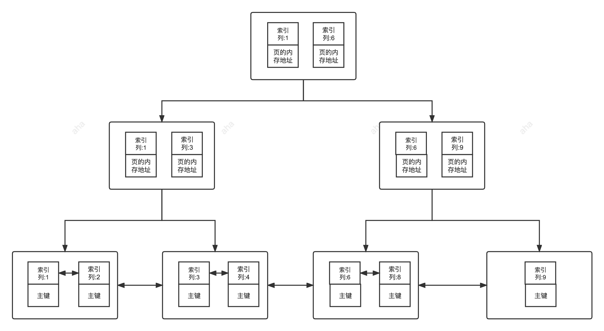
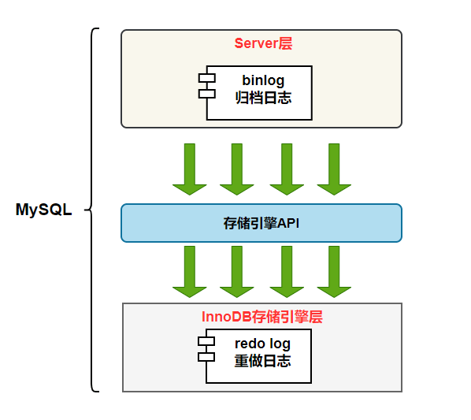
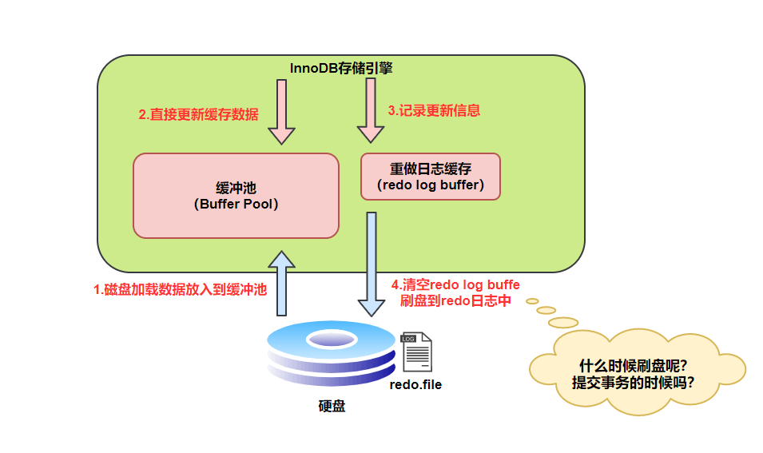

# MySQL基础

## Introduction

关系型数据库（RDB，Relational Database）就是一种建立在**关系模型**的基础上的数据库。

关系模型表明了数据库中所存储的数据之间的联系（**一对一、一对多、多对多**）。

**常见的关系型数据库**：MySQL、PostgreSQL、Oracle、SQL Server、SQLite

SQL 是一种**结构化查询语言**(Structured Query Language)，专门用来与数据库打交道，目的是提供一种从数据库中读写数据的简单有效的方法。

MySQL的优点：

- 成熟稳定，功能完善。
- 开源免费。
- 文档丰富，既有详细的官方文档，又有非常多优质文章可供参考学习。
- 开箱即用，操作简单，维护成本低。
- 兼容性好，支持常见的操作系统，支持多种开发语言。
- 社区活跃，生态完善。
- **事务支持优秀**， InnoDB 存储引擎默认使用 REPEATABLE-READ 并不会有任何性能损失，并且，InnoDB 实现的 REPEATABLE-READ 隔离级别其实是可以解决幻读问题发生的。
- **支持分库分表、读写分离、高可用**。

## 字段类型

MySQL 字段类型可以简单分为三大类：

- **数值类型**：整型（TINYINT、SMALLINT、MEDIUMINT、INT 和 BIGINT）、浮点型（FLOAT 和 DOUBLE）、定点型（DECIMAL）
- **字符串类型**：CHAR、VARCHAR、TINYTEXT、TEXT、MEDIUMTEXT、LONGTEXT、TINYBLOB、BLOB、MEDIUMBLOB 和 LONGBLOB 等，最常用的是 CHAR 和 VARCHAR。
- **日期时间类型**：YEAR、TIME、DATE、DATETIME 和 TIMESTAMP 等。

**UNSIGNED**

- 作用于整数类型，表示不允许负值的无符号整数，使用 UNSIGNED 属性可以将正整数的上限提高一倍，因为它不需要存储负数值。

**char和varchar**

- char 是**定长字符串**，在存储时会在右边填充空格以达到指定的长度，检索时会去掉空格。更适合存储长度较短或者长度都差不多的字符串，例如 Bcrypt 算法、MD5 算法加密后的密码、身份证号码；
- varchar是**变长字符串**，在存储时需要使用 1 或 2 个额外字节记录字符串的长度，检索时不需要处理。适合存储长度不确定或者差异较大的字符串，例如用户昵称、文章标题等；

- CHAR(M) 和 VARCHAR(M) 的 M 都代表能够保存的字符数的最大值，无论是字母、数字还是中文，每个都只占用一个字符。

**decimal和float/double**

- decimal是**定点数**，可以存储精确的小数值
- float/double是**浮点数**，只能存储近似的小数值

**Text和Blob**

- TEXT 类型类似于 CHAR（0-255 字节）和 VARCHAR（0-65,535 字节），但可以存储更长的字符串，即长文本数据，例如博客内容

- | 类型       | 可存储大小           | 用途           |
  | ---------- | -------------------- | -------------- |
  | TINYTEXT   | 0-255 字节           | 一般文本字符串 |
  | TEXT       | 0-65,535 字节        | 长文本字符串   |
  | MEDIUMTEXT | 0-16,772,150 字节    | 较大文本数据   |
  | LONGTEXT   | 0-4,294,967,295 字节 | 极大文本数据   |

- BLOB 类型主要用于存储二进制大对象，例如图片、音视频等文件。

- | 类型       | 可存储大小 | 用途                     |
  | ---------- | ---------- | ------------------------ |
  | TINYBLOB   | 0-255 字节 | 短文本二进制字符串       |
  | BLOB       | 0-65KB     | 二进制字符串             |
  | MEDIUMBLOB | 0-16MB     | 二进制形式的长文本数据   |
  | LONGBLOB   | 0-4GB      | 二进制形式的极大文本数据 |

- 在日常开发中，很少使用 TEXT 类型，但偶尔会用到，而 BLOB 类型则基本不常用。如果预期长度范围可以通过 VARCHAR 来满足，建议避免使用 TEXT。

**`Datetime`和`timestamp`**

- Datetime类型**没有时区信息**，需要消耗八个字节空间，时间范围：1000-01-01 00:00:00 ~ 9999-12-31 23:59:59
- timestamp和**时区有关**，只需要使用四个字节空间，时间范围：1970-01-01 00:00:01 ~ 2037-12-31 23:59:59

`NULL`和`‘’`

- `NULL` 跟 `''`(空字符串)是两个完全不一样的值
- NULL表示一个不确定的值，就算是两个 `NULL`,它俩也不一定相等。例如，`SELECT NULL=NULL`的结果为 false，但是在我们使用`DISTINCT`,`GROUP BY`,`ORDER BY`时,`NULL`又被认为是相等的；
- `‘’`的长度为0，是不占用空间的，而`NULL` 是需要占用空间的；
- `NULL` 会影响聚合函数的结果。例如，`SUM`、`AVG`、`MIN`、`MAX` 等聚合函数会忽略 `NULL` 值。 `COUNT` 的处理方式取决于参数的类型。如果参数是 `*`(`COUNT(*)`)，则会统计所有的记录数，包括 `NULL` 值；如果参数是某个字段名(`COUNT(列名)`)，则会忽略 `NULL` 值，只统计非空值的个数。
- 查询 `NULL` 值时，必须使用 `IS NULL` 或 `IS NOT NULLl` 来判断，而不能使用 =、!=、 <、> 之类的比较运算符。而`''`是可以使用这些比较运算符的。

**Boolean**

- MySQL 中没有专门的布尔类型，而是用 TINYINT(1) 类型来表示布尔值。TINYINT(1) 类型可以存储 0 或 1，分别对应 false 或 true。

# MySQL基础架构

从下图可以看出， MySQL 主要由下面几部分构成：

- **连接器：** 身份认证和权限相关(登录 MySQL 的时候)。
- **查询缓存：** 执行查询语句的时候，会先查询缓存（MySQL 8.0 版本后移除，因为这个功能不太实用）。
- **分析器：** 没有命中缓存的话，SQL 语句就会经过分析器，分析器说白了就是要先看你的 SQL 语句要干嘛，再检查你的 SQL 语句语法是否正确。
- **优化器：** 按照 MySQL 认为最优的方案去执行。
- **执行器：** 执行语句，然后从存储引擎返回数据。 执行语句之前会先判断是否有权限，如果没有权限的话，就会报错。
- **插件式存储引擎**：主要负责数据的存储和读取，采用的是插件式架构，支持 InnoDB、MyISAM、Memory 等多种存储引擎


# MySQL存储引擎

MySQL 5.5.5 之前，`MyISAM` 是 MySQL 的默认存储引擎。5.5.5 版本之后，`InnoDB` 是 MySQL 的默认存储引擎。只有 InnoDB 支持事务。

MySQL存储引擎架构

- 插件式架构，支持多种存储引擎，甚至可以为不同的数据库表设置不同的存储引擎以适应不同场景的需要
- **存储引擎是基于表的，而不是数据库**

**InnoDB和MyISAM**

- **是否支持行级锁**：InnoDB 支持行级别的锁粒度，MyISAM 不支持，只支持表级别的锁粒度。
- **是否支持事务**：MyISAM 不提供事务支持。InnoDB 提供事务支持，实现了 SQL 标准定义了四个隔离级别。
- **是否支持外键**：MyISAM 不支持外键，而 InnoDB 支持。
- **是否支持数据库异常崩溃后的安全恢复**：MyISAM 不支持 MVCC，而 InnoDB 支持。
- **是否支持 MVCC**：虽然 MyISAM 引擎和 InnoDB 引擎都是使用 B+Tree 作为索引结构，但是两者的实现方式不太一样。
- **索引实现不一样**：MyISAM 不支持数据库异常崩溃后的安全恢复，而 InnoDB 支持。
- **性能有差别**：InnoDB 的性能比 MyISAM 更强大。

# MySQL事务

## **事务隔离级别**


SQL 标准定义了四个隔离级别：

- **READ-UNCOMMITTED(读取未提交)** ：最低的隔离级别，允许读取尚未提交的数据变更，可能会导致脏读、幻读或不可重复读。
- **READ-COMMITTED(读取已提交)** ：允许读取并发事务已经提交的数据，可以阻止脏读，但是幻读或不可重复读仍有可能发生。
- **REPEATABLE-READ(可重复读)** ：对同一字段的多次读取结果都是一致的，除非数据是被本身事务自己所修改，可以阻止脏读和不可重复读，但幻读仍有可能发生。
- **SERIALIZABLE(可串行化)** ：最高的隔离级别，完全服从 ACID 的隔离级别。所有的事务依次逐个执行，这样事务之间就完全不可能产生干扰，也就是说，该级别可以防止脏读、不可重复读以及幻读。

| 隔离级别                 | Lost Updates | Dirty Reads | Non-repeating Reads | Phantom Reads |
| ------------------------ | ------------ | ----------- | ------------------- | ------------- |
| READ-UNCOMMITTED（最低） |              |             |                     |               |
| READ-COMMITTED           |              | √           |                     |               |
| REPEATABLE-READ（默认）  | √            | √           | √                   |               |
| SERIALIZABLE（最高）     | √            | √           | √                   | √             |

MySQL设置事务级别

MySQL 命令行的默认配置中事务都是自动提交的，即执行 SQL 语句后就会马上执行 COMMIT 操作。如果要显式地开启一个事务需要使用命令：`START TRANSACTION`。

```sql
SET [SESSION|GLOBAL] TRANSACTION ISOLATION LEVEL [READ UNCOMMITTED|READ COMMITTED|REPEATABLE READ|SERIALIZABLE]
```

`START TRANSACTION` |`BEGIN`：显式地开启一个事务。

`COMMIT`：提交事务，使得对数据库做的所有修改成为永久性。

`ROLLBACK`：回滚会结束用户的事务，并撤销正在进行的所有未提交的修改。


解决幻读的方式有很多，但是它们的核心思想就是一个事务在操作某张表数据的时候，另外一个事务不允许新增或者删除这张表中的数据了。解决幻读的方式主要有以下几种：

1. 将事务隔离级别调整为 `SERIALIZABLE` 。
2. 在可重复读的事务级别下，给事务操作的这张表添加表锁。
3. 在可重复读的事务级别下，给事务操作的这张表添加 `Next-key Lock（Record Lock+Gap Lock）`

# MySQL索引

## 索引介绍

**索引是一种用于快速查询和检索数据的数据结构，其本质可以看成是一种排序好的数据结构**。其作用相当于书的目录。

索引底层数据结构存在很多种类型，常见的索引结构有: B 树， B+树 和 Hash、红黑树。在 MySQL 中，无论是 Innodb 还是 MyIsam，都使用了 **B+树**作为索引结构

**索引的优点**

- 使用索引可以大大加快数据的检索速度（大大减少检索的数据量）, 这也是创建索引的最主要的原因。
- 通过创建唯一性索引，可以保证数据库表中每一行数据的唯一性。

**索引的缺点**：

- **创建索引和维护索引需要耗费许多时间**。当对表中的数据进行增删改的时候，如果数据有索引，那么索引也需要动态的修改，会降低 SQL 执行效率。
- 索引需要使用物理文件存储，也会**耗费一定空间**。
- **索引一定能提高查询性能吗？**大多数情况下，索引查询都是比全表扫描要快的。但是如果数据库的数据量不大，那么使用索引也不一定能够带来很大提升。

## 索引底层数据结构选型

------

### **Hash表**

哈希表是键值对的集合，通过键(key)即可快速取出对应的值(value)，可用于检索数据

基于哈希算法，我们可以快速找到 key 对应的 index，找到了 index 也就找到了对应的 value。

Hash冲突：多个不同的 key 最后得到的 index 相同，常用解决方案是链地址法，JDK1.8 之前 `HashMap` 就是通过链地址法来解决哈希冲突的。不过，JDK1.8 以后`HashMap`为了减少链表过长的时候搜索时间过长引入了红黑树。

**为什么 MySQL 没有使用其作为索引的数据结构呢？** 主要是因为 Hash 索引不支持顺序和范围查询。

------

### **二叉查找树BST**

二叉查找树（Binary Search Tree）是一种基于二叉树的数据结构，它具有以下特点：

1. 左子树所有节点的值均小于根节点的值。
2. 右子树所有节点的值均大于根节点的值。
3. 左右子树也分别为二叉查找树。

平衡二叉树查询时间复杂度为O(1)，当二叉查找树不平衡时，例如在最坏情况下（有序插入节点），树会退化成线性链表（也被称为斜树），导致查询效率急剧下降，时间复杂退化为 O（N）

**二叉查找树的性能非常依赖于它的平衡程度，这就导致其不适合作为 MySQL 底层索引的数据结构。**

------

### AVL树

自平衡二叉查找树，AVL 树的特点是**保证任何节点的左右子树高度之差不超过 1**，因此也被称为高度平衡二叉树，它的查找、插入和删除在平均和最坏情况下的时间复杂度都是 O(logn)。

AVL 树采用了旋转操作来保持平衡。主要有四种旋转操作：LL 旋转、RR 旋转、LR 旋转和 RL 旋转。其中 LL 旋转和 RR 旋转分别用于处理左左和右右失衡，而 LR 旋转和 RL 旋转则用于处理左右和右左失衡。

由于 AVL 树需要**频繁地进行旋转操作**来保持平衡，因此会有较大的计算开销进而降低了查询性能。并且， 在使用 AVL 树时，每个树节点仅存储一个数据，而每次进行磁盘 IO 时只能读取一个节点的数据，如果需要查询的数据分布在多个节点上，那么就需要进行多次磁盘 IO。 **磁盘 IO 是一项耗时的操作，在设计数据库索引时，我们需要优先考虑如何最大限度地减少磁盘 IO 操作的次数。**

实际应用中，AVL 树使用的并不多。

------

### 红黑树

红黑树是一种**自平衡二叉查找树**，通过在插入和删除节点时进行颜色变换和旋转操作，使得树始终保持平衡状态，它具有以下特点：

1. 每个节点非红即黑；
2. 根节点总是黑色的；
3. 每个叶子节点都是黑色的空节点（NIL 节点）；
4. 如果节点是红色的，则它的子节点必须是黑色的（反之不一定）；
5. 从根节点到叶节点或空子节点的每条路径，必须包含相同数目的黑色节点（即相同的黑色高度）。


和 AVL 树不同的是，红黑树并不追求严格的平衡，而是大致的平衡。正因如此，红黑树的查询效率稍有下降，因为红黑树的平衡性相对较弱，可能会导致树的高度较高，这可能会导致一些数据需要进行多次磁盘 IO 操作才能查询到，这也是 MySQL 没有选择红黑树的主要原因。也正因如此，红黑树的插入和删除操作效率大大提高了，因为红黑树在插入和删除节点时只需进行 O(1) 次数的旋转和变色操作，即可保持基本平衡状态，而不需要像 AVL 树一样进行 O(logn) 次数的旋转操作。

**红黑树的应用还是比较广泛的，TreeMap、TreeSet 以及 JDK1.8 的 HashMap 底层都用到了红黑树。对于数据在内存中的这种情况来说，红黑树的表现是非常优异的。**

------

### B树&B+树

B 树也称 B-树,全称为 **多路平衡查找树** ，B+ 树是 B 树的一种变体。B 树和 B+树中的 B 是 `Balanced` （平衡）的意思。

目前大部分数据库系统及文件系统都采用 B-Tree 或其变种 B+Tree 作为索引结构。

**B 树& B+树两者有何异同呢？**

- B 树的所有节点既存放键(key) 也存放数据(data)，而 B+树只有叶子节点存放 key 和 data，其他内节点只存放 key。
- B 树的叶子节点都是独立的; B+树的叶子节点有一条引用链指向与它相邻的叶子节点。
- B 树的检索的过程相当于对范围内的每个节点的关键字做二分查找，可能还没有到达叶子节点，检索就结束了。而 B+树的检索效率就很稳定了，任何查找都是从根节点到叶子节点的过程，叶子节点的顺序检索很明显。
- 在 B 树中进行范围查询时，首先找到要查找的下限，然后对 B 树进行中序遍历，直到找到查找的上限；而 B+树的范围查询，只需要对链表进行遍历即可。

在 MySQL 中，MyISAM 引擎和 InnoDB 引擎都是使用 B+Tree 作为索引结构，但是，两者的实现方式不太一样。

- 聚簇索引（聚集索引）：索引结构和数据一起存放的索引，**InnoDB 中的主键索引就属于聚簇索引**。
- 非聚簇索引（非聚集索引）：索引结构和数据分开存放的索引，二级索引(辅助索引)就属于非聚簇索引。**MySQL 的 MyISAM 引擎，不管主键还是非主键，使用的都是非聚簇索引**。

------

## 主键索引

数据表的主键列使用的就是主键索引。一张数据表有只能有一个主键，并且主键不能为 null，不能重复。

在 MySQL 的 InnoDB 的表中，当没有显示的指定表的主键时，InnoDB 会自动先检查表中是否有唯一索引且不允许存在 null 值的字段，如果有，则选择该字段为默认的主键，否则 InnoDB 将会自动创建一个 6Byte 的自增主键。


------

## 二级索引

**二级索引（Secondary Index）又称为辅助索引，是因为二级索引的叶子节点存储的数据是主键。也就是说，通过二级索引，可以定位主键的位置**

唯一索引，普通索引，前缀索引等索引属于二级索引。

- **唯一索引(Unique Key)**:唯一索引也是一种约束。唯一索引的属性列不能出现重复的数据，但是允许数据为 NULL，一张表允许创建多个唯一索引。 建立唯一索引的目的大部分时候都是为了该属性列的数据的唯一性，而不是为了查询效率。
- **普通索引(Index)**:普通索引的唯一作用就是为了快速查询数据，一张表允许创建多个普通索引，并允许数据重复和 NULL。
- **前缀索引(Prefix)**:前缀索引只适用于字符串类型的数据。前缀索引是对文本的前几个字符创建索引，相比普通索引建立的数据更小，
   因为只取前几个字符。
- **全文索引(Full Text)**:全文索引主要是为了检索大文本数据中的关键字的信息，是目前搜索引擎数据库使用的一种技术。Mysql5.6 之前只有 MYISAM 引擎支持全文索引，5.6 之后 InnoDB 也支持了全文索引。



------

## 聚簇索引和非聚簇索引

**聚簇索引**

- **聚簇索引（Clustered Index）即索引结构和数据一起存放的索引，并不是一种单独的索引类型。InnoDB 中的主键索引就属于聚簇索引。**
- 优点：
  - **查询速度非常快**，聚簇索引的查询速度非常的快，因为整个 B+树本身就是一颗多叉平衡树，叶子节点也都是有序的，定位到索引的节点，就相当于定位到了数据。相比于非聚簇索引， 聚簇索引少了一次读取数据的 IO 操作。
  - 对**排序查找和范围查找优化**，聚簇索引对于主键的排序查找和范围查找速度非常快。
- 缺点
  - **依赖于有序的数据**，因为 B+树是多路平衡树，如果索引的数据不是有序的，那么就需要在插入时排序，如果数据是整型还好，否则类似于字符串或 UUID 这种又长又难比较的数据，插入或查找的速度肯定比较慢。
  - **更新代价大**，如果对索引列的数据被修改时，那么对应的索引也将会被修改，而且聚簇索引的叶子节点还存放着数据，修改代价肯定是较大的，所以对于主键索引来说，主键一般都是不可被修改的。

**非聚簇索引**

- 非聚簇索引(Non-Clustered Index)即索引结构和数据分开存放的索引，并不是一种单独的索引类型。二级索引(辅助索引)就属于非聚簇索引。
- MySQL 的 MyISAM 引擎，不管主键还是非主键，使用的都是非聚簇索引。非聚簇索引的叶子节点并不一定存放数据的指针，因为二级索引的叶子节点就存放的是主键，根据主键再回表查数据。
- 优点：**更新代价比聚簇索引要小** 。非聚簇索引的更新代价就没有聚簇索引那么大了，非聚簇索引的叶子节点是不存放数据的。
- **缺点**：
  - **依赖于有序的数据**:跟聚簇索引一样，非聚簇索引也依赖于有序的数据
  - **可能会二次查询(回表)**:这应该是非聚簇索引最大的缺点了。 当查到索引对应的指针或主键后，可能还需要根据指针或主键再到数据文件或表中查询。

**聚簇索引和非聚簇索引：**


------

## 覆盖索引和联合索引

覆盖索引：如果一个索引包含（或者说覆盖）所有需要查询的字段的值，我们就称之为 **覆盖索引**

**覆盖索引即需要查询的字段正好是索引的字段，那么直接根据该索引，就可以查到数据了，而无需回表查询。**

联合索引：使用表中的多个字段创建索引，就是 **联合索引**，也叫 **组合索引** 或 **复合索引**。

以 `score` 和 `name` 两个字段建立联合索引：

```sql
ALTER TABLE `cus_order` ADD INDEX id_score_name(score, name);
```

------

## 最左前缀匹配原则

最左前缀匹配原则指的是，在使用**联合索引**时，**MySQL** 会根据联合索引中的字段顺序，从左到右依次到查询条件中去匹配，如果查询条件中存在与联合索引中最左侧字段相匹配的字段，则就会使用该字段过滤一批数据，直至联合索引中全部字段匹配完成，或者在执行过程中遇到范围查询（如 **`>`**、**`<`** ）才会停止匹配。对于 **`>=`**、**`<=`**、**`BETWEEN`**、**`like`** 前缀匹配的范围查询，并不会停止匹配。所以，我们在使用联合索引时，可以将区分度高的字段放在最左边，这也可以过滤更多数据。

------

## 使用索引的建议

------

### 选择合适的字段创建索引

**不为 NULL 的字段**：索引字段的数据应该尽量不为 NULL，因为对于数据为 NULL 的字段，数据库较难优化。如果字段频繁被查询，但又避免不了为 NULL，建议使用 0,1,true,false 这样语义较为清晰的短值或短字符作为替代。

**被频繁查询的字段**：我们创建索引的字段应该是查询操作非常频繁的字段。

**被作为条件查询的字段**：被作为 WHERE 条件查询的字段，应该被考虑建立索引。

**频繁需要排序的字段**：索引已经排序，这样查询可以利用索引的排序，加快排序查询时间。

**被经常频繁用于连接的字段**：经常用于连接的字段可能是一些外键列，对于外键列并不一定要建立外键，只是说该列涉及到表与表的关系。对于频繁被连接查询的字段，可以考虑建立索引，提高多表连接查询的效率。

------

### 被频繁更新的字段应该慎重简历索引

虽然索引能带来查询上的效率，但是维护索引的成本也是不小的。 如果一个字段不被经常查询，反而被经常修改，那么就更不应该在这种字段上建立索引了。

### 限制每张表上的索引数量

索引并不是越多越好，建议单张表索引不超过 5 个！索引可以提高效率同样可以降低效率。

索引可以增加查询效率，但同样也会降低插入和更新的效率，甚至有些情况下会降低查询效率。

因为 MySQL 优化器在选择如何优化查询时，会根据统一信息，对每一个可以用到的索引来进行评估，以生成出一个最好的执行计划，如果同时有很多个索引都可以用于查询，就会增加 MySQL 优化器生成执行计划的时间，同样会降低查询性能。

------

### 尽可能的考虑建立联合索引而不是单列索引

因为索引是需要占用磁盘空间的，可以简单理解为每个索引都对应着一颗 B+树。如果一个表的字段过多，索引过多，那么当这个表的数据达到一个体量后，索引占用的空间也是很多的，且修改索引时，耗费的时间也是较多的。如果是联合索引，多个字段在一个索引上，那么将会节约很大磁盘空间，且修改数据的操作效率也会提升

------

### 注意避免荣誉索引

冗余索引指的是索引的功能相同，能够命中索引(a, b)就肯定能命中索引(a) ，那么索引(a)就是冗余索引。如（name,city ）和（name ）这两个索引就是冗余索引，能够命中前者的查询肯定是能够命中后者的 在大多数情况下，都应该尽量扩展已有的索引而不是创建新索引。

------

### 字符串类型的字段使用前缀索引代替普通索引

前缀索引仅限于字符串类型，较普通索引会占用更小的空间，所以可以考虑使用前缀索引带替普通索引。

------

### 避免索引失效

索引失效也是慢查询的主要原因之一，常见的导致索引失效的情况有下面这些：

- 使用 `SELECT *` 进行查询; `SELECT *` 不会直接导致索引失效（如果不走索引大概率是因为 where 查询范围过大导致的），但它可能会带来一些其他的性能问题比如造成网络传输和数据处理的浪费、无法使用索引覆盖;
- 创建了组合索引，但查询条件未遵守最左匹配原则;
- 在索引列上进行计算、函数、类型转换等操作;
- 以 % 开头的 LIKE 查询比如 `LIKE '%abc';`;
- 查询条件中使用 OR，且 OR 的前后条件中有一个列没有索引，涉及的索引都不会被使用到;
- IN 的取值范围较大时会导致索引失效，走全表扫描(NOT IN 和 IN 的失效场景相同);
- 发生隐式转换

------

### 删除长期未使用的索引

删除长期未使用的索引，不用的索引的存在会造成不必要的性能损耗。

MySQL 5.7 可以通过查询 `sys` 库的 `schema_unused_indexes` 视图来查询哪些索引从未被使用。

知道如何分析语句是否走索引查询

我们可以使用 `EXPLAIN` 命令来分析 SQL 的 **执行计划** ，这样就知道语句是否命中索引了。执行计划是指一条 SQL 语句在经过 MySQL 查询优化器的优化会后，具体的执行方式。

`EXPLAIN` 并不会真的去执行相关的语句，而是通过 **查询优化器** 对语句进行分析，找出最优的查询方案，并显示对应的信息。

`EXPLAIN` 的输出格式如下：

```sql
mysql> EXPLAIN SELECT `score`,`name` FROM `cus_order` ORDER BY `score` DESC;
+----+-------------+-----------+------------+------+---------------+------+---------+------+--------+----------+----------------+
| id | select_type | table     | partitions | type | possible_keys | key  | key_len | ref  | rows   | filtered | Extra          |
+----+-------------+-----------+------------+------+---------------+------+---------+------+--------+----------+----------------+
|  1 | SIMPLE      | cus_order | NULL       | ALL  | NULL          | NULL | NULL    | NULL | 997572 |   100.00 | Using filesort |
+----+-------------+-----------+------------+------+---------------+------+---------+------+--------+----------+----------------+
1 row in set, 1 warning (0.00 sec)
```

各个字段的含义如下：

| 列名          | **含义**                                     |
| ------------- | -------------------------------------------- |
| id            | SELECT 查询的序列标识符                      |
| select_type   | SELECT 关键字对应的查询类型                  |
| table         | 用到的表名                                   |
| partitions    | 匹配的分区，对于未分区的表，值为 NULL        |
| type          | 表的访问方法                                 |
| possible_keys | 可能用到的索引                               |
| key           | 实际用到的索引                               |
| key_len       | 所选索引的长度                               |
| ref           | 当使用索引等值查询时，与索引作比较的列或常量 |
| rows          | 预计要读取的行数                             |
| filtered      | 按表条件过滤后，留存的记录数的百分比         |
| Extra         | 附加信息                                     |

# MySQL日志

`MySQL` 日志 主要包括**错误日志、查询日志、慢查询日志、事务日志、二进制日志**几大类。其中，比较重要的还要属二进制日志 `binlog`（归档日志）和事务日志 `redo log`（重做日志）和 `undo log`（回滚日志）。



## 事务日志 `redo log`

`redo log`（重做日志）是`InnoDB`存储引擎独有的，它让`MySQL`拥有了崩溃恢复能力。

比如 `MySQL` 实例挂了或宕机了，重启时，`InnoDB`存储引擎会使用`redo log`恢复数据，保证数据的持久性与完整性。


`MySQL` 中数据是以页为单位，你查询一条记录，会从硬盘把一页的数据加载出来，加载出来的数据叫数据页，会放入到 `Buffer Pool` 中。

后续的查询都是先从 `Buffer Pool` 中找，没有命中再去硬盘加载，减少硬盘 `IO` 开销，提升性能。

更新表数据的时候，也是如此，发现 `Buffer Pool` 里存在要更新的数据，就直接在 `Buffer Pool` 里更新。

然后会把“在某个数据页上做了什么修改”记录到重做日志缓存（`redo log buffer`）里，接着刷盘到 `redo log` 文件里。



> 图片笔误提示：第 4 步 “清空 redo log buffe 刷盘到 redo 日志中”这句话中的 buffe 应该是 buffer。

理想情况，事务一提交就会进行刷盘操作，但实际上，刷盘的时机是根据策略来进行的。

> 小贴士：每条 redo 记录由“表空间号+数据页号+偏移量+修改数据长度+具体修改的数据”组成

------

著作权归JavaGuide(javaguide.cn)所有 基于MIT协议 原文链接：https://javaguide.cn/database/mysql/mysql-logs.html