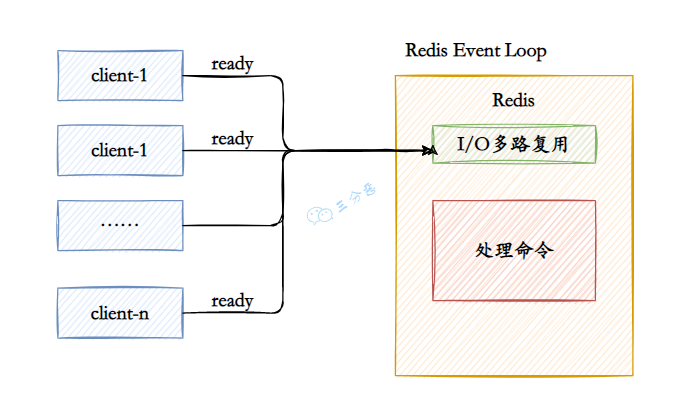
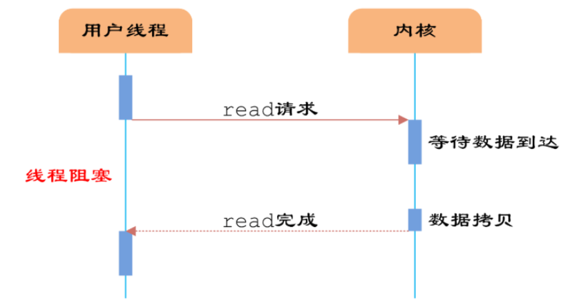
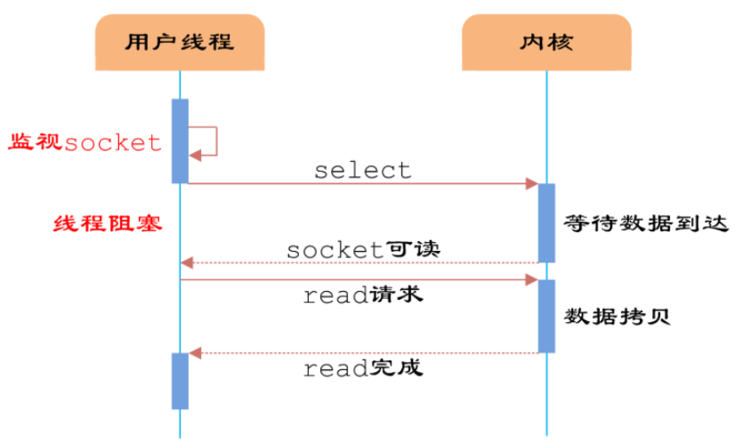
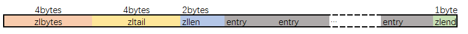

# 基础

`Redis`（Remote Dictionary Service）是一种基于键值对（key-value）的 `NoSQL` 数据库。

`Redis` 中的 value 支持 string（字符串）、hash（哈希）、 list（列表）、set（集合）、`zset`（有序集合）、Bitmaps（位图）、 `HyperLogLog`（基数估算）、GEO（地理信息定位）等多种数据结构。

## Redis特点

- 提供多种数据结构，优化存储性能；
- 数据存储在内存中，读写性能优秀；
- 可持久化到硬盘中；
- 还提供了键过期、发布订阅、事务、流水线、`Lua`脚本等附加功能；

## Redis与MySQL的区别

- `Redis`：数据存储在内存中的 `NoSQL` 数据库，读写性能非常好，是互联网技术领域中使用最广泛的缓存中间件。
- `MySQL`：数据存储在硬盘中的关系型数据库，适用于需要事务支持和复杂查询的场景。

`Redis`的应用：缓存、计数器、社交网络、消息队列、分布式锁；

- Token 存储：用户登录成功之后，使用 `Redis` 存储 Token
- 登录失败次数计数：使用 `Redis` 计数，登录失败超过一定次数，锁定账号
- 地址缓存：对省市区数据的缓存
- 分布式锁：分布式环境下登录、注册等操作加分布式锁
- ……

## Redis常见存储结构

| 常见存储结构 | 介绍                                                         | 主要应用场景                  |
| ------------ | ------------------------------------------------------------ | ----------------------------- |
| String       | 最基础的数据结构，key是一个字符串，value可以是字符串、数字、二进制等 | 缓存、计数、共享Session、限速 |
| Hash         | 键值对结合，key是字符串，value是一个Map集合                  | 缓存用户信息或对象信息        |
| List         | 简单的字符串列表，按照插入顺序排序，可以添加一个元素到列表的头部或者尾部 | 消息队列                      |
| Set          | 字符串的无序集合，集合中的元素是唯一的，不允许重复           | 标签、共同关注                |
| ZSet         | 有序集合，比Set多列一个排序属性score(分值)                   | 用户点赞统计、用户排序        |

## Redis为什么这么快？

`Redis` 的速度⾮常快，单机的 `Redis` 就可以⽀撑每秒十几万的并发，性能是 `MySQL` 的⼏⼗倍。速度快的原因主要有⼏点：

1、**基于内存的数据存储**，`Redis` 将数据存储在内存当中，使得数据的读写操作避开了磁盘 I/O。而内存的访问速度远超硬盘，这是 `Redis` 读写速度快的根本原因。

2、**单线程模型**，`Redis` 使用单线程模型来处理客户端的请求，这意味着在任何时刻只有一个命令在执行。这样就避免了线程切换和锁竞争带来的消耗。

3、**IO 多路复⽤**，基于 Linux 的 `select/epoll` 机制。该机制允许内核中同时存在多个监听套接字和已连接套接字，内核会一直监听这些套接字上的连接请求或者数据请求，一旦有请求到达，就会交给 `Redis` 处理，就实现了所谓的 `Redis` 单个线程处理多个 IO 读写的请求。

**Redis使用IO多路复用和自身事件模型：**



4、**高效的数据结构**，`Redis` 提供了多种高效的数据结构，如字符串（String）、列表（List）、集合（Set）、有序集合（Sorted Set）等，这些数据结构经过了高度优化，能够支持快速的数据操作。

## 能说一下 I/O 多路复用吗？

**阻塞I/O模型**



**I/O多路复用模型**



Linux 系统有三种方式实现 IO 多路复用：`select`、`poll` 和 `epoll`。

例如 `epoll` 方式是将用户 socket 对应的 `fd` 注册进 `epoll`，然后 `epoll` 帮你监听哪些 socket 上有消息到达，这样就避免了大量的无用操作。此时的 socket 应该采用非阻塞模式。

这样，整个过程只在进行 `select、poll、epoll` 这些调用的时候才会阻塞，收发客户消息是不会阻塞的，整个进程或者线程就被充分利用起来，这就是事件驱动，所谓的 reactor 模式。

**Java的I/O多路复用模型**

IO 多路复用模型中，线程首先发起 **select 调用**，询问内核数据是否准备就绪，等内核把数据准备好了，用户线程再发起 read 调用。read 调用的过程（数据从内核空间 -> 用户空间）还是阻塞的。

**IO 多路复用模型，通过减少无效的系统调用，减少了对 CPU 资源的消耗。**


## Redis单线程和多线程

`Redis6.0`之前是单线程的。官方 FAQ 表示，因为 Redis 是基于内存的操作，CPU 成为 Redis 的瓶颈的情况很少见，Redis 的瓶颈最有可能是内存的大小或者网络限制。如果想要最大程度利用 CPU，可以在一台机器上启动多个 Redis 实例。

**`Redis6.0` 的多线程是用多线程来处理数据的读写和协议解析，但是 Redis 执行命令还是单线程的。**这样做的目的是因为 Redis 的性能瓶颈在于网络IO而非 CPU，使用多线程能提升 IO 读写的效率，从⽽整体提⾼ Redis 的性能。


# 持久化

## Redis持久化⽅式有哪些？有什么区别？

`Redis` 支持两种主要的持久化方式：`RDB（Redis DataBase）`持久化和 `AOF（Append Only File）`持久化。这两种方式可以单独使用，也可以同时使用。

### `RDB`（`Redis DataBase`）

`RDB` 持久化通过创建数据集的快照（snapshot）来工作，在指定的时间间隔内将 `Redis` 在某一时刻的数据状态保存到磁盘的一个 RDB 文件中。

可通过 `save` 和 `bgsave` 命令两个命令来手动触发 `RDB` 持久化操作：

**1、 `save` 命令**：

- 会同步地将 `Redis` 的所有数据保存到磁盘上的一个 `RDB` 文件中。这个操作会**阻塞所有客户端请求**直到 `RDB` 文件被完全写入磁盘。

- 当 `Redis` 数据集较大时，使用 SAVE 命令会导致 `Redis` 服务器停止响应客户端的请求。

- 不推荐在生产环境中使用，除非数据集非常小，或者可以接受服务暂时的不可用状态。

**2、`bgsave` 命令**：

- 会在**后台异步地**创建 `Redis` 的数据快照，并将快照保存到磁盘上的 `RDB` 文件中。这个命令会立即返回，`Redis`服务器可以继续处理客户端请求。

- 在 `BGSAVE` 命令执行期间，`Redis` 会继续响应客户端的请求，对服务的可用性影响较小。快照的创建过程是由一个子进程完成的，主进程不会被阻塞。是在生产环境中执行 `RDB` 持久化的推荐方式。

- 以下场景会自动触发 `RDB` 持久化：

- 1、在 `Redis` 配置文件（通常是 `redis.conf`）中，可以通过`save <seconds> <changes>`指令配置自动触发 `RDB` 持久化的条件。这个指令可以设置多次，每个设置定义了一个时间间隔（秒）和该时间内发生的变更次数阈值。

- ```sql
  save 900 1
  save 300 10
  save 60 10000
  
  - 这意味着：
  - - 如果至少有 1 个键被修改，900 秒后自动触发一次 RDB 持久化。
    - 如果至少有 10 个键被修改，300 秒后自动触发一次 RDB 持久化。
    - 如果至少有 10000 个键被修改，60 秒后自动触发一次 RDB 持久化。
  - 满足以上任一条件，`RDB` 持久化就会被自动触发。
  ```

- 2、当 `Redis` 服务器**通过 SHUTDOWN 命令正常关闭**时，如果没有禁用 `RDB` 持久化，`Redis` 会自动执行一次 `RDB` 持久化，以确保数据在下次启动时能够恢复。
- 3、在 `Redis` 复制场景中，当一个 `Redis` 实例被配置为从节点并且与主节点建立连接时，它可能会根据配置接收主节点的 `RDB` 文件来初始化数据集。这个过程中，主节点会在后台自动触发 `RDB` 持久化，然后将生成的 `RDB` 文件发送给从节点。

### `AOF`（Append Only File）

- `AOF` 持久化通过记录每个写操作命令并将其追加到 `AOF` 文件中来工作，恢复时通过重新执行这些命令来重建数据集。

- `AOF` 的主要作用是**解决了数据持久化的实时性**，目前已经是 `Redis` 持久化的**主流方式**。

- `AOF` 的工作流程操作：命令写入 （append）、文件同步（sync）、文件重写（rewrite）、重启加载 （load）


- 流程如下：

  - 1、当 `AOF` 持久化功能被启用时，`Redis` 服务器会将接收到的所有写命令（比如 `SET, LPUSH, SADD` 等修改数据的命令）追加到 `AOF` 缓冲区（buffer）的末尾。

  - 2、为了将缓冲区中的命令持久化到磁盘中的 `AOF` 文件，`Redis` 提供了几种不同的**同步策略**：
    - `always`：每次写命令都会同步到 `AOF` 文件，这提供了最高的数据安全性，但可能因为磁盘 I/O 的延迟而影响性能。
    - `everysec`（默认）：每秒同步一次，这是一种折衷方案，提供了较好的性能和数据安全性。
    - `no`：不主动进行同步，交由操作系统决定何时将缓冲区数据写入磁盘，这种方式性能最好，但在系统崩溃时可能会丢失最近一秒的数据。

  - 3、随着操作的不断执行，`AOF` 文件会不断增长，为了减小 `AOF` 文件大小，`Redis` 可以重写 `AOF` 文件：重写过程不会解析原始的 `AOF` 文件，而是将当前内存中的数据库状态转换为一系列写命令，然后保存到一个新的 `AOF` 文件中。

    - `AOF` 重写操作由 `BGREWRITEAOF` 命令触发，它会创建一个子进程来执行重写操作，因此不会阻塞主进程。

    - 重写过程中，新的写命令会继续追加到旧的 `AOF` 文件中，同时也会被记录到一个缓冲区中。一旦重写完成，`Redis` 会将这个缓冲区中的命令追加到新的 `AOF` 文件中，然后切换到新的 `AOF` 文件上，以确保数据的完整性。

  - 4、当 `Redis` 服务器启动时，如果配置为使用 `AOF` 持久化方式，它会读取 `AOF` 文件中的所有命令并重新执行它们，以恢复数据库的状态。

## RDB 和 AOF 各自有什么优缺点？

**RDB | 优点**

1. 只有一个紧凑的二进制文件 `dump.rdb`，非常适合备份、全量复制的场景。
2. **容灾性好**，可以把 RDB 文件拷贝道远程机器或者文件系统张，用于容灾恢复。
3. **恢复速度快**，RDB 恢复数据的速度远远快于 AOF 的方式

**RDB | 缺点**

1. **实时性低**，RDB 是间隔一段时间进行持久化，没法做到实时持久化/秒级持久化。如果在这一间隔事件发生故障，数据会丢失。
2. **存在兼容问题**，Redis 演进过程存在多个格式的 RDB 版本，存在老版本 Redis 无法兼容新版本 RDB 的问题。

**AOF | 优点**

1. **实时性好**，aof 持久化可以配置 `appendfsync` 属性，有 `always`，每进行一次命令操作就记录到 aof 文件中一次。
2. 通过 append 模式写文件，即使中途服务器宕机，可以通过 redis-check-aof 工具解决数据一致性问题。

**AOF | 缺点**

1. AOF 文件比 RDB **文件大**，且 **恢复速度慢**。
2. **数据集大** 的时候，比 RDB **启动效率低**。


# 底层数据结构

## 简单动态字符串SDS

Redis 是用 C 语言写的，但是对于Redis的字符串，却不是 C 语言中的字符串（即以空字符’\0’结尾的字符数组），它是自己构建了一种名为 **简单动态字符串（simple dynamic string,SDS**）的抽象类型，并将 SDS 作为 Redis的默认字符串表示。

这是一种用于存储二进制数据的一种结构, 具有动态扩容的特点. 其实现位于`src/sds.h`与`src/sds.c`中。

- **SDS的总体概览**如下图:


其中`sdshdr`是头部, `buf`是真实存储用户数据的地方. 另外注意, 从命名上能看出来, 这个数据结构除了能存储二进制数据, 显然是用于设计作为字符串使用的, 所以在buf中, 用户数据后总跟着一个\0. 即图中 `"数据" + "\0" `是为所谓的buf

使用`SDS`的好处

- **常数复杂度获取字符串长度**

- **杜绝缓存区溢出**
- **减少修改字符串的内存重新分配次数**
- **二进制安全**
- **兼容部分 C 字符串函数**

## 压缩列表-ZipList

> `ziplist`是为了提高存储效率而设计的一种**特殊编码的双向链表**。它可以存储字符串或者整数，存储整数时是采用整数的二进制而不是字符串形式存储。它能在**O(1)的时间复杂度下完成list两端的push和pop操作**。但是因为每次操作都需要重新分配`ziplist`的内存，所以实际复杂度和`ziplist`的内存使用量相关。

整个`ziplist`在内存中的存储格式如下：



- `zlbytes`字段的类型是`uint32_t`, 这个字段中存储的是整个ziplist所占用的内存的字节数
- `zltail`字段的类型是`uint32_t`, 它指的是`ziplist`中最后一个entry的偏移量. 用于快速定位最后一个entry, 以快速完成pop等操作
- `zllen`字段的类型是uint16_t, 它指的是整个ziplit中entry的数量. 这个值只占2bytes（16位）: 如果ziplist中entry的数目小于65535(2的16次方), 那么该字段中存储的就是实际entry的值. 若等于或超过65535, 那么该字段的值固定为65535, 但实际数量需要一个个entry的去遍历所有entry才能得到.
- `zlend`是一个终止字节, 其值为全F, 即0xff. ziplist保证任何情况下, 一个entry的首字节都不会是255