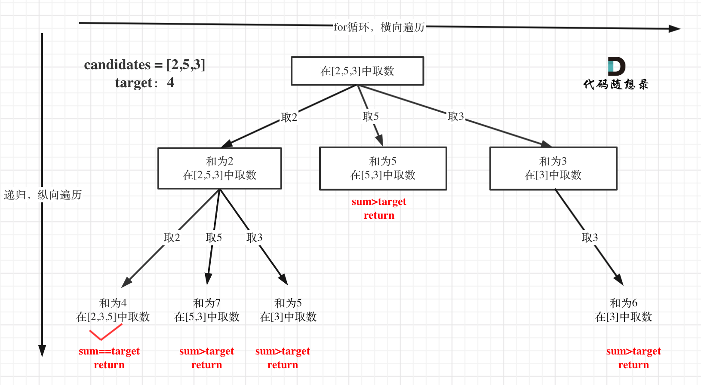

# 数组

## 121 买卖股票的最佳时机

[121. 买卖股票的最佳时机](https://leetcode.cn/problems/best-time-to-buy-and-sell-stock/)

**题目描述**

给定一个数组 `prices` ，它的第 `i` 个元素 `prices[i]` 表示一支给定股票第 `i` 天的价格。

你只能选择 **某一天** 买入这只股票，并选择在 **未来的某一个不同的日子** 卖出该股票。设计一个算法来计算你所能获取的最大利润。

返回你可以从这笔交易中获取的最大利润。如果你不能获取任何利润，返回 `0` 。

**示例**

> 输入：[7,1,5,3,6,4]
> 输出：5
> 解释：在第 2 天（股票价格 = 1）的时候买入，在第 5 天（股票价格 = 6）的时候卖出，最大利润 = 6-1 = 5 。
>      注意利润不能是 7-1 = 6, 因为卖出价格需要大于买入价格；同时，你不能在买入前卖出股票。

> 输入：prices = [7,6,4,3,1]
> 输出：0
> 解释：在这种情况下, 没有交易完成, 所以最大利润为 0。

**解题思路**

需要找出给定数组中两个数字之间的最大差值（即，最大利润）。此外，第二个数字（卖出价格）必须大于第一个数字（买入价格）

一次遍历

- 时间复杂度：O(n)，只需要遍历一次。
- 空间复杂度：O(1)，只使用了常数个变量。

**参考代码**

```java
public int maxProfit(int prices[]) {
    // 历史中的最小值
    int minprice = Integer.MAX_VALUE;
    int maxprofit = 0;
    for (int i = 0; i < prices.length; i++) {
        if (prices[i] < minprice) {
            minprice = prices[i];
        } else if (prices[i] - minprice > maxprofit) {
            maxprofit = prices[i] - minprice;
        }
    }
    return maxprofit;
}
```

------

------

# 字符串

## 151.翻转字符串里的单词

[151. 反转字符串中的单词](https://leetcode.cn/problems/reverse-words-in-a-string/)

**题目描述**

给你一个字符串 `s` ，请你反转字符串中 **单词** 的顺序。

**单词** 是由非空格字符组成的字符串。`s` 中使用至少一个空格将字符串中的 **单词** 分隔开。

返回 **单词** 顺序颠倒且 **单词** 之间用单个空格连接的结果字符串。

**注意：**输入字符串 `s`中可能会存在前导空格、尾随空格或者单词间的多个空格。返回的结果字符串中，单词间应当仅用单个空格分隔，且不包含任何额外的空格。

**示例**

> 输入：s = "the sky is blue"  输出："blue is sky the"
>

> 输入：s = "  hello world  "  输出："world hello"  解释：反转后的字符串中不能存在前导空格和尾随空格。

> 输入：s = "a good   example"  输出："example good a"  解释：如果两个单词间有多余的空格，反转后的字符串需要将单词间的空格减少到仅有一个。

**解题思路**

思路一：

- 去除首尾以及中间多余空格
- 反转整个字符串
- 反转各个单词

思路二：双指针法

**参考代码**

```Java
/**
 * 不使用Java内置方法实现
 * <p>
 * 1.去除首尾以及中间多余空格
 * 2.反转整个字符串
 * 3.反转各个单词
 */
public String reverseWords(String s) {
    // System.out.println("ReverseWords.reverseWords2() called with: s = [" + s + "]");
    // 1.去除首尾以及中间多余空格
    StringBuilder sb = removeSpace(s);
    // 2.反转整个字符串
    reverseString(sb, 0, sb.length() - 1);
    // 3.反转各个单词
    reverseEachWord(sb);
    return sb.toString();
}

private StringBuilder removeSpace(String s) {
    // System.out.println("ReverseWords.removeSpace() called with: s = [" + s + "]");
    int start = 0;
    int end = s.length() - 1;
    while (s.charAt(start) == ' ') start++;
    while (s.charAt(end) == ' ') end--;
    StringBuilder sb = new StringBuilder();
    while (start <= end) {
        char c = s.charAt(start);
        if (c != ' ' || sb.charAt(sb.length() - 1) != ' ') {
            sb.append(c);
        }
        start++;
    }
    // System.out.println("ReverseWords.removeSpace returned: sb = [" + sb + "]");
    return sb;
}

/**
 * 反转字符串指定区间[start, end]的字符
 */
public void reverseString(StringBuilder sb, int start, int end) {
    // System.out.println("ReverseWords.reverseString() called with: sb = [" + sb + "], start = [" + start + "], end = [" + end + "]");
    while (start < end) {
        char temp = sb.charAt(start);
        sb.setCharAt(start, sb.charAt(end));
        sb.setCharAt(end, temp);
        start++;
        end--;
    }
    // System.out.println("ReverseWords.reverseString returned: sb = [" + sb + "]");
}

private void reverseEachWord(StringBuilder sb) {
    int start = 0;
    int end = 1;
    int n = sb.length();
    while (start < n) {
        while (end < n && sb.charAt(end) != ' ') {
            end++;
        }
        reverseString(sb, start, end - 1);
        start = end + 1;
        end = start + 1;
    }
}
```

```java
public String reverseWords(String s) {
    s = s.trim();                                     // 删除首尾空格
    // i指向单词的首字母的前一个字符，j指向单词最后一个字符
    int j = s.length() - 1, i = j;
    StringBuilder res = new StringBuilder();
    // 从后向前遍历
    // 找到第一个空格，然后将单词插入res中
    // 跳过单词间空格，j 指向下个单词的尾字符
    while (i >= 0) {
        while (i >= 0 && s.charAt(i) != ' ') i--;     // 搜索首个空格
        res.append(s, i + 1, j + 1).append(" ");      // 添加单词
        while (i >= 0 && s.charAt(i) == ' ') i--;     // 跳过单词间空格
        j = i;                                        // j 指向下个单词的尾字符
    }
    return res.toString().trim();                     // 转化为字符串并返回
}
```

## 28. 找出字符串中第一个匹配项的下标

[28. 找出字符串中第一个匹配项的下标](https://leetcode.cn/problems/find-the-index-of-the-first-occurrence-in-a-string/)

**题目描述**

给你两个字符串 `haystack` 和 `needle` ，请你在 `haystack` 字符串中找出 `needle` 字符串的第一个匹配项的下标（下标从 0 开始）。如果 `needle` 不是 `haystack` 的一部分，则返回 `-1` ****。

**示例**

> 示例 1：输入：haystack = "sadbutsad", needle = "sad" 输出：0 解释："sad" 在下标 0 和 6 处匹配。 第一个匹配项的下标是 0 ，所以返回 0 。

> 示例 2：输入：haystack = "leetcode", needle = "leeto" 输出：-1 解释："leeto" 没有在 "leetcode" 中出现，所以返回 -1 。

**解题思路**

KMP算法：字符串匹配问题

前缀表：next数组表示，记录模式串与子串（文本串）不匹配的时候，模式串应该从哪里考试重新匹配，其值为**最长相等前后缀的长度**

- **前缀是指不包含最后一个字符的所有以第一个字符开头的连续子串**。
- **后缀是指不包含第一个字符的所有以最后一个字符结尾的连续子串**。

字符串匹配过程：

**参考代码**

```Java
public int strStr(String haystack, String needle) {
    return kmp(haystack, needle);
}

/**
 * KMP数组
 *
 * @param haystack 文本串
 * @param needle   模式串
 * @return 数组索引
 */
public int kmp(String haystack, String needle) {
    // 边界条件
    if (needle.isEmpty()) return 0;
    int[] next = new int[needle.length()];
    // 获取前缀表
    getNext(next, needle);
    // 记录模式串的索引
    int j = 0;
    // 遍历文本串，i记录模式串在文本串中匹配的最后一个字符索引
    for (int i = 0; i < haystack.length(); i++) {
        // 当前字符不一致
        while (j > 0 && haystack.charAt(i) != needle.charAt(j)) {
            j = next[j - 1];
        }
        // 当前字符一致
        if (haystack.charAt(i) == needle.charAt(j)) {
            j++;
        }
        // 模式串全部匹配
        if (j == needle.length()) {
            return (i - needle.length() + 1);
        }
    }
    return -1;
}

/**
 * 计算前缀表：最长相等前后缀的长度
 *
 * @param next   前缀表
 * @param target 目标字符串
 */
public void getNext(int[] next, String target) {
    // 初始化，i指向后缀末尾位置，j指向前缀末尾位置（代表i之前包括i子串的最长相等前后缀长度）
    int j = 0;
    next[0] = 0;
    for (int i = 1; i < target.length(); i++) {  // 注意i从1开始
        // 前后缀不相同，向前回退
        while (j > 0 && target.charAt(i) != target.charAt(j)) {
            j = next[j - 1];  // 向前回退
        }
        // 找到相同的前后缀
        if (target.charAt(i) == target.charAt(j)) {
            j++;
        }
        // 将j(前缀的长度)赋给next[i]
        next[i] = j;
    }
}
```

------

# 双指针

## 15 三数之和

[15. 三数之和](https://leetcode.cn/problems/3sum/)

**题目描述**

给你一个整数数组 `nums` ，判断是否存在三元组 `[nums[i], nums[j], nums[k]]` 满足 `i != j`、`i != k` 且 `j != k` ，同时还满足 `nums[i] + nums[j] + nums[k] == 0` 。请

你返回所有和为 `0` 且不重复的三元组。

**注意：**答案中不可以包含重复的三元组。

**示例**

> 输入：nums = [-1,0,1,2,-1,-4]  输出：[[-1,-1,2],[-1,0,1]]  解释：  nums[0] + nums[1] + nums[2] = (-1) + 0 + 1 = 0 。  nums[1] + nums[2] + nums[4] = 0 + 1 + (-1) = 0 。  nums[0] + nums[3] + nums[4] = (-1) + 2 + (-1) = 0 。  不同的三元组是 [-1,0,1] 和 [-1,-1,2] 。  注意，输出的顺序和三元组的顺序并不重要。

**具体思路**

**Hash解法**：两层for循环可以确定a和b的值，可以使用哈希法来确定 0-(a+b) 是否在数组里出现，使用Set进行去重操作

- 时间复杂度: O(n^2)
- 空间复杂度: O(n)，额外的 set 开销

**双指针法**

- 以nums数组为例，首先将数组排序，然后有一层for循环，i从下标0的地方开始，同时定一个下标left 定义在i+1的位置上，定义下标right 在数组结尾的位置上。
- 依然还是在数组中找到 abc 使得a + b +c =0，我们这里相当于 a = nums[i]，b = nums[left]，c = nums[right]。
- 如何移动left 和right呢， 如果nums[i] + nums[left] + nums[right] > 0 就说明 此时三数之和大了，因为数组是排序后了，所以right下标就应该向左移动，这样才能让三数之和小一些。
- 如果 nums[i] + nums[left] + nums[right] < 0 说明此时 三数之和小了，left 就向右移动，才能让三数之和大一些，直到left与right相遇为止。
- 时间复杂度：O(n^2)

**参考代码**

```Java
public List<List<Integer>> threeSum(int[] nums) {
    // 边界条件
    if (nums == null || nums.length < 3)
        return null;
    // 存放结果数组
    List<List<Integer>> res = new ArrayList<>();
    int len = nums.length;
    // 数组排序
    Arrays.sort(nums);
    for (int i = 0; i < len; i++) {
        // 数组最小值大于0
        if (nums[i] > 0)
            break;
        // 去重
        if (i > 0 && nums[i] == nums[i - 1])
            continue;
        int left = i + 1;
        int right = len - 1;
        while (left < right) {
            int sum = nums[i] + nums[left] + nums[right];
            if (sum == 0) {
                res.add(Arrays.asList(nums[i], nums[left], nums[right]));
                // 左区间去重
                while (left < right && nums[left] == nums[left + 1]) {
                    left++;
                }
                // 右区间去重
                while (left < right && nums[right] == nums[right - 1]) {
                    right--;
                }
                left++;
                right--;
            } else if (sum < 0) {
                left++;
            } else {
                right--;
            }
        }
    }
    return res;
}
```

## 16 最接近的三数之和

[16. 最接近的三数之和](https://leetcode.cn/problems/3sum-closest/)

**题目描述**

给你一个长度为 `n` 的整数数组 `nums` 和 一个目标值 `target`。请你从 `nums` 中选出三个整数，使它们的和与 `target` 最接近。

返回这三个数的和。

假定每组输入只存在恰好一个解。

**示例**

> 输入：nums = [-1,2,1,-4], target = 1
> 输出：2
> 解释：与 target 最接近的和是 2 (-1 + 2 + 1 = 2) 。

> 输入：nums = [0,0,0], target = 1
> 输出：0

**解题思路**

- 同样依照上述三数之和的解法，依靠双指针进行枚举

**参考代码**

```java
public int threeSumClosest(int[] nums, int target) {
    int n = nums.length;
    int closeSum = 10000000;
    Arrays.sort(nums);

    for (int i = 0; i < n; i++) {
        // 保证和上一次枚举的元素不相等，排除重复元素
        if (i > 0 && nums[i] == nums[i - 1]) {
            continue;
        }
        // 使用双指针进行枚举
        int left = i + 1, right = n - 1;
        while (left < right) {
            int sum = nums[i] + nums[left] + nums[right];
            // 如果和为 target 直接返回答案
            if (sum == target) {
                return target;
            }
            // 根据差值的绝对值来更新答案
            if (Math.abs(sum - target) < Math.abs(closeSum - target)) {
                closeSum = sum;
            }
            if (sum > target) {
                // 右区间去重
                while (left < right && nums[right] == nums[right - 1]) {
                    --right;
                }
                --right;
            } else {
                // 左区间去重
                while (left < right && nums[left] == nums[left + 1]) {
                    ++left;
                }
                ++left;
            }
        }
    }
    return closeSum;
}
```

## 18 四数之和

[18. 四数之和](https://leetcode.cn/problems/4sum/)

**题目描述**

给你一个由 `n` 个整数组成的数组 `nums` ，和一个目标值 `target` 。请你找出并返回满足下述全部条件且**不重复**的四元组 `[nums[a], nums[b], nums[c], nums[d]]` （若两个四元组元素一一对应，则认为两个四元组重复）：

- `0 <= a, b, c, d < n`
- `a`、`b`、`c` 和 `d` **互不相同**
- `nums[a] + nums[b] + nums[c] + nums[d] == target`

你可以按 **任意顺序** 返回答案 。

**示例**

> 输入：nums = [1,0,-1,0,-2,2], target = 0
> 输出：[[-2,-1,1,2],[-2,0,0,2],[-1,0,0,1]]

> 输入：nums = [2,2,2,2,2], target = 8
> 输出：[[2,2,2,2]]

**解题思路**

双指针：继续延续三树之和双指针策略，采用两次循环遍历

剪枝操作：提出重复值

- 在确定第一个数之后，如果 `nums[i]+nums[i+1]+nums[i+2]+nums[i+3]>target`，说明此时剩下的三个数无论取什么值，四数之和一定大于 target，因此退出第一重循环；
- 在确定第一个数之后，如果 `nums[i]+nums[n−3]+nums[n−2]+nums[n−1]<target`，说明此时剩下的三个数无论取什么值，四数之和一定小于 target，因此第一重循环直接进入下一轮，枚举 `nums[i+1]`；
- 在确定前两个数之后，如果 `nums[i]+nums[j]+nums[j+1]+nums[j+2]>target`，说明此时剩下的两个数无论取什么值，四数之和一定大于 target，因此退出第二重循环；
- 在确定前两个数之后，如果 `nums[i]+nums[j]+nums[n−2]+nums[n−1]<target`，说明此时剩下的两个数无论取什么值，四数之和一定小于 target，因此第二重循环直接进入下一轮，枚举 `nums[j+1]`。

**参考代码**

```java
public static List<List<Integer>> fourSum(int[] nums, int target) {
    // 存放结果数组
    List<List<Integer>> res = new ArrayList<>();
    int len = nums.length;
    // 边界条件
    if (nums == null || nums.length < 4) return res;
    Arrays.sort(nums);
    for (int i = 0; i < len - 3; i++) {
        // 数组最小值大于0
        if (i > 0 && nums[i] == nums[i - 1]) {
            continue;
        }
        if ((long) nums[i] + nums[i + 1] + nums[i + 2] + nums[i + 3] > target) {
            break;
        }
        if ((long) nums[i] + nums[len - 3] + nums[len - 2] + nums[len - 1] < target) {
            continue;
        }
        for (int j = i + 1; j < len - 2; j++) {
            int left = j + 1;
            int right = len - 1;
            if (j > i + 1 && nums[j] == nums[j - 1]) {
                continue;
            }
            if ((long) nums[i] + nums[j] + nums[j + 1] + nums[j + 2] > target) {
                break;
            }
            if ((long) nums[i] + nums[j] + nums[len - 2] + nums[len - 1] < target) {
                continue;
            }
            while (left < right) {
                int num = nums[i] + nums[j] + nums[left] + nums[right];
                if (num == target) {
                    res.add(Arrays.asList(nums[i], nums[j], nums[left], nums[right]));
                    while (left < right && nums[left] == nums[left + 1]) left++;
                    while (left < right && nums[right] == nums[right - 1]) right--;
                    left++;
                    right--;
                } else if (num > target) {
                    right--;
                } else {
                    left++;
                }
            }
        }
    }

    return res;
}
```

## 142 环形链表

[142. 环形链表 II](https://leetcode.cn/problems/linked-list-cycle-ii/)

**题目描述**

给定一个链表的头节点  `head` ，返回链表开始入环的第一个节点。 *如果链表无环，则返回 `null`。*

如果链表中有某个节点，可以通过连续跟踪 `next` 指针再次到达，则链表中存在环。 为了表示给定链表中的环，评测系统内部使用整数 `pos` 来表示链表尾连接到链表中的位置（**索引从 0 开始**）。如果 `pos` 是 `-1`，则在该链表中没有环。**注意：`pos` 不作为参数进行传递**，仅仅是为了标识链表的实际情况。

**不允许修改** 链表。

**示例**


> 输入：`head = [3,2,0,-4], pos = 1`
> 输出：返回索引为 1 的链表节点
> 解释：链表中有一个环，其尾部连接到第二个节点。

**解题思路**

双指针法

双指针的第一次相遇：

1. 设两指针 `fast`，`slow` 指向链表头部 `head` 。
2. 令 `fast` 每轮走 222 步，`slow` 每轮走 111 步。

第一种结果： fast 指针走过链表末端，说明链表无环，此时直接返回 null。

- 如果链表存在环，则双指针一定会相遇。因为每走 1 轮，fast 与 slow 的间距 +1，fast 一定会追上 slow 。

第二种结果： 当`fast == slow`时， 两指针在环中第一次相遇。下面分析此时 fast 与 slow 走过的步数关系：

- 设链表共有 a+b个节点，其中 链表头部到链表入口 有 a个节点（不计链表入口节点）， 链表环 有 b 个节点（这里需要注意，a 和 b 是未知数，例如图解上链表 a=4 , b=5）；设两指针分别走了 f，s 步，则有：

- fast 走的步数是 slow 步数的 2 倍，即 `f=2s`；（解析： fast 每轮走 2 步）。fast 比 slow 多走了 n 个环的长度，即 `f=s+nb`；（ 解析： 双指针都走过 a 步，然后在环内绕圈直到重合，重合时 fast 比 slow 多走环的长度整数倍 ）。
- 将以上两式相减得到 `f=2nb，s=nb`，即 fast 和 slow 指针分别走了 `2n，n` 个环的周长。

接下来该怎么做呢？

- 如果让指针从链表头部一直向前走并统计步数k，那么所有走到链表入口节点时的步数 是：`k=a+nb`，即先走 a 步到入口节点，之后每绕 1 圈环（ b 步）都会再次到入口节点。而目前 slow 指针走了 `nb` 步。因此，我们只要想办法让 slow 再走 `a` 步停下来，就可以到环的入口。

- 但是我们不知道 a 的值，该怎么办？依然是使用双指针法。考虑构建一个指针，此指针需要有以下性质：此指针和 slow 一起向前走 a 步后，两者在入口节点重合。那么从哪里走到入口节点需要 `a`步？答案是链表头节点head。

双指针第二次相遇：

- 令 fast 重新指向链表头部节点。此时 `f=0，s=nb` 。
- slow 和 fast 同时每轮向前走 1步。
- 当 fast 指针走到 f=a 步时，slow 指针走到 `s=a+nb` 步。此时两指针重合，并同时指向链表环入口，返回 slow 指向的节点即可。

**参考代码**

```java
public ListNode detectCycle(ListNode head) {
    // 定义快慢指针。指向头节点
    ListNode fast = head, slow = head;
    // 快慢指针在环中第一次相遇
    // 设无环的结点数为a, 环中节点数为b
    // 设两指针分别走了 f，s 步， 则有f = 2s
    // 同时亦有：f = s + nb
    // 则 s = nb, f = 2nb
    do {
        if (fast == null || fast.next == null) return null;
        fast = fast.next.next;
        slow = slow.next;
    } while (slow != fast);
    // 链表环状入口的位置是： k = a + nb, 即先走 a 步到入口节点，之后每绕 1 圈环（ b 步）都会再次到入口节点。
    // 目前 slow 指针走了 nb 步。因此，我们只要想办法让 slow 再走 a 步停下来，就可以到环的入口。
    // 快指针指向头结点
    fast = head;
    // 快慢指针第二次相遇
    while (slow != fast) {
        slow = slow.next;
        fast = fast.next;
    }
    return fast;
}
```


# 滑动窗口

## 209. 长度最小的子数组

[209. 长度最小的子数组](https://leetcode.cn/problems/minimum-size-subarray-sum/)

**题目描述**

给定一个含有 `n` ****个正整数的数组和一个正整数 `target` **。**

找出该数组中满足其总和大于等于 ****`target` ****的长度最小的 **连续子数组** `[numsl, numsl+1, ..., numsr-1, numsr]` ，并返回其长度**。**如果不存在符合条件的子数组，返回 `0` 。

**示例**

> 输入：target = 7, nums = [2,3,1,2,4,3]  输出：2  解释：子数组 [4,3] 是该条件下的长度最小的子数组。
>
> 输入：target = 4, nums = [1,4,4]  输出：1
>
> 输入：target = 11, nums = [1,1,1,1,1,1,1,1]  输出：0

**解题思路**

辅助队列

滑动窗口

**参考代码**

```Java
/**
 * 辅助队列
 */
public int minSubArrayLen(int target, int[] nums) {
    ArrayDeque<Integer> deque = new ArrayDeque<>();
    int sum = 0, minLen = Integer.MAX_VALUE;
    for (int num : nums) {
        deque.offerLast(num);
        sum += num;
        if (sum >= target) {
            while (sum >= target) {
                Integer first = deque.peekFirst();
                if(sum-first>=target){
                    deque.pollFirst();
                    sum -= first;
                }else{
                    break;
                }
            }
            minLen = Math.min(minLen, deque.size());
        }
    }
    if(sum < target) return 0;
    return minLen;
}
/**
 * 滑动窗口
 */
public int minSubArrayLen(int target, int[] nums) {
    int sum = 0, minLen = Integer.MAX_VALUE;
    if (nums.length == 0) {
        return 0;
    }
    int start = 0, end = 0;
    for (; end < nums.length; end++) {
        sum += nums[end];
        while (sum >= target) {
            minLen = Math.min(minLen, end - start + 1);
            sum -= nums[start];
            start++;
        }
    }
    return minLen == Integer.MAX_VALUE ? 0 : minLen;
}
```

------

# 栈与队列

## 239. 滑动窗口的最大值

[239. 滑动窗口最大值 - 力扣（LeetCode）](https://leetcode.cn/problems/sliding-window-maximum/description/)

**题目描述**：给你一个整数数组 `nums`，有一个大小为 `k` 的滑动窗口从数组的最左侧移动到数组的最右侧。你只可以看到在滑动窗口内的 `k` 个数字。滑动窗口每次只向右移动一位。返回 *滑动窗口中的最大值* 。

**示例**

```
输入：nums = [1,3,-1,-3,5,3,6,7], k = 3
输出：[3,3,5,5,6,7]
解释：
滑动窗口的位置                最大值
---------------               -----
[1  3  -1] -3  5  3  6  7       3
 1 [3  -1  -3] 5  3  6  7       3
 1  3 [-1  -3  5] 3  6  7       5
 1  3  -1 [-3  5  3] 6  7       5
 1  3  -1  -3 [5  3  6] 7       6
 1  3  -1  -3  5 [3  6  7]      7
 
输入：nums = [1], k = 1
输出：[1]
```

**解题思路**

暴力方法：遍历一遍的过程中每次从窗口中再找到最大的数值，其时间复杂度为O(n × k)，会超时；

单调队列：

- 自定义单调递减队列，会随着滑动窗口的移动动态增减队列数据，其中实现poll、add、peek三个方法；
- 分析题意可知，队列中不需要存储滑动窗口内的所有元素，最多存储最大的前两个元素即可；
- 入队时，需对队列中的元素进行遍历，将队列中小于val的元素出队；
- 弹出元素时，比较当前要弹出的数值是否等于队列出口的数值，如果相等则弹出；

**参考代码**

```java
class MyQueue {
    Deque<Integer> deque = new LinkedList<>();

    // 弹出元素时，比较当前要弹出的数值是否等于队列出口的数值，如果相等则弹出
    // 同时判断队列当前是否为空
    void poll(int val) {
        if (!deque.isEmpty() && val == deque.peek()) {
            deque.poll();
        }
    }

    // 添加元素时，如果要添加的元素大于入口处的元素，就将入口元素弹出
    // 保证队列元素单调递减
    // 比如此时队列元素3,1，2将要入队，比1大，所以1弹出，此时队列：3,2
    void add(int val) {
        while (!deque.isEmpty() && val > deque.getLast()) {
            deque.removeLast();
        }
        deque.add(val);
    }

    // 队列队顶元素始终为最大值
    int peek() {
        return deque.peek();
    }
}

/**
     * 解法一
     */
public int[] maxSlidingWindow(int[] nums, int k) {
    if (nums.length == 1) {
        return nums;
    }
    int len = nums.length - k + 1;
    // 存放结果元素的数组
    int[] res = new int[len];
    int num = 0;
    // 自定义队列
    MyQueue myQueue = new MyQueue();
    // 先将前k的元素放入队列
    for (int i = 0; i < k; i++) {
        myQueue.add(nums[i]);
    }
    res[num++] = myQueue.peek();
    for (int i = k; i < nums.length; i++) {
        // 滑动窗口移除最前面的元素，移除是判断该元素是否放入队列
        myQueue.poll(nums[i - k]);
        // 滑动窗口加入最后面的元素
        myQueue.add(nums[i]);
        // 记录对应的最大值
        res[num++] = myQueue.peek();
    }
    return res;
}
```

------

# 二叉树

## 102 二叉树的层次遍历

[102. 二叉树的层序遍历](https://leetcode.cn/problems/binary-tree-level-order-traversal/)

**题目描述**

给你二叉树的根节点 `root` ，返回其节点值的 **层序遍历** 。 （即逐层地，从左到右访问所有节点）。

**示例**


> 输入：root = [3,9,20,null,null,15,7]  输出：[[3],[9,20],[15,7]]

**解题思路**

递归法：借助辅助数组

迭代法：借助队列，实现层次遍历

**同类型题目**

[107. 二叉树的层序遍历 II](https://leetcode.cn/problems/binary-tree-level-order-traversal-ii/)

[199. 二叉树的右视图](https://leetcode.cn/problems/binary-tree-right-side-view/)

[637. 二叉树的层平均值](https://leetcode.cn/problems/average-of-levels-in-binary-tree/)

[103. 二叉树的锯齿形层序遍历](https://leetcode.cn/problems/binary-tree-zigzag-level-order-traversal/)

**参考代码**

```Java
public List<List<Integer>> levelOrder(TreeNode root) {
    if (root == null) return new LinkedList<>();
    // 定义双端队列
    Queue<TreeNode> queue = new ArrayDeque<>();
    // 结果数组
    List<List<Integer>> res = new ArrayList<>();
    // 根节点入队
    queue.offer(root);
    // 判断队列是否为空，不为空则执行循环体
    while (!queue.isEmpty()) {
        // 获取队列长度
        int n = queue.size();
        List<Integer> layer = new ArrayList<>();
        while(n > 0){
            TreeNode p = queue.poll();
            layer.add(p.val);
            if (p.left != null) queue.offer(p.left);
            if (p.right != null) queue.offer(p.right);
            n--;
        }
        res.add(layer);
    }
    return res;
}
public List<List<Integer>> resList = new ArrayList<List<Integer>>();

public List<List<Integer>> levelOrder2(TreeNode root) {
    traversal(root,0);
    return resList;
}

/**
 * DFS--递归方式
 * @param node 结点
 * @param deep 深度
 */
public void traversal(TreeNode node, Integer deep) {
    if (node == null) return;
    deep++;

    if (resList.size() < deep) {
        //当层级增加时，list的Item也增加，利用list的索引值进行层级界定
        List<Integer> item = new ArrayList<Integer>();
        resList.add(item);
    }
    resList.get(deep - 1).add(node.val);

    traversal(node.left, deep);
    traversal(node.right, deep);
}
```

## 701.二叉搜索树中的插入操作

[701. 二叉搜索树中的插入操作](https://leetcode.cn/problems/insert-into-a-binary-search-tree/)

**题目描述**

给定二叉搜索树（BST）的根节点 `root` 和要插入树中的值 `value` ，将值插入二叉搜索树。 返回插入后二叉搜索树的根节点。 输入数据 **保证** ，新值和原始二叉搜索树中的任意节点值都不同。

**注意**，可能存在多种有效的插入方式，只要树在插入后仍保持为二叉搜索树即可。 你可以返回 **任意有效的结果** 。

**示例**

> 输入：root = [4,2,7,1,3], val = 5 
> 输出：[4,2,7,1,3,5] 

**解题思路**

递归法：

- 确定**递归函数的参数以及返回值：**遍历到待插入的位置（一定是个空节点），返回该节点
- 确定**终止条件：**如果当前节点不存在，创建节点
- 确定**单层递归的逻辑：**依托二叉搜索树的特性，找到待插入的位置

迭代法：

```java
public TreeNode insertIntoBST(TreeNode root, int val) {
    if (root == null) {
        return new TreeNode(val);
    }
    if (val < root.val) {
        root.left = insertIntoBST(root.left, val);
    } else {
        root.right = insertIntoBST(root.right, val);
    }
    return root;
}
```

```Java
public TreeNode insertIntoBST2(TreeNode root, int val) {
    if (root == null) {
        return new TreeNode(val);
    }
    TreeNode pre = null, cur = root;
    while (cur != null) {
        pre = cur;
        cur = cur.val > val ? cur.left : cur.right;
    }
    TreeNode treeNode = new TreeNode(val);
    if (pre.val > val) {
        pre.left = treeNode;
    } else {
        pre.right = treeNode;
    }
    return root;
}
```

## 669. 修剪二叉搜索树

[669. 修剪二叉搜索树 - 力扣（LeetCode）](https://leetcode.cn/problems/trim-a-binary-search-tree/description/)

**题目描述**

给你二叉搜索树的根节点 `root` ，同时给定最小边界`low` 和最大边界 `high`。通过修剪二叉搜索树，使得所有节点的值在`[low, high]`中。修剪树 **不应该** 改变保留在树中的元素的相对结构 (即，如果没有被移除，原有的父代子代关系都应当保留)。 可以证明，存在 **唯一的答案** 。

所以结果应当返回修剪好的二叉搜索树的新的根节点。注意，根节点可能会根据给定的边界发生改变。

**示例**


```
输入：root = [1,0,2], low = 1, high = 2
输出：[1,null,2]
```

**解题思路**

**参考代码**

## 538. 把二叉搜索树转换为累加树

[538. 把二叉搜索树转换为累加树](https://leetcode.cn/problems/convert-bst-to-greater-tree/)

**题目描述**

给出二叉 **搜索** 树的根节点，该树的节点值各不相同，请你将其转换为累加树（Greater Sum Tree），使每个节点 `node` 的新值等于原树中大于或等于 `node.val` 的值之和。

**示例1**


```
输入：[4,1,6,0,2,5,7,null,null,null,3,null,null,null,8]
输出：[30,36,21,36,35,26,15,null,null,null,33,null,null,null,8]
```

**解题思路**

遍历需要技巧，利用二叉搜索树的特性，可以看出，大于或等于 `node.val` 的值都在该节点的右子树上，因此使用递归法（RNL）进行遍历：

递归法（RNL）：

- 先遍历右节点
- 计算当前根节点的新值
- 在遍历左节点

**参考代码**

```java
class Solution {
    private int sum = 0;

    public TreeNode convertBST(TreeNode root) {
        traversal(root);
        return root;
    }

    public void traversal(TreeNode node) {
        if (node == null) return;
        traversal(node.right);
        sum += node.val;
        node.val = sum;
        traversal(node.left);
    }
}
```

## 912 排序数据

[912. 排序数组](https://leetcode.cn/problems/sort-an-array/)

**题目描述**

给你一个整数数组 `nums`，请你将该数组升序排列。

> 示例 1：
> 输入：nums = [5,2,3,1]
> 输出：[1,2,3,5]
>
> 示例 2：
> 输入：nums = [5,1,1,2,0,0]
> 输出：[0,0,1,1,2,5]

**解题思路**

**解题思路**

**参考代码**

```java
/**
 * 快速排序
 */

public int[] sortArray(int[] nums) {
    randomizedQuicksort(nums, 0, nums.length - 1);
    return nums;
}

public void randomizedQuicksort(int[] nums, int l, int r) {
    if (l < r) {
        int pos = randomizedPartition(nums, l, r);
        randomizedQuicksort(nums, l, pos - 1);
        randomizedQuicksort(nums, pos + 1, r);
    }
}

public int randomizedPartition(int[] nums, int l, int r) {
    int i = new Random().nextInt(r - l + 1) + l; // 随机选一个作为我们的主元
    swap(nums, r, i);
    return partition(nums, l, r);
}

public int partition(int[] nums, int l, int r) {
    int pivot = nums[r];
    int i = l - 1;
    for (int j = l; j <= r - 1; ++j) {
        if (nums[j] <= pivot) {
            i = i + 1;
            swap(nums, i, j);
        }
    }
    swap(nums, i + 1, r);
    return i + 1;
}
```


```Java
/**
 * 堆排序
 * 一般用数组来表示堆，下标为 i 的结点的父结点下标为(i-1)/2；其左右子结点分别为 (2i + 1)、(2i + 2)
 */

public void heapSort(int[] nums) {
    int len = nums.length - 1;
    buildMaxHeap(nums, len);
    for (int i = len; i >= 1; --i) {
        swap(nums, i, 0);
        len -= 1;
        maxHeapify(nums, 0, len);
    }
}

/**
 * 创建最大堆
 */
public void buildMaxHeap(int[] nums, int len) {
    for (int i = len / 2; i >= 0; --i) {
        maxHeapify(nums, i, len);
    }
}

/**
 * 最大堆调整
 */
public void maxHeapify(int[] nums, int i, int len) {
    // 找到第一个非叶子节点
    while ((i << 1) + 1 <= len) {
        int lSon = (i << 1) + 1;  // 左孩子节点
        int rSon = (i << 1) + 2;  // 右孩子节点
        int large;
        // 对比左孩子节点
        if (lSon <= len && nums[lSon] > nums[i]) {
            large = lSon;
        } else {
            large = i;
        }
        // 对比右孩子节点
        if (rSon <= len && nums[rSon] > nums[large]) {
            large = rSon;
        }
        // 交换
        if (large != i) {
            swap(nums, i, large);
            i = large;
        } else {
            break;
        }
    }
}

```

```java
/**
 * 选择排序
 * 从待排序序列中找到最小的值，与排好序的序列最后的元素进行置换
 */
public int[] selectSort(int[] nums) {
    int n = nums.length;
    int minIndex;
    for (int i = 0; i < n - 1; i++) {
        minIndex = i;
        // 找到最小值索引
        for (int j = i + 1; j < n; j++) {
            if (nums[minIndex] > nums[j]) {
                minIndex = j;
            }
        }
        swap(nums, minIndex, i);
    }
    return nums;
}
```

```java
/**
 * 冒泡排序
 */
public int[] bubbleSort(int[] nums) {
    int n = nums.length;
    for (int i = 0; i < n - 1; i++) {
        boolean flag = true;
        for (int j = 0; j < n - 1; j++) {
            if (nums[j] > nums[j + 1]) {
                swap(nums, j, j + 1);
                flag = false;
            }
        }
        if (flag) break;
    }
    return nums;
}

public void swap(int[] nums, int i, int j) {
    int temp = nums[i];
    nums[i] = nums[j];
    nums[j] = temp;
}
```

------

# 动态规划

动态规划，英文：Dynamic Programming，简称DP，如果某一问题有很多重叠子问题，使用动态规划是最有效的。

所以动态规划中每一个状态一定是由上一个状态推导出来的，**这一点就区分于贪心**，贪心没有状态推导，而是从局部直接选最优的;

解题步骤：

1. 确定dp数组（dp table）以及下标的含义
2. 确定递推公式
3. dp数组如何初始化
4. 确定遍历顺序
5. 举例推导dp数组

------

## 122 买卖股票的最佳时机2

[122. 买卖股票的最佳时机 II](https://leetcode.cn/problems/best-time-to-buy-and-sell-stock-ii/)

**题目描述**

给你一个整数数组 `prices` ，其中 `prices[i]` 表示某支股票第 `i` 天的价格。

在每一天，你可以决定是否购买和/或出售股票。你在任何时候 **最多** 只能持有 **一股** 股票。你也可以先购买，然后在 **同一天** 出售。

返回 *你能获得的 **最大** 利润* 。

**示例**

> 输入：prices = [7,1,5,3,6,4]
> 输出：7
> 解释：在第 2 天（股票价格 = 1）的时候买入，在第 3 天（股票价格 = 5）的时候卖出, 这笔交易所能获得利润 = 5 - 1 = 4 。
>      随后，在第 4 天（股票价格 = 3）的时候买入，在第 5 天（股票价格 = 6）的时候卖出, 这笔交易所能获得利润 = 6 - 3 = 3 。
>      总利润为 4 + 3 = 7 。

**解题思路**

暴力解法：超时

动态规划法

1. 确定dp数组以及下标的含义
   - `dp[i][0]` 表示第i天持有股票所得现金。
   - `dp[i][1]` 表示第i天不持有股票所得最多现金
2. 确定递推公式
   - `dp[i][0] = Math.max(dp[i - 1][0], dp[i - 1][1] + prices[i]);`
   - `dp[i][1] = Math.max(dp[i - 1][1], dp[i - 1][0] - prices[i]);` 
3. dp数组如何初始化：`dp[0][0] = 0;` `dp[0][1] = -prices[0];`
4. 确定遍历顺序
5. 举例推导dp数组

**参考代码**

```java
/**
 * 优化空间
 * 时间复杂度：O(n)
*  空间复杂度：O(n)
 */
public int maxProfit(int[] prices) {
    int len = prices.length;
    if (len < 2) {
        return 0;
    }

    // 0：持有现金，dp[i][0] 表示第i天持有股票所得现金
    // 1：持有股票，dp[i][1] 表示第i天不持有股票所得最多现金
    // 状态转移：0 → 1 → 0 → 1 → 0 → 1 → 0
    int[][] dp = new int[len][2];

    dp[0][0] = 0;
    dp[0][1] = -prices[0];

    for (int i = 1; i < len; i++) {
        // 这两行调换顺序也是可以的
        dp[i][0] = Math.max(dp[i - 1][0], dp[i - 1][1] + prices[i]);
        dp[i][1] = Math.max(dp[i - 1][1], dp[i - 1][0] - prices[i]);
    }
    return dp[len - 1][0];
}
```

```java
/**
 * 优化空间
 * 时间复杂度：O(n)
 *  空间复杂度：O(1)
 */
public int maxProfit2(int[] prices) {
    int[] dp = new int[2];
    // 0表示持有，1表示卖出
    dp[0] = -prices[0];
    dp[1] = 0;
    for(int i = 1; i <= prices.length; i++){
        // 前一天持有; 既然不限制交易次数，那么再次买股票时，要加上之前的收益
        dp[0] = Math.max(dp[0], dp[1] - prices[i-1]);
        // 前一天卖出; 或当天卖出，当天卖出，得先持有
        dp[1] = Math.max(dp[1], dp[0] + prices[i-1]);
    }
    return dp[1];
}
```

## 123 买卖股票的最佳时机3

[123. 买卖股票的最佳时机 III](https://leetcode.cn/problems/best-time-to-buy-and-sell-stock-iii/)

**题目描述**

给定一个数组，它的第 `i` 个元素是一支给定的股票在第 `i` 天的价格。

设计一个算法来计算你所能获取的最大利润。你最多可以完成 **两笔** 交易。

**注意：**你不能同时参与多笔交易（你必须在再次购买前出售掉之前的股票）。

**示例**

> 输入：prices = [3,3,5,0,0,3,1,4]
> 输出：6
> 解释：在第 4 天（股票价格 = 0）的时候买入，在第 6 天（股票价格 = 3）的时候卖出，这笔交易所能获得利润 = 3-0 = 3 。
>      随后，在第 7 天（股票价格 = 1）的时候买入，在第 8 天 （股票价格 = 4）的时候卖出，这笔交易所能获得利润 = 4-1 = 3 。

**解题思路**

动态规划法

1. 确定dp数组以及下标的含义
   - `dp[i][j]`中 i表示第i天，j为 `[0 - 4]` 五个状态，`dp[i][j]`表示第i天状态j所剩最大现金。
   - 五个状态分别是：没有操作 （其实我们也可以不设置这个状态）、第一次持有股票、第一次不持有股票、第二次持有股票、第二次不持有股票
2. 确定递推公式
   - 达到`dp[i][1]`状态，有两个具体操作：
     - 操作一：第i天买入股票了，那么`dp[i][1] = dp[i-1][0] - prices[i]`
     - 操作二：第i天没有操作，而是沿用前一天买入的状态，即：`dp[i][1] = dp[i - 1][1]`
   - 其它同理
3. dp数组如何初始化：`dp[0][0] = 0;` `dp[0][1] = -prices[0];`
4. 确定遍历顺序
   - 从递归公式其实已经可以看出，一定是从前向后遍历，因为dp[i]，依靠dp[i - 1]的数值。
5. 举例推导dp数组

**参考代码**

```java
public int maxProfit(int[] prices) {
    int len = prices.length;
    // 边界判断, 题目中 length >= 1, 所以可省去
    if (prices.length == 0) return 0;

   /*
    * 定义 5 种状态:
    * 0: 没有操作, 1: 第一次买入, 2: 第一次卖出, 3: 第二次买入, 4: 第二次卖出
    */
    int[][] dp = new int[len][5];
    dp[0][1] = -prices[0];
    // 初始化第二次买入的状态是确保 最后结果是最多两次买卖的最大利润
    dp[0][3] = -prices[0];

    for (int i = 1; i < len; i++) {
        dp[i][1] = Math.max(dp[i - 1][1], -prices[i]);
        dp[i][2] = Math.max(dp[i - 1][2], dp[i - 1][1] + prices[i]);
        dp[i][3] = Math.max(dp[i - 1][3], dp[i - 1][2] - prices[i]);
        dp[i][4] = Math.max(dp[i - 1][4], dp[i - 1][3] + prices[i]);
    }

    return dp[len - 1][4];
}
```

```java
/**
 * 空间优化
 */
public int maxProfit(int[] prices) {
    int[] dp = new int[4];
    // 存储两次交易的状态就行了
    // dp[0]代表第一次交易的买入
    dp[0] = -prices[0];
    // dp[1]代表第一次交易的卖出
    dp[1] = 0;
    // dp[2]代表第二次交易的买入
    dp[2] = -prices[0];
    // dp[3]代表第二次交易的卖出
    dp[3] = 0;
    for (int i = 1; i <= prices.length; i++) {
        // 要么保持不变，要么没有就买，有了就卖
        dp[0] = Math.max(dp[0], -prices[i - 1]);
        dp[1] = Math.max(dp[1], dp[0] + prices[i - 1]);
        // 这已经是第二次交易了，所以得加上前一次交易卖出去的收获
        dp[2] = Math.max(dp[2], dp[1] - prices[i - 1]);
        dp[3] = Math.max(dp[3], dp[2] + prices[i - 1]);
    }
    return dp[3];
}
```

## 139 单词拆分

[139. 单词拆分](https://leetcode.cn/problems/word-break/)

**题目描述**

给你一个字符串 `s` 和一个字符串列表 `wordDict` 作为字典。如果可以利用字典中出现的一个或多个单词拼接出 `s` 则返回 `true`。

**注意：**不要求字典中出现的单词全部都使用，并且字典中的单词可以重复使用。

**示例**

> 输入: s = "leetcode", wordDict = ["leet", "code"]
> 输出: true
> 解释: 返回 true 因为 "leetcode" 可以由 "leet" 和 "code" 拼接成。

> 输入: s = "applepenapple", wordDict = ["apple", "pen"]
> 输出: true
> 解释: 返回 true 因为 "applepenapple" 可以由 "apple" "pen" "apple" 拼接成。
>      注意，你可以重复使用字典中的单词。

> **提示：**
>
> - `1 <= s.length <= 300`
> - `1 <= wordDict.length <= 1000`
> - `1 <= wordDict[i].length <= 20`
> - `s` 和 `wordDict[i]` 仅由小写英文字母组成
> - `wordDict` 中的所有字符串 **互不相同**

**解题思路**

动态规划:

1、确定dp数组以及下标的含义

定义 `dp[i]`表示字符串 s 前 i个字符组成的字符串 `s[0..i−1]` 是否能被空格拆分成若干个字典中出现的单词

2、确定递推公式

`dp[i]=dp[j]&& check(s[j..i−1])`

从前往后计算考虑转移方程，**每次转移的时候我们需要枚举包含位置 i−1 的最后一个单词，看它是否出现在字典中以及除去这部分的字符串是否合法即可**。

公式化来说，我们需要枚举 `s[0..i−1]`中的分割点 j ，看 `s[0..j−1]` 组成的字符串 `s1` （默认 j=0 时 `s1`为空串）和 s[j..i−1] 组成的字符串 `s2`是否都合法，如果两个字符串均合法，那么按照定义 `s1` 和 `s2` 拼接成的字符串也同样合法。

**时间复杂度：O(n^2)**

**空间复杂度：O(n)**

**参考代码**

```java
public boolean wordBreak(String s, List<String> wordDict) {
    // 数组去重
    Set<String> wordDictSet = new HashSet<>(wordDict);
    // dp数组
    boolean[] dp = new boolean[s.length() + 1];
    // dp数组初始化
    dp[0] = true;
    // 遍历
    for (int i = 1; i <= s.length(); i++) {
        for (int j = 0; j < i; j++) {
            if (dp[j] && wordDictSet.contains(s.substring(j, i))) {
                dp[i] = true;
                break;
            }
        }
    }
    return dp[s.length()];
}
```

------

## 746 使用最小花费爬楼梯

[746. 使用最小花费爬楼梯](https://leetcode.cn/problems/min-cost-climbing-stairs/)

**题目描述**

给你一个整数数组 `cost` ，其中 `cost[i]` 是从楼梯第 `i` 个台阶向上爬需要支付的费用。一旦你支付此费用，即可选择向上爬一个或者两个台阶。

你可以选择从下标为 `0` 或下标为 `1` 的台阶开始爬楼梯。

请你计算并返回达到楼梯顶部的最低花费。

**示例**

> 输入：cost = [10,15,20]
> 输出：15
> 解释：你将从下标为 1 的台阶开始。支付 15 ，向上爬两个台阶，到达楼梯顶部。总花费为 15 。

> 输入：cost = [1,100,1,1,1,100,1,1,100,1]
> 输出：6
> 解释：你将从下标为 0 的台阶开始。
> - 支付 1 ，向上爬两个台阶，到达下标为 2 的台阶。
> - 支付 1 ，向上爬两个台阶，到达下标为 4 的台阶。
> - 支付 1 ，向上爬两个台阶，到达下标为 6 的台阶。
> - 支付 1 ，向上爬一个台阶，到达下标为 7 的台阶。
> - 支付 1 ，向上爬两个台阶，到达下标为 9 的台阶。
> - 支付 1 ，向上爬一个台阶，到达楼梯顶部。
> 总花费为 6 。

**解题思路**

定义dp数组：dp[i] 的值为登上第i阶阶梯所要支付的代价；

`dp[i] = min{dp[i-i]+cost[i-1], dp[i-2]+cost[i-2]}`

`dp[0] = dp[1] = 0`

**参考代码**

```java
/**
* 时间复杂度：O(n)
* 空间复杂度：O(n)
*/
public static int minCostClimbingStairs(int[] cost) {
    int[] dp = new int[cost.length + 1];
    dp[0] = 0;
    dp[1] = 0;
    for (int i = 2; i <= cost.length; i++) {
        dp[i] = Math.min(dp[i - 1] + cost[i - 1], dp[i - 2] + cost[i - 2]);
    }
    System.out.println(Arrays.toString(dp));
    return dp[cost.length];
}

/**
* 时间复杂度：O(n)
* 空间复杂度：O(1)
*/
public static int minCostClimbingStairs2(int[] cost) {
    int pre = 0, cur = 0;
    for (int i = 2; i <= cost.length; i++) {
        int next = Math.min(cur + cost[i - 1], pre + cost[i - 2]);
        pre = cur;
        cur = next;
    }
    return cur;
}
```

------

## 322 零钱兑换

[322. 零钱兑换](https://leetcode.cn/problems/coin-change/)

**题目描述**

给你一个整数数组 `coins` ，表示不同面额的硬币；以及一个整数 `amount` ，表示总金额。

计算并返回可以凑成总金额所需的 **最少的硬币个数** 。如果没有任何一种硬币组合能组成总金额，返回 `-1` 。

你可以认为每种硬币的数量是无限的。

**示例**

> 输入：coins = [1, 2, 5], amount = 11
> 输出：3 
> 解释：11 = 5 + 5 + 1

> 输入：coins = [2], amount = 3
> 输出：-1

> 输入：coins = [1], amount = 0
> 输出：0

> **提示：**
>
> - `1 <= coins.length <= 12`
> - `1 <= coins[i] <= 2^31 - 1`
> - `0 <= amount <= 104`

**解题思路**

1、确定dp数组以及下标的含义

dp[i]：表示

**总结**

1、确定dp数组以及下标的含义：dp[j]：凑成总金额j的货币组合数为dp[j]

2、确定递推公式：`dp[j] = Math.min(dp[i], dp[i - coins[j]] + 1);;`

3、dp数组如何初始化：`dp[0]=1`

4、确定遍历顺序

**参考代码**

```java
public class Solution {
    public int coinChange(int[] coins, int amount) {
        int max = amount + 1;
        int[] dp = new int[amount + 1];
        Arrays.fill(dp, max);
        dp[0] = 0;
        for (int i = 1; i <= amount; i++) {
            for (int j = 0; j < coins.length; j++) {
                if (coins[j] <= i) {
                    dp[i] = Math.min(dp[i], dp[i - coins[j]] + 1);
                }
            }
        }
        return dp[amount] > amount ? -1 : dp[amount];
    }
}
```

## 62 不同路径

[62. 不同路径](https://leetcode.cn/problems/unique-paths/)

**题目描述**

一个机器人位于一个 `m x n` 网格的左上角 （起始点在下图中标记为 “Start” ）。

机器人每次只能向下或者向右移动一步。机器人试图达到网格的右下角（在下图中标记为 “Finish” ）。

问总共有多少条不同的路径？

**示例**

> 输入：m = 3, n = 7
> 输出：28

> 输入：m = 3, n = 2
> 输出：3
> 解释：
> 从左上角开始，总共有 3 条路径可以到达右下角。
> 1. 向右 -> 向下 -> 向下
> 2. 向下 -> 向下 -> 向右
> 3. 向下 -> 向右 -> 向下

**解题思路**

树的深度优先遍历：

- 由于机器人只能向下或向右，可以根据其方向画出一棵树
- 会超出时间限制

动态规划

- `dp[i][j]`表示到行号为i，列号为j是的路径数量；

- 递推方程：`dp[i][j] = dp[i - 1][j] + dp[i][j - 1];`
- 初始化：要对第一行和第一列进行初始化，初始值都为1
- 遍历：先遍历行在遍历列或相反；
- 时间复杂度和空间复杂度：O(m*n)

**参考代码**

```java
/**
 * 深度优先遍历：超出时间限制
 */
public int uniquePaths(int m, int n) {
    return traversal(1, 1, m, n);
}

public int traversal(int i, int j, int m, int n) {
    if (i > m || j > n) return 0;
    if (i == m && j == n) return 1;
    return traversal(i + 1, j, m, n) + traversal(i, j + 1, m, n);
}
```

```java
/**
 * 动态规划算法
 */
public static int uniquePaths2(int m, int n) {
    int[][] dp = new int[m][n];
    for (int i = 0; i < m; i++) dp[i][0] = 1;
    for (int j = 0; j < n; j++) dp[0][j] = 1;
    for (int i = 1; i < m; i++) {
        for (int j = 1; j < n; j++) {
            dp[i][j] = dp[i - 1][j] + dp[i][j - 1];
        }
    }
    return dp[m - 1][n - 1];
}
```

## 63 不同路径2

**题目描述**

一个机器人位于一个 `m x n` 网格的左上角 （起始点在下图中标记为 “Start” ）。

机器人每次只能向下或者向右移动一步。机器人试图达到网格的右下角（在下图中标记为 “Finish”）。

现在考虑网格中有障碍物。那么从左上角到右下角将会有多少条不同的路径？

网格中的障碍物和空位置分别用 `1` 和 `0` 来表示。

**示例**


> 输入：`obstacleGrid = [[0,0,0],[0,1,0],[0,0,0]]`
> 输出：2
> 解释：3x3 网格的正中间有一个障碍物。
> 从左上角到右下角一共有 2 条不同的路径：
>
> 1. 向右 -> 向右 -> 向下 -> 向下
> 2. 向下 -> 向下 -> 向右 -> 向右


> 输入：`obstacleGrid = [[0,1],[0,0]]`
> 输出：1

> **提示：**
>
> - `m == obstacleGrid.length`
> - `n == obstacleGrid[i].length`
> - `1 <= m, n <= 100`
> - `obstacleGrid[i][j]` 为 `0` 或 `1`

**解题思路**

- `dp[i][j]` ：表示从（0 ，0）出发，到(i, j) 有`dp[i][j]`条不同的路径。
- 递推公式：`dp[i][j] = dp[i - 1][j] + dp[i][j - 1]`
- 初始化：主要初始化第一行第一列，遇到障碍则返回
- 遍历：从左到右，从上到下

**参考代码**

```java
public int uniquePathsWithObstacles(int[][] obstacleGrid) {
    int m = obstacleGrid.length;
    int n = obstacleGrid[0].length;
    // 若起点或终点都是障碍，则输出0
    if (obstacleGrid[0][0] == 1 || obstacleGrid[m - 1][n - 1] == 1) {
        return 0;
    }
    int[][] dp = new int[m][n];
    // 初始化
    for (int i = 0; i < n && obstacleGrid[0][i] == 0; i++) dp[0][i] = 1;
    for (int j = 0; j < m && obstacleGrid[j][0] == 0; j++) dp[j][0] = 1;
    // 遍历
    for (int i = 1; i < m; i++) {
        for (int j = 1; j < n; j++) {
            if (obstacleGrid[i][j] == 0) {
                dp[i][j] = dp[i - 1][j] + dp[i][j - 1];
            }
        }
    }
    return dp[m - 1][n - 1];
}
```

# 回溯

## 77 组合

[77. 组合](https://leetcode.cn/problems/combinations/)

**题目描述**

给定两个整数 `n` 和 `k`，返回范围 `[1, n]` 中所有可能的 `k` 个数的组合。

你可以按 **任何顺序** 返回答案。

**示例**

> 输入：n = 4, k = 2
> 输出：[ [2,4], [3,4],[2,3],[1,2],[1,3], [1,4],]

**解题思路**
暴力解法：k个数就需要k层遍历

回溯法：抽象树结构


1. 确定回溯函数参数，定义全局链表收集叶子节点的结果，在定义一个全局数组收集结果，startIndex表示遍历到那个参数
2. 确定终止条件；
3. 确定单层遍历逻辑；

**参考代码**

```java
class Solution {
    public List<List<Integer>> result = new ArrayList<>();

    public LinkedList<Integer> path = new LinkedList<>();

    public List<List<Integer>> combine(int n, int k) {
        backtrack(n, k, 1);
        return result;
    }

    private void backtrack(int n, int k, int startIndex) {
        if (path.size() == k) {
            result.add(new ArrayList<>(path));
            return;
        }
        for (int i = startIndex; i <= n; i++) {
            path.offer(i);
            backtrack(n, k, i + 1);
            path.removeLast();
        }
    }
}
```

```java
// 剪枝优化
class Solution {
    List<List<Integer>> result = new ArrayList<>();
    LinkedList<Integer> path = new LinkedList<>();
    
    public List<List<Integer>> combine(int n, int k) {
        combineHelper(n, k, 1);
        return result;
    }

    /**
     * 每次从集合中选取元素，可选择的范围随着选择的进行而收缩，调整可选择的范围，就是要靠startIndex
     * @param startIndex 用来记录本层递归的中，集合从哪里开始遍历（集合就是[1,...,n] ）。
     */
    private void combineHelper(int n, int k, int startIndex){
        //终止条件
        if (path.size() == k){
            result.add(new ArrayList<>(path));
            return;
        }
        for (int i = startIndex; i <= n - (k - path.size()) + 1; i++){
            path.add(i);
            combineHelper(n, k, i + 1);
            path.removeLast();
        }
    }
}
```

## 39 组合总和

[39. 组合总和](https://leetcode.cn/problems/combination-sum/)

**题目描述**

给你一个 **无重复元素** 的整数数组 `candidates` 和一个目标整数 `target` ，找出 `candidates` 中可以使数字和为目标数 `target` 的 所有 **不同组合** ，并以列表形式返回。你可以按 **任意顺序** 返回这些组合。

`candidates` 中的 **同一个** 数字可以 **无限制重复被选取** 。如果至少一个数字的被选数量不同，则两种组合是不同的。 

对于给定的输入，保证和为 `target` 的不同组合数少于 `150` 个。

**示例**

> 输入：`candidates = [2,3,6,7], target = 7`
> 输出：`[[2,2,3],[7]]`
> 解释：
> 2 和 3 可以形成一组候选，2 + 2 + 3 = 7 。注意 2 可以使用多次。
> 7 也是一个候选， 7 = 7 。
> 仅有这两种组合。

> **提示：**
>
> - `1 <= candidates.length <= 30`
> - `2 <= candidates[i] <= 40`
> - `candidates` 的所有元素 **互不相同**
> - `1 <= target <= 40`

**具体思路**

本题搜索的过程抽象成树形结构如下：

 注意图中叶子节点的返回条件，因为本题没有组合数量要求，仅仅是总和的限制，所以递归没有层数的限制，只要选取的元素总和超过target，就返回！

**注意本题和[77.组合 (opens new window)](https://programmercarl.com/0077.组合.html)、[216.组合总和III (opens new window)](https://programmercarl.com/0216.组合总和III.html)的一个区别是：本题元素为可重复选取的**。

**参考代码**

```java
class Solution {
    List<List<Integer>> result = new ArrayList<>();

    LinkedList<Integer> path = new LinkedList<>();

    public List<List<Integer>> combinationSum(int[] candidates, int target) {
        result.clear();
        path.clear();
        Arrays.sort(candidates);
        backtrace(candidates, target, 0, 0);
        return result;
    }

    private void backtrace(int[] candidates, int target, int startIndex, int sum) {
        if (sum > target) {
            return;
        }
        if (sum == target) {
            result.add(new ArrayList<>(path));
            return;
        }
        for (int i = startIndex; i < candidates.length && sum + candidates[i] <= target; i++) {
            sum += candidates[i];
            path.add(candidates[i]);
            backtrace(candidates, target, i, sum); // 不用i+1了，表示可以重复读取当前的数
            sum -= candidates[i];
            path.removeLast();
        }
    }
}
```

## 40 组合总和 II

[40. 组合总和 II](https://leetcode.cn/problems/combination-sum-ii/)

**题目描述**

给定一个候选人编号的集合 `candidates` 和一个目标数 `target` ，找出 `candidates` 中所有可以使数字和为 `target` 的组合。

`candidates` 中的每个数字在每个组合中只能使用 **一次** 。

**注意：**解集不能包含重复的组合。 

**示例**

> 输入: `candidates = [10,1,2,7,6,1,5], target = 8`
> 输出:`[[1,1,6],[1,2,5],[1,7],[2,6]]`

**具体思路**

如图：


1. 确定回溯函数参数
   - 定义全局链表收集叶子节点的结果
   - 定义一个全局数组收集结果
   - used表示是否用过该节点
   - `startIndex`表示遍历到那个参数
2. 确定终止条件；
3. 确定单层遍历逻辑；

**参考代码**

```java
class Solution {
    List<List<Integer>> result = new ArrayList<>();

    LinkedList<Integer> path = new LinkedList<>();

    public List<List<Integer>> combinationSum2(int[] candidates, int target) {
        boolean[] used = new boolean[candidates.length];
        result.clear();
        path.clear();
        Arrays.sort(candidates);
        backtrace(candidates, target, 0, 0, used);
        return result;
    }

    private void backtrace(int[] candidates, int target, int startIndex, int sum, boolean[] used) {
        if (sum > target) {
            return;
        }
        if (sum == target) {
            result.add(new ArrayList<>(path));
            return;
        }
        for (int i = startIndex; i < candidates.length && sum + candidates[i] <= target; i++) {
            // used[i - 1] == true，说明同一树枝candidates[i - 1]使用过
            // used[i - 1] == false，说明同一树层candidates[i - 1]使用过
            // 要对同一树层使用过的元素进行跳过
            if (i > 0 && candidates[i] == candidates[i - 1] && !used[i - 1]) {
                continue;
            }
            sum += candidates[i];
            path.add(candidates[i]);
            used[i] = true;
            backtrace(candidates, target, i + 1, sum, used);
            used[i] = false;
            sum -= candidates[i];
            path.removeLast();
        }
    }
}
```

## 216 组合总和III

[216. 组合总和 III](https://leetcode.cn/problems/combination-sum-iii/)

**题目描述**

找出所有相加之和为 `n` 的 `k` 个数的组合，且满足下列条件：

- 只使用数字1到9
- 每个数字 **最多使用一次** 

返回 *所有可能的有效组合的列表* 。该列表不能包含相同的组合两次，组合可以以任何顺序返回。

**示例**

> 输入: k = 3, n = 9
> 输出: [[1,2,6], [1,3,5], [2,3,4]]
> 解释:
> 1 + 2 + 6 = 9
> 1 + 3 + 5 = 9
> 2 + 3 + 4 = 9
> 没有其他符合的组合了。

> - `2 <= k <= 9`
> - `1 <= n <= 60`

**解题思路**


**参考代码**

```java
class Solution {
    List<List<Integer>> result = new ArrayList<>();

    LinkedList<Integer> path = new LinkedList<>();

    public List<List<Integer>> combinationSum3(int k, int n) {
        result.clear();
        path.clear();
        backtrace(k, n, 1, 0);
        return result;
    }

    /**
     * 回溯法方案
     *
     * @param k     目标数量
     * @param n     目标总和
     * @param index 当前数量
     * @param sum   当前数量的总和
     */
    void backtrace(int k, int n, int index, int sum) {
        // 剪枝
        if (sum > n) {
            return;
        }
        // 终止条件
        if (path.size() == k) {
            if(sum == n) {
                result.add(new ArrayList<>(path));
            }
            return;
        }
        // 单层遍历逻辑，// 减枝 9 - (k - path.size()) + 1
        for (int i = index; i <= 9 - (k - path.size()) + 1; i++) {
            path.add(i);
            sum += i;
            backtrace(k, n, i + 1, sum);
            path.removeLast();
            sum -= i;  //回溯
        }
    }
}
```

## 17 电话号码的字母组合

[17. 电话号码的字母组合](https://leetcode.cn/problems/letter-combinations-of-a-phone-number/)

**题目描述**

给定一个仅包含数字 `2-9` 的字符串，返回所有它能表示的字母组合。答案可以按 **任意顺序** 返回。

给出数字到字母的映射如下（与电话按键相同）。注意 1 不对应任何字母。


**示例**

> 输入：`digits = "23"`
> 输出：`["ad","ae","af","bd","be","bf","cd","ce","cf"]`

**解题思路**

回溯法

例如：输入："23"，抽象为树形结构，如图所示：


1. 确定回溯函数参数，定义全局字符串收集叶子节点的结果，在定义一个全局字符串数组收集结果，index表示遍历到那个参数
2. 确定终止条件；
3. 确定单层遍历逻辑；

**参考代码**

```java
public class LetterCombinations {
    List<String> letterMap = Arrays.asList("", "", "abc", "def", "ghi", "jkl", "mno", "pqrs", "tuv", "wxyz");

    List<String> result = new ArrayList<>();

    StringBuilder stringBuilder = new StringBuilder();

    /**
     * 使用回溯法来解决n个for循环的问题
     */
    public List<String> letterCombinations(String digits) {
        result.clear();
        if (digits == null || digits.isEmpty()) {
            return result;
        }
        backtrace(digits, 0);
        return result;
    }


    void backtrace(String digits, int index) {
        if (index == digits.length()) {
            result.add(stringBuilder.toString());
            return;
        }
        int digit = digits.charAt(index) - '0';
        String letters = letterMap.get(digit);
        for (int i = 0; i < letters.length(); i++) {
            stringBuilder.append(letters.charAt(i));
            backtrace(digits, index + 1);
            stringBuilder.deleteCharAt(stringBuilder.length() - 1);
        }
    }

    public static void main(String[] args) {
        LetterCombinations letterCombinations = new LetterCombinations();
        List<String> list = letterCombinations.letterCombinations("23");
        System.out.println(list);
    }
}

```

## 131 分割回文串

[131. 分割回文串](https://leetcode.cn/problems/palindrome-partitioning/)

**题目描述**

给你一个字符串 `s`，请你将 `s` 分割成一些子串，使每个子串都是 **回文串** 。返回 `s` 所有可能的分割方案。

**示例**

> 输入：`s = "aab"`
> 输出：`[["a","a","b"],["aa","b"]]`

> **提示：**
>
> - `1 <= s.length <= 16`
> - `s` 仅由小写英文字母组成

**解题思路**

**切割问题类似组合问题**。

例如对于字符串abcdef：

- 组合问题：选取一个a之后，在bcdef中再去选取第二个，选取b之后在cdef中再选取第三个.....。
- 切割问题：切割一个a之后，在bcdef中再去切割第二段，切割b之后在cdef中再切割第三段.....。


回溯法

- 递归函数参数：
  - 全局变量数组path存放切割后回文的子串，二维数组result存放结果集。 （这两个参数可以放到函数参数里）
  - 本题递归函数参数还需要startIndex，因为切割过的地方，不能重复切割，和组合问题也是保持一致的。
- 递归函数终止条件
- 单层搜索的逻辑
  - 在`for (int i = startIndex; i < s.size(); i++)`循环中，我们 定义了起始位置`startIndex`，那么 `[startIndex, i]` 就是要截取的子串。
  - **注意切割过的位置，不能重复切割，所以，backtracking(s, i + 1); 传入下一层的起始位置为i + 1**。

**参考代码**

```java
class Solution {
    List<List<String>> result = new ArrayList<>();

    LinkedList<String> path = new LinkedList<>();

    public List<List<String>> partition(String s) {
        result.clear();
        path.clear();
        backtrace(s, 0);
        return result;
    }

    private void backtrace(String s, int startIndex) {
        //如果起始位置大于s的大小，说明找到了一组分割方案
        if (startIndex >= s.length()) {
            result.add(new ArrayList<>(path));
            return;
        }
        for (int i = startIndex; i < s.length(); i++) {
            // 如果是回文子串，则记录
            if (isPalindrome(s, startIndex, i)) {
                String substring = s.substring(startIndex, i + 1);
                path.add(substring);
            } else {
                continue;
            }
            // 起始位置后移，保证不重复
            backtrace(s, i + 1);
            path.removeLast();
        }
    }
    // 判断是否是回文串
    private Boolean isPalindrome(String s, int startIndex, int endIndex) {
        for (int i = startIndex, j = endIndex; i < j; i++, j--) {
            if (s.charAt(i) != s.charAt(j)) {
                return false;
            }
        }
        return true;
    }
}
```

## 93 复原IP地址

[93. 复原 IP 地址](https://leetcode.cn/problems/restore-ip-addresses/)

**题目描述**

**有效 IP 地址** 正好由四个整数（每个整数位于 `0` 到 `255` 之间组成，且不能含有前导 `0`），整数之间用 `'.'` 分隔。

- 例如：`"0.1.2.201"` 和` "192.168.1.1"` 是 **有效** IP 地址，但是 `"0.011.255.245"`、`"192.168.1.312"` 和 `"192.168@1.1"` 是 **无效** IP 地址。

给定一个只包含数字的字符串 `s` ，用以表示一个 IP 地址，返回所有可能的**有效 IP 地址**，这些地址可以通过在 `s` 中插入 `'.'` 来形成。你 **不能** 重新排序或删除 `s` 中的任何数字。你可以按 **任何** 顺序返回答案。

**示例**

```java
输入：s = "25525511135"
输出：["255.255.11.135","255.255.111.35"]
    
输入：s = "0000"
输出：["0.0.0.0"]
    
输入：s = "101023"
输出：["1.0.10.23","1.0.102.3","10.1.0.23","10.10.2.3","101.0.2.3"]  
```

**解题思路**

递归参数：

- `startIndex`一定是需要的，因为不能重复分割，记录下一层递归分割的起始位置。

- 本题我们还需要一个变量`pointNum`，记录添加逗点的数量。

递归终止条件

- `pointNum`表示逗点数量，`pointNum`为3说明字符串分成了4段了，然后验证一下第四段是否合法，如果合法就加入到结果集里

单层搜索的逻辑

- 在`for (int i = startIndex; i < s.size(); i++)`循环中 `[startIndex, i]` 这个区间就是截取的子串，需要判断这个子串是否合法。
- 如果合法就在字符串后面加上符号`.`表示已经分割。
- 如果不合法就结束本层循环，如图中剪掉的分支：
- 然后就是递归和回溯的过程：递归调用时，下一层递归的`startIndex`要从i+2开始（因为需要在字符串中加入了分隔符`.`），同时记录分割符的数量`pointNum` 要 +1。


**参考代码**

```java
class Solution {
    List<String> result = new ArrayList<>();

    public List<String> restoreIpAddresses(String s) {
        if (s.length() > 12) return result; // 算是剪枝了
        backTrack(s, 0, 0);
        return result;
    }

    // startIndex: 搜索的起始位置， pointNum:添加逗点的数量
    private void backTrack(String s, int startIndex, int pointNum) {
        if (pointNum == 3) {// 逗点数量为3时，分隔结束
            // 判断第四段⼦字符串是否合法，如果合法就放进result中
            if (isValid(s,startIndex,s.length()-1)) {
                result.add(s);
            }
            return;
        }
        for (int i = startIndex; i < s.length(); i++) {
            if (isValid(s, startIndex, i)) {
                s = s.substring(0, i + 1) + "." + s.substring(i + 1);    //在str的后⾯插⼊⼀个逗点
                pointNum++;
                backTrack(s, i + 2, pointNum);// 插⼊逗点之后下⼀个⼦串的起始位置为i+2
                pointNum--;// 回溯
                s = s.substring(0, i + 1) + s.substring(i + 2);// 回溯删掉逗点
            } else {
                break;
            }
        }
    }

    // 判断字符串s在左闭⼜闭区间[start, end]所组成的数字是否合法
    private Boolean isValid(String s, int start, int end) {
        if (start > end) {
            return false;
        }
        if (s.charAt(start) == '0' && start != end) { // 0开头的数字不合法
            return false;
        }
        int num = 0;
        for (int i = start; i <= end; i++) {
            if (s.charAt(i) > '9' || s.charAt(i) < '0') { // 遇到⾮数字字符不合法
                return false;
            }
            num = num * 10 + (s.charAt(i) - '0');
            if (num > 255) { // 如果⼤于255了不合法
                return false;
            }
        }
        return true;
    }
}
```

```java
//方法一：但使用stringBuilder，故优化时间、空间复杂度，因为向字符串插入字符时无需复制整个字符串，从而减少了操作的时间复杂度，也不用开新空间存subString，从而减少了空间复杂度。
class Solution {
    List<String> result = new ArrayList<>();
    
    public List<String> restoreIpAddresses(String s) {
        StringBuilder sb = new StringBuilder(s);
        backTracking(sb, 0, 0);
        return result;
    }
    
    private void backTracking(StringBuilder s, int startIndex, int dotCount){
        if(dotCount == 3){
            if(isValid(s, startIndex, s.length() - 1)){
                result.add(s.toString());
            }
            return;
        }
        for(int i = startIndex; i < s.length(); i++){
            if(isValid(s, startIndex, i)){
                s.insert(i + 1, '.');
                backTracking(s, i + 2, dotCount + 1);
                s.deleteCharAt(i + 1);
            }else{
                break;
            }
        }
    }
    //[start, end]
    private boolean isValid(StringBuilder s, int start, int end){
        if(start > end)
            return false;
        if(s.charAt(start) == '0' && start != end)
            return false;
        int num = 0;
        for(int i = start; i <= end; i++){
            int digit = s.charAt(i) - '0';
            num = num * 10 + digit;
            if(num > 255)
                return false;
        }
        return true;
    }
}
```

```java
// 方法二：比上面的方法时间复杂度低，更好地剪枝，优化时间复杂度
class Solution {
    List<String> result = new ArrayList<String>();
	StringBuilder stringBuilder = new StringBuilder();

	public List<String> restoreIpAddresses(String s) {
		restoreIpAddressesHandler(s, 0, 0);
		return result;
	}

	// number表示stringbuilder中ip段的数量
	public void restoreIpAddressesHandler(String s, int start, int number) {
		// 如果start等于s的长度并且ip段的数量是4，则加入结果集，并返回
		if (start == s.length() && number == 4) {
			result.add(stringBuilder.toString());
			return;
		}
		// 如果start等于s的长度但是ip段的数量不为4，或者ip段的数量为4但是start小于s的长度，则直接返回
		if (start == s.length() || number == 4) {
			return;
		}
		// 剪枝：ip段的长度最大是3，并且ip段处于[0,255]
		for (int i = start; i < s.length() && i - start < 3 && Integer.parseInt(s.substring(start, i + 1)) >= 0
				&& Integer.parseInt(s.substring(start, i + 1)) <= 255; i++) {
			// 如果ip段的长度大于1，并且第一位为0的话，continue
			if (i + 1 - start > 1 && s.charAt(start) - '0' == 0) {
				continue;
			}
			stringBuilder.append(s.substring(start, i + 1));
			// 当stringBuilder里的网段数量小于3时，才会加点；如果等于3，说明已经有3段了，最后一段不需要再加点
			if (number < 3) {
				stringBuilder.append(".");
			}
			number++;
			restoreIpAddressesHandler(s, i + 1, number);
			number--;
			// 删除当前stringBuilder最后一个网段，注意考虑点的数量的问题
			stringBuilder.delete(start + number, i + number + 2);
		}
	}
}
```


# 技巧性

## 287 寻找重复数

[287. 寻找重复数](https://leetcode.cn/problems/find-the-duplicate-number/)

**题目描述**

给定一个包含 `n + 1` 个整数的数组 `nums` ，其数字都在 `[1, n]` 范围内（包括 `1` 和 `n`），可知至少存在一个重复的整数。

假设 `nums` 只有 **一个重复的整数** ，返回 **这个重复的数** 。

你设计的解决方案必须 **不修改** 数组 `nums` 且只用常量级 `O(1)` 的额外空间。

**示例**

> 输入：`nums = [1,3,4,2,2]`
> 输出：2

**解题思路**

暴力解法：双重遍历，时间复杂度O(n^2)，空间复杂度O(1)

哈希表/数组：需要额外的存储空间，时间复杂度O(n)，空间复杂度O(n)

二分查找

快慢指针：[Floyd判圈算法（龟兔赛跑算法）](https://www.jianshu.com/p/9b6a9bf31144)

- 我们对 nums  数组建图，每个位置 iii 连一条 `i→nums[i]`的边。由于存在的重复的数字`target`，因此 target 这个位置一定有起码两条指向它的边，因此整张图一定存在环，且我们要找到的 target 就是这个环的入口，那么整个问题就等价于 [142. 环形链表 II](https://leetcode.cn/problems/linked-list-cycle-ii/)
- 我们先设置慢指针 slow和快指针 fast，慢指针每次走一步，快指针每次走两步，根据「Floyd 判圈算法」两个指针在有环的情况下一定会相遇，此时我们再将 slow 放置起点 0，两个指针每次同时移动一步，相遇的点就是答案。
- 时间复杂度：O(n)。`「Floyd 判圈算法」`时间复杂度为线性的时间复杂度。
- 空间复杂度：O(1)。我们只需要常数空间存放若干变量。

**参考代码**

```java
public int findDuplicate(int[] nums) {
    int slow = 0, fast = 0;
    do {
        slow = nums[slow];
        fast = nums[nums[fast]];
    } while (slow != fast);
    slow = 0;
    while (slow != fast) {
        slow = nums[slow];
        fast = nums[fast];
    }
    return slow;
}
```

