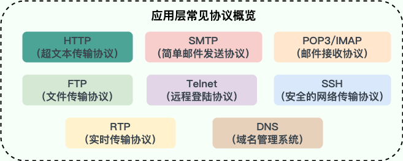

# 计算机网络

[计算机网络面试题43问](https://www.nowcoder.com/discuss/406776190017585152?sourceSSR=enterprise)

[JavaGuide 计算机网络篇](https://javaguide.cn/cs-basics/network/other-network-questions.html)

## 网络分层模型

**OSI 七层模型** 是国际标准化组织提出一个网络分层模型，其大体结构以及每一层提供的功能如下图所示：

每一层都专注做一件事情，并且每一层都需要使用下一层提供的功能比如传输层需要使用网络层提供的路由和寻址功能，这样传输层才知道把数据传输到哪里去。

## TCP/IP四层模型

**TCP/IP 四层模型** 是目前被广泛采用的一种模型,我们可以将 `TCP / IP` 模型看作是 `OSI` 七层模型的精简版本，由以下 4 层组成：

1. 应用层
2. 传输层
3. 网络层
4. 网络接口层

需要注意的是，我们并不能将 TCP/IP 四层模型 和 OSI 七层模型完全精确地匹配起来，不过可以简单将两者对应起来，如下图所示：

> 为什么网络要分层？

**复杂的系统需要分层，因为每一层都需要专注于一类事情。网络分层的原因也是一样，每一层只专注于做一类事情。**

- **各层之间相互独立**：各层之间相互独立，各层之间不需要关心其他层是如何实现的，只需要知道自己如何调用下层提供好的功能就可以了（可以简单理解为接口调用）**。**
- 提高了灵活性和可替换性**：每一层都可以使用最适合的技术来实现，你只需要保证你提供的功能以及暴露的接口的规则没有改变就行了。并且，每一层都可以根据需要进行修改或替换，而不会影响到整个网络的结构。**这个和我们平时开发系统的时候要求的高内聚、低耦合的原则也是可以对应上的。**
- **大问题化小**：分层可以将复杂的网络问题分解为许多比较小的、界线比较清晰简单的小问题来处理和解决。这样使得复杂的计算机网络系统变得易于设计，实现和标准化。 **这个和我们平时开发的时候，一般会将系统功能分解，然后将复杂的问题分解为容易理解的更小的问题是相对应的，这些较小的问题具有更好的边界（目标和接口）定义。**

## 常见网络协议

### 应用层常见协议

**HTTP（Hypertext Transfer Protocol，超文本传输协议）**：基于 TCP 协议，是一种用于传输超文本和多媒体内容的协议，主要是为 Web 浏览器与 Web 服务器之间的通信而设计的。当我们使用浏览器浏览网页的时候，我们网页就是通过 HTTP 请求进行加载的。

------

**SMTP（Simple Mail Transfer Protocol，简单邮件发送协议）**：基于 TCP 协议，是一种用于发送电子邮件的协议。注意 ⚠️：SMTP 协议只负责邮件的发送，而不是接收。要从邮件服务器接收邮件，需要使用 POP3 或 IMAP 协议。

------

**POP3/IMAP（邮件接收协议）**：基于 TCP 协议，两者都是负责邮件接收的协议。IMAP 协议是比 POP3 更新的协议，它在功能和性能上都更加强大。IMAP 支持邮件搜索、标记、分类、归档等高级功能，而且可以在多个设备之间同步邮件状态。几乎所有现代电子邮件客户端和服务器都支持 IMAP。

------

**FTP（File Transfer Protocol，文件传输协议）** : 基于 TCP 协议，是一种用于在计算机之间传输文件的协议，可以屏蔽操作系统和文件存储方式。注意 ⚠️：FTP 是一种不安全的协议，因为它在传输过程中不会对数据进行加密。建议在传输敏感数据时使用更安全的协议，如 SFTP。

------

**Telnet（远程登陆协议）**：基于 TCP 协议，用于通过一个终端登陆到其他服务器。Telnet 协议的最大缺点之一是所有数据（包括用户名和密码）均以明文形式发送，这有潜在的安全风险。这就是为什么如今很少使用 Telnet，而是使用一种称为 SSH 的非常安全的网络传输协议的主要原因。

------

**SSH（Secure Shell Protocol，安全的网络传输协议）**：基于 TCP 协议，通过加密和认证机制实现安全的访问和文件传输等业务

------

**RTP（Real-time Transport Protocol，实时传输协议）**：通常基于 UDP 协议，但也支持 TCP 协议。它提供了端到端的实时传输数据的功能，但不包含资源预留存、不保证实时传输质量，这些功能由 WebRTC 实现。

------

**DNS（Domain Name System，域名管理系统）**: 基于 UDP 协议，用于解决域名和 IP 地址的映射问题。

### 传输层协议

传输层常见协议

**TCP（Transmission Control Protocol，传输控制协议 ）**：提供 **面向连接** 的，**可靠** 的数据传输服务。

**UDP（User Datagram Protocol，用户数据协议）**：提供 **无连接** 的，**尽最大努力** 的数据传输服务（不保证数据传输的可靠性），简单高效。

### 网络层协议

**IP（Internet Protocol，网际协议）**：TCP/IP 协议中最重要的协议之一，属于网络层的协议，主要作用是定义数据包的格式、对数据包进行路由和寻址，以便它们可以跨网络传播并到达正确的目的地。目前 IP 协议主要分为两种，一种是过去的 IPv4，另一种是较新的 IPv6，目前这两种协议都在使用，但后者已经被提议来取代前者。

------

**ARP（Address Resolution Protocol，地址解析协议）**：ARP 协议解决的是网络层地址和链路层地址之间的转换问题。因为一个 IP 数据报在物理上传输的过程中，总是需要知道下一跳（物理上的下一个目的地）该去往何处，但 IP 地址属于逻辑地址，而 MAC 地址才是物理地址，ARP 协议解决了 IP 地址转 MAC 地址的一些问题。

------

**ICMP（Internet Control Message Protocol，互联网控制报文协议）**：一种用于传输网络状态和错误消息的协议，常用于网络诊断和故障排除。例如，Ping 工具就使用了 ICMP 协议来测试网络连通性。

------

**NAT（Network Address Translation，网络地址转换协议）**：NAT 协议的应用场景如同它的名称——网络地址转换，应用于内部网到外部网的地址转换过程中。具体地说，在一个小的子网（局域网，LAN）内，各主机使用的是同一个 LAN 下的 IP 地址，但在该 LAN 以外，在广域网（WAN）中，需要一个统一的 IP 地址来标识该 LAN 在整个 Internet 上的位置。

------

**OSPF（Open Shortest Path First，开放式最短路径优先）** ）：一种内部网关协议（Interior Gateway Protocol，IGP），也是广泛使用的一种动态路由协议，基于链路状态算法，考虑了链路的带宽、延迟等因素来选择最佳路径。

------

**RIP(Routing Information Protocol，路由信息协议）**：一种内部网关协议（Interior Gateway Protocol，IGP），也是一种动态路由协议，基于距离向量算法，使用固定的跳数作为度量标准，选择跳数最少的路径作为最佳路径。

------

**BGP（Border Gateway Protocol，边界网关协议）**：一种用来在路由选择域之间交换网络层可达性信息（Network Layer Reachability Information，NLRI）的路由选择协议，具有高度的灵活性和可扩展性。

## 访问网页的全过程

> 从输入URL到页面展示到底发生了什么

| 过程                                                         | 使用的协议                                                   |
| ------------------------------------------------------------ | ------------------------------------------------------------ |
| 1. 浏览器查找域名的ip地址 （DNS查找过程：浏览器缓存，路由器缓存，DNS缓存） | DNS：获取域名对应的IP                                        |
| 2. 浏览器向web服务器发送一个HTTP请求 （cookie会随着请求发送给服务器） | TCP：与服务器建立TCP连接 IP：建立TCP协议时，需要发送数据，发送数据在网络层使用IP协议 OSPF：IP数据在路由器之间，路由选择使用OSPF协议 ARP：路由器在于服务器通信时，需要将ip地址转化为MAC地址，需要使用ARP协议 HTTP：在TCP建立完成后，使用HTTP协议访问网页 |
| 3. 服务器处理请求 （请求 处理请求&它的参数、cookies、生成一个HTML响应） |                                                              |
| 4. 服务器发挥一个HTML响应                                    |                                                              |
| 5. 浏览器开始响应HTML                                        |                                                              |

总体来说分为以下几个步骤:

1. 在浏览器中输入指定网页的 URL。
2. 浏览器通过 DNS 协议，获取域名对应的 IP 地址。
3. 浏览器根据 IP 地址和端口号，向目标服务器发起一个 TCP 连接请求。
4. 浏览器在 TCP 连接上，向服务器发送一个 HTTP 请求报文，请求获取网页的内容。
5. 服务器收到 HTTP 请求报文后，处理请求，并返回 HTTP 响应报文给浏览器。
6. 浏览器收到 HTTP 响应报文后，解析响应体中的 HTML 代码，渲染网页的结构和样式，同时根据 HTML 中的其他资源的 URL（如图片、CSS、JS 等），再次发起 HTTP 请求，获取这些资源的内容，直到网页完全加载显示。
7. 浏览器在不需要和服务器通信时，可以主动关闭 TCP 连接，或者等待服务器的关闭请求。

------

## URL

URL（Uniform Resource Locators），即统一资源定位器。网络上的所有资源都靠 URL 来定位，每一个文件就对应着一个 URL，就像是路径地址。理论上，文件资源和 URL 一一对应。实际上也有例外，比如某些 URL 指向的文件已经被重定位到另一个位置，这样就有多个 URL 指向同一个文件。

### URL 的组成结构

1. 协议。URL 的前缀通常表示了该网址采用了何种应用层协议，通常有两种——HTTP 和 HTTPS。当然也有一些不太常见的前缀头，比如文件传输时用到的`ftp:`。
2. 域名。域名便是访问网址的通用名，这里也有可能是网址的 IP 地址，域名可以理解为 IP 地址的可读版本，毕竟绝大部分人都不会选择记住一个网址的 IP 地址。
3. 端口。如果指明了访问网址的端口的话，端口会紧跟在域名后面，并用一个冒号隔开。
4. 资源路径。域名（端口）后紧跟的就是资源路径，从第一个`/`开始，表示从服务器上根目录开始进行索引到的文件路径，上图中要访问的文件就是服务器根目录下`/path/to/myfile.html`。早先的设计是该文件通常物理存储于服务器主机上，但现在随着网络技术的进步，该文件不一定会物理存储在服务器主机上，有可能存放在云上，而文件路径也有可能是虚拟的（遵循某种规则）。
5. 参数。参数是浏览器在向服务器提交请求时，在 URL 中附带的参数。服务器解析请求时，会提取这些参数。参数采用键值对的形式`key=value`，每一个键值对使用`&`隔开。参数的具体含义和请求操作的具体方法有关。
6. 锚点。锚点顾名思义，是在要访问的页面上的一个锚。要访问的页面大部分都多于一页，如果指定了锚点，那么在客户端显示该网页是就会定位到锚点处，相当于一个小书签。值得一提的是，在 URL 中，锚点以`#`开头，并且**不会**作为请求的一部分发送给服务端。

## DNS

键入了 URL 之后，第一个重头戏登场——DNS 服务器解析。DNS（Domain Name System）域名系统，要解决的是 **域名和 IP 地址的映射问题** 。毕竟，域名只是一个网址便于记住的名字，而网址真正存在的地址其实是 IP 地址。

## HTTP/HTTPS

利用 DNS 拿到了目标主机的 IP 地址之后，浏览器便可以向目标 IP 地址发送 HTTP 报文，请求需要的资源了。在这里，根据目标网站的不同，请求报文可能是 HTTP 协议或安全性增强的 HTTPS 协议

**1、HTTP协议**

- HTTP 协议，全称**超文本传输协议（Hypertext Transfer Protocol）**。顾名思义，HTTP 协议就是用来规范超文本的传输，超文本，也就是网络上的包括文本在内的各式各样的消息，具体来说，主要是来规范浏览器和服务器端的行为的。

- 并且，HTTP 是一个**无状态（stateless）协议**，也就是说服务器不维护任何有关客户端过去所发请求的消息。这其实是一种懒政，有状态协议会更加复杂，需要维护状态（历史信息），而且如果客户或服务器失效，会产生状态的不一致，解决这种不一致的代价更高。

HTTP协议过程

HTTP 是应用层协议，它以 TCP（传输层）作为底层协议，**默认端口为 80**. 通信过程主要如下：

1. 服务器在 80 端口等待客户的请求。
2. 浏览器发起到服务器的 TCP 连接（创建套接字 Socket）。
3. 服务器接收来自浏览器的 TCP 连接。
4. 浏览器（HTTP 客户端）与 Web 服务器（HTTP 服务器）交换 HTTP 消息。
5. 关闭 TCP 连接。

HTTP优点：扩展性强、速度快、跨平台支持性好。

**2、HTTPS协议**

HTTPS 协议（Hyper Text Transfer Protocol Secure），是 HTTP 的加强安全版本。HTTPS 是基于 HTTP 的，也是用 TCP 作为底层协议，并额外使用 `SSL/TLS 协议`用作加密和安全认证。`默认端口号是 443`.

HTTPS 协议中，`SSL 通道`通常使用基于密钥的加密算法，密钥长度通常是 40 比特或 128 比特。

优点：保密性好，信任度高

## Cookie和Session

`Cookie` 和 `Session` 都是用来跟踪浏览器用户身份的会话方式，但是两者的应用场景不太一样。

**`Cookie` 存放在客户端，一般用来保存用户信息**。

**`Session` 的主要作用就是通过服务端记录用户的状态。**

## GET和POST

GET 和 POST 是 HTTP 协议中两种常用的请求方法：

**语义（主要区别）**：GET 通常用于获取或查询资源，而 POST 通常用于创建或修改资源。

**幂等**：GET 请求是幂等的，即多次重复执行不会改变资源的状态，而 POST 请求是不幂等的，即每次执行可能会产生不同的结果或影响资源的状态。

**格式**：GET 请求的参数通常放在 URL 中，形成查询字符串（querystring），而 POST 请求的参数通常放在请求体（body）中，可以有多种编码格式，如 application/x-www-form-urlencoded、multipart/form-data、application/json 等。GET 请求的 URL 长度受到浏览器和服务器的限制，而 POST 请求的 body 大小则没有明确的限制。不过，实际上 GET 请求也可以用 body 传输数据，只是并不推荐这样做，因为这样可能会导致一些兼容性或者语义上的问题。

**缓存**：由于 GET 请求是幂等的，它可以被浏览器或其他中间节点（如代理、网关）缓存起来，以提高性能和效率。而 POST 请求则不适合被缓存，因为它可能有副作用，每次执行可能需要实时的响应。

**安全性**：GET 请求和 POST 请求如果使用 HTTP 协议的话，那都不安全，因为 HTTP 协议本身是明文传输的，必须使用 HTTPS 协议来加密传输数据。另外，GET 请求相比 POST 请求更容易泄露敏感数据，因为 GET 请求的参数通常放在 URL 中。

## WebSocket

