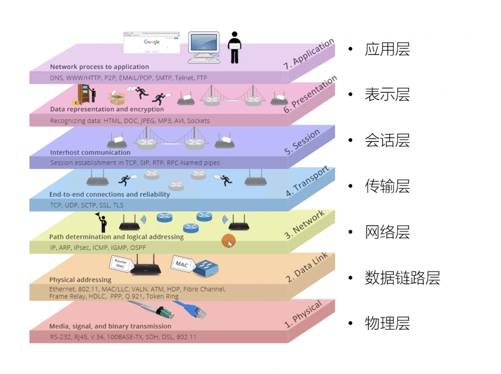
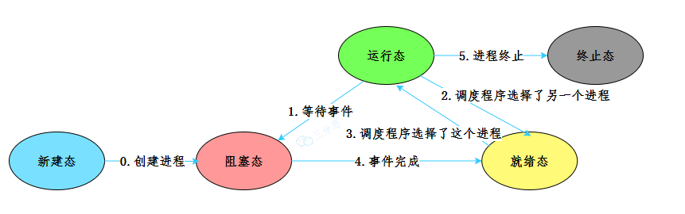
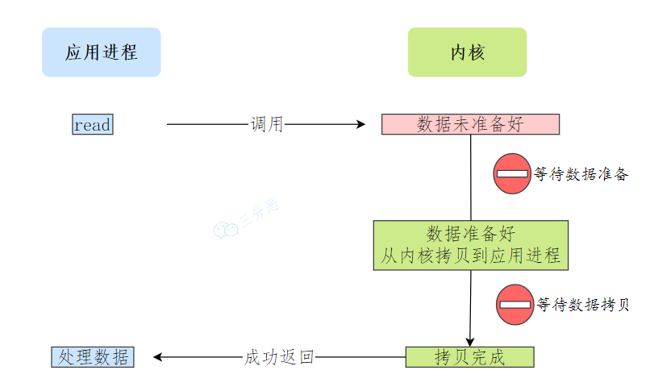
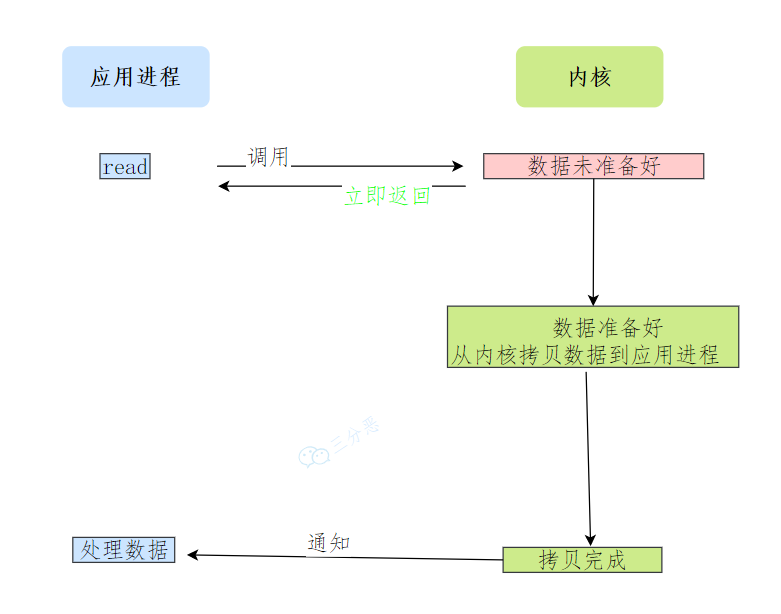

# 计算机网络

[计算机网络面试题43问](https://www.nowcoder.com/discuss/406776190017585152?sourceSSR=enterprise)

[JavaGuide 计算机网络篇](https://javaguide.cn/cs-basics/network/other-network-questions.html)

## 网络分层模型

### **OSI 七层模型** 

是国际标准化组织提出一个网络分层模型，其大体结构以及每一层提供的功能如下图所示：

每一层都专注做一件事情，并且每一层都需要使用下一层提供的功能比如传输层需要使用网络层提供的路由和寻址功能，这样传输层才知道把数据传输到哪里去。

### TCP/IP四层模型

**TCP/IP 四层模型** 是目前被广泛采用的一种模型,我们可以将 `TCP / IP` 模型看作是 `OSI` 七层模型的精简版本，由以下 4 层组成：

1. 应用层
2. 传输层
3. 网络层
4. 网络接口层

需要注意的是，我们并不能将 TCP/IP 四层模型 和 OSI 七层模型完全精确地匹配起来，不过可以简单将两者对应起来，如下图所示：

> 为什么网络要分层？

**复杂的系统需要分层，因为每一层都需要专注于一类事情。网络分层的原因也是一样，每一层只专注于做一类事情。**

- **各层之间相互独立**：各层之间相互独立，各层之间不需要关心其他层是如何实现的，只需要知道自己如何调用下层提供好的功能就可以了（可以简单理解为接口调用）**。**
- 提高了灵活性和可替换性**：每一层都可以使用最适合的技术来实现，你只需要保证你提供的功能以及暴露的接口的规则没有改变就行了。并且，每一层都可以根据需要进行修改或替换，而不会影响到整个网络的结构。**这个和我们平时开发系统的时候要求的高内聚、低耦合的原则也是可以对应上的。**
- **大问题化小**：分层可以将复杂的网络问题分解为许多比较小的、界线比较清晰简单的小问题来处理和解决。这样使得复杂的计算机网络系统变得易于设计，实现和标准化。 **这个和我们平时开发的时候，一般会将系统功能分解，然后将复杂的问题分解为容易理解的更小的问题是相对应的，这些较小的问题具有更好的边界（目标和接口）定义。**

## 常见网络协议

### 应用层常见协议

**HTTP（Hypertext Transfer Protocol，超文本传输协议）**：基于 TCP 协议，是一种用于传输超文本和多媒体内容的协议，主要是为 Web 浏览器与 Web 服务器之间的通信而设计的。当我们使用浏览器浏览网页的时候，我们网页就是通过 HTTP 请求进行加载的。

------

**SMTP（Simple Mail Transfer Protocol，简单邮件发送协议）**：基于 TCP 协议，是一种用于发送电子邮件的协议。注意 ⚠️：SMTP 协议只负责邮件的发送，而不是接收。要从邮件服务器接收邮件，需要使用 POP3 或 IMAP 协议。

------

**POP3/IMAP（邮件接收协议）**：基于 TCP 协议，两者都是负责邮件接收的协议。IMAP 协议是比 POP3 更新的协议，它在功能和性能上都更加强大。IMAP 支持邮件搜索、标记、分类、归档等高级功能，而且可以在多个设备之间同步邮件状态。几乎所有现代电子邮件客户端和服务器都支持 IMAP。

------

**FTP（File Transfer Protocol，文件传输协议）** : 基于 TCP 协议，是一种用于在计算机之间传输文件的协议，可以屏蔽操作系统和文件存储方式。注意 ⚠️：FTP 是一种不安全的协议，因为它在传输过程中不会对数据进行加密。建议在传输敏感数据时使用更安全的协议，如 SFTP。

------

**Telnet（远程登陆协议）**：基于 TCP 协议，用于通过一个终端登陆到其他服务器。Telnet 协议的最大缺点之一是所有数据（包括用户名和密码）均以明文形式发送，这有潜在的安全风险。这就是为什么如今很少使用 Telnet，而是使用一种称为 SSH 的非常安全的网络传输协议的主要原因。

------

**SSH（Secure Shell Protocol，安全的网络传输协议）**：基于 TCP 协议，通过加密和认证机制实现安全的访问和文件传输等业务

------

**RTP（Real-time Transport Protocol，实时传输协议）**：通常基于 UDP 协议，但也支持 TCP 协议。它提供了端到端的实时传输数据的功能，但不包含资源预留存、不保证实时传输质量，这些功能由 WebRTC 实现。

------

**DNS（Domain Name System，域名管理系统）**: 基于 UDP 协议，用于解决域名和 IP 地址的映射问题。

------

### 传输层协议

传输层常见协议

**TCP（Transmission Control Protocol，传输控制协议 ）**：提供 **面向连接** 的，**可靠**的数据传输服务。

**UDP（User Datagram Protocol，用户数据协议）**：提供 **无连接** 的，**尽最大努力** 的数据传输服务（不保证数据传输的可靠性），简单高效。

### 网络层协议

**IP（Internet Protocol，网际协议）**：TCP/IP 协议中最重要的协议之一，属于网络层的协议，主要作用是定义数据包的格式、对数据包进行路由和寻址，以便它们可以跨网络传播并到达正确的目的地。目前 IP 协议主要分为两种，一种是过去的 IPv4，另一种是较新的 IPv6，目前这两种协议都在使用，但后者已经被提议来取代前者。

------

**ARP（Address Resolution Protocol，地址解析协议）**：ARP 协议解决的是网络层地址和链路层地址之间的转换问题。因为一个 IP 数据报在物理上传输的过程中，总是需要知道下一跳（物理上的下一个目的地）该去往何处，但 IP 地址属于逻辑地址，而 MAC 地址才是物理地址，ARP 协议解决了 IP 地址转 MAC 地址的一些问题。

------

**ICMP（Internet Control Message Protocol，互联网控制报文协议）**：一种用于传输网络状态和错误消息的协议，常用于网络诊断和故障排除。例如，Ping 工具就使用了 ICMP 协议来测试网络连通性。

------

**NAT（Network Address Translation，网络地址转换协议）**：NAT 协议的应用场景如同它的名称——网络地址转换，应用于内部网到外部网的地址转换过程中。具体地说，在一个小的子网（局域网，LAN）内，各主机使用的是同一个 LAN 下的 IP 地址，但在该 LAN 以外，在广域网（WAN）中，需要一个统一的 IP 地址来标识该 LAN 在整个 Internet 上的位置。

------

**OSPF（Open Shortest Path First，开放式最短路径优先）** ）：一种内部网关协议（Interior Gateway Protocol，IGP），也是广泛使用的一种动态路由协议，基于链路状态算法，考虑了链路的带宽、延迟等因素来选择最佳路径。

------

**RIP(Routing Information Protocol，路由信息协议）**：一种内部网关协议（Interior Gateway Protocol，IGP），也是一种动态路由协议，基于距离向量算法，使用固定的跳数作为度量标准，选择跳数最少的路径作为最佳路径。

------

**BGP（Border Gateway Protocol，边界网关协议）**：一种用来在路由选择域之间交换网络层可达性信息（Network Layer Reachability Information，NLRI）的路由选择协议，具有高度的灵活性和可扩展性。

## 访问网页的全过程

> 从输入URL到页面展示到底发生了什么

| 过程                                                         | 使用的协议                                                   |
| ------------------------------------------------------------ | ------------------------------------------------------------ |
| 1. 浏览器查找域名的ip地址 （DNS查找过程：浏览器缓存，路由器缓存，DNS缓存） | DNS：获取域名对应的IP                                        |
| 2. 浏览器向web服务器发送一个HTTP请求 （cookie会随着请求发送给服务器） | TCP：与服务器建立TCP连接 IP：建立TCP协议时，需要发送数据，发送数据在网络层使用IP协议 OSPF：IP数据在路由器之间，路由选择使用OSPF协议 ARP：路由器在于服务器通信时，需要将ip地址转化为MAC地址，需要使用ARP协议 HTTP：在TCP建立完成后，使用HTTP协议访问网页 |
| 3. 服务器处理请求 （请求 处理请求&它的参数、cookies、生成一个HTML响应） |                                                              |
| 4. 服务器发挥一个HTML响应                                    |                                                              |
| 5. 浏览器开始响应HTML                                        |                                                              |

总体来说分为以下几个步骤:

1. 在浏览器中输入指定网页的 URL。
2. 浏览器通过 DNS 协议，获取域名对应的 IP 地址。
3. 浏览器根据 IP 地址和端口号，向目标服务器发起一个 TCP 连接请求。
4. 浏览器在 TCP 连接上，向服务器发送一个 HTTP 请求报文，请求获取网页的内容。
5. 服务器收到 HTTP 请求报文后，处理请求，并返回 HTTP 响应报文给浏览器。
6. 浏览器收到 HTTP 响应报文后，解析响应体中的 HTML 代码，渲染网页的结构和样式，同时根据 HTML 中的其他资源的 URL（如图片、CSS、JS 等），再次发起 HTTP 请求，获取这些资源的内容，直到网页完全加载显示。
7. 浏览器在不需要和服务器通信时，可以主动关闭 TCP 连接，或者等待服务器的关闭请求。

------

## URL

URL（`Uniform Resource Locators`），即**统一资源定位器**。网络上的所有资源都靠 URL 来定位，每一个文件就对应着一个 URL，就像是路径地址。理论上，文件资源和 URL 一一对应。实际上也有例外，比如某些 URL 指向的文件已经被重定位到另一个位置，这样就有多个 URL 指向同一个文件。

### URL 的组成结构

1. **协议**。URL 的前缀通常表示了该网址采用了何种应用层协议，通常有两种——HTTP 和 HTTPS。当然也有一些不太常见的前缀头，比如文件传输时用到的`ftp:`。
2. **域名**。域名便是访问网址的通用名，这里也有可能是网址的 IP 地址，域名可以理解为 IP 地址的可读版本，毕竟绝大部分人都不会选择记住一个网址的 IP 地址。
3. **端口**。如果指明了访问网址的端口的话，端口会紧跟在域名后面，并用一个冒号隔开。
4. **资源路径**。域名（端口）后紧跟的就是资源路径，从第一个`/`开始，表示从服务器上根目录开始进行索引到的文件路径，上图中要访问的文件就是服务器根目录下`/path/to/myfile.html`。早先的设计是该文件通常物理存储于服务器主机上，但现在随着网络技术的进步，该文件不一定会物理存储在服务器主机上，有可能存放在云上，而文件路径也有可能是虚拟的（遵循某种规则）。
5. **参数**。参数是浏览器在向服务器提交请求时，在 URL 中附带的参数。服务器解析请求时，会提取这些参数。参数采用键值对的形式`key=value`，每一个键值对使用`&`隔开。参数的具体含义和请求操作的具体方法有关。
6. **锚点**。锚点顾名思义，是在要访问的页面上的一个锚。要访问的页面大部分都多于一页，如果指定了锚点，那么在客户端显示该网页是就会定位到锚点处，相当于一个小书签。值得一提的是，在 URL 中，锚点以`#`开头，并且**不会**作为请求的一部分发送给服务端。

## DNS

键入了 URL 之后，第一个重头戏登场——DNS 服务器解析。DNS（Domain Name System）域名系统，要解决的是 **域名和 IP 地址的映射问题** 。毕竟，域名只是一个网址便于记住的名字，而网址真正存在的地址其实是 IP 地址。

## HTTP/HTTPS

利用 DNS 拿到了目标主机的 IP 地址之后，浏览器便可以向目标 IP 地址发送 HTTP 报文，请求需要的资源了。在这里，根据目标网站的不同，请求报文可能是 HTTP 协议或安全性增强的 HTTPS 协议

**1、HTTP协议**

- HTTP 协议，全称**超文本传输协议（Hypertext Transfer Protocol）**。顾名思义，HTTP 协议就是用来规范超文本的传输，超文本，也就是网络上的包括文本在内的各式各样的消息，具体来说，主要是来规范浏览器和服务器端的行为的。

- 并且，HTTP 是一个**无状态（stateless）协议**，也就是说服务器不维护任何有关客户端过去所发请求的消息。这其实是一种懒政，有状态协议会更加复杂，需要维护状态（历史信息），而且如果客户或服务器失效，会产生状态的不一致，解决这种不一致的代价更高。

HTTP协议过程

HTTP 是应用层协议，它以 TCP（传输层）作为底层协议，**默认端口为 80**. 通信过程主要如下：

1. 服务器在 80 端口等待客户的请求。
2. 浏览器发起到服务器的 TCP 连接（创建套接字 Socket）。
3. 服务器接收来自浏览器的 TCP 连接。
4. 浏览器（HTTP 客户端）与 Web 服务器（HTTP 服务器）交换 HTTP 消息。
5. 关闭 TCP 连接。

HTTP优点：扩展性强、速度快、跨平台支持性好。

**2、HTTPS协议**

HTTPS 协议（Hyper Text Transfer Protocol Secure），是 HTTP 的加强安全版本。HTTPS 是基于 HTTP 的，也是用 TCP 作为底层协议，并额外使用 `SSL/TLS 协议`用作加密和安全认证。`默认端口号是 443`.

HTTPS 协议中，`SSL 通道`通常使用基于密钥的加密算法，密钥长度通常是 40 比特或 128 比特。

优点：保密性好，信任度高

## Cookie和Session和Token

`Cookie` 和 `Session` 都是用来跟踪浏览器用户身份的会话方式，但是两者的应用场景不太一样。

`Cookie`：客户端会话跟踪技术，存放在客户端，一般用来保存用户信息**。

- 优点：HTTP协议中支持的技术，使用比较简答，可以在请求头中设置

- 缺点：移动端无法使用Cookie；数据存储在浏览器端，不安全，用户可以自己禁用Cookie；Cookie不能跨域（跨域区分的三个维度：协议、IP/域名、端口）

`Session`：服务端会话跟踪技术，主要作用就是通过服务端记录用户的状态。

- 优点：数据存储在服务端，安全，底层实现基于Cookie
- 缺点：服务器集群环境下无法使用Cookie；用于Cookie的所有缺点

`JWT`令牌技术：是一种**基于 Token 的认证授权机制**

- 优点：支持PC端、移动端；解决集群环境下的认证问题；减轻服务器存储压力；
- 缺点：需要自己实现；

## `JWT`令牌

[JWT官网](https://jwt.io/)

`JWT （JSON Web Token）` 是目前最流行的**跨域认证解决方案**，是一种**基于 Token 的认证授权机制**。 从 `JWT` 的全称可以看出，`JWT` 本身也是 Token，一种规范化之后的 `JSON` 结构的 Token。

定义：定义了一种简洁的、自包含的格式，用于在通信双方以`json`数据格式安全的传输信息。由于数字签名的存在，这些信息是可靠的

**组成：**

- 第一部分：`Header`(头)，记录令牌类型、签名算法等。`base64`编码。例如：`{"arg":"HS256, , "type": "JWT}`

- 第二部分：`Payload`(有效载荷)，携带一些自定义信息、默认信息等。`base64`编码。例如`{"id":"1", "username":"Tom"}`
- 第三部分：`Signature`(签名)，防止token被篡改、确保安全性。将`header、payload`，并加入指定密钥，通过指定签名算法计算而来

> `Base64`：是一种基于64个可打印字符`（A-Z  a-z  0-9 + /）`来表示二进制数据的编码方式

**应用场景**：登录认证：登录后下发令牌

- 令牌生成：登录成功后，生成`JWT`令牌，并返回给前端
- 令牌校验：在请求到达服务端后，对令牌进行统一拦截、校验
- 备注：用户登陆成功后，系统会自动下发`JWT`令牌，然后在后续的每次请求中，都需要在请求头`header`中携带到服务器，请求头的名称为token，值为登录时下发的`JWT`令牌

**使用-`JWT`**

1、添加`JJWT`依赖

2、生成`JWT`令牌

3、解析`JWT`令牌

## GET和POST

GET 和 POST 是 HTTP 协议中两种常用的请求方法：

**语义（主要区别）**：GET 通常用于获取或查询资源，而 POST 通常用于创建或修改资源。

**幂等**：GET 请求是幂等的，即多次重复执行不会改变资源的状态，而 POST 请求是不幂等的，即每次执行可能会产生不同的结果或影响资源的状态。

**格式**：GET 请求的参数通常放在 URL 中，形成查询字符串（`querystring`），而 POST 请求的参数通常放在请求体（body）中，可以有多种编码格式，如 `application/x-www-form-urlencoded、multipart/form-data、application/json` 等。GET 请求的 URL 长度受到浏览器和服务器的限制，而 POST 请求的 body 大小则没有明确的限制。不过，实际上 GET 请求也可以用 body 传输数据，只是并不推荐这样做，因为这样可能会导致一些兼容性或者语义上的问题。

**缓存**：由于 GET 请求是幂等的，它可以被浏览器或其他中间节点（如代理、网关）缓存起来，以提高性能和效率。而 POST 请求则不适合被缓存，因为它可能有副作用，每次执行可能需要实时的响应。

**安全性**：GET 请求和 POST 请求如果使用 HTTP 协议的话，那都不安全，因为 HTTP 协议本身是明文传输的，必须使用 `HTTPS` 协议来加密传输数据。另外，GET 请求相比 POST 请求更容易泄露敏感数据，因为 GET 请求的参数通常放在 URL 中。

## WebSocket

------

# 操作系统

## 基本概念

操作系统是一种运行在内核态的软件。它是应用程序和硬件之间的媒介，向应用程序提供硬件的抽象，以及管理硬件资源。

操作系统最主要的功能：

- **处理器（CPU）管理**：CPU 的管理和分配，主要指的是进程管理。
- **内存管理：**内存的分配和管理，主要利用了虚拟内存的方式。
- **外存管理**：外存（磁盘等）的分配和管理，将外存以文件的形式提供出去。
- **I/O 管理**：对输入/输出设备的统一管理。

除此之外，还有保证自身正常运行的健壮性管理，防止非法操作和入侵的安全性管理。

## 操作系统结构

操作系统内核：可以这么说，内核是一个计算机程序，它是操作系统的核心，提供了操作系统最核心的能力，可以控制操作系统中所有的内容。

用户态和核心态：内核具有很⾼的权限，可以控制 cpu、内存、硬盘等硬件，出于权限控制的考虑，因此⼤多数操作系统，把内存分成了两个区域：

- 内核空间，这个内存空间只有内核程序可以访问；
- ⽤户空间，这个内存空间专⻔给应⽤程序使⽤，权限比较小；

⽤户空间的代码只能访问⼀个局部的内存空间，⽽内核空间的代码可以访问所有内存空间。因此，当程序使⽤⽤户空间时，我们常说该程序在**⽤户态**执⾏，⽽当程序使内核空间时，程序则在**内核态**执⾏。

> 用户态和内核态之间如何切换：
>
> 应⽤程序如果需要进⼊内核空间，就需要通过系统调⽤，来进入内核态：
>
> ：
>
> 
>
> 内核程序执⾏在内核态，⽤户程序执⾏在⽤户态。当应⽤程序使⽤系统调⽤时，会产⽣⼀个中断。发⽣中断后， CPU 会中断当前在执⾏的⽤户程序，转⽽跳转到中断处理程序，也就是开始执⾏内核程序。内核处理完后，主动触发中断，把 CPU 执⾏权限交回给⽤户程序，回到⽤户态继续⼯作。

## 进程和线程

并发：同一时间段，处理多个任务(单核CPU:时间片轮转)

并行：同一时刻处理多个任务（多核CPU）

> 进程上下文切换：

- 对于单核单线程 CPU 而言，在某一时刻只能执行一条 CPU 指令。
- 上下文切换 (Context Switch) 是一种将 CPU 资源从一个进程分配给另一个进程的机制。
- 从用户角度看，计算机能够并行运行多个进程，这恰恰是操作系统通过快速上下文切换造成的结果。在切换的过程中，操作系统需要先存储当前进程的状态 (包括内存空间的指针，当前执行完的指令等等)，再读入下一个进程的状态，然后执行此进程。

> 进程的状态

- **运⾏状态**（*Running*）：该时刻进程占⽤ CPU；
- **就绪状态**（*Ready*）：可运⾏，由于其他进程处于运⾏状态⽽暂时停⽌运⾏；
- **阻塞状态**（*Blocked*）：该进程正在等待某⼀事件发⽣（如等待输⼊/输出操作的完成）⽽暂时停⽌运⾏，这时，即使给它 CPU 控制权，它也⽆法运⾏；

- 创建状态（*new*）：进程正在被创建时的状态；
- 结束状态（*Exit*）：进程正在从系统中消失时的状态；

**僵尸进程**：已完成且处于终止状态，但在进程表中却仍然存在的进程。般发生有父子关系的进程中，一个子进程的进程描述符在子进程退出时不会释放，只有当父进程通过 wait() 或 waitpid() 获取了子进程信息后才会释放。如果子进程退出，而父进程并没有调用 wait() 或 waitpid()，那么子进程的进程描述符仍然保存在系统中。

**孤儿进程**：一个父进程退出，而它的一个或多个子进程还在运行，那么这些子进程将成为孤儿进程。孤儿进程将被 init 进程 (进程 ID 为 1 的进程) 所收养，并由 init 进程对它们完成状态收集工作。因为孤儿进程会被 init 进程收养，所以孤儿进程不会对系统造成危害。

> 进程调度算法

进程调度就是确定某一个时刻 CPU 运行哪个进程，常见的进程调度算法有：

**先来先服务**：非抢占式的调度算法，按照请求的顺序进行调度。有利于长作业，但不利于短作业，不利于I/O密集型进程。

**短作业优先**：非抢占式的调度算法，按估计运行时间最短的顺序进行调度。长作业有可能会饿死，处于一直等待短作业执行完毕的状态。

**优先级调度**：为每个进程分配一个优先级，按优先级进行调度。为了防止低优先级的进程永远等不到调度，可以随着时间的推移增加等待进程的优先级。

**时间片轮转**：将所有就绪进程按 先来先服务的原则排成一个队列，每次调度时，把 CPU 时间分配给队首进程，该进程可以执行一个时间片。当时间片用完时，由计时器发出时钟中断，调度程序便停止该进程的执行，并将它送往就绪队列的末尾，同时继续把 CPU 时间分配给队首的进程。

**最短剩余时间优先**：最短作业优先的抢占式版本，按剩余运行时间的顺序进行调度。 当一个新的作业到达时，其整个运行时间与当前进程的剩余时间作比较。如果新的进程需要的时间更少，则挂起当前进程，运行新的进程。否则新的进程等待

> 进程间通信方式

进程间通信（IPC，Inter-Process Communication）的方式有**管道、信号、消息队列、共享内存、信号量和套接字**。

**管道**

- 定义：管道可以理解成不同进程之间的传话筒，一方发声，一方接收，声音的介质可以是空气或者电缆。**进程间的管道就是内核中的一串缓存**，从管道的一端写入数据，另一端读取。数据只能单向流动，遵循先进先出（FIFO）的原则。

- **匿名管道**：允许具有亲缘关系的进程（如父子进程）进行通信。
- **命名管道**：允许无亲缘关系的进程通信，通过在文件系统中创建一个特殊类型的文件来实现。
- 缺点：管道的效率低，不适合进程间频繁地交换数据

**信号**：适用于异步通信

**消息队列**：

- 定义：消息队列是保存在内核中的消息链表，按照消息的类型进行消息传递，具有较高的可靠性和稳定性。

- 缺点：消息体有一个最大长度的限制，不适合比较大的数据传输；存在用户态与内核态之间的数据拷贝开销。

**共享内存**：

- 允许两个或多个进程共享一个给定的内存区，一个进程写⼊的东西，其他进程⻢上就能看到。

- 共享内存是最快的进程间通信方式，它是针对其他进程间通信方式运行效率低而专门设计的。

- 缺点：当多进程竞争同一个共享资源时，会造成数据错乱的问题。

**信号量**

- 信号量可以理解成红绿灯，红灯停（信号量为零），绿灯行（信号量非零）。**它本质上是一个计数器**，用来控制对共享资源的访问数量。
- 它常作为一种锁机制，防止某进程正在访问共享资源时，其他进程也访问该资源。
- 控制信号量的⽅式有两种原⼦操作：
  - ⼀个是 **P 操作**（wait，减操作），当进程希望获取资源时，它会执行P操作。如果信号量的值大于0，表示有资源可用，信号量的值减1，进程继续执行。如果信号量的值为0，表示没有可用资源，进程进入等待状态，直到信号量的值变为大于0。
  - 另⼀个是 **V 操作**（signal，加操作），当进程释放资源时，它会执行V操作，信号量的值加1。如果有其他进程因为等待该资源而被阻塞，这时会唤醒其中一个进程。

**套接字Socket：**

- 这个和 Java 中的 Socket 很相似，提供网络通信的端点，可以让不同机器上运行的进程之间进行双向通信。
- 

> 进程和线程的联系和区别

线程与进程的⽐较如下：

- 调度：**进程是资源（包括内存、打开的⽂件等）分配的单位**，**线程是 CPU 调度的单位**；
- 资源：进程拥有⼀个完整的资源平台，⽽线程只独享必不可少的资源，如寄存器和栈；
- 拥有资源：线程同样具有就绪、阻塞、执⾏三种基本状态，同样具有状态之间的转换关系；
- 系统开销：线程能减少并发执⾏的时间和空间开销——创建或撤销进程时，系统都要为之分配或回收系统资源，如内存空间，I/O 设备等，OS 所付出的开销显著大于在创建或撤销线程时的开销，进程切换的开销也远大于线程切换的开销

> 线程上下文切换

这还得看线程是不是属于同⼀个进程：

- 当两个线程不是属于同⼀个进程，则切换的过程就跟进程上下⽂切换⼀样；
- **当两个线程是属于同⼀个进程，因为虚拟内存是共享的，所以在切换时，虚拟内存这些资源就保持不动，只需要切换线程的私有数据、寄存器等不共享的数据**；

所以，线程的上下⽂切换相⽐进程，开销要⼩很多。

> 线程有哪些实现方式

主要有三种线程的实现⽅式：

- **内核态线程实现**：在内核空间实现的线程，由内核直接管理直接管理线程。

- **⽤户态线程实现**：在⽤户空间实现线程，不需要内核的参与，内核对线程无感知。

- **混合线程实现**：现代操作系统基本都是将两种方式结合起来使用。用户态的执行系统负责进程内部线程在非阻塞时的切换；内核态的操作系统负责阻塞线程的切换。即我们同时实现内核态和用户态线程管理。其中内核态线程数量较少，而用户态线程数量较多。每个内核态线程可以服务一个或多个用户态线程。

> 线程间如何同步？

**临界区**：我们把对共享资源访问的程序片段称为`临界区`，我们希望这段代码是`互斥`的，保证在某时刻只能被一个线程执行，也就是说一个线程在临界区执行时，其它线程应该被阻止进入临界区。

**锁**：使⽤加锁操作和解锁操作可以解决并发线程/进程的互斥问题。任何想进⼊临界区的线程，必须先执⾏加锁操作。若加锁操作顺利通过，则线程可进⼊临界区；在完成对临界资源的访问后再执⾏解锁操作，以释放该临界资源。

根据锁的实现不同，可以分为`忙等待锁和`和`无忙等待锁`。

- `忙等待锁和`就是加锁失败的线程，会不断尝试获取锁，也被称为自旋锁，它会一直占用 CPU。

- `⽆忙等待锁`就是加锁失败的线程，会进入阻塞状态，放弃 CPU，等待被调度。

**信号量**：信号量是操作系统提供的⼀种协调共享资源访问的⽅法。通常**信号量表示资源的数量**，对应的变量是⼀个整型（ sem ）变量。另外，还有**两个原⼦操作的系统调⽤函数来控制信号量的**，分别是：

- *P* 操作：将 sem 减 1 ，相减后，如果 sem < 0 ，则进程/线程进⼊阻塞等待，否则继续，表明 P 操作可能会阻塞；
- *V* 操作：将 sem 加 1 ，相加后，如果 sem <= 0 ，唤醒⼀个等待中的进程/线程，表明 V 操作不会阻塞；

P 操作是⽤在进⼊临界区之前，V 操作是⽤在离开临界区之后，这两个操作是必须成对出现的。

## 死锁

在两个或者多个并发线程中，如果每个线程持有某种资源，而又等待其它线程释放它或它们现在保持着的资源，在未改变这种状态之前都不能向前推进，称这一组线程产生了死锁。通俗的讲就是两个或多个线程无限期的阻塞、相互等待的一种状态。

> 死锁产生的四个必要条件

- **互斥条件**：指线程对己经获取到的资源进行排它性使用，即该资源同时只由一个线程占用。如果此时还有其它线程请求获取获取该资源，则请求者只能等待，直至占有资源的线程释放该资源。
- **请求并持有条件**：指一个线程己经持有了至少一个资源，但又提出了新的资源请求，而新资源己被其它线程占有，所以当前线程会被阻塞，但阻塞 的同时并不释放自己已经获取的资源。
- **不可剥夺条件**：指线程获取到的资源在自己使用完之前不能被其它线程抢占，只有在自己使用完毕后才由自己释放该资源。
- **环路等待条件**：指在发生死锁时，必然存在一个线程——资源的环形链，即线程集合 {T0，T1，T2,…… ，Tn} 中 T0 正在等待一 T1 占用的资源，Tl1 正在等待 T2 用的资源，…… Tn 在等待己被 T0 占用的资源。

> 如何避免死锁？

产生死锁的有四个必要条件：互斥条件、持有并等待条件、不可剥夺条件、环路等待条件。

避免死锁，破坏其中的一个就可以。

**互斥条件**：这个是没法实现，因为很多资源就是只能被一个线程占用，例如锁。

**消除请求并持有条件**：消除这个条件的办法很简单，就是`一个线程一次请求其所需要的所有资源`。

**消除不可剥夺条件**：占用部分资源的线程进一步申请其他资源时，如果申请不到，可以主动释放它占有的资源，这样不可剥夺这个条件就破坏掉了。

**消除环路等待条件**：可以靠`按序申请资源`来预防。所谓按序申请，是指资源是有线性顺序的，申请的时候可以先申请资源序号小的，再申请资源序号大的，这样线性化后就不存在环路了。

> 活锁和饥饿锁

**饥饿锁：**饥饿锁，这个饥饿指的是资源饥饿，某个线程一直等不到它所需要的资源，从而无法向前推进，就像一个人因为饥饿无法成长。

**活锁：**在活锁状态下，处于活锁线程组里的线程状态可以改变，但是整个活锁组的线程无法推进。

## 内存管理

> 虚拟内存

**虚拟内存是操作系统提供的⼀种机制，将不同进程的虚拟地址和不同内存的物理地址映射起来。**

每个进程都有自己独立的地址空间，再由操作系统映射到到实际的物理内存。

于是，这⾥就引出了两种地址的概念：

> 内存分段

程序是由若干个逻辑分段组成的，如可由代码分段、数据分段、栈段、堆段组成。不同的段是有不同的属性的，所以就⽤分段（Segmentation）的形式把这些段分离出来。

分段机制下的虚拟地址由两部分组成，**段号**和**段内偏移量**。

虚拟地址和物理地址通过段表映射，段表主要包括**段号**、**段的界限**。

> 内存分页

**分页是把整个虚拟和物理内存空间切成⼀段段固定尺寸的大小**。这样⼀个连续并且尺⼨固定的内存空间，我们叫**⻚**（*Page*）。在 Linux 下，每⼀⻚的大小为 4KB 。

访问分页系统中内存数据需要两次的内存访问：一次是从内存中访问页表，从中找到指定的物理页号，加上页内偏移得到实际物理地址，第二次就是根据第一次得到的物理地址访问内存取出数据。

> 多级分页

多级页表，就是把我们原来的单级页表再次分页，这里利用了`局部性原理`，除了顶级页表，其它级别的页表一来可以在需要的时候才被创建，二来内存紧张的时候还可以被置换到磁盘中。

> 块表

同样利用了`局部性原理`，即在⼀段时间内，整个程序的执⾏仅限于程序中的某⼀部分。相应地，执⾏所访问的存储空间也局限于某个内存区域。

利⽤这⼀特性，把最常访问的⼏个⻚表项存储到访问速度更快的硬件，于是计算机科学家们，就在 CPU 芯⽚中，加⼊了⼀个专⻔存放程序最常访问的⻚表项的 Cache，这个 Cache 就是 TLB（*Translation Lookaside Buffer*） ，通常称为⻚表缓存、转址旁路缓存、快表等。

> 分页和分段的区别

- 段是信息的逻辑单位，它是根据用户的需要划分的，因此段对用户是可见的；页是信息的物理单位，是为了管理主存的方便而划分的，对用户是透明的。
- 段的大小不固定，有它所完成的功能决定；页的大小固定，由系统决定
- 段向用户提供二维地址空间；页向用户提供的是一维地址空间
- 段是信息的逻辑单位，便于存储保护和信息的共享，页的保护和共享受到限制。

> 交换空间

操作系统把物理内存(Physical RAM)分成一块一块的小内存，每一块内存被称为页(page)。当内存资源不足时，Linux 把某些页的内容转移至磁盘上的一块空间上，以释放内存空间。磁盘上的那块空间叫做交换空间(swap space),而这一过程被称为交换(swapping)。物理内存和交换空间的总容量就是虚拟内存的可用容量。

用途：

- 物理内存不足时一些不常用的页可以被交换出去，腾给系统。
- 程序启动时很多内存页被用来初始化，之后便不再需要，可以交换出去。

> 页面置换算法有哪些

在分页系统里，一个虚拟的页面可能在主存里，也可能在磁盘中，如果 CPU 发现虚拟地址对应的物理页不在主存里，就会产生一个缺页中断，然后从磁盘中把该页调入主存中。如果内存里没有空间，就需要从主存里选择一个页面来置换。

①**最佳⻚⾯置换算法**

基本思路是，淘汰以后不会使用的页面。这是理论上的最佳算法，因为它可以保证最低的缺页率。但在实际应用中，由于无法预知未来的访问模式，OPT 通常无法实现。

②**先进先出置换算法**

基本思路是，优先淘汰最早进入内存的页面。FIFO 算法维护一个队列，新来的页面加入队尾，当发生页面置换时，队头的页面（即最早进入内存的页面）被移出。

③**最近最久未使⽤的置换算法**

基本思路是，淘汰最近没有使用的页面。LRU 算法根据页面的访问历史来进行置换，最长时间未被访问的页面将被置换出去。

相对更接近最优算法的效果，因为最近未使用的页面可能在将来也不会被使用。但 LRU 算法的实现需要跟踪页面的访问历史，可能会增加系统的开销。

④**时钟页面置换算法**

时钟算法是 LRU 的一种近似和实现简单的形式。它通过一个循环列表（类似时钟的指针）遍历页面，每个页面有一个使用位，当页面被访问时，使用位设置为 1。

当需要页面置换时，时钟指针会顺时针移动，直到找到使用位为 0 的页面进行置换。这个过程类似于给每个页面一个二次机会。算法执行时，会先将使用位从 1 清零，如果该页面再次被访问，它的使用位再次被设置为 1。

⑤**最不常⽤置换算法**

根据页面被访问的频率进行置换，访问次数最少的页面最先被置换。实现较为复杂，需要记录每个页面的访问频率。

## 文件

硬链接就是在目录下创建一个条目，记录着文件名与 `inode` 编号，这个 `inode` 就是源文件的 `inode`。删除任意一个条目，文件还是存在，只要引用数量不为 0。但是硬链接有限制，它不能跨越文件系统，也不能对目录进行链接。

软链接相当于重新创建⼀个⽂件，这个⽂件有**独⽴的** **inode**，但是这个**⽂件的内容是另外⼀个⽂件的路径**，所以访问软链接的时候，实际上相当于访问到了另外⼀个⽂件，所以**软链接是可以跨⽂件系统的**，甚⾄**⽬标⽂件被删除了，链接⽂件还是在的，只不过打不开指向的文件了而已。**

## I/O

> 零拷贝

假如需要文件传输，使用传统 I/O，数据读取和写入是用户空间到内核空间来回赋值，而内核空间的数据是通过操作系统的 I/O 接口从磁盘读取或者写入，这期间发生了多次用户态和内核态的上下文切换，以及多次数据拷贝。

传统文件传输示意图

为了提升 I/O 性能，就需要**减少用户态与内核态的上下文切换**和**内存拷贝的次数**。

这就用到了我们零拷贝的技术，零拷贝技术实现主要有两种：、

1、**mmap + write**

mmap() 系统调⽤函数会直接把内核缓冲区⾥的数据「**映射**」到⽤户空间，这样，操作系统内核与⽤户空间就不需要再进⾏任何的数据拷⻉操作。

mmap示意图

2、**sendfile**

在 Linux 内核版本 2.1 中，提供了⼀个专⻔发送⽂件的系统调⽤函数 sendfile() 。

⾸先，它可以替代前⾯的 read() 和 write() 这两个系统调⽤，这样就可以减少⼀次系统调⽤，也就减少了 2 次上下⽂切换的开销。

其次，该系统调⽤，可以直接把内核缓冲区⾥的数据拷⻉到 socket 缓冲区⾥，不再拷⻉到⽤户态，这样就只有 2 次上下⽂切换，和 3 次数据拷⻉。

sendfile示意图

> **阻塞与非阻塞I/O**

**阻塞I/O**

- 当⽤户程序执⾏ read ，线程会被阻塞，⼀直等到内核数据准备好，并把数据从内核缓冲区拷⻉到应⽤程序的缓冲区中，当拷⻉过程完成， read 才会返回。

- **阻塞等待的是`内核数据准备好`和`数据从内核态拷⻉到⽤户态`这两个过程**。
- 

**非阻塞I/O**

- 非阻塞的 read 请求在数据未准备好的情况下立即返回，可以继续往下执行，此时应⽤程序**不断轮询内核**，直到数据准备好，内核将数据拷贝到应用程序缓冲区， read 调用才可以获取到结果。
- 

**基于非阻塞的 I/O 多路复用**

- **I/O** **多路复用**技术: 当内核数据准备好时**，以事件通知应⽤程序**进⾏操作。
- 

> 注意：⽆论是阻塞 I/O、还是⾮阻塞 I/O、非阻塞 I/O 多路复用，都是**同步调⽤**。因为它们在 read 调⽤时，内核将数据从内核空间拷⻉到应⽤程序空间，过程都是需要等待的，也就是说这个过程是同步的，如果内核实现的拷⻉效率不⾼，read 调⽤就会在这个同步过程中等待⽐较⻓的时间。

**异步I/O**

真正的**异步** **I/O** 是`内核数据准备好`和`数据从内核态拷⻉到⽤户态`这两个过程都不⽤等待。

发起 `aio_read` 之后，就⽴即返回，内核⾃动将数据从内核空间拷⻉到应⽤程序空间，这个拷⻉过程同样是异步的，内核⾃动完成的，和前⾯的同步操作不⼀样，应⽤程序并不需要主动发起拷⻉动作。

> I/O多路复用

就是一个进程/线程维护多个 Socket，这个多路复用就是多个连接复用一个进程/线程。

 I/O 多路复用三种实现机制：

1、**select**

select 实现多路复⽤的⽅式是：

将已连接的 Socket 都放到⼀个**⽂件描述符集合**fd_set，然后调⽤ select 函数将 fd_set 集合拷⻉到内核⾥，让内核来检查是否有⽹络事件产⽣，检查的⽅式很粗暴，就是通过遍历 fd_set 的⽅式，当检查到有事件产⽣后，将此 Socket 标记为可读或可写， 接着再把整个 fd_set 拷⻉回⽤户态⾥，然后⽤户态还需要再通过遍历的⽅法找到可读或可写的 Socket，再对其处理。

select 使⽤固定⻓度的 BitsMap，表示⽂件描述符集合，⽽且所⽀持的⽂件描述符的个数是有限制的，在 Linux 系统中，由内核中的 FD_SETSIZE 限制， 默认最⼤值为 1024 ，只能监听 0~1023 的⽂件描述符。

select 机制的缺点：

（1）每次调用 select，都需要把 fd_set 集合从用户态拷贝到内核态，如果 fd_set 集合很大时，那这个开销也很大，比如百万连接却只有少数活跃连接时这样做就太没有效率。

（2）每次调用 select 都需要在内核遍历传递进来的所有 fd_set，如果 fd_set 集合很大时，那这个开销也很大。

（3）为了减少数据拷贝带来的性能损坏，内核对被监控的 fd_set 集合大小做了限制，一般为 1024，如果想要修改会比较麻烦，可能还需要编译内核。

（4）每次调用 select 之前都需要遍历设置监听集合，重复工作。

2、**poll**

poll 不再⽤ BitsMap 来存储所关注的⽂件描述符，取⽽代之⽤动态数组，以链表形式来组织，突破了 select 的⽂件描述符个数限制，当然还会受到系统⽂件描述符限制。

但是 poll 和 select 并没有太⼤的本质区别，都是使⽤线性结构存储进程关注的 Socket 集合，因此都需要遍历⽂件描述符集合来找到可读或可写的 Socke，时间复杂度为 O(n)，⽽且也需要在⽤户态与内核态之间拷⻉⽂件描述符集合，这种⽅式随着并发数上来，性能的损耗会呈指数级增⻓。

3、**epoll**

epoll 通过两个⽅⾯，很好解决了 select/poll 的问题。

第⼀点，epoll 在内核⾥使⽤**红⿊树来跟踪进程所有待检测的⽂件描述字**，把需要监控的 socket 通过 epoll_ctl() 函数加⼊内核中的红⿊树⾥，红⿊树是个⾼效的数据结构，增删查⼀般时间复杂度是 O(logn) ，通过对这棵⿊红树进⾏操作，这样就不需要像 select/poll 每次操作时都传⼊整个 socket 集合，只需要传⼊⼀个待检测的 socket，**减少了内核和⽤户空间⼤量的数据拷⻉和内存分配**。

第⼆点， epoll 使⽤事件驱动的机制，内核⾥**维护了⼀个链表来记录就绪事件**，当某个 socket 有事件发⽣时，通过回调函数，内核会将其加⼊到这个就绪事件列表中，当⽤户调⽤ epoll_wait() 函数时，只会返回有事件发⽣的⽂件描述符的个数，不需要像 select/poll 那样轮询扫描整个 socket 集合，⼤⼤提⾼了检测的效率。

![epoll接口作用-来源参考[3]](计算机基础.assets/os-cca76ac4-cfb4-4374-8fc6-256cd4d3893f.png)

> 同步和异步 阻塞和非阻塞

同步（Synchronous）和异步（Asynchronous），阻塞（Blocking）和非阻塞（Non-blocking）是描述**程序执行和交互**的两组概念。

1. **同步（Synchronous）**：
   - 同步指的是程序按照预定顺序或时间进行执行，一步一步地完成任务。在同步操作中，一个操作完成后才能开始下一个操作。
   - 通常情况下，同步操作会等待调用完成并返回结果之后再继续执行后续代码。
2. **异步（Asynchronous）**：
   - 异步指的是程序不按照固定顺序或时间执行，可以在后台执行任务，不必等待某个操作的完成。
   - 在异步操作中，一个操作的调用不会立即返回结果，而是会立即返回一个异步任务或回调函数，允许程序继续执行其他操作。
3. **阻塞（Blocking）**：
   - 阻塞指的是当一个操作执行时，调用方会一直等待，直到操作完成并返回结果之后才能继续执行后续代码。
   - 在阻塞操作中，调用方的执行会被暂时阻塞，直到被调用的操作完成。
4. **非阻塞（Non-blocking）**：
   - 非阻塞指的是调用方在执行一个操作时不会被阻塞，而是可以继续执行后续代码。
   - 在非阻塞操作中，即使被调用的操作还没有完成，调用方也可以继续执行其他操作。

关于同步和异步的例子：

- 同步例子：阻塞调用一个远程API并等待其返回结果。
- 异步例子：通过异步调用一个远程API，在等待其返回结果时可以执行其他操作，当结果返回时执行回调函数或处理异步任务。

关于阻塞和非阻塞的例子：

- 阻塞例子：调用一个阻塞式的读取文件操作，在文件完全读取之前，程序会一直等待。
- 非阻塞例子：调用一个非阻塞式的读取文件操作，即使文件没有完全读取，程序也可以继续执行其他操作。
